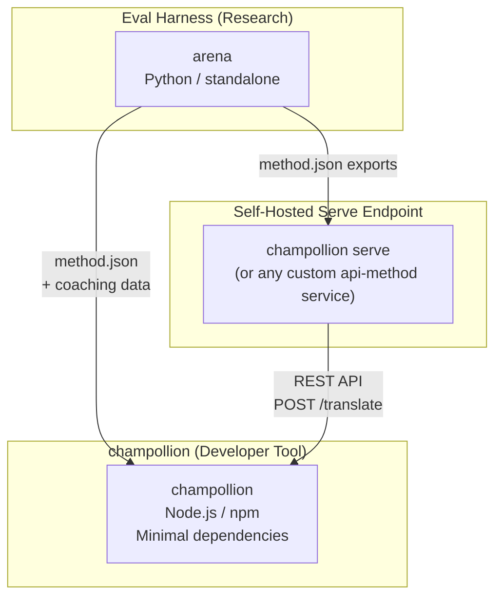
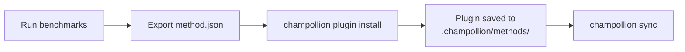
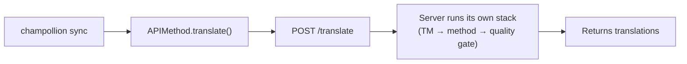
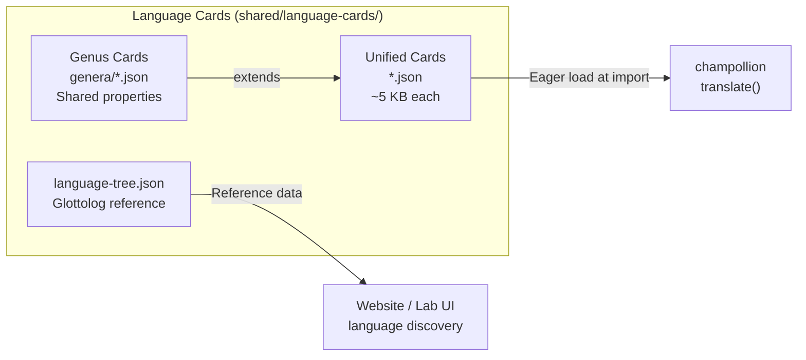

# Architecture

The Champollion translation ecosystem is three independent tools that work together through well-defined contracts. None of them depend on each other at build time. They communicate through a shared **method plugin format** and a **REST API contract**.

## The Three Pieces



### champollion (this project)

The source-available developer tool (free for noncommercial use). Translates locale files using pluggable methods. Minimal dependencies, config-optional, works out of the box.

**Built-in methods:**
- `llm` → OpenRouter / any LLM (200+ models)
- `llm-coached` → LLM + grammar/dictionary coaching
- `openai` → Direct OpenAI API (GPT-4o, GPT-4o-mini)
- `anthropic` → Direct Anthropic API (Claude Sonnet, Haiku, Opus)
- `gemini` → Direct Google Gemini API (Flash, Pro — free tier available)
- `google-translate` → Google Cloud Translation API v2
- `deepl` → DeepL API with glossary support
- `microsoft-translator` → Azure Cognitive Services Translator
- `libretranslate` → Self-hosted LibreTranslate (AGPL, free)
- `api` → Thin pipe to any remote REST endpoint

### Eval Harness (companion project)

A research tool for developing, testing, and benchmarking translation methods. When a method reaches acceptable quality, the harness exports a **method plugin** — a `method.json` manifest and optional coaching data files.

The harness never runs inside champollion. It's a separate tool that produces static output (JSON files). Champollion just reads those files.

[→ Eval Harness on GitHub](https://github.com/gamedaysuits/Champollion)

### Self-hosted serve endpoint (`champollion serve`)

Any champollion project can serve its own configured translation stack over HTTP with one command — [`champollion serve`](/docs/guides/serving-a-method#the-zero-code-path-champollion-serve) — and any other project can consume it through the `api` method. The prompts, coaching data, Translation Memory, and provider keys stay on the owner's infrastructure; consumers only send source strings and receive translations. Pipelines that live outside champollion entirely (an FST chain, a research system) can implement the same contract as a [custom service](/docs/guides/serving-a-method). There is no hosted Champollion service — serving is always self-hosted, by design.

## How They Connect

### Eval Harness → champollion (one-way export)



**Contract**: [Plugin Specification](/docs/reference/plugin-spec)

### Serve endpoint → champollion (API at runtime)



Champollion's `APIMethod` is a **dumb pipe**. It sends keys out and receives translations back. It contains zero translation logic and zero proprietary content.

## What Each Piece Knows About the Others

| Tool | Knows about champollion? | Knows about a serve endpoint? | Knows about harness? |
|------|---------------------|-------------------------------|---------------------|
| **champollion** | *(is champollion)* | Yes — `api` method calls it | No — just reads plugin exports |
| **Serve endpoint** | Yes — serves its requests | *(is the serve endpoint)* | No — installs exported methods like any project |
| **Eval Harness** | Yes — exports plugin format | No — methods deployed separately | *(is the harness)* |

## User Scenarios

### Scenario 1: Free, zero-config (most users)

```bash
export OPENROUTER_API_KEY=sk-...
npx champollion sync
```

Uses built-in `llm` method. No plugins, no server, no harness.

### Scenario 2: Google Translate baseline

```bash
export GOOGLE_TRANSLATE_API_KEY=AIza...
npx champollion sync
```

Uses built-in `google-translate` method. No plugins needed.

### Scenario 3: Open plugin with bundled coaching

```bash
champollion plugin install ./french-formal-v1/
champollion sync
```

Plugin has `type: "llm-coached"` → champollion uses user's own OpenRouter key. Coaching data is local (no server call).

### Scenario 4: DIY coaching (no plugin, no harness)

```json title="champollion.config.json"
{
  "pairs": {
    "en:fr": { "method": "llm-coached" }
  }
}
```

User maintains their own grammar rules and dictionary in `.champollion/coaching/fr.json`.

### Scenario 5: Consume another project's served stack

```bash
champollion plugin install ./their-project-serve/   # manifest from `champollion serve --emit-manifest`
CHAMPOLLION_API_KEY=<their bearer token> champollion sync
```

The pair's `api` method POSTs source strings to their self-hosted [`champollion serve`](/docs/guides/serving-a-method#the-zero-code-path-champollion-serve) endpoint; their stack (coaching, TM, quality gate) does the translating.

## Language Cards

Each language in champollion is configured through a **Language Card** — a unified JSON file containing register presets, formality rules, method support flags, typography conventions, genealogical classification, and linguistic reference data.



Cards are loaded eagerly at import. Each card contains all metadata the translation engine and developer docs need — there is no separate reference tier. Cards are generated from authoritative sources (IANA, CLDR, [Glottolog](https://glottolog.org), [WALS](https://wals.info)) using `scripts/generate-language-card.mjs` and `scripts/build-language-tree.mjs`, then human-curated for linguistic accuracy.

## Design Principles

1. **No circular dependencies.** The bridges are one-way.
2. **Champollion is the lightweight core.** Minimal dependencies, config-optional. Plugins and API are additive.
3. **IP protection is architectural.** Proprietary techniques stay on the serving side — whoever runs the endpoint keeps their prompts, coaching, and keys. The npm package ships nothing proprietary.
4. **The plugin format is the contract.** Everything flows through `method.json`.
5. **Each tool has one job.** Harness → develop methods. `champollion serve` → host methods. Champollion → translate files.

---

## See Also

- [Translation Methods](/docs/guides/translation-methods) — how each built-in method works
- [Plugin Specification](/docs/reference/plugin-spec) — the method.json manifest format
- [Eval Harness](/docs/network/specifications/harness) — the companion research tool
- [Serving a Method via API](/docs/guides/serving-a-method) — hosting custom translation pipelines
- [Support a Low-Resource Language](/docs/network/community/low-resource-languages) — the use case that drove this architecture
