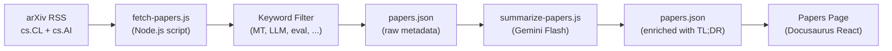

# Research Papers Feed

Champollion maintains a curated feed of machine translation and NLP research papers from arXiv, filtered and summarized for practitioners. The feed is semi-automated: papers are fetched and filtered daily, AI-summarized, and published to the website.

## Why It Exists

champollion's translation pipeline is built on techniques from published research — register-steered prompting, coaching data injection, context rollover, quality gates. The Papers feed serves three purposes:

1. **Transparency**: Users can see the research backing each feature
2. **Discovery**: New techniques published on arXiv may inform future features or user configurations
3. **Community**: Positions champollion as a research-informed tool, not just another API wrapper

## Architecture



### Pipeline Steps

#### 1. Fetch (Daily)

`scripts/fetch-papers.js` queries the arXiv Atom API for recent papers in:
- `cs.CL` (Computation and Language)
- `cs.AI` (Artificial Intelligence)

Returns: title, authors, abstract, arXiv ID, PDF link, published date, categories.

#### 2. Filter

Papers are filtered by keyword relevance. A paper must match at least one primary keyword:

**Primary keywords** (must match ≥1):
- `machine translation`, `neural machine translation`, `NMT`
- `LLM`, `large language model`
- `multilingual`, `cross-lingual`
- `document-level translation`
- `low-resource language`, `endangered language`
- `translation evaluation`, `BLEU`, `COMET`, `chrF`
- `tokenization`, `morphology`, `polysynthetic`
- `context window`, `sliding window`
- `prompt engineering` (in translation context)

**Boost keywords** (increase relevance score):
- `i18n`, `internationalization`, `localization`
- `few-shot`, `in-context learning`
- `terminology`, `glossary`, `consistency`
- `quality estimation`, `hallucination`

#### 3. Summarize (AI-Assisted)

`scripts/summarize-papers.js` processes new (unsummarized) papers:

For each paper, sends the abstract to Gemini 3.5 Flash with:
```
Read this ML research abstract and produce:
1. A 2-sentence TL;DR accessible to a software developer (not a researcher)
2. A single bullet: "Why this matters for MT" — how could this technique
   improve machine translation quality, cost, or speed in production?

Abstract: {abstract}
```

Output is stored back in `papers.json` alongside the raw metadata.

#### 4. Publish

The Docusaurus Papers page (`website/src/pages/papers.js`) renders `papers.json` as a filterable, paginated card grid.

Each card displays:
- **Title** (linked to arXiv)
- **Authors** (first 3 + "et al.")
- **Date** (published or last updated)
- **TL;DR** (AI-generated)
- **Why it matters** (AI-generated)
- **Categories** (arXiv tags)
- **PDF link**

### Automation

A GitHub Actions workflow runs the pipeline daily:

```yaml title=".github/workflows/fetch-papers.yml"
name: Fetch MT Research Papers
on:
  schedule:
    - cron: '0 6 * * *'  # 06:00 UTC daily
  workflow_dispatch: {}   # Manual trigger

jobs:
  fetch:
    runs-on: ubuntu-latest
    steps:
      - uses: actions/checkout@v4
      - uses: actions/setup-node@v4
        with:
          node-version: 20
      - run: node scripts/fetch-papers.js
      - run: node scripts/summarize-papers.js
        env:
          GEMINI_API_KEY: ${{ secrets.GEMINI_API_KEY }}
      - name: Commit if changed
        run: |
          git config user.name "github-actions[bot]"
          git config user.email "github-actions[bot]@users.noreply.github.com"
          git add website/src/data/papers.json
          git diff --cached --quiet || git commit -m "chore: update research papers feed"
          git push
```

## Data Schema

```typescript
interface Paper {
  id: string;           // arXiv ID (e.g., "2406.12345")
  title: string;
  authors: string[];
  abstract: string;
  published: string;    // ISO date
  updated: string;      // ISO date
  pdfUrl: string;
  categories: string[];
  primaryCategory: string;

  // Computed by filter
  relevanceScore: number;
  matchedKeywords: string[];

  // Computed by summarizer (null until processed)
  tldr: string | null;
  whyItMatters: string | null;
  summarizedAt: string | null;
}
```

## File Locations

| File | Purpose |
|------|---------|
| `scripts/fetch-papers.js` | arXiv RSS fetcher and keyword filter |
| `scripts/summarize-papers.js` | AI summarization via Gemini |
| `website/src/data/papers.json` | Paper data (committed to repo) |
| `website/src/pages/papers.js` | Docusaurus page component |
| `website/src/pages/papers.module.css` | Page styles |
| `.github/workflows/fetch-papers.yml` | Daily automation |

## Implementation Status

| Feature | Status |
|---------|--------|
| `fetch-papers.js` (arXiv fetch + filter) | 🔲 Planned |
| `summarize-papers.js` (AI summary) | 🔲 Planned |
| Papers page (React component) | 🔲 Planned |
| GitHub Actions workflow | 🔲 Planned |
| Category/keyword filtering on page | 🔲 Planned |
| Pagination | 🔲 Planned |

## See Also

- [Architecture](/docs/concepts/architecture) — how champollion's components relate
- [Context Rollover](/docs/concepts/context-rollover) — a feature directly informed by this research feed
