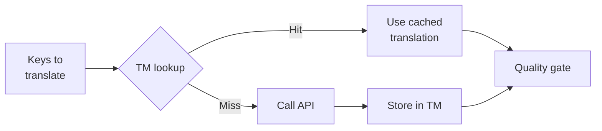

# Translation Memory

Translation Memory (TM) is champollion's built-in caching layer. It stores every translation keyed by source text + locale + method, so re-running `sync` only calls the API for keys that have genuinely changed.

## Why TM Exists

Without TM, every `sync` re-translates every modified key — even if you've already translated the exact same English text for the same locale on a previous run. Common scenarios where this wastes money:

| Scenario | Without TM | With TM |
|----------|-----------|---------|
| Re-run sync after 1 key change (500 keys × 10 locales) | 5,000 API calls | 10 API calls |
| Revert a key to a previous English value | Full API call | Instant cache hit |
| Same phrase appears in 3 locale files | 3 × API calls | 1 API call + 2 cache hits |
| Dry-run → real sync | Full API calls on both | First run caches, second reuses |

TM is **enabled by default** and requires no configuration. Translations are cached automatically during every `sync` and served on subsequent runs.

## How It Works

### Cache Key

Each TM entry is keyed by a SHA-256 hash of three values:

```
SHA-256( sourceValue + '\x00' + locale + '\x00' + method )
```

| Component | Why it's in the key |
|-----------|-------------------|
| `sourceValue` | Different English text → different translation |
| `locale` | "Hello" translates differently to French vs Japanese |
| `method` | Google Translate output ≠ GPT-4o output |

The null byte separator (`\x00`) prevents collision between `"ab" + "c"` and `"a" + "bc"`.

The `sourceValue` is the text the key is translated from, with whatever else tells two identical texts apart folded in:

- **gettext context.** An entry with a `msgctxt` is cached with its context: "Open" the verb and "Open" the adjective are two entries.
- **Plural forms the source does not have.** i18next stores plurals as suffixed keys, and a target language can have forms the source lacks: French and Spanish add `count_many`, which is translated from the English `count_other` text. The two keys send the same text, but the model is asked for different forms (`"2 recettes"` and `"1 000 000 de recettes"`), so each gets its own entry: `count_other` keeps the plain one, and `count_many` is cached under the text plus its form. The same holds for every form translated from another category's text (Arabic `_zero`, `_two`, `_few`, `_many`; Russian `_few`, `_many`; ordinal forms).
- **gettext `msgid_plural` and ARB / ICU plurals** are one message per key (every form in one value), so they are one entry, as before.

Before 0.4.0, a borrowed form shared the entry of the form it is translated from, and the entry held whichever answer was stored last, so `--redo all` could write one form into both keys. A cache from then is repaired as it is used. When the shared entry holds the borrowed form's text, it moves to that form's own entry, and the other form is translated again the next time it is queued. Otherwise the entry stays with the form it borrows from, and the borrowed form is sent to the model once, the first time it is queued (the run says so). `champollion verify` warns when a borrowed form holds exactly the text of the form it borrows from and the cache does not show the model wrote it that way. Some languages do write two forms alike, so this is a warning; `--redo keys:<key>` asks again.

### During Sync



1. Before calling the translation API, champollion partitions keys into **TM hits** and **TM misses**
2. Hits are served instantly from cache — no API call, no latency, no cost
3. Misses go through the normal translation pipeline
4. New translations from the API are stored in TM for future runs
5. All translations (cached + fresh) pass through the quality gate

### Storage

TM is stored at `.champollion/tm.json` in your project root. The file uses compact JSON (no pretty-printing) to keep size manageable. Each entry stores:

| Field | Description |
|-------|-------------|
| `t` | The translated text |
| `ts` | ISO-8601 timestamp of when it was cached |
| `l` | Target locale code (for stats/filtering) |
| `m` | Translation method name (for stats/filtering) |

At 50 languages × 500 keys = 25,000 entries, the file should be ~2-3 MB.

## Managing the Cache

### View Statistics

```bash
champollion tm stats
```

Shows entry count, file size, and a per-locale breakdown:

```
  Translation Memory — .champollion/tm.json

  Entries:      2,847
  File size:    1.2 MB
  Created:      2026-05-20 09:14 MDT
  Last entry:   2026-05-24 17:52 MDT

  By locale:
    fr       482 entries
               380  llm · model google/gemini-3.8-flash · register formal-vous
               102  llm-coached · model google/gemini-3.8-flash · register formal-vous · coaching 3f2a9c1b
    de       471 entries
               471  llm · model google/gemini-3.8-flash · register formal-Sie
    ja       465 entries
               465  llm · model google/gemini-3.8-flash · register polite
```

The dates are in this machine's local time, with the zone named (`--json`
also carries the stored UTC timestamps as `createdAt` and `lastEntryAt`).
Each line under a locale is what made those entries: the method, model and
register (and a fingerprint of the coaching text, for every method whose
prompt carries it: `llm`, `local`, `openai`, `anthropic`, `gemini`,
`llm-coached`; a pair's, language's or fallback's own `coachingFile` is read
for this, and its text, not its path, counts). Two
models under one locale usually mean a model switch; `champollion status`
says whether the locale files themselves now mix the two models' text.

### Clear the Cache

```bash
# Clear everything (with confirmation prompt)
champollion tm clear

# Clear without prompt (CI environments)
champollion tm clear --yes

# Clear only one locale
champollion tm clear --locale fr
```

### Skip TM for One Run

```bash
# Fresh API calls for everything queued (useful when debugging quality)
champollion sync --redo all --fresh     # --fresh = --no-tm
```

This doesn't delete the cache and doesn't read it this run — but what the run translates (and pays for) is still stored, so the next run is cached again.

## Switching Model

**How to switch.** The model is a setting in `champollion.config.json`: edit `"model"` (and `"defaultMethod"` when the method changes too), or a pair's own `"model"` in `"pairs"`. The next `champollion sync` uses it.

`sync --model <name>` (and `--method <name>`) name a model for **one run only**: the file is not changed, sync says so, and the next plain `sync` uses the configured model again. What that run translated stays in the files. A plain sync afterwards says which translations another model wrote, with both ways out: keep them by making that model the configured one (set `"model"` to it — nothing is sent), or have the configured model translate them (the redo command it prints, with its price). `champollion status` says the same. Running `champollion init` again is not needed to switch; `init --force` rewrites only what its flags name, and keeps every other setting ([CLI Reference](/docs/reference/cli#init)).

Changing model does not throw your cache away. When a string has no entry under the new model, sync reuses the translation made under the previous model, as long as the method, register and coaching are unchanged. Reused entries go through the same quality checks as any other cache hit. Before the cost estimate, sync says how many translations it will reuse and which model wrote them — a dry run too, and also after the switch is complete: a string reverted to a text only the earlier model translated is served that model's translation, and the run says so before the estimate.

To have the new model translate them instead (it sends the keys an earlier
model translated; what the new model already translated still comes from the
cache):

```bash
champollion sync --redo all --fresh-on-model-change
```

On its own, `--fresh-on-model-change` only affects keys the run translates
anyway (new or changed ones). After a full re-translation, sync stops
announcing the model change for that language. Keys the new model's answers
failed for are recorded as **pending** in `.champollion.lock`: the next
`champollion sync` asks the new model for them once more (not the cache), and
the switch is complete when they are done. `champollion status` lists pending
keys, and says when the files hold text from an earlier model — mixed with the
current one, or all of it ([Quality Gate](/docs/concepts/quality-gate#a-redo-that-could-not-finish)).
It knows which model wrote each value because sync records it in
`.champollion.lock` (the model that answered, or the one whose cached
translation was served). For values written before 0.4.0 it falls back to the
cache, and says "model unknown" when two models cached the same text. A plain
`champollion sync` with nothing to translate says, in one line per language,
when the files were written by a model other than the configured one, with the
command above.
A bulk redo never replaces a translation a person edited in the file
([Editing translations](/docs/guides/professional-translators#editing-key-value-files)).

Changing the method, register or coaching still produces fresh translations, because those changes exist to get different text. When keys go to the model although the cache holds translations of the same text made another way (say after switching `local` → `llm`), sync says so once per language, naming what made them — that is why the run shows nothing served from the cache.

A change of method, register or coaching re-translates nothing on its own: a plain sync (or a dry run) with nothing new to translate keeps the files as they are. It says so, per language: how many values another method wrote, the redo that replaces them (`champollion sync --pair en:fr --redo all`), and what that would cost.

## When TM Doesn't Help

TM won't produce a cache hit when:

- **Source text changed** — the hash changes, so it's a miss
- **Method changed** — switching from `llm` to `google-translate` means different cache keys
- **Register or coaching changed** — the cache key includes them (a model change alone is reused; see above). A pair's fallback has its own key (method, model, register, coaching): after changing it, `sync` and `status` name the values its earlier setup wrote and the redo (`--redo all`; with `--fresh-on-model-change` for a model change alone). Caches written before 0.4.0 keyed coaching only for `llm-coached`; on the first run, entries made with the coaching a pair has then are kept
- **Not part of the key:** the glossary, and `llm-coached`'s grammar rules and style notes — editing them re-translates nothing cached (`--redo keys:… --fresh` asks again)
- **`--retranslate <glob>`** — the named content files are translated fresh on purpose
- **First run** — cold start, no entries yet
- **`--no-tm` / `--fresh`** — explicitly bypasses the cache
- **A pending key** — a key a redo could not finish is asked of the model again, not served from the cache

The cache never decides whether a key is *queued*: an unchanged key whose translation is already in the file is skipped before any lookup (it is not counted as a cache hit). And a key the quality gate refused from a model is not sent to that model again on a plain sync — it would bill the same answer ([held back](/docs/concepts/quality-gate#refused-keys-are-held-back)); the cache is still read for it.

## Should You Commit `.champollion/tm.json`?

**Generally no.** TM is local developer optimization. It's populated automatically during sync and only helps when re-running sync on the same machine. However, you might consider committing it if:

- Your team shares a single CI runner that syncs translations
- You want reproducible builds without API calls
- You're archiving translations for compliance

Add `.champollion/tm.json` to `.gitignore` for typical usage.

---

## See Also

- [How Sync Works](/docs/concepts/how-sync-works) — where TM fits in the pipeline
- [CLI Reference — tm](/docs/reference/cli#tm) — command reference
- [CLI Reference — sync --no-tm](/docs/reference/cli#sync) — bypassing TM
