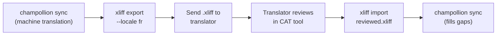

# Working with Professional Translators

Champollion generates machine translations, but some projects need human review — regulatory content, brand-sensitive copy, or high-stakes UI. The XLIFF workflow lets you export translations for professional review and import them back seamlessly.

XLIFF covers your app's **string files** (keys and values). Translated **Markdown** (newsletters, blog posts, docs pages) is reviewed differently: the reviewer edits the translated `.md` file directly, and sync keeps those edits. See [Reviewing translated Markdown](#reviewing-translated-markdown) below.

## What is XLIFF?

XLIFF (XML Localization Interchange File Format) is the industry-standard exchange format for translation tools. Every professional CAT (Computer-Assisted Translation) tool supports it:

- **memoQ** — import XLIFF, review in-context, export reviewed file
- **SDL Trados Studio** — native XLIFF support
- **Phrase (Memsource)** — upload XLIFF jobs for translator teams
- **Smartling** — XLIFF ingestion pipeline
- **OmegaT** — free/open-source CAT tool with XLIFF support

Champollion generates XLIFF 1.2 (the universally supported version) rather than 2.0+ for maximum tool compatibility.

## The Workflow



### Step 1: Generate Machine Translations

Run `sync` first to get a baseline machine translation:

```bash
champollion sync
```

### Step 2: Export XLIFF

Export the source + target pair as XLIFF:

```bash
champollion xliff export --locale fr
```

This writes `.champollion/xliff/fr.xliff` containing:
- Every source key with its English value
- The current machine translation (if any) as the `<target>`
- Keys without translations marked as `state="new"`

```xml
<trans-unit id="hero.title" xml:space="preserve">
  <source>Welcome to our platform</source>
  <target state="translated">Bienvenue sur notre plateforme</target>
</trans-unit>
```

### Step 3: Send to Translator

Send the `.xliff` file to your translator or upload it to your CAT platform. The translator sees source and target side-by-side, and can:

- Edit machine translations
- Fill in missing translations
- Flag quality issues
- Apply their own translation memory and termbases

### Step 4: Import Reviewed File

When the translator returns the reviewed `.xliff`, import it:

```bash
# Preview what will change
champollion xliff import .champollion/xliff/fr.xliff --dry

# Apply changes
champollion xliff import .champollion/xliff/fr.xliff
```

Output:
```
  ✓ Imported 142 translations for fr
    Updated:    23 (changed from existing)
    Added:      0 (new keys)
    Unchanged:  119
    Written to: locales/fr.json
```

### Step 5: Fill Gaps

If new keys were added after the XLIFF was exported, run `sync` to translate them:

```bash
champollion sync
```

Champollion only translates keys that are still missing — reviewed translations from the XLIFF import are preserved.

## Tips

### Export Custom Paths

```bash
# Export to a specific directory
champollion xliff export --locale ja --out ./for-review/

# Export with a specific filename
champollion xliff export --locale de --out ./review/german.xliff
```

### Multiple Locales

Export each locale separately:

```bash
for locale in fr de ja ko; do
  champollion xliff export --locale $locale
done
```

### Version Control

Add `.champollion/xliff/` to `.gitignore` — XLIFF files are transient artifacts, not project source:

```gitignore
.champollion/xliff/
```

### When to Use XLIFF vs. Just `sync`

| Scenario | Recommendation |
|----------|---------------|
| Internal app, 90%+ quality acceptable | Just `sync` — machine translation is fine |
| User-facing marketing copy | Export XLIFF for human review |
| Legal/regulatory content | Export XLIFF — human review required |
| 50+ locales, tight deadline | `sync` first, XLIFF export for top 5 locales only |
| Translator already uses a CAT tool | XLIFF is the natural handoff format |

## Editing Translations in the Locale Files {#editing-key-value-files}

A reviewer can also fix a translation directly in a locale file (`messages/fr.json`, `locale/fr/LC_MESSAGES/django.po`, `app_fr.arb`, …) and commit it. Champollion records, in `.champollion.lock`, a fingerprint of every value it writes. A value that no longer matches was changed by a person, and sync treats it as theirs:

| What runs | What happens to the edited value |
|-----------|----------------------------------|
| A plain `sync`, the English unchanged | Untouched (as before). |
| `sync --redo all` / `--force`, a model switch (`--redo all --fresh-on-model-change`), or the retry of keys a redo left pending | **Kept.** The run says how many it kept and which, and how to replace one: `--redo keys:<key>`. |
| `sync --redo keys:<key>` naming it | Replaced — you asked for that key by name. The edited wording is printed first. |
| The **English source of that key changes** | Translated again (the edit was for the old text). The edited wording is printed so it can be re-applied, and appended to `.champollion-replaced-edits.jsonl` in the project root. |

`.champollion-replaced-edits.jsonl` is a tracked file next to the lock (the `.champollion/` cache folder is per machine and ignored by git): one JSON line per replaced edit, with the locale, file, key, the edited wording, why it was replaced and the new source text. Commit it with the lock — it is the only copy of that wording. `champollion status` says how many it holds.

Values written before this record existed, or by another tool, have no fingerprint. Such a value counts as Champollion's only when the translation cache holds exactly that text for the key; otherwise it is treated as a person's and kept by bulk redos (the run names them as values it has no record of writing). Values imported with `champollion xliff import` are a person's work and are kept the same way.

## Reviewing Translated Markdown {#reviewing-translated-markdown}

Content files from a `contentDir` (for example `newsletters/2026-10.md` → `newsletters/2026-10.crk.md`) have no XLIFF export. The reviewer works in the translated file itself:

1. Run `champollion sync` and commit the translations together with `.champollion-content.lock`.
2. The reviewer edits the translated file, either a paragraph or a translated front-matter field such as `title`, and commits it.
3. On later syncs, the edits are kept. If the English source changes in other paragraphs, the reviewer's paragraphs stay word for word and only the changed paragraphs are translated. The run prints `kept the edits made by hand to …`.

There are two exceptions, and sync warns about both. If the English paragraph the reviewer corrected changes too, that paragraph is translated again and the reviewer's wording is printed so it can be re-applied. If the reviewer added or removed paragraphs and the source then changes, the file is left as it is, and listed on every sync, until someone updates it by hand.

To throw the edits away and go back to machine translation, name the file: `champollion sync --redo files:2026-10.md`. The full rules are in [Content Translation](/docs/guides/content-translation#reviewing-and-editing-translations).

---

## See Also

- [CLI Reference — xliff](/docs/reference/cli#xliff) — command reference
- [Translation Memory](/docs/concepts/translation-memory) — caching reviewed translations
- [Translation Methods](/docs/guides/translation-methods) — machine translation options
- [Content Translation](/docs/guides/content-translation) — translating Markdown, and how reviewers' edits are kept
- [Quality Gate](/docs/concepts/quality-gate#refused-keys-are-held-back) — keys the gate refused, and keys a redo left pending
