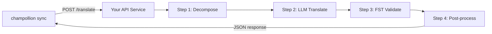

# Serving a Custom Method as an API

champollion's **`api` method** lets you point any translation pair at an external HTTP endpoint. This is how you integrate pipelines that are too complex for a single LLM prompt — morphological analyzers, finite-state transducers (FSTs), multi-step LLM chains, or any custom research method you've built.

There are two ways to stand up such an endpoint:

1. **`champollion serve`** — one command that serves your existing champollion project's configured stack (method, registers, coaching, Translation Memory, quality gate) behind this contract. No server code. See [the zero-code path](#the-zero-code-path-champollion-serve).
2. **A custom service** — write your own HTTP server implementing the contract, for pipelines that live outside champollion entirely.

## Why an API Service?

Some translation pipelines can't run inside a simple prompt-response cycle:

| Pipeline step | Example |
|---|---|
| **Morphological decomposition** | Split polysynthetic words into morphemes before translation |
| **FST validation** | Reject outputs that violate phonological or morphological rules |
| **Multi-step LLM chains** | Generate → verify → correct cycles with different models |
| **Dictionary lookup** | Cross-reference a curated bilingual dictionary mid-pipeline |
| **Human-in-the-loop** | Queue uncertain translations for expert review |

The `api` method treats your pipeline as a black box — champollion sends source strings, your service returns translations. What happens inside is entirely up to you.

## Architecture



## The Zero-Code Path: `champollion serve`

If your pipeline is already a champollion project — a configured method (LLM, coached, or an engine), registers, coaching files, Translation Memory, and the deterministic quality gate — you don't need to write a server at all. `champollion serve` stands **your own configured stack** up behind the exact contract described below:

```bash
# Owner side — run from the project whose champollion.config.json defines the stack
CHAMPOLLION_SERVE_TOKEN=$(openssl rand -hex 24) npx champollion serve
# [OK] champollion serve listening on http://127.0.0.1:1822/translate
```

Every request runs through the same pipeline `champollion sync` uses:

- **Translation Memory** — strings the TM already holds are served from cache for free, without touching your upstream provider. Gate-validated API results are cached for the next request.
- **Quality gate** — every response is validated deterministically (repetition, length ratio, script compliance, source echo). Failures come back as structured per-key errors (HTTP 207/422) — never as silently degraded output.
- **Cost guard** — `--max-cost-per-request` and `--max-session-cost` refuse requests whose *estimated* upstream cost exceeds your caps, before any provider call is made. Methods with unknown pricing are refused under a cap too: unknown is not free. TM-covered requests are a known $0 and always pass.

The server binds to `127.0.0.1` by default: anyone who can reach the port can spend your upstream API budget, so exposing it is an explicit decision — `--bind 0.0.0.0` plus a strong bearer token. `--no-auth` is only accepted together with a loopback bind. A per-IP rate limit and a request-size cap are on by default; see `champollion serve --help`.

### Point a Consumer at It

Emit the plugin manifest consumers install (one command on each side):

```bash
# Owner side
champollion serve --emit-manifest --endpoint https://translate.example.org
# [OK] Wrote ./my-project-serve/method.json
```

```bash
# Consumer side
champollion plugin install ./my-project-serve
```

```json title="champollion.config.json (consumer)"
{
  "pairs": {
    "en:crk": { "methodPlugin": "my-project-serve" }
  }
}
```

```bash
CHAMPOLLION_API_KEY=<the server's bearer token> champollion sync
```

The consumer's `api` method POSTs source strings to your server; your stack translates, gates, and caches; the manifest's `qualityTier` is an honest passthrough of your configured pairs (the most conservative tier when they differ). Your prompts, coaching data, and provider keys never leave your machine.

The rest of this guide covers writing a **custom** service — useful when your pipeline isn't a champollion project (a Python FST chain, a bespoke research system). The wire contract is identical either way.

## Setting Up Your Service

Your API service must implement a single endpoint that accepts and returns JSON:

### Request Format

champollion sends this exact JSON body (see [api.js](https://github.com/gamedaysuits/Champollion/blob/main/cli/lib/methods/api.js)):

```json
POST /translate
Content-Type: application/json
Authorization: Bearer <CHAMPOLLION_API_KEY>

{
  "source_locale": "en",
  "target_locale": "crk",
  "method": "crk-coached-v1",
  "keys": {
    "greeting": "Hello, welcome to our app",
    "farewell": "Goodbye and thanks"
  }
}
```

| Field | Type | Description |
|-------|------|-------------|
| `source_locale` | string | BCP 47 source language code |
| `target_locale` | string | BCP 47 target language code |
| `method` | string | Plugin name or `"default"` |
| `keys` | object | Map of key → source string to translate |
```

### Response Format

Your service must return a `translations` object. An optional `meta` object can include cost and diagnostic info:

```json
{
  "translations": {
    "greeting": "tânisi, pê-kîwêw ôta",
    "farewell": "ekosi mâka, kinanâskomitin"
  },
  "meta": {
    "model": "my-custom-pipeline/v1",
    "cost_usd": 0.0042,
    "method": "decompose-translate-validate"
  }
}
```

| Field | Type | Required | Description |
|-------|------|----------|-------------|
| `translations` | object | ✅ | Map of key → translated string |
| `meta` | object | — | Optional metadata |
| `meta.cost_usd` | number | — | If present, displayed in champollion's output |
| `errors` | object | — | For partial success (HTTP 207): map of key → `{ message }` |

### Minimal Express Server

```javascript
import express from 'express';

const app = express();
app.use(express.json());

/**
 * champollion API contract:
 *
 * Request:  { source_locale, target_locale, method, keys: { "key": "source" } }
 * Response: { translations: { "key": "translated" }, meta: { ... } }
 */
app.post('/translate', async (req, res) => {
  const { source_locale, target_locale, method, keys } = req.body;

  const translations = {};

  for (const [key, source] of Object.entries(keys)) {
    // --- Your pipeline goes here ---
    // Step 1: Morphological decomposition
    const morphemes = await decompose(source, source_locale);

    // Step 2: LLM translation with context
    const draft = await llmTranslate(morphemes, target_locale);

    // Step 3: FST validation
    const validated = await fstValidate(draft, target_locale);

    // Step 4: Post-processing (orthography normalization, etc.)
    translations[key] = await postProcess(validated);
  }

  res.json({
    translations,
    meta: {
      model: 'my-custom-pipeline/v1',
      method: 'decompose-translate-validate',
    },
  });
});

app.listen(3001, () => {
  console.log('Translation API running on http://localhost:3001');
});
```

## Configuring champollion

Point a translation pair at your running service in `champollion.config.json`:

```json
{
  "inputLocale": "en",
  "pairs": {
    "en:crk": {
      "method": "api",
      "endpoint": "http://localhost:3001/translate",
      "register": "Formal Plains Cree. Use SRO orthography."
    }
  }
}
```

Then run sync as usual:

```bash
npx champollion sync
```

champollion will POST your source strings to the endpoint and write the returned translations to `crk.json`.

## Case Study: Plains Cree Pipeline

:::info[Under Development]
The Plains Cree pipeline described below is **under active development** and is not yet running in production. Details here reflect the current design direction and may change as the project evolves.
:::

The **arena** project demonstrates this pattern. Its Plains Cree pipeline uses:

1. **Morphological decomposition** — Break polysynthetic Cree words into translatable morpheme chains
2. **LLM translation** — Context-enriched GPT-4o translation with coaching data (SRO orthography rules, register instructions)
3. **FST validation** — Finite-state transducer checks that outputs conform to Cree phonological rules
4. **Confidence scoring** — Each translation gets a confidence score based on FST pass rate and dictionary coverage

The entire pipeline runs as a single HTTP endpoint that champollion calls via the `api` method.

### Running Evaluations

After translating, you can evaluate output quality using the harness directly:

```bash
# Clone the harness
git clone https://github.com/gamedaysuits/Champollion.git
cd Champollion/arena
pip install -e .

# Run the evaluation against a real, non-bundled corpus
mt-eval run --corpus eval-amh-fra-globalvoices-test-v1 --model gemini-pro --yes
```

This produces structured evaluation records with chrF++, BLEU, and exact match scores that can be used as regression baselines.

## Authentication

If your API requires authentication, set the `apiKey` field or use an environment variable:

```json
{
  "pairs": {
    "en:crk": {
      "method": "api",
      "endpoint": "https://my-mt-service.example.com/translate",
      "apiKey": "${CRK_API_KEY}"
    }
  }
}
```

## Data Sovereignty

The `api` method is particularly important for **Indigenous language communities**. By self-hosting the translation pipeline, a community keeps full control over:

- **Proprietary coaching data** — register instructions, orthography rules, and domain glossaries never leave community infrastructure.
- **Linguistic resources** — curated dictionaries, FST grammars, and elder-verified translations remain under community ownership.
- **Access policies** — the community decides who can call the endpoint and under what terms.

This design follows the direction of [Indigenous data-sovereignty principles](/docs/network/community/low-resource-languages#data-sovereignty-principles) — community ownership and control of language data: sensitive language data stays governed by the community rather than a third-party platform.

:::tip
Combine the `api` method with a private deployment (e.g., a community-hosted VM or on-prem server) for the strongest data-sovereignty posture. `champollion serve` gives a community exactly this self-hosting posture without writing any server code — coaching data, provider keys, and the Translation Memory all stay on community infrastructure. See [Support a Low-Resource Language](/docs/network/community/low-resource-languages) for a full walkthrough.
:::

## Cost Estimation

The `api` method returns `null` for cost estimation by default — your service controls pricing. If you want to provide cost transparency, have your API return a `cost` field in the metadata:

```json
{
  "translations": { "...": "..." },
  "metadata": {
    "cost": {
      "estimatedCost": 0.0042,
      "currency": "USD",
      "source": "my-service-pricing"
    }
  }
}
```

## Best Practices

1. **Return empty strings for failures** — Don't return the source string as a "translation." Return `""` and champollion's quality gate will catch it. The key will be skipped and retried on the next sync.
2. **Include confidence scores** — If your pipeline can estimate quality, return it in metadata. This helps with quality auditing.
3. **Implement health checks** — Add a `GET /health` endpoint so champollion can verify connectivity before starting a large sync.
4. **Rate limit gracefully** — If your pipeline has throughput limits, return `429` status codes. champollion's batch system will back off.
5. **Log everything** — Multi-step pipelines can fail silently. Log each step's input/output for debugging.

## Licensing

The `api` method pattern is fully open — there are no licensing restrictions on wrapping your own translation pipeline as an HTTP service. The `arena` eval harness is licensed AGPL-3.0-or-later (with a §7 eval-standard-plugin exception); you can study and build on it under those terms.

## See Also

- [Translation Methods](/docs/guides/translation-methods) — overview of every built-in method (`openai`, `google`, `api`, etc.)
- [Plugin Specification](/docs/reference/plugin-spec) — full schema for `champollion.config.json` including `api` method fields
- [Support a Low-Resource Language](/docs/network/community/low-resource-languages) — end-to-end guide for under-resourced languages, including data-sovereignty principles
- [Architecture](/docs/concepts/architecture) — how champollion's sync loop, batching, and method dispatch work
- [MT Evaluation](/docs/network/leaderboard/rules) — evaluation methodology, metrics, and the leaderboard submission process
- [Method Leaderboard](/leaderboard) — live quality rankings across methods and language pairs

