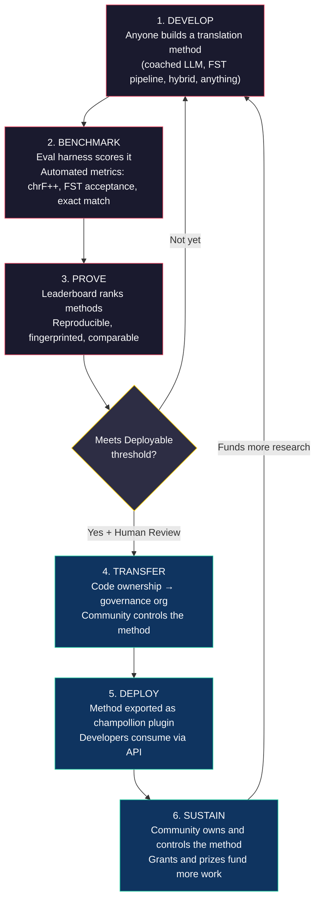
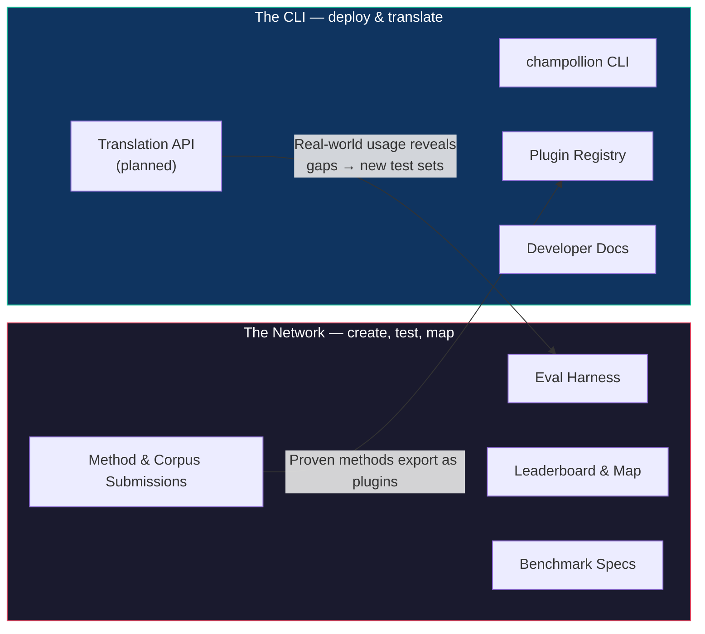
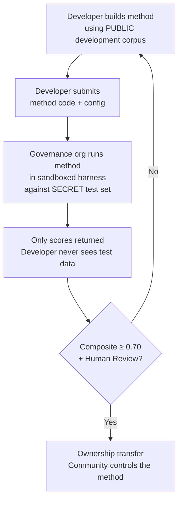

# How the Network Works: Build, Test, Develop, Deploy

> **Executive Summary.** Machine translation for the world's underserved languages is not a model-training problem — it is an *infrastructure* problem. No single model, lab, or company will solve it. This document describes a platform architecture that turns the global community of ML engineers, linguists, and language speakers into a distributed research lab: anyone builds a translation method, the network tests whether it works — including against community-held evaluation data the platform never sees — and methods that work become assets owned by the communities whose languages they serve. The mechanism is open, collaborative method development paired with flexible, steward-set terms — a combination still rare in practice, and the one we think this problem demands.

---

> [!IMPORTANT]
> **Scope.** This platform evaluates **formal written text translation** — documents, educational materials, official communications, UI strings. It is not a chatbot, real-time interpreter, or unrestricted-domain conversational system. The leaderboard ranks translation methods against curated parallel corpora in specific text domains (see [Benchmark Specification §2.7](/docs/network/specifications/benchmark#27-domain) for the domain taxonomy). MT is infrastructure for language revitalization, not a substitute for it. Children learn language from people, not machines.

### Current Domain Coverage

The board is **live and populating** — runs publish to it continuously, and
anyone can add more. The table below shows which public reference corpora
are *supported* per domain; the [leaderboard](/leaderboard) has the live
rankings.
Corpora are fetched from source at run time, never hosted here.

| Domain | Reference corpus | Status | Notes |
|--------|------------------|--------|-------|
| News / journalism | Global Voices (OPUS) | Supported — open for submissions | 493 language pairs, CC BY 3.0 |
| Everyday / mixed (written) | Tatoeba | Supported — open for submissions | 874 language pairs, CC BY 2.0 |
| Educational / textbook | EdTeKLA (Plains Cree) | Research-only — **not ranked**; remote model-API evaluation consent-gated | EdTeKLA's modified CC BY-NC-SA (sovereignty-scoped, non-commercial); carved out of the leaderboard, prizes, and API/commercial lanes |
| Narrative / literary | — | Planned | No runnable corpus wired yet |
| Religious / scriptural | FLORES+ (Bible-domain) | Wired, relative-only | Runnable corpus; HIGH contamination, so relative-only — never used for official scoring |
| Spoken / real-time | — | Out of scope | This system evaluates written text, not speech |
| Technical / scientific | — | Future | Requires domain-specific terminology validation |

## What the Network Is For

Before the mechanics, the mission. The Champollion Network rests on four commitments:

1. **Create and trust translation test sets.** For most languages the scarce, valuable thing is not another model — it is a *trustworthy* test set: human-authored, domain-honest, and version-pinned. The Network exists to create those test sets and to make them trustworthy.
2. **Make the field navigable.** Who can translate what, how good each method is on each kind of text, and where the gaps are — surfaced as a public map, not buried in scattered papers and PDFs.
3. **Every method is welcome — human and machine.** We are pragmatists with a solutions bias. A professional translator, a rule-based system, a coached LLM, a fine-tuned model — all are first-class. We care about getting languages translated, not about which tool wins.
4. **Built *with* communities, never scraped — and sovereignty is non-negotiable.** Language data is biodata; the people who provide a corpus hold the keys to it, and to anything measured against it.

Everything below — the loop, the harness, the leaderboard, the deployment bridge — is in service of those four commitments.

---

## 1. The Problem: Machine Translation ≠ Machine Learning

Machine translation for low-resource languages (LRLs) is commonly framed as a machine learning problem: collect data, train a model, deploy. This framing is wrong, and the error is consequential — it directs funding, talent, and infrastructure toward an approach that structurally cannot work for the majority of the world's languages.

### 1.1 Why the ML Framing Fails

The standard ML pipeline for MT requires three things: large parallel corpora, validated evaluation benchmarks, and a deployment path. For the 194 languages on Google's Cloud Translation list and the 200 covered by NLLB-200, all three exist. For the ~1,200 languages in OMT-1600's long tail — our arithmetic: the 1,600 it covers minus the 400+ its authors report the models "understand sufficiently well" — evaluation data exists but quality is mostly below usable thresholds, the model weights are not publicly available, and there is no deployment pipeline. For the remaining ~5,400+, none exist at all.

| Requirement | High-Resource Languages | OMT-1600 Long Tail (~1,200 LRLs) | Remaining ~5,400 Languages |
|-------------|------------------------|-------------------------------|---------------------------|
| **Parallel corpora** | Millions of sentence pairs (Europarl, UN Corpus, OpenSubtitles) | Bible-domain bitext, web scrapes, synthetic backtranslation. No community-curated data. | Hundreds to low thousands, if any |
| **Evaluation benchmarks** | WMT, FLORES, NTREX — standardized, reproducible | BOUQuET (Bible-domain), met-BOUQuET. No morphological validation. No independent evaluation. | No standard benchmarks; ad hoc evaluation |
| **Deployment path** | Google Translate, DeepL, Azure — commercial APIs | Model weights not released. No CLI, no plugin system, no community-deployable API. | Nothing. No API, no product, no market. |

The ML approach works when the data exists to train on and the market exists to deploy into. OMT-1600 has expanded the first condition significantly — but expansion without independent quality verification, morphological validation, or community governance is expansion without trust. The problem isn't just "we need a better model" — it's "we need infrastructure that proves the model works, on terms the community controls."

### 1.2 What MT for LRLs Actually Requires

Translation for underserved languages is not primarily a training problem. It is a **method engineering** problem — the challenge of assembling available resources (LLMs, morphological tools, community knowledge, linguistic rules) into working translation pipelines, then proving they work with rigorous evaluation.

The distinction matters:

| Dimension | ML Approach | Method Engineering Approach |
|-----------|------------|---------------------------|
| **Core activity** | Train a model on data | Combine tools, prompts, and linguistic knowledge into a pipeline |
| **Bottleneck** | Parallel data volume | Engineering creativity + evaluation infrastructure |
| **Who can contribute** | Teams with GPU clusters and datasets | Anyone with an API key, a dictionary, and an idea |
| **Evaluation** | BLEU/chrF on held-out test sets | Morphological validation + human review + automated metrics |
| **Deployment** | Serve the model | Package the method as a plugin |

Modern LLMs already contain latent knowledge of many low-resource languages — enough to produce output that *looks* plausible. The problem is that this output is often morphologically invalid (the model hallucinates word forms that don't exist in the language). The engineering challenge is: how do you extract what the LLM knows, validate it against linguistic reality, and package the result for production use?

This is why we benchmark **methods**, not models. A method is the full recipe: model selection + prompt engineering + tool usage + pre/post-processing + coaching data + retry strategies. Two teams using the same model with different methods will get different scores. That's the point.

### 1.3 Why Polysynthetic Languages Break Everything

Many of the world's most underserved languages are **polysynthetic** — they encode entire sentences into single words through productive morphological processes. Consider the Plains Cree word:

> **ê-kî-nitawi-kîskinwahamâkosiyân**
> *"when I had gone to school"*

One word. It encodes tense (past), direction (going to), the root (learn), voice (passive/reflexive), and person (first singular). English needs six words for what Cree expresses in one.

This breaks standard MT at every level:

- **Tokenization** — BPE and SentencePiece shred polysynthetic words into meaningless fragments, because they were designed for concatenative morphology.
- **Hallucination** — LLMs produce plausible-looking strings that are not valid words. A non-speaker cannot tell the difference. Without morphological validation, hallucinations are invisible.
- **Evaluation** — Word-level metrics (BLEU) penalize the natural inflectional variation that is fundamental to how these languages work. Character-level metrics (chrF++) are better but still insufficient without structural validation.

The solution isn't a bigger model or more training data. It's **infrastructure that catches hallucinations before they reach users** — morphological analyzers (FSTs) that can definitively say "this is not a word in this language."

---

## 2. Why Existing Approaches Don't Work

### 2.1 Commercial MT

Commercial translation services have historically optimized for market volume. Meta's OMT-1600 (March 2026) represents a significant shift — 1,600 languages in one system. But for the ~1,200 in its long tail (our arithmetic: 1,600 minus the 400+ its authors report the models "understand sufficiently well"), quality is below usable thresholds, the model weights are not available, and there is no deployment pipeline. The structural incentive problem has evolved: Big Tech can now build models for LRLs, but without independent evaluation, morphological validation, or community governance, coverage alone doesn't solve the problem.

### 2.2 Academic Research

Academic MT research focuses overwhelmingly on high-resource language pairs because that's where the training data, shared tasks, and publication venues are. Researchers who work on low-resource pairs struggle to publish, struggle to fund compute, and struggle to deploy — because deployment infrastructure for LRLs doesn't exist.

### 2.3 One-Off Competitions

You could run a Kaggle competition: "English→Plains Cree, best chrF++ wins $10,000." Here's what happens:

1. Someone wins, submits a notebook, collects the prize, goes home.
2. The notebook rots in Kaggle's archive. Nobody deploys it. Nobody maintains it.
3. The test set is eventually published — contaminated forever.
4. The governance organization uploaded their linguistic data to Google's infrastructure under Google's terms of service, with no real control over the lifecycle.
5. No deployment bridge. A winning notebook is not a working API.

A one-time bounty attracts bounty hunters. An ongoing leaderboard with community governance creates sustained engagement.

### 2.4 Fine-Tuning

Fine-tuning an open model on parallel text is the obvious ML approach. But for most LRLs, the parallel corpus needed for fine-tuning is exactly the data that doesn't exist — and creating it requires the same bilingual speakers and community engagement that the fine-tuning is meant to replace. You can't bootstrap your way out of a data scarcity problem with a technique that requires data.

---

## 3. The Solution: Collaborative Method Development with Sovereign Evaluation

The platform inverts the traditional approach: instead of one team building one model, **the global community builds and tests translation methods together**, the network verifies what works, and methods that work deploy to production with the language community retaining ownership and control.

### 3.1 The Full Loop

Each stage has a specific function:

| Stage | What Happens | Who Benefits |
|-------|-------------|--------------|
| **Develop** | A researcher, student, or hobbyist builds a translation method using whatever tools they want — LLM prompting, FST pipelines, dictionaries, fine-tuned models, rule-based systems, or hybrids | The contributor learns, experiments, publishes |
| **Benchmark** | The eval harness scores the method against a standardized corpus with reproducible metrics. Every run produces a [run card](/docs/network/specifications/benchmark#3-run-card-schema) — a complete record of what was tested and how it performed | Researchers get reproducible, comparable results |
| **Prove** | Results appear on the public leaderboard. Methods are ranked, compared, and scrutinized. The community sees what works and what doesn't | Everyone gains visibility into the state of the art |
| **Transfer** | For Indigenous languages, methods that reach the Deployable threshold (composite ≥ 0.70) AND pass human validation have their code ownership transferred to the language community's governance organization | Community owns the method outright — code, weights, and deployment decisions |
| **Deploy** | The method is exported as a [champollion](https://github.com/gamedaysuits/Champollion) plugin the community can run on its own infrastructure. Developers consume translations without needing to understand the underlying method | Developers get translation for languages commercial APIs don't serve |
| **Sustain** | Grant funding and sponsored prizes — which the project is actively seeking; it is self-funded today — pay for more corpora, speaker validation, and research. Champollion is non-commercial and takes no share of anything a community earns from an asset it owns | Paid corpus work and community-owned methods outlive any single grant |

### 3.2 Why Open Collaboration Works

Open participation is not incidental — it is the mechanism. Here's why:

**Diversity of approaches.** The best method for English→Plains Cree might be an FST-gated coached LLM. The best for English→Quechua might be a dictionary-augmented pipeline. The best for English→Inuktitut might be a fine-tuned model bootstrapped from the Nunavut Hansard corpus. No single team or approach will dominate across all languages. The leaderboard reveals which *kinds* of approaches work for which *kinds* of languages — a meta-result that is itself a research contribution.

**Sustained engagement.** A leaderboard is never finished. There's always a better method to build. Every submission donates compute and intellectual effort to the problem. Unlike a one-time grant, the open, ongoing process generates sustained research investment from the global community.

**Low barrier to entry.** You need an API key, a dictionary, and an idea. The eval harness is open source. The corpus format is simple JSON. A linguistics student can match a well-resourced lab — and sometimes do better, because domain knowledge (understanding the language) can outweigh compute resources.

**Deployment bridge.** The same method that scores well in the harness deploys to production with one config change. "Prove it here, deploy it there." This is the gap that Kaggle, WMT shared tasks, and academic publications don't bridge.

### 3.3 The Platform Architecture

champollion.dev is **one hub with two faces**. The same site hosts the Network — where test sets are created, methods are evaluated, and results are mapped — and the CLI, where proven methods are deployed into real projects. They share one domain, one set of docs, and one data layer; the labels below describe two *roles*, not two sites.

**The [Network](/docs/network/)** is the proving ground. Its audience is translators, linguists, communities, and researchers. Everything here is about creating test sets, evaluating methods against them — human or machine — and mapping where the gaps are.

**The [CLI](https://champollion.dev)** is the deployment side. Its audience is developers who need translation for their apps. They don't need to understand how a method works — they just call it.

The bridge between the two faces is the **method**: created and trusted on the Network, packaged for deployment through the CLI, and — for community languages — owned by the community.

---

## 4. Sovereign Evaluation: Why the Infrastructure Matters

The evaluation infrastructure is not a technical detail — it is the core of the sovereignty model. Standard evaluation (upload your test set to a shared platform) doesn't work for Indigenous languages because it surrenders control over the linguistic data.

### 4.1 The Sovereignty Mechanism

The developer never sees the gold-standard evaluation data. They develop against a public development corpus, then submit their method code to the governance organization, which runs it in a sandbox against the secret test set. Only scores come back. This is not just security — it is built toward the Indigenous data-sovereignty principles that community ownership and control of language data require. Whether it meets them is not our call: the determination belongs to the communities involved.

### 4.2 Why This Can't Run on Someone Else's Platform

On Kaggle, the governance organization uploads their linguistic data to Google's infrastructure under Google's terms of service. They can't revoke access on their own timeline. They can't attach custom legal terms (like ownership transfer) to submissions. They have no cryptographic guarantee the data won't be used for other purposes. Data sovereignty means the community controls the evaluation endpoint, holds the keys, and can shut it down.

---

## 5. Evaluation Philosophy: Microeval and LYSS

Standard MT metrics (BLEU, chrF++, COMET) are designed to generalize across languages. That generality is their strength — and their blindspot. For polysynthetic languages, a morphologically invalid word that shares character n-grams with the reference scores well on chrF++ but would be recognized as gibberish by any speaker.

**Microeval development** means building evaluation metrics tailored to specific languages using the best available linguistic tools. The framework is called **LYSS** (Linguistically-informed Yield & Structural Scoring):

| Component | What it measures | Tool | Status |
|-----------|-----------------|------|--------|
| **LYSS-fst** | Morphological validity | Finite-state transducer | ✅ Implemented (Plains Cree) |
| **LYSS-eq** | Linguistic equivalence | Linguist-curated variant rules | ✅ Implemented (Plains Cree) |
| **LYSS-sem** | Semantic preservation | Language-specific semantic models | ✅ Implemented (Plains Cree) |

The universal metrics (chrF++, BLEU) serve as baselines and as the primary signals for languages without LYSS tooling. Wherever language-specific tools exist, LYSS components carry the scoring weight — because the things that matter most for each language are the things only language-specific tools can measure.

For the full LYSS specification and composite scoring logic, see [SCORING_SPEC.md §4](/docs/network/specifications/scoring#4-composite-score).

> [!WARNING]
> **Cross-run comparability.** When comparing runs with different metric availability (e.g., one run has FST scores, another doesn't), the composite scores are not directly comparable. The composite normalizes to available metrics, but a run evaluated on 5 metrics carries more information than one evaluated on 2. The leaderboard indicates metric coverage for each entry.

---

## 6. Who This Serves

### For ML Engineers & Researchers

An open leaderboard with standardized benchmarks for language pairs that no shared task covers. Reproduce any result with the eval harness. Publish your method. Beat the top score. Every submission is fingerprinted to a specific configuration and dataset version — no ambiguity about what was tested.

### For Language Communities

Ownership and control over translation technology built for your language. The competitive dynamic means multiple teams are working on your language simultaneously — you benefit from all of them and own the result. The benefit flows through ownership, attribution, capacity, and data terms the community governs — never a revenue share: Champollion is non-commercial and takes no cut of anything a community earns from an asset it owns.

### For Funders & Grant Reviewers

Transparent, reproducible metrics to evaluate translation research proposals. Measurable outcomes beyond publications: quality metrics over time, language coverage, corpora built and registered under steward control, paid speaker-hours delivered to communities. A successful method becomes a community-owned asset running on open evaluation infrastructure — the grant's impact compounds through reusable methods and public benchmarks rather than ending when the funding does.

### For Developers

Translation for languages no commercial API serves. One CLI command (`npx champollion sync`) translates your locale files using community-proven methods. Use Google Translate for French, a coached LLM for Plains Cree, and a community API for Quechua — all in the same project, all with the same interface.

### For Students

An open challenge with real-world impact. Build a translation method for an underserved language, benchmark it, and publish your results. The infrastructure is free, the datasets are open, and the leaderboard doesn't care whether you're at a top-10 university or working from a library terminal.

---

## 7. Social and Technical Context

### 7.1 Language Revitalization Is Accelerating

Language revitalization efforts are growing worldwide. Immersion schools, community language nests, and digital archiving projects are expanding across Indigenous communities in Canada, the United States, Australia, New Zealand, and Northern Europe. These efforts need technology — specifically, translation technology that respects community sovereignty over linguistic data.

### 7.2 LLMs Changed the Baseline

Before 2023, building any MT capability for a polysynthetic language required significant NLP expertise, custom model training, and large compute budgets. Modern LLMs have changed the baseline: a well-crafted prompt with coaching data and morphological validation can produce usable translations for some language pairs — no training required. This dramatically lowers the barrier to entry for method development. The problem has shifted from "how do we build a model?" to "how do we build a pipeline that validates and corrects what the model produces?"

### 7.3 Open, Reproducible Measurement

Public, shared evaluation has reshaped how the field learns what works. The Chatbot Arena, LMSYS, and the Hugging Face Open LLM Leaderboard showed that open, reproducible measurement — anyone can run it, anyone can check it — surfaces real progress faster than closed, self-reported claims. We take that lesson, not the tournament culture, and point it at translation for the thousands of languages where commercial MT either doesn't exist or hasn't been independently verified. The goal is a shared, checkable map of what works for which languages and which kinds of text — not a ranking of who beat whom.

### 7.4 Indigenous Data Sovereignty Is Non-Negotiable

Indigenous data-sovereignty principles — community ownership and control of language data, the CARE principles (Collective Benefit, Authority to Control, Responsibility, Ethics), and frameworks like Te Mana Raraunga (Māori Data Sovereignty) — are not optional add-ons — they are structural requirements for any technology that touches Indigenous linguistic resources. Our evaluation infrastructure is built to align with these principles architecturally, not just in policy statements — and whether it meets them is a determination that belongs to the communities, not to us.

---

## 8. Tensions and Limitations {#8-tensions-and-limitations}

This project uses a Western mechanism — competitive benchmarking — to serve knowledge systems that are often communal, relational, and Elder-guided. That tension is real and must be named, not resolved by assertion.

**Benchmarking vs. communal knowledge.** Leaderboards rank individuals and optimize numerical scores. Indigenous knowledge traditions emphasize relational authority, communal correction, and relationship-based legitimacy. We cannot claim to serve these knowledge systems while building a platform whose core mechanism is individual competitive optimization. The sovereignty architecture (§4) — where communities own methods, control evaluation, and decide what gets deployed — is our structural response, but it does not dissolve the tension. A leaderboard is still a leaderboard.

**What we are doing about it.** The platform supports team and community submissions alongside individual ones. The leaderboard frames results as "current state of the art" rather than "who is winning." The governance organization — not the leaderboard score — determines what gets deployed. No automated score entitles a developer to anything; the community decides. And we maintain an ongoing advisory feedback loop with partner communities about whether the platform's framing and incentive structure serves them. If it doesn't, we change it.

**MT is not revitalization.** Translation converts text between languages. Revitalization creates new speakers. A perfect MT system does not solve the transmission problem, the prestige problem, or the pedagogical problem. It might even create the illusion that "the computer can speak the language," undermining urgency for human transmission. We build MT as infrastructure — draft translation for post-editing, morphological tools for language learning apps, political leverage for communities demanding services in their language — not as a replacement for intergenerational transmission. The community controls if, when, and how the technology is deployed.

This section exists because these tensions were identified in an invited critique (May 2026) and we committed to naming them publicly rather than burying them in internal documents.

> [!NOTE]
> **Leaderboard scores are automated proxies.** All scores displayed on the leaderboard are automated measurements computed by the evaluation harness under controlled conditions. They indicate relative method performance but do not constitute quality guarantees. Community-validated methods are marked separately. No automated score entitles a developer to deployment — the governance organization makes that decision.

---

## 9. Current State

### What Exists Today

- **champollion** — the CLI tool. Multiple translation methods, per-pair configuration, quality gates, and support for the common locale file formats.
- **MT Eval Harness** — Working evaluation framework. chrF++, FST acceptance, and exact match metrics implemented. Run card schema finalized. Fingerprinting and integrity verification working.
- **EDTeKLA Dev v1** — Plains Cree evaluation corpus (EdTeKLA's modified CC BY-NC-SA — sovereignty-scoped, non-commercial), sourced from the University of Alberta's EdTeKLA research group. Carved out of the leaderboard, prizes, and the API/commercial path (non-commercial license); entry counts are stated once on the [Evaluation Datasets page](/docs/network/leaderboard/datasets#edtekla-development-set-v1).
- **FLORES+ Devtest** — 1,012 sentences × 870 catalogued language pairs (CC BY-SA 4.0).
- **Network website** — Docusaurus-based documentation site with leaderboard, specifications, tutorials, and sovereignty framework.
- **Benchmark Specification** — [Canonical spec](/docs/network/specifications/benchmark) defining corpus schema, run card format, and evaluation protocol. For metric definitions, composite weights, and quality tiers, see [SCORING_SPEC.md](/docs/network/specifications/scoring).

### What's Next

| Phase | What | Status |
|-------|------|--------|
| Baseline sweep | 12 models × 3 temperatures × 2 coaching configs on EDTeKLA | ⏸ Consent-gated — awaits the rights-holder's recorded permission for remote model-API evaluation |
| Composite score | Weighted metric implementation in harness | ✅ Done |
| Semantic score | Verdict-weighted score from CrkSemanticMetric (eval standard) | ✅ Done |
| Morphological accuracy | Per-morpheme scoring against gold-standard analysis | 🔲 Planned |
| Equivalent match | Variant-class matching via CrkLinterMetric (eval standard) | ✅ Done |
| Champollion API | API for community-owned methods | 🔲 Planned |
| Second language | Expand to a second language pair (Inuktitut, Quechua, or Sámi) | 🔲 Planned |

---

## 10. Getting Started

**Build a method:** Clone the [eval harness](https://github.com/gamedaysuits/Champollion), run a baseline experiment, and see where you land on the leaderboard.

**Contribute a corpus:** If you speak an underserved language, even 50 curated translation pairs are enough to open a new leaderboard track. See [For Language Communities](/docs/network/community/for-language-communities).

**Deploy translations:** Install [champollion](https://github.com/gamedaysuits/Champollion) and translate your app with `npx champollion sync`.

**Fund the effort:** See [The Economic Model](/docs/network/sovereignty/economic-model) for cost frameworks and sustainability projections.

---

## See Also

- **[Benchmark Specification](/docs/network/specifications/benchmark)** — corpus format, run card schema, evaluation protocol, sovereignty
- **[Scoring Specification](/docs/network/specifications/scoring)** — metrics, composite weights, quality tiers, cost/speed formulas
- **[the Network](/arena)** — the R&D proving ground
- **[champollion](https://github.com/gamedaysuits/Champollion)** — the deployment platform
- **[Support a Low-Resource Language](/docs/network/community/low-resource-languages)** — deep dive into polysynthetic MT challenges and approaches

---

*This document is the entry point for anyone encountering the project for the first time. For the full technical specification, see [BENCHMARK_SPEC.md](/docs/network/specifications/benchmark) (protocol) and [SCORING_SPEC.md](/docs/network/specifications/scoring) (metrics).*
