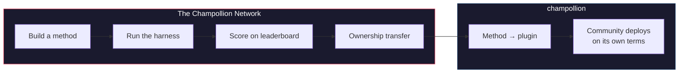

# The Champollion Network

> **Executive Summary.** The Champollion Network is open infrastructure to *create and trust* translation test sets for as many language pairs as possible — built *with* professionals and communities, never scraped from them — and to make the whole field navigable: who can translate what, how good each method is on each kind of text, and where the gaps are. Every method is welcome, human and machine. You can also build and submit a method and see how it scores against real corpora. For the languages whose data communities provide, sovereignty is non-negotiable: the people who provide a corpus hold the keys to it and to anything measured against it.

This section is the map's home. The pages beneath it explain how the
network of measured pairs is built ([How the Network
Works](/docs/network/how-it-works)), why the public work queue ranks what it
ranks ([Why the Queue](/docs/network/perspectives/why-the-queue) and the
[Queue Construction spec](/docs/network/specifications/queue-construction)),
and how a connection's strength is computed
([Connection Strength](/docs/network/specifications/connection-strength)).
If you are deciding whether to trust the project at all, start with
[Honest Limitations](/docs/network/honest-limitations); if you already know
what you want to build, the doors are in
[What Champollion Is](/docs/what-is-champollion).

**It runs on two kinds of benchmark.** *Public benchmarks* use open datasets to map and rank every method cheaply and openly — the scraped/open-data baseline tier, with contamination risk noted. *Sovereign benchmarks* are the gold standard: secret test sets that language communities create, own, and control, and that Champollion **never sees** — evaluated blind, and only when the community authorizes it. The infrastructure itself is source-available and singly stewarded; what belongs to a community are the test sets for their language and the methods built for it.

:::info[Launch/seed stage]
The Network is young but live: the leaderboard carries real published runs
and is open for anyone's submissions. For exactly what we do and do not yet
claim — verification, community validation, held-out evaluation — see
**[Honest Limitations](/docs/network/honest-limitations)**.
:::

---

## The Problem

Google's Cloud Translation service lists 194 languages ([Google's published list](https://docs.cloud.google.com/translate/docs/languages)). Meta's NLLB-200 covers 200, and OMT-1600 (March 2026) claims 1,600. There are over 7,000 spoken on Earth. For the ~1,200 languages in OMT-1600's long tail — our arithmetic: the 1,600 it covers minus the 400+ its authors report the models "understand sufficiently well" — the model weights are not available, quality is below usable thresholds, and evaluation used Bible-domain text with standard machine metrics — no morphological validation, no independent testing, no community governance. For the remaining ~5,400 languages, no pretrained model produces any output at all.

Big Tech is now investing in LRL coverage — but coverage without independent quality verification, morphological validation, or community governance is coverage without trust. The speakers who need translation tools the most are the same communities least likely to have them built.

**The Network exists to change that.** It provides the infrastructure to create test sets, evaluate any method against them — human or machine — and map the results, for any language, with reproducible scoring, open submission, and community governance over who controls the data and the results.

Language data is *biodata*. Like genetic or health data, a language carries the identity and relationships of the people who speak it, and it cannot be meaningfully anonymized — so the people who provide a corpus hold the keys to it, and to anything measured against it. Sovereignty is not a feature bolted on here; it is the foundation the rest is built on.

---

## How It Works

1. **You build a translation method** — coached LLM, fine-tuned model, FST-gated pipeline, or anything else that produces translations.
2. **The harness benchmarks it** — standardized metrics (chrF++, exact match, FST acceptance), fingerprinted to a specific Git commit.
3. **Results appear on the leaderboard** — live and open for submissions; every published run is reproducible and comparable.
4. **When a method works, ownership transfers** — for Indigenous languages, the method's code transfers to the community governance organization.
5. **The community deploys it — if and how they choose.** The method exports as a [champollion](https://champollion.dev) plugin and can run entirely on community infrastructure. Champollion takes no share of anything it earns there.

**Build it here. Deploy it there.**

:::tip[Crack a language, win, give it back]
This is an ML-benchmarking operation on purpose — competition is how hard pairs
get solved. We invite ML researchers and any capable builder to build the best
method for a specific hard pair, **win a bounty when one is open**, *and* hand the
resulting method to the sovereignty organization that owns that language. The
competitive energy is real; it is pointed at the mission, not at climbing a
leaderboard for its own sake. See the [Prize Specification](/docs/network/specifications/prizes).
:::

---

## Who This Is For

| You are... | The network gives you... |
|---|---|
| **ML engineer / researcher** | Standardized benchmarks, reproducible scoring, a shared corpus to test against |
| **Linguist** | A framework to turn grammar rules and dictionaries into testable methods |
| **Professional / human translator** | A place to register your services and be found — human translation is a first-class method here, listed and benchmarked alongside the machines, not an afterthought |
| **Language community member** | Governance over how your language's methods are developed and deployed |
| **Funder / grant reviewer** | Transparent, reproducible metrics to evaluate translation research proposals |
| **Student** | An open invitation with real impact — build a method, contribute your results |

---

## Reference corpora supported

**The board is live and still early** — the first sweeps are published and
more land as contributors run queue items. What follows is not a
leaderboard; it is the set of public reference corpora a submission can be
scored against today. Corpora are never hosted here: the harness fetches references from the
upstream source at run time and scores against the freshly fetched data.

### Global Voices (OPUS) — news domain
- **Coverage:** 493 language pairs catalogued and runnable (e.g. `eval-amh-fra-globalvoices-test-v1`, Amharic → French)
- **License:** CC BY 3.0
- **Source:** [Global Voices via OPUS](https://opus.nlpl.eu/)

### Tatoeba — conversational / mixed domain
- **Coverage:** 874 language pairs catalogued and runnable (e.g. `eval-afr-eng-tatoeba-dev-v1`, Afrikaans → English)
- **License:** CC BY 2.0
- **Source:** [Tatoeba community](https://tatoeba.org)

:::note[EdTeKLA is research-only — not a ranking benchmark]
The EdTeKLA Plains Cree corpus (*Cree: Language of the Plains*) carries
[EdTeKLA's **modified** CC BY-NC-SA](https://github.com/EdTeKLA/IndigenousLanguages_Corpora)
— sovereignty-scoped, non-commercial terms (the root textbook itself is CC
BY-NC-ND 4.0). It is **carved out of all ranking** — it does not qualify for
the leaderboard, any prize, or the API/commercial lanes — and remote
model-API evaluation of it is **consent-gated**: the harness refuses to send
its text to third-party model APIs unless the rights-holder's explicit
permission is recorded (local evaluation remains possible).

FLORES+ **is** wired and runnable here (870 catalogued pairs, e.g.
`eval-flores-devtest-v1-amh-fra`), but it is **HIGH-contamination** — public,
web-crawled evaluation data that frontier models have very likely already seen.
It is therefore **relative-only**: usable to compare methods head-to-head, but
**never reported as an absolute-quality benchmark**, and it is **test /
illustration only**. A FLORES+ result never ranks as a quality score and is
never used as a chain edge on the [translation map](https://champollion.dev).
See [Honest Limitations](/docs/network/honest-limitations) for exactly what we
do and do not claim.
:::

---

## The One Rule

:::danger[Do not train on evaluation data]
Methods exposed to the benchmark dataset — as training data, few-shot examples, dictionary entries, or prompt material — will be **disqualified**. Fine-tune on whatever you want. Just not on the test set.
:::

---

## Next Steps

- **[Submit a Method](/docs/network/getting-started/submit-a-method)** — how to submit your first benchmark run
- **[Benchmark Specification](/docs/network/specifications/benchmark)** — the full experiment protocol
- **[Leaderboard Rules](/docs/network/leaderboard/rules)** — submission criteria and anti-gaming policies
- **[Data Stewardship](/docs/network/sovereignty/data-sovereignty)** — corpora stay with their stewards; every license respected
- **[How the Work Is Funded](/docs/network/sovereignty/economic-model)** — non-commercial and currently self-funded; funders wanted, and every dollar's destination is published

**[→ View the Leaderboard](https://champollion.dev/leaderboard)**
