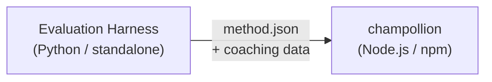

# Method Plugin Specification

> **Version**: 1.1  
> **Audience**: Plugin developers  
> **Canonical Schema**: [`shared/schemas/champollion-plugin.schema.json`](https://github.com/gamedaysuits/Champollion/blob/main/cli/shared/schemas/champollion-plugin.schema.json)

## Overview

champollion uses a **pluggable method system**. Each language pair can use a different translation method (LLM, coached, script-converter, etc.). Methods are registered in `lib/translate.js` and resolved per-pair via `lib/pairs.js`.

The eval harness's job is to **develop, test, and export** translation methods. champollion's job is to **consume and execute** them. The plugin is **data only** — configuration, coaching content, and benchmark results. No Python code, no harness dependencies.

### Data Flow



The harness develops and tests methods in Python. When a method is ready for deployment, the harness exports a `method.json` manifest and optional coaching data files. Champollion installs and executes the method using its own built-in method implementations.

---

## Method Plugin Format

A method plugin is a single JSON file (`method.json`) with optional coaching data files.

### `method.json` — Required

```json
{
  "name": "french-formal-v1",
  "type": "llm-coached",
  "version": "1.0.0",
  "description": "Formally-tuned French with terminology enforcement and grammar coaching",
  "author": "Plugin Author",

  "config": {
    "model": "google/gemini-3.5-flash",
    "temperature": 0.2,
    "batchSize": 80,
    "register": "formal",
    "coachingFile": null,
    "coachingPrompt": null,
    "promptContext": null,
    "qualityTier": null
  },

  "locales": ["fr"],

  "benchmarks": {
    "fr": {
      "date": "2026-05-11T00:00:00Z",
      "corpus_size": 500,
      "exact_match_rate": 0.42,
      "corpus_chrf": 72.3,
      "corpus_bleu": 45.1,
      "model": "google/gemini-3.5-flash",
      "harness_version": "1.0.0"
    }
  },

  "provenance": {
    "resources": [],
    "commercialReady": false,
    "flags": ["license-unclear"]
  },

  "coaching": {
    "dir": "coaching"
  }
}
```

### Field Reference

| Field | Type | Required | Description |
|-------|------|----------|-------------|
| `name` | string | ✅ | Unique method identifier (kebab-case) |
| `type` | string | ✅ | Champollion method type: `llm`, `llm-coached`, `api`, `google-translate`, `deepl`, `microsoft-translator`, `libretranslate`, `openai`, `anthropic`, `gemini` |
| `version` | string | ✅ | Semver version (e.g. `1.0.0`) |
| `locales` | string[] | ✅ | Which locale codes this method targets (minimum 1) |
| `description` | string | — | Human-readable description |
| `author` | string | — | Who developed/tested this method |
| `config.model` | string | — | OpenRouter model identifier |
| `config.temperature` | number | — | LLM temperature (0.0–2.0, default: 0.3) |
| `config.batchSize` | number | — | Keys per API batch (1–200, default: 80) |
| `config.register` | string \| null | — | Target language register/tone (preset key or freeform text) |
| `config.coachingFile` | string \| null | — | Path to free-text coaching prompt file (relative to project root) |
| `config.coachingPrompt` | string \| null | — | Resolved coaching prompt text (read from `coachingFile` at runtime) |
| `config.promptContext` | string \| null | — | Application context injected into system prompt (e.g., "E-commerce product descriptions") |
| `config.qualityTier` | string \| null | — | Quality tier from benchmark evaluation (`standard`, `high`, `research`, `verified`) |
| `benchmarks` | object | — | Per-locale benchmark results from the eval harness |
| `provenance` | object | — | Licensing and resource dependencies |
| `coaching.dir` | string | — | Relative path to coaching data directory |

:::info[Canonical MethodConfig Shape]
The `config` block uses the **canonical MethodConfig schema** — the same 8 fields used across `champollion.config.json`, harness run cards, `mt-eval export-config`, and leaderboard publish/install. All fields are always present; unused values are `null`. This ensures zero-friction round-tripping between evaluation and production.
:::

### Benchmark Object (per locale)

| Field | Type | Required | Description |
|-------|------|----------|-------------|
| `date` | string | ✅ | ISO 8601 timestamp of the benchmark run |
| `corpus_size` | number | ✅ | Number of entries evaluated |
| `exact_match_rate` | number | ✅ | 0.0–1.0, proportion of exact matches |
| `corpus_chrf` | number | — | chrF++ score (0–100) |
| `corpus_bleu` | number | — | BLEU score (0–100) |
| `model` | string | ✅ | Model used during eval |
| `harness_version` | string | ✅ | Version of the evaluation harness used |

:::info[Which metrics are displayed?]
The `champollion status` command displays **chrF++** and **exact match rate** from the benchmark block. `corpus_bleu` is accepted in the manifest but is not currently displayed or used by any champollion command. The [Method Leaderboard](/leaderboard) tracks chrF++, exact match, and FST acceptance rate.
:::

---

### Provenance Object

The provenance block communicates the licensing status of the plugin's bundled resources.

| Field | Type | Default | Description |
|-------|------|---------|-------------|
| `resources` | object[] | `[]` | List of bundled resources with `name`, `license`, and `type` |
| `commercialReady` | boolean | `false` | Whether the plugin is cleared for commercial distribution |
| `flags` | string[] | `["license-unclear"]` | Machine-readable status flags |

**Default state** — exported plugins ship with `commercialReady: false` and `flags: ["license-unclear"]`.

**Cleared state** — when licensing has been verified: set `commercialReady: true` and clear the flags.

---

## Coaching Data Format

If `type` is `llm-coached`, the plugin should include coaching data files in the `coaching/` subdirectory.

### `coaching/<locale>.json`

```json
{
  "grammar_rules": [
    "French adjectives agree in gender and number with the noun they modify",
    "Use 'vous' for formal contexts, 'tu' for informal"
  ],
  "dictionary": {
    "dashboard": "tableau de bord",
    "deployment": "déploiement",
    "settings": "paramètres"
  },
  "style_notes": "Prefer active voice. Avoid anglicisms where a native French term exists."
}
```

| Field | Type | Required | Description |
|-------|------|----------|-------------|
| `grammar_rules` | string[] | — | Rules injected into every LLM prompt for this locale |
| `dictionary` | object | — | Term → translation map. Matched terms are injected as required terminology. |
| `style_notes` | string | — | Freeform style instructions appended to the prompt |

---

## Directory Structure

```
french-formal-v1/
  method.json                 # Method manifest with benchmarks
  coaching/
    fr.json                   # Coaching data for French
```

For multi-locale methods:

```
european-formal-v2/
  method.json                 # locales: ["fr", "de", "es", "it"]
  coaching/
    fr.json
    de.json
    es.json
    it.json
```

---

## How Champollion Consumes Plugins

### Installation

```bash
champollion plugin install ./french-formal-v1/
```

Saves to `.champollion/methods/french-formal-v1/`.

### Configuration

```json title="champollion.config.json"
{
  "pairs": {
    "en:fr": {
      "methodPlugin": "french-formal-v1"
    }
  }
}
```

:::info[Merge semantics]
The plugin defines *what* method to use (`type`). The pair config tunes *how* to run it (`model`, `register`, `batchSize`). If the pair sets `model`, it overrides the plugin's default.
:::

### Runtime

1. Champollion reads `method.json` from `.champollion/methods/french-formal-v1/`
2. The plugin's `type` field sets the translation method (e.g., `llm-coached`)
3. Loads coaching data from the plugin's `coaching/` directory
4. Uses the `config` block to fill gaps in model/register/temperature
5. The `benchmarks` block is displayed in `champollion status` output
6. The `provenance` block is checked by `champollion provenance` for licensing flags

---

## Schema Validation

Plugin manifests are validated at install time against [`shared/schemas/champollion-plugin.schema.json`](https://github.com/gamedaysuits/Champollion/blob/main/cli/shared/schemas/champollion-plugin.schema.json).

Reference the schema in your `method.json` for IDE autocompletion:

```json
{
  "$schema": "./node_modules/champollion/shared/schemas/champollion-plugin.schema.json",
  "name": "my-method-v1"
}
```

---

## What NOT to Include

- ❌ No Python code or harness dependencies
- ❌ No raw corpus data or run logs
- ❌ No API keys or credentials
- ❌ No harness configuration
- ❌ No internal prompt templates (those live in champollion's method implementations)

The plugin is **data only**: configuration, coaching content, and benchmark results.

---

## See Also

- [Translation Methods](/docs/guides/translation-methods) — how each built-in method works
- [Configuration](/docs/getting-started/configuration) — per-pair and per-language config
- [Serving a Method via API](/docs/guides/serving-a-method) — hosting methods as HTTP services
- [Cookbook: FST-Gated Pipeline](/docs/network/tutorials/fst-gated-pipeline) — building and packaging a pipeline
- [MT Evaluation](/docs/network/leaderboard/rules) — benchmarking methods for leaderboard submission
- [Support a Low-Resource Language](/docs/network/community/low-resource-languages) — the use case for community plugins
