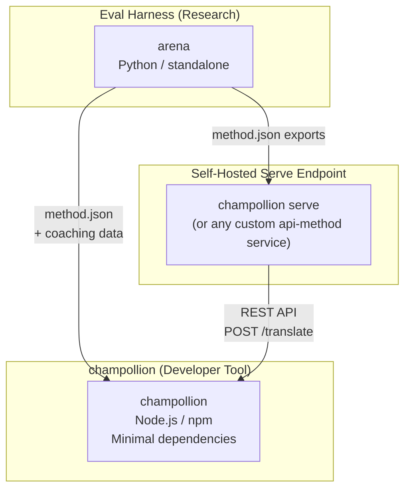
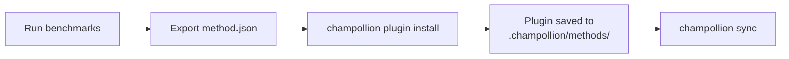
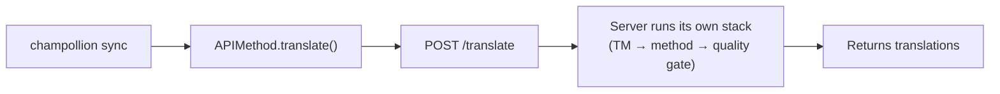
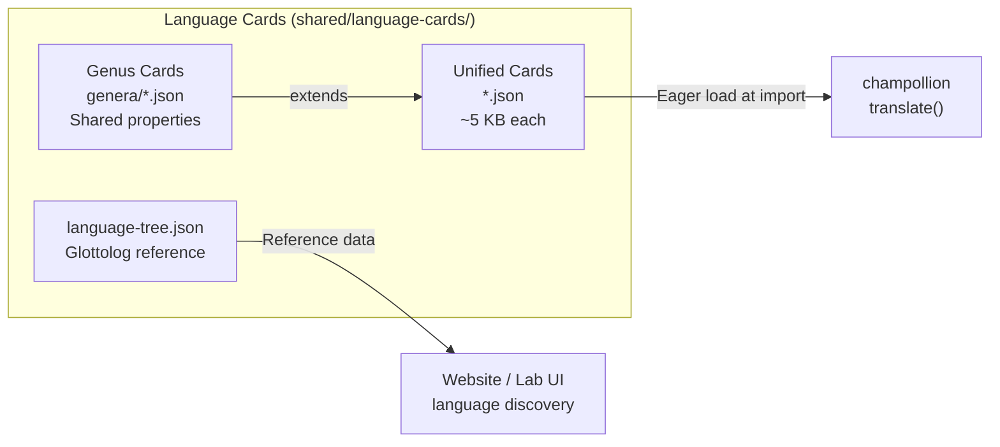

# البنية

تتكون بيئة ترجمة Champollion من ثلاث أدوات مستقلة تعمل معًا من خلال عقود محددة جيدًا. لا تعتمد أي منها على الأخرى في وقت البناء (build time). وتتواصل فيما بينها من خلال **تنسيق مكون إضافي للطريقة (method plugin format)** مشترك و**عقد واجهة برمجة تطبيقات REST (REST API contract)**.

## الأجزاء الثلاثة



### champollion (هذا المشروع)

أداة المطورين متاحة المصدر (مجانية للاستخدام غير التجاري). تترجم ملفات الترجمة (locale files) باستخدام طرق قابلة للتوصيل (pluggable methods). تتميز بتبعيات (dependencies) قليلة، وتكوين اختياري، وتعمل مباشرة دون إعداد مسبق (out of the box).

**الطرق المدمجة:**
- `llm` → OpenRouter / أي نموذج لغوي كبير (LLM) (أكثر من 200 نموذج)
- `llm-coached` → نموذج لغوي كبير (LLM) + توجيه نحوي/معجمي (grammar/dictionary coaching)
- `openai` → واجهة برمجة تطبيقات OpenAI المباشرة (GPT-4o، GPT-4o-mini)
- `anthropic` → واجهة برمجة تطبيقات Anthropic المباشرة (Claude Sonnet، Haiku، Opus)
- `gemini` → واجهة برمجة تطبيقات Google Gemini المباشرة (Flash، Pro — تتوفر فئة مجانية)
- `google-translate` → واجهة برمجة تطبيقات Google Cloud Translation الإصدار الثاني (v2)
- `deepl` → واجهة برمجة تطبيقات DeepL مع دعم المسرد (glossary)
- `microsoft-translator` → مترجم Azure Cognitive Services
- `libretranslate` → LibreTranslate مستضاف ذاتيًا (AGPL، مجاني)
- `api` → قناة اتصال خفيفة (Thin pipe) لأي نقطة نهاية REST بعيدة

### Eval Harness (مشروع مصاحب)

أداة بحثية لتطوير واختبار وقياس أداء طرق الترجمة. عندما تصل طريقة ما إلى جودة مقبولة، تُصدِّر الأداة (harness) **مكونًا إضافيًا للطريقة (method plugin)** — وهو عبارة عن بيان (manifest) `method.json` وملفات بيانات توجيه (coaching data) اختيارية.

لا تعمل أداة harness أبدًا داخل champollion. إنها أداة منفصلة تنتج مخرجات ثابتة (ملفات JSON). ويقتصر دور Champollion على قراءة تلك الملفات.

[→ Eval Harness على GitHub](https://github.com/gamedaysuits/Champollion)

### نقطة نهاية خدمة مستضافة ذاتيًا (`champollion serve`)

يمكن لأي مشروع champollion تقديم حزمة الترجمة (translation stack) المكونة الخاصة به عبر HTTP بأمر واحد — [`champollion serve`](/docs/guides/serving-a-method#the-zero-code-path-champollion-serve) — ويمكن لأي مشروع آخر استهلاكها من خلال طريقة `api`. تظل التلقينات (prompts)، وبيانات التوجيه، وذاكرة الترجمة (Translation Memory)، ومفاتيح المزود على البنية التحتية للمالك؛ ويرسل المستهلكون السلاسل النصية المصدرية فقط ويتلقون الترجمات. يمكن لمسارات العمل (Pipelines) التي توجد خارج champollion بالكامل (سلسلة FST، نظام بحثي) تنفيذ نفس العقد كـ [خدمة مخصصة](/docs/guides/serving-a-method). لا توجد خدمة Champollion مستضافة — فالخدمة دائمًا مستضافة ذاتيًا، حسب التصميم.

## كيفية اتصالها

### Eval Harness → champollion (تصدير في اتجاه واحد)



**العقد**: [مواصفات المكون الإضافي](/docs/reference/plugin-spec)

### نقطة نهاية الخدمة → champollion (واجهة برمجة التطبيقات في وقت التشغيل)



تُعد `APIMethod` في Champollion بمثابة **قناة اتصال بسيطة (dumb pipe)**. فهي ترسل المفاتيح وتتلقى الترجمات في المقابل. ولا تحتوي على أي منطق ترجمة أو أي محتوى مملوك (proprietary content).

## ما يعرفه كل جزء عن الأجزاء الأخرى

| الأداة | هل تعرف عن champollion؟ | هل تعرف عن نقطة نهاية الخدمة؟ | هل تعرف عن harness؟ |
|------|---------------------|-------------------------------|---------------------|
| **champollion** | *(هي champollion)* | نعم — طريقة `api` تستدعيها | لا — تقرأ فقط صادرات المكون الإضافي |
| **نقطة نهاية الخدمة (Serve endpoint)** | نعم — تخدم طلباتها | *(هي نقطة نهاية الخدمة)* | لا — تثبت الطرق المُصدَّرة مثل أي مشروع |
| **Eval Harness** | نعم — تُصدِّر تنسيق المكون الإضافي | لا — تُنشر الطرق بشكل منفصل | *(هي harness)* |

## سيناريوهات المستخدم

### السيناريو 1: مجاني، بدون تكوين (معظم المستخدمين)

```bash
export OPENROUTER_API_KEY=sk-...
npx champollion sync
```

يستخدم طريقة `llm` المدمجة. بدون مكونات إضافية، بدون خادم، بدون harness.

### السيناريو 2: خط الأساس لترجمة Google (Google Translate baseline)

```bash
export GOOGLE_TRANSLATE_API_KEY=AIza...
npx champollion sync
```

يستخدم طريقة `google-translate` المدمجة. لا حاجة لمكونات إضافية.

### السيناريو 3: مكون إضافي مفتوح مع توجيه مدمج (bundled coaching)

```bash
champollion plugin install ./french-formal-v1/
champollion sync
```

يحتوي المكون الإضافي على `type: "llm-coached"` → يستخدم champollion مفتاح OpenRouter الخاص بالمستخدم. بيانات التوجيه محلية (لا يوجد استدعاء للخادم).

### السيناريو 4: توجيه ذاتي (DIY coaching) (بدون مكون إضافي، بدون harness)

```json title="champollion.config.json"
{
  "pairs": {
    "en:fr": { "method": "llm-coached" }
  }
}
```

يحتفظ المستخدم بالقواعد النحوية والقاموس الخاص به في `.champollion/coaching/fr.json`.

### السيناريو 5: استهلاك حزمة مقدمة من مشروع آخر

```bash
champollion plugin install ./their-project-serve/   # manifest from `champollion serve --emit-manifest`
CHAMPOLLION_API_KEY=<their bearer token> champollion sync
```

تقوم طريقة `api` الخاصة بالزوج (pair) بإرسال (POST) السلاسل النصية المصدرية إلى نقطة نهاية [`champollion serve`](/docs/guides/serving-a-method#the-zero-code-path-champollion-serve) المستضافة ذاتيًا الخاصة بهم؛ وتتولى حزمتهم (التوجيه، ذاكرة الترجمة، بوابة الجودة) عملية الترجمة.

## بطاقات اللغة (Language Cards)

تُكوَّن كل لغة في champollion من خلال **بطاقة لغة (Language Card)** — وهي ملف JSON موحد يحتوي على إعدادات مسبقة للسجل (register presets)، وقواعد الرسمية (formality rules)، وعلامات دعم الطريقة (method support flags)، واصطلاحات الطباعة (typography conventions)، والتصنيف الأنسابي (genealogical classification)، والبيانات المرجعية اللغوية.



تُحمَّل البطاقات بشكل مبكر (eagerly) عند الاستيراد. تحتوي كل بطاقة على جميع البيانات الوصفية (metadata) التي يحتاجها محرك الترجمة ووثائق المطورين — ولا توجد طبقة مرجعية منفصلة. تُنشأ البطاقات من مصادر موثوقة (IANA، CLDR، [Glottolog](https://glottolog.org)، [WALS](https://wals.info)) باستخدام `scripts/generate-language-card.mjs` و `scripts/build-language-tree.mjs`، ثم تُنسَّق بشريًا (human-curated) لضمان الدقة اللغوية.

## مبادئ التصميم

1. **لا توجد تبعيات دائرية (circular dependencies).** الجسور تعمل في اتجاه واحد.
2. **Champollion هو النواة الخفيفة.** تبعيات قليلة، وتكوين اختياري. المكونات الإضافية وواجهة برمجة التطبيقات (API) هي إضافات.
3. **حماية الملكية الفكرية (IP) هي جزء من البنية.** تظل التقنيات المملوكة على جانب الخدمة — فمن يدير نقطة النهاية يحتفظ بتلقيناته، وتوجيهاته، ومفاتيحه. لا تشحن حزمة npm أي شيء مملوك.
4. **تنسيق المكون الإضافي هو العقد.** يتدفق كل شيء من خلال `method.json`.
5. **لكل أداة وظيفة واحدة.** Harness → تطوير الطرق. `champollion serve` → استضافة الطرق. Champollion → ترجمة الملفات.

---

## انظر أيضًا

- [طرق الترجمة](/docs/guides/translation-methods) — كيف تعمل كل طريقة مدمجة
- [مواصفات المكون الإضافي](/docs/reference/plugin-spec) — تنسيق بيان method.json
- [Eval Harness](/docs/network/specifications/harness) — الأداة البحثية المصاحبة
- [تقديم طريقة عبر واجهة برمجة التطبيقات (API)](/docs/guides/serving-a-method) — استضافة مسارات ترجمة مخصصة
- [دعم لغة منخفضة الموارد](/docs/network/community/low-resource-languages) — حالة الاستخدام التي قادت إلى هذه البنية
