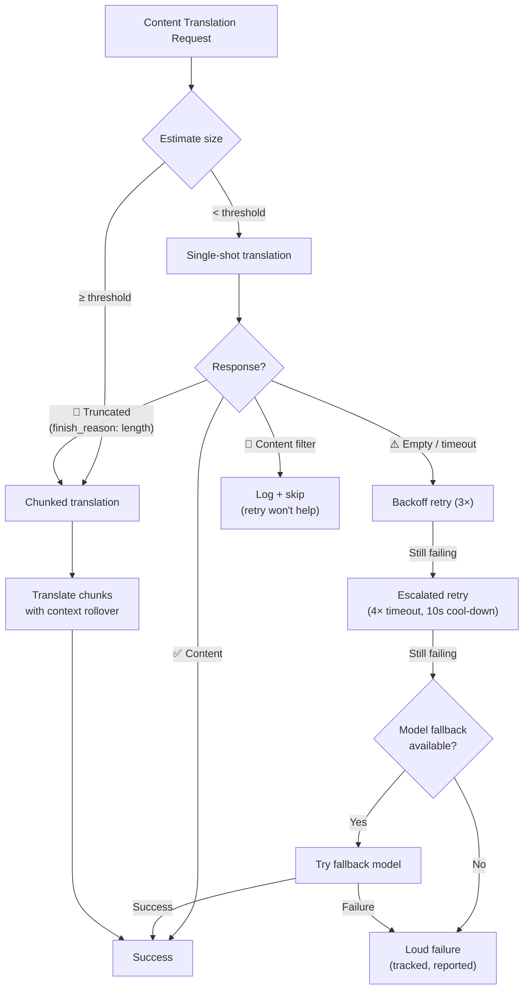

# مرونة ترجمة المحتوى

يستخدم مسار ترجمة المحتوى في Champollion (مستندات Markdown/MDX) نظام مرونة متعدد الطبقات للتعامل مع حالات الفشل بسلاسة. على عكس ترجمة المفتاح والقيمة (key-value) — حيث تكون كل دفعة صغيرة وتكلفة إعادة المحاولة منخفضة — تتضمن ترجمة المحتوى مطالبات (prompts) كبيرة ومخرجات طويلة يمكن أن تفشل لأسباب هيكلية، وليس فقط لأسباب عابرة.

## المشكلة

تختلف أنماط الفشل في ترجمة المحتوى اختلافاً جذرياً عن ترجمة المفتاح والقيمة:

| نمط الفشل | المفتاح والقيمة (Key-Value) | المحتوى |
|---|---|---|
| حد المعدل (429) | شائع، عابر | شائع، عابر |
| انتهاء المهلة (Timeout) | نادر (دفعات صغيرة) | شائع (مخرجات طويلة) |
| استجابة فارغة | نادر | شائع (حدود المخرجات، الفلاتر) |
| اقتطاع المخرجات | غير متوفر (JSON مُتحقق منه) | يحدث بصمت |
| فلتر المحتوى | نادر جداً | محتمل (مستندات CLI، مستندات الأمان) |
| قيود النموذج | إعادة المحاولة تحل المشكلة | إعادة المحاولة لن تحل المشكلة |

الرؤية الأساسية: **إعادة محاولة نفس الطلب الفاشل ليس تكراراً للضمان (redundancy)، بل هو عناد.** يحدد نظام المرونة السليم *سبب* الفشل ويغير نهجه بناءً على ذلك.

## نظرة عامة على البنية



## الطبقة 1: إعادة المحاولة بناءً على التشخيص أولاً

قبل تحديد *كيفية* إعادة المحاولة، يفحص النظام استجابة واجهة برمجة التطبيقات (API) لفهم *ما* الذي فشل.

### تحليل سبب الإنهاء (Finish Reason)

تُرجع كل واجهة برمجة تطبيقات لنموذج لغوي كبير (LLM API) `finish_reason` إلى جانب النص المُنشأ. يستخدم Champollion ذلك لاتخاذ قرارات ذكية بشأن إعادة المحاولة:

| `finish_reason` | المعنى | الإجراء |
|---|---|---|
| `stop` + محتوى | أكمل النموذج عمله بشكل طبيعي | ✅ قبول النتيجة |
| `stop` + فارغ | لم يُنشئ النموذج أي شيء | ⚠️ إعادة محاولة نفس الطلب (عابر) |
| `length` | وصلت المخرجات إلى حد الرموز (token limit) | 🔶 تقسيم المستند تلقائياً (Auto-chunk) |
| `content_filter` | حظر فلتر الأمان المخرجات | 🔴 تسجيل وتخطي (إعادة المحاولة لن تفيد) |
| `null` / مفقود | استجابة مشوهة | ⚠️ إعادة محاولة نفس الطلب (عابر) |

يستبدل هذا النهج الحالي المتمثل في التعامل مع كل فشل بشكل متطابق باستخدام إعادة المحاولة مع التراجع (backoff retries).

### ميزانية إعادة المحاولة

ميزانية إعادة المحاولة القياسية لحالات الفشل العابرة:

| الجولة | المحاولات | انتهاء المهلة | التراجع (Backoff) |
|---|---|---|---|
| قياسي (Standard) | 4 (0→3) | 60 ثانية | 1 ثانية → 2 ثانية → 4 ثوانٍ |
| مُصعَّد (Escalated) | 4 (0→3) | 120 ثانية | 1 ثانية → 2 ثانية → 4 ثوانٍ |
| **الإجمالي** | **8** | — | **~3.5 دقيقة في أسوأ الحالات** |

بين الجولات، تسمح فترة التهدئة (cool-down) البالغة 10 ثوانٍ بحل المشكلات العابرة.

## الطبقة 2: تقسيم المحتوى (Content Chunking)

عندما يتجاوز المستند حد الحجم — أو عندما تشير الطبقة 1 إلى اقتطاع المخرجات — يقوم النظام بتقسيم المستند إلى أجزاء (chunks) بحجم مناسب للترجمة.

راجع [ترحيل السياق (Context Rollover)](/docs/concepts/context-rollover#content-chunking) للحصول على تكوين مفصل للتقسيم. النقاط الرئيسية هي:

### استراتيجية التقسيم

1. **حدود العناوين** — تعتبر `##` و `###` حدوداً طبيعية لوحدات الترجمة. كل قسم مستقل بذاته بما يكفي لترجمته بشكل مستقل.
2. **الرجوع إلى الفقرات** — إذا تجاوز قسم عنوان واحد حجم الجزء (chunk)، يتم التقسيم عند الأسطر الجديدة المزدوجة.
3. **التقسيم الصارم** — الملاذ الأخير للفقرات الطويلة جداً (مثل الجداول). يتم التقسيم عند حدود الجمل.

### السياق بين الأجزاء (Chunks)

يتلقى كل جزء آخر فقرتين إلى ثلاث فقرات من *ترجمة الجزء السابق* كسياق. يمنع هذا:
- **انحراف المصطلحات** — يرى النموذج ما أطلق عليه "tableau de bord" في الجزء السابق
- **تحديد الضمائر** — تنتقل المراجع (antecedents) من القسم السابق إلى القسم التالي
- **اتساق الأسلوب (Register)** — تستمر النبرة المحددة في الجزء 1 حتى الجزء N

### مشغلات التقسيم التلقائي (Auto-Chunking)

| المشغل (Trigger) | السلوك |
|---|---|
| تعيين `contentChunkSize` في التكوين | تقسيم المستندات التي تتجاوز هذا الحجم دائماً |
| إرجاع `finish_reason: "length"` | تقسيم تلقائي كإجراء احتياطي (حتى بدون تكوين) |
| المدخلات > ~12 كيلوبايت (اكتشاف تلقائي) | تسجيل اقتراح، ولكن دون إجبار |

## الطبقة 3: سلسلة النماذج الاحتياطية (Model Fallback Chain)

عندما يفشل النموذج المُكوَّن باستمرار — ليس بشكل عابر، بل هيكلياً — يجرب النظام نماذج بديلة. تمتلك النماذج المختلفة نوافذ سياق، وحدود مخرجات، وفلاتر أمان، ونقاط قوة متعددة اللغات مختلفة.

### السلسلة الاحتياطية الافتراضية

```json title="champollion.config.json"
{
  "contentFallbackChain": [
    "google/gemini-2.5-flash",
    "anthropic/claude-sonnet-4"
  ]
}
```

تتم تجربة النموذج المُكوَّن دائماً في البداية. تُستخدم النماذج الاحتياطية فقط بعد استنفاد جميع جولات إعادة المحاولة (القياسية + المُصعَّدة).

### لماذا بنيات متعددة

| السيناريو | فشل النموذج الأساسي | نجاح النموذج الاحتياطي |
|---|---|---|
| مستندات CLI الفيتنامية | يُرجع Gemini استجابة فارغة | يتعامل Claude معها بشكل جيد |
| محتوى مفلتر أمنياً | يحظره OpenAI | يمتلك Gemini حدود فلاتر مختلفة |
| جداول مهيكلة طويلة | يقتطع النموذج A المخرجات | يمتلك النموذج B نافذة مخرجات أكبر |

تكمن قيمة الإجراء الاحتياطي في التنوع المعماري — فالعائلات المختلفة من النماذج لها أنماط فشل مختلفة. الفشل الذي يُعد هيكلياً لنموذج ما قد يكون بسيطاً لنموذج آخر.

### النطاق

> يقتصر الإجراء الاحتياطي للنموذج على **المحتوى فقط**. دفعات المفتاح والقيمة صغيرة ولا تفشل هيكلياً تقريباً. إضافة تعقيد الإجراء الاحتياطي هناك سيكون بمثابة هندسة مفرطة (over-engineering).

## الطبقة 4: حصر حالات الفشل (Failure Accounting)

عند حدوث حالات فشل، يقوم النظام بتتبعها والإبلاغ عنها بشكل صحيح بدلاً من الاستمرار بصمت.

### أثناء المزامنة (Sync)

- تُظهر العناصر الفاشلة `[FAIL]` في مخرجات التقدم
- يُسجل كل فشل السبب المحدد (انتهاء المهلة، استجابة فارغة، فلتر المحتوى، اقتطاع)
- تُحفظ العناصر المكتملة في البيان (manifest) على الفور (استمرارية تدريجية)

### بعد المزامنة

تُطبع خلاصة حالات الفشل في النهاية:

```
  ┌─ Content Translation Failures ─────────────────────────────────────┐
  │                                                                     │
  │  2 of 24 content translations failed:                              │
  │                                                                     │
  │  ✗ docs/reference/cli.md → vi                                      │
  │    Reason: empty response after 8 attempts + 1 fallback model      │
  │    Models tried: google/gemini-3.1-pro-preview, gemini-2.5-flash   │
  │                                                                     │
  │  ✗ docs/guides/troubleshooting.md → ar                             │
  │    Reason: content_filter (no retry — blocked by safety filter)    │
  │                                                                     │
  │  Re-run: npx champollion@latest sync                              │
  │  (22 completed translations are cached and won't re-run)           │
  └─────────────────────────────────────────────────────────────────────┘
```

### بيان إعادة المحاولة (Retry Manifest)

تُكتب الملفات الفاشلة في `.champollion-retry.json`:

```json
{
  "failedAt": "2026-05-27T21:45:00Z",
  "files": [
    {
      "source": "docs/reference/cli.md",
      "locale": "vi",
      "reason": "empty_response",
      "attempts": 8,
      "modelsTried": ["google/gemini-3.1-pro-preview", "google/gemini-2.5-flash"]
    }
  ]
}
```

في التشغيل التالي لـ `sync`، تتم إعادة معالجة هذه الملفات فقط. تُحفظ الملفات المكتملة عبر بيان تجزئة المحتوى (content hash manifest) (`.champollion-content.lock`).

### رموز الخروج (Exit Codes)

| الرمز | المعنى |
|---|---|
| 0 | نجحت جميع الترجمات |
| 1 | خطأ في التكوين، مفتاح API مفقود، إلخ. |
| 2 | فشل جزئي — فشلت بعض ترجمات المحتوى |

## التكوين

```json title="champollion.config.json"
{
  "contentChunkSize": 4000,
  "contentOverlap": 200,
  "contentFallbackChain": [
    "google/gemini-2.5-flash",
    "anthropic/claude-sonnet-4"
  ]
}
```

| الحقل | النوع | الافتراضي | الوصف |
|---|---|---|---|
| `contentChunkSize` | `number \| null` | `null` | الحد الأقصى للرموز (tokens) لكل جزء محتوى. `null` = بدون تقسيم (تقسيم تلقائي عند الاقتطاع فقط) |
| `contentOverlap` | `number` | `200` | تداخل الرموز بين أجزاء المحتوى لاستمرارية السياق |
| `contentFallbackChain` | `string[]` | `[]` | النماذج الاحتياطية التي يجب تجربتها عندما يفشل النموذج المُكوَّن هيكلياً |

## حالة التنفيذ

| الميزة | الحالة |
|---|---|
| إعادة المحاولة بناءً على التشخيص أولاً (تحليل finish_reason) | 🔲 مُخطط لها |
| تقسيم المحتوى (تقسيم العناوين/الفقرات) | 🔲 مُخطط لها |
| ترحيل السياق بين الأجزاء | 🔲 مُخطط لها |
| سلسلة النماذج الاحتياطية | 🔲 مُخطط لها |
| تقرير خلاصة حالات الفشل | 🔲 مُخطط لها |
| بيان إعادة المحاولة (.champollion-retry.json) | 🔲 مُخطط لها |
| رمز الخروج 2 لحالات الفشل الجزئي | 🔲 مُخطط لها |
| إعادة المحاولة المُصعَّدة (مهلة ممتدة) | ✅ مُنفذة (v3.3.3) |
| رسائل إعادة المحاولة المرقمة بالمحاولات | ✅ مُنفذة (v3.3.3) |
| فشل صريح عند أخطاء المحتوى | ✅ مُنفذة (v3.3.3) |

## انظر أيضًا

- [ترحيل السياق (Context Rollover)](/docs/concepts/context-rollover) — اتساق الدفعات وتكوين تقسيم المحتوى
- [كيف تعمل المزامنة (How Sync Works)](/docs/concepts/how-sync-works) — مسار المزامنة الكامل
- [طرق الترجمة (Translation Methods)](/docs/guides/translation-methods) — الطرق المتاحة وخصائصها
