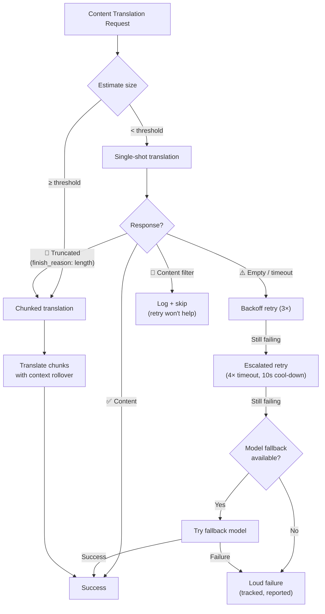

# مرونة ترجمة المحتوى

يستخدم مسار ترجمة المحتوى في Champollion (مستندات Markdown/MDX) نظام مرونة متعدد الطبقات للتعامل مع حالات الفشل بسلاسة. وعلى عكس ترجمة المفتاح-القيمة — حيث تكون كل دفعة صغيرة وإعادة المحاولة غير مكلفة — تتضمن ترجمة المحتوى مطالبات ضخمة ومخرجات طويلة يمكن أن تفشل لأسباب بنيوية، وليس لأسباب عارضة فحسب.

## المشكلة

تتميز ترجمة المحتوى بأنماط فشل تختلف جوهرياً عن ترجمة المفتاح-القيمة:

| نمط الفشل | المفتاح-القيمة | المحتوى |
|---|---|---|
| حد معدل الطلبات (429) | شائع، وعارض | شائع، وعارض |
| انتهاء المهلة (Timeout) | نادر (دفعات صغيرة) | شائع (مخرجات طويلة) |
| استجابة فارغة | نادر | شائع (حدود المخرجات، عوامل التصفية) |
| اقتطاع المخرجات | لا ينطبق (يتم التحقق من صحة JSON) | يحدث بصمت |
| تصفية المحتوى (Content filter) | نادر للغاية | وارد (توثيق CLI، وتوثيق الأمان) |
| قصور في قدرات النموذج | إعادة المحاولة تحله | إعادة المحاولة لن تحله |

الفكرة الأساسية: **إعادة محاولة الطلب الفاشل نفسه ليست تكراراً للمحاولة بدافع التسامح، بل هي عناد.** فنظام المرونة السليم يحدد *سبب* الفشل ويغير نهجه وفقاً لذلك.

## نظرة عامة على البنية المعمارية


```mermaid
flowchart TD
    A["Content Translation Request"] --> B{"Estimate size"}
    B -->|"< threshold"| C["Single-shot translation"]
    B -->|"≥ threshold"| D["Chunked translation"]
    C --> E{"Response?"}
    E -->|"✅ Content"| F["Success"]
    E -->|"⚠️ Empty / timeout"| G["Backoff retry (3×)"]
    E -->|"🔶 Truncated\n(finish_reason: length)"| D
    E -->|"🔴 Content filter"| H["Log + skip\n(retry won't help)"]
    G -->|"Still failing"| I["Escalated retry\n(4× timeout, 10s cool-down)"]
    I -->|"Still failing"| J{"Model fallback\navailable?"}
    J -->|"Yes"| K["Try fallback model"]
    J -->|"No"| L["Loud failure\n(tracked, reported)"]
    K -->|"Success"| F
    K -->|"Failure"| L
    D --> M["Translate chunks\nwith context rollover"]
    M --> F
```

## الطبقة الأولى: إعادة المحاولة القائمة على التشخيص أولاً

قبل اتخاذ القرار بشأن *كيفية* إعادة المحاولة، يفحص النظام استجابة API لفهم *سبب* الفشل.

### تحليل سبب الإنهاء (Finish Reason)

تُرجع كل واجهة برمجة تطبيقات (API) لنموذج لغوي كبير (LLM) قيمة `finish_reason` إلى جانب النص المُولَّد. يستخدم Champollion هذه القيمة لاتخاذ قرارات ذكية بشأن إعادة المحاولة:

| `finish_reason` | المعنى | الإجراء |
|---|---|---|
| `stop` + محتوى | اكتمل النموذج بصورة طبيعية | ✅ قبول النتيجة |
| `stop` + فارغ | لم يُولّد النموذج أي شيء | ⚠️ إعادة محاولة الطلب نفسه (عارض) |
| `length` | وصلت المخرجات إلى الحد الأقصى للرموز (Tokens) | 🔶 تقسيم المستند تلقائياً إلى أجزاء (Auto-chunk) |
| `content_filter` | حظر فلتر الأمان المخرجات | 🔴 تسجيل في السجل والتخطي (إعادة المحاولة لن تجدي نفعاً) |
| `null` / مفقود | استجابة مشوهة أو غير صالحة | ⚠️ إعادة محاولة الطلب نفسه (عارض) |

يحل هذا محل النهج الحالي الذي يعامل جميع حالات الفشل بالطريقة نفسها عبر التراجع المتتالي (Backoff).

### ميزانية إعادة المحاولة

ميزانية إعادة المحاولة القياسية للأخطاء العارضة:

| الجولة | المحاولات | المهلة الزمنية | التراجع (Backoff) |
|---|---|---|---|
| قياسية | 4 (0→3) | 60 ثانية | 1 ثانية → 2 ثانية → 4 ثوانٍ |
| تصعيدية | 4 (0→3) | 120 ثانية | 1 ثانية → 2 ثانية → 4 ثوانٍ |
| **الإجمالي** | **8** | — | **~3.5 دقيقة في أسوأ الحالات** |

بين الجولات، تتيح فترة تهدئة مدتها 10 ثوانٍ حل المشكلات العارضة.

## الطبقة الثانية: تقسيم المحتوى إلى أجزاء (Chunking)

عندما يتجاوز المستند حداً معيناً للحجم — أو عندما تشير الطبقة الأولى إلى اقتطاع المخرجات — يُقسّم النظام المستند إلى أجزاء بحجم ملائم للترجمة.

راجع [ترحيل السياق](/docs/concepts/context-rollover#content-chunking) للحصول على تفاصيل تهيئة التقسيم إلى أجزاء. وأهم النقاط هي:

### استراتيجية التقسيم

1. **حدود العناوين** — يُعد `##` و`###` حدوداً طبيعية لوحدات الترجمة؛ فكل قسم قائم بذاته بدرجة تكفي لترجمته بشكل مستقل.
2. **الرجوع إلى الفقرات كبديل** — إذا تجاوز قسم يتبع عنواناً واحداً حجم الجزء المحدد، يتم التقسيم عند الأسطر الجديدة المزدوجة.
3. **التقسيم الصارم** — الملاذ الأخير للفقرات الطويلة للغاية (مثل الجداول). يتم التقسيم عند حدود الجمل.

### السياق بين الأجزاء

يتلقى كل جزء آخر فقرتين إلى 3 فقرات من *ترجمة الجزء السابق* كسياق. ويمنع ذلك:
- **انحراف المصطلحات** — يرى النموذج المصطلح الذي استخدمه لـ "tableau de bord" في الجزء السابق
- **حل الضمائر** — يتم ترحيل العائدات والضمائر من القسم السابق إلى الأمام
- **اتساق الأسلوب (Register)** — يستمر الأسلوب المُعتمد في الجزء 1 حتى الجزء N

### محفزات التقسيم التلقائي إلى أجزاء

| المحفز | السلوك |
|---|---|
| تعيين `contentChunkSize` في ملف التكوين | تقسيم المستندات التي تتجاوز هذا الحجم دائماً |
| إرجاع `finish_reason: "length"` | التقسيم التلقائي كخيار بديل (حتى بدون ضبطه في ملف التكوين) |
| إدخال أكبر من ~12 كيلوبايت (اكتشاف تلقائي) | تسجيل اقتراح في السجل، دون فرضه إجبارياً |

## الطبقة الثالثة: سلسلة النماذج البديلة (Model Fallback Chain)

عندما يفشل النموذج المُهيأ باستمرار — ليس بشكل عارض، بل بنيوياً — يجرّب النظام نماذج بديلة؛ إذ تمتلك النماذج المختلفة نوافذ سياق وحدود مخرجات وفلاتر أمان وقدرات لغوية متعددة ومتباينة.

### سلسلة البدائل الافتراضية

```json title="champollion.config.json"
{
  "contentFallbackChain": [
    "google/gemini-3.8-flash",
    "anthropic/claude-sonnet-4"
  ]
}
```

تتم محاولة استخدام النموذج المُهيأ أولاً دائماً. ولا تُستخدم النماذج البديلة إلا بعد استنفاد جميع جولات إعادة المحاولة (القياسية + التصعيدية).

### لماذا نستخدم بنيات معمارية متعددة

| السيناريو | فشل النموذج الأساسي | نجاح النموذج البديل |
|---|---|---|
| توثيق CLI باللغة الفيتنامية | Gemini يُرجع استجابة فارغة | Claude يتعامل معه بكفاءة |
| محتوى محظور بفلاتر الأمان | OpenAI يمنعه | Gemini لديه عتبات تصفية مختلفة |
| جداول طويلة ومنسقة | النموذج A يقتطع المخرجات | النموذج B لديه نافذة مخرجات أكبر |

تكمن قيمة النماذج البديلة في التنوع المعماري — فلكل عائلة نماذج أنماط فشل مختلفة. وقد يكون الفشل البنيوي بالنسبة لنموذج ما أمراً بسيطاً وعادياً بالنسبة لنموذج آخر.

### النطاق

> يقتصر استخدام النماذج البديلة على **المحتوى فقط**. فدفعات المفتاح-القيمة صغيرة ونادراً جداً ما تفشل بنيوياً، وإضافة تعقيد النماذج البديلة هناك سيكون إفراطاً في التصميم (Over-engineering).

## الطبقة الرابعة: حصر ومحاسبة حالات الفشل

عند حدوث حالات فشل، يتتبعها النظام ويُبلّغ عنها بالشكل المناسب بدلاً من الاستمرار في التنفيذ بصمت.

### أثناء المزامنة

- تعرض العناصر الفاشلة `[FAIL]` في مخرجات شريط التقدم
- يسجل كل إخفاق السبب المحدد (انتهاء المهلة، استجابة فارغة، فلتر المحتوى، الاقتطاع)
- تُحفظ العناصر المكتملة في البيان (manifest) على الفور (حفظ تراكمي تصاعدي)

### بعد المزامنة

تتم طباعة ملخص حالات الفشل في النهاية:

```
  ┌─ Content Translation Failures ─────────────────────────────────────┐
  │                                                                     │
  │  2 of 24 content translations failed:                              │
  │                                                                     │
  │  ✗ docs/reference/cli.md → vi                                      │
  │    Reason: empty response after 8 attempts + 1 fallback model      │
  │    Models tried: google/gemini-3.1-pro-preview, gemini-3.8-flash   │
  │                                                                     │
  │  ✗ docs/guides/troubleshooting.md → ar                             │
  │    Reason: content_filter (no retry — blocked by safety filter)    │
  │                                                                     │
  │  Re-run: npx champollion@latest sync                              │
  │  (22 completed translations are cached and won't re-run)           │
  └─────────────────────────────────────────────────────────────────────┘
```

### بيان إعادة المحاولة (Retry Manifest)

تُكتب الملفات الفاشلة إلى `.champollion-retry.json`:

```json
{
  "failedAt": "2026-05-27T21:45:00Z",
  "files": [
    {
      "source": "docs/reference/cli.md",
      "locale": "vi",
      "reason": "empty_response",
      "attempts": 8,
      "modelsTried": ["google/gemini-3.1-pro-preview", "google/gemini-3.8-flash"]
    }
  ]
}
```

في تشغيل `sync` التالي، تتم إعادة معالجة هذه الملفات فقط. وتُحفظ الملفات المكتملة عبر بيان تجزئة المحتوى (`.champollion-content.lock`).

### رموز الخروج (Exit Codes)

| الرمز | المعنى |
|---|---|
| 0 | نجحت جميع الترجمات |
| 1 | خطأ في التهيئة، أو مفتاح API مفقود، إلخ. |
| 2 | فشل جزئي — فشلت بعض ترجمات المحتوى |

## التهيئة

```json title="champollion.config.json"
{
  "contentChunkSize": 4000,
  "contentOverlap": 200,
  "contentFallbackChain": [
    "google/gemini-3.8-flash",
    "anthropic/claude-sonnet-4"
  ]
}
```

| الحقل | النوع | الافتراضي | الوصف |
|---|---|---|---|
| `contentChunkSize` | `number \| null` | `null` | الحد الأقصى للرموز لكل جزء من المحتوى. `null` = تعطيل التقسيم (تقسيم تلقائي فقط عند الاقتطاع) |
| `contentOverlap` | `number` | `200` | رموز التداخل بين أجزاء المحتوى لضمان استمرارية السياق |
| `contentFallbackChain` | `string[]` | `[]` | النماذج البديلة لتجربتها عندما يفشل النموذج المُهيأ بنيوياً |

## حالة التنفيذ

| الميزة | الحالة |
|---|---|
| إعادة المحاولة القائمة على التشخيص أولاً (تحليل finish_reason) | 🔲 مخطط لها |
| تقسيم المحتوى إلى أجزاء (التقسيم بالعناوين/الفقرات) | 🔲 مخطط لها |
| ترحيل السياق بين الأجزاء | 🔲 مخطط لها |
| سلسلة النماذج البديلة | 🔲 مخطط لها |
| تقرير ملخص حالات الفشل | 🔲 مخطط لها |
| بيان إعادة المحاولة (.champollion-retry.json) | 🔲 مخطط لها |
| رمز الخروج 2 للفشل الجزئي | 🔲 مخطط لها |
| إعادة المحاولة التصعيدية (مهلة زمنية ممتدة) | ✅ تم التنفيذ (v3.3.3) |
| رسائل إعادة محاولة مرقمة بحسب رقم المحاولة | ✅ تم التنفيذ (v3.3.3) |
| تنبيه صريح وعالٍ عند حدوث أخطاء في المحتوى | ✅ تم التنفيذ (v3.3.3) |

## انظر أيضًا

- [ترحيل السياق](/docs/concepts/context-rollover) — اتساق الدفعات وتهيئة تقسيم المحتوى
- [كيف تعمل المزامنة](/docs/concepts/how-sync-works) — مسار المزامنة الكامل
- [طرق الترجمة](/docs/guides/translation-methods) — الطرق المتاحة وخصائصها
