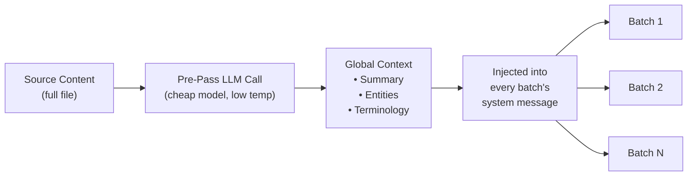

# تجميع ترحيل السياق

ترحيل السياق هو ميزة لضمان اتساق الترجمة على مستوى المستند، حيث تقوم بنقل نافذة من الترجمات السابقة إلى الدفعات اللاحقة، مما يمنح النموذج اللغوي الكبير (LLM) "ذاكرة قصيرة المدى" عبر حدود الدفعات.

## سبب وجودها

عند ترجمة ملفات كبيرة (أكثر من 100 مفتاح أو مستندات Markdown طويلة)، يقوم Champollion بتقسيم العمل إلى دفعات. وبدون الترحيل، تُترجم كل دفعة بشكل مستقل — حيث لا يمتلك النموذج اللغوي الكبير (LLM) أي ذاكرة لما قام بترجمته في الدفعة السابقة. وهذا يتسبب في:

- **انحراف المصطلحات**: يُترجم نفس المصطلح الإنجليزي بشكل مختلف عبر الدفعات (على سبيل المثال، "dashboard" ← "لوحة القيادة" في الدفعة 1، "لوحة" في الدفعة 3)
- **فشل الإحالة المشتركة**: تفقد الضمائر والإشارات التي تمتد عبر حدود الدفعات مرجعها السابق
- **عدم اتساق مستوى اللغة**: يمكن أن تتغير نبرة النص بين الدفعات (رسمية ← غير رسمية ← رسمية)

هذه مشكلة موثقة جيدًا في أدبيات الترجمة الآلية (MT). وقد تم التحقق من صحة نهج النافذة المنزلقة من خلال الأبحاث في الترجمة الآلية على مستوى المستند (ورش عمل ACL و WMT).

## كيف تعمل

### النافذة المنزلقة

عند تمكين `contextRollover`، يحافظ مسار الترجمة على نافذة من أزواج المفتاح-القيمة المترجمة حديثًا. بعد اكتمال كل دفعة، يتم ترحيل جزء من مخرجاتها (الافتراضي: 20% من `batchSize`) إلى موجه الدفعة التالية كـ "ترجمات مرجعية".

```
Batch 1: Translate keys 1-80         → LLM sees: system prompt + keys 1-80
Batch 2: Translate keys 81-160       → LLM sees: system prompt + [16 reference translations from batch 1] + keys 81-160
Batch 3: Translate keys 161-240      → LLM sees: system prompt + [16 reference translations from batch 2] + keys 161-240
```

يتم إدراج الترجمات المرجعية في رسالة المستخدم مع تسمية واضحة:

```
--- Previous translations for context (do NOT re-translate these) ---
"nav.dashboard": "Tableau de bord"
"nav.settings": "Paramètres"
"header.welcome": "Bienvenue sur la plateforme"
---

{
  "content.main_heading": "Getting Started with Your Dashboard",
  ...
}
```

### استراتيجية التحديد

وضعان لاختيار الترجمات التي سيتم ترحيلها:

| الاستراتيجية | السلوك | الأفضل لـ |
|----------|----------|----------|
| `tail` (الافتراضي) | آخر N ترجمات من الدفعة السابقة | المستندات المتسلسلة، محتوى Markdown |
| `diverse` | يختار الإدخالات التي تغطي أنواع مفاتيح مختلفة (أزرار، عناوين، أوصاف) | ملفات JSON الكبيرة التي تحتوي على أنواع مختلطة من عناصر واجهة المستخدم |

### ميزانية الرموز

تستهلك نافذة الترحيل رموز الإدخال. يحسب Champollion التكلفة التقريبية للرموز ويُصدر تحذيرًا إذا تجاوزت النافذة 15% من نافذة السياق المقدرة للنموذج. يتضمن التحذير اقتراحًا بالتخفيض:

```
[WARN] Rollover window is ~2400 tokens (18% of model context).
       Consider reducing rolloverSize to 0.15 or lowering batchSize.
```

## التمرير المسبق للسياق العام

استدعاء اختياري للنموذج اللغوي الكبير (LLM) في التمرير الأول يتم تشغيله **قبل** بدء الترجمة. يقوم النموذج اللغوي الكبير بتحليل محتوى المصدر بالكامل وينتج:

1. **ملخص المستند** — وصف من جملتين إلى ثلاث جمل لما يتم ترجمته
2. **الكيانات المسماة** — أسماء المنتجات، والمصطلحات الفنية، وأسماء الأعلام مع اقتراحات للتعامل معها
3. **قائمة اتساق المصطلحات** — المصطلحات الأساسية التي حددها النموذج اللغوي الكبير (LLM) على أنها تتطلب ترجمة متسقة

يتم إدراج هذا السياق العام في **رسالة النظام** لكل دفعة، مما يمنح كل دفعة وعيًا بالمستند الكامل على الرغم من أنها لا ترى سوى جزء منه.



### نموذج التمرير المسبق

يستخدم استخراج السياق العام استدعاءً منفصلاً ومنخفض التكلفة للنموذج اللغوي الكبير (الافتراضي: `google/gemini-3.5-flash` بدرجة حرارة 0.1) بغض النظر عن نموذج الترجمة الذي كونه المستخدم. هذه مهمة استخراج بيانات وصفية، وليست مهمة ترجمة — حيث تهم السرعة والتكلفة أكثر من المخرجات الإبداعية.

## تقسيم المحتوى {#content-chunking}

بالنسبة لمستندات Markdown الطويلة (ترجمة المحتوى)، قد يتجاوز النص نافذة السياق الفعالة للنموذج اللغوي الكبير (LLM)، أو قد يقتطع النموذج مخرجاته. يقوم تقسيم المحتوى بتجزئة المستند إلى أجزاء متداخلة تُترجم كل منها بشكل مستقل، ثم يُعاد تجميعها.

### استراتيجية التقسيم

يتبع التقسيم تسلسلاً هرميًا للأولويات — حيث يحاول أولاً نقطة التقسيم الأكثر أهمية من الناحية الدلالية:

1. **حدود العناوين** — تُنشئ علامات `##` و `###` وحدات ترجمة طبيعية. كل قسم مكتفٍ ذاتيًا بما يكفي للترجمة المستقلة، وتمنح العناوين النموذج اللغوي الكبير (LLM) سياقًا هيكليًا حول ما يترجمه.
2. **حدود الفقرات** — إذا تجاوز قسم عنوان واحد حجم الجزء، يتم التقسيم عند الأسطر الجديدة المزدوجة (`\n\n`). تُعد الفقرات ثاني أفضل حد لأنها تمثل أفكارًا مكتملة.
3. **حدود الجمل** — الملاذ الأخير للفقرات الطويلة جدًا (مثل الجداول الكبيرة، والنصوص الكثيفة). يتم التقسيم عند حدود النقطة والمسافة مع احترام الاختصارات.

الكتل المحمية (أسوار التعليمات البرمجية، الرموز القصيرة — راجع [كيفية عمل المزامنة](/docs/concepts/how-sync-works)) لا يتم تقسيمها أبدًا عبر الأجزاء. إذا كان سيتم قطع كتلة محمية، فإن نقطة التقسيم تنتقل قبلها أو بعدها.

### مشغلات التقسيم التلقائي

يتم تنشيط التقسيم بطريقتين:

| المشغل | السلوك |
|---------|----------|
| تعيين `contentChunkSize` في التكوين | يقوم بتقسيم جميع المستندات التي تتجاوز عدد الرموز هذا بشكل استباقي |
| يُرجع النموذج `finish_reason: "length"` | يقوم بالتقسيم التلقائي كإجراء احتياطي، حتى بدون تكوين |

يعني المشغل الاحتياطي أن التقسيم يعمل كشبكة أمان حتى إذا لم تقم بتكوينه — فإذا قام النموذج بالاقتطاع، يقوم Champollion تلقائيًا بإعادة المحاولة باستخدام الأجزاء.

### التكوين

- **`contentChunkSize`**: الحد الأقصى للرموز لكل جزء (الافتراضي: null = إرسال النص بالكامل؛ قم بتعيينه إلى 4000 مثلاً للمستندات الطويلة)
- **`contentOverlap`**: التداخل في الرموز بين الأجزاء (الافتراضي: 200). يضمن التداخل انتقالات سلسة عند حدود الأجزاء.

عندما يكون التقسيم نشطًا، يتم تطبيق ترحيل السياق تلقائيًا بين الأجزاء — حيث يتم إلحاق المخرجات المترجمة للفقرة الأخيرة من الجزء السابق في بداية موجه الجزء التالي.

```json title="champollion.config.json"
{
  "contentChunkSize": 4000,
  "contentOverlap": 200
}
```

> للحصول على نظام مرونة ترجمة المحتوى بالكامل (إعادة المحاولة التشخيصية، النموذج الاحتياطي، حساب الفشل)، راجع [مرونة المحتوى](/docs/concepts/content-resilience).

## التكوين

### البدء السريع

```json title="champollion.config.json"
{
  "contextRollover": true,
  "globalContext": true,
  "contentChunkSize": 4000,
  "contentOverlap": 200
}
```

### الخيارات الكاملة

```json title="champollion.config.json (advanced)"
{
  "contextRollover": {
    "size": 0.2,
    "strategy": "tail",
    "maxTokens": null
  },
  "globalContext": {
    "model": "google/gemini-3.5-flash",
    "maxEntities": 20,
    "temperature": 0.1
  },
  "contentChunkSize": 4000,
  "contentOverlap": 200,
  "contentFallbackChain": [
    "google/gemini-2.5-flash",
    "anthropic/claude-sonnet-4"
  ]
}
```

| الحقل | النوع | الافتراضي | الوصف |
|-------|------|---------|-------------|
| `contextRollover` | `boolean \| object` | `false` | تمكين ترحيل النافذة المنزلقة |
| `contextRollover.size` | `number` | `0.2` | جزء من `batchSize` ليتم ترحيله (0.0–1.0) |
| `contextRollover.strategy` | `string` | `"tail"` | استراتيجية التحديد: `"tail"` أو `"diverse"` |
| `contextRollover.maxTokens` | `number \| null` | `null` | حد أقصى صارم لميزانية رموز الترحيل |
| `globalContext` | `boolean \| object` | `false` | تمكين التمرير المسبق للسياق العام |
| `globalContext.model` | `string` | `"google/gemini-3.5-flash"` | نموذج استدعاء التمرير المسبق |
| `globalContext.maxEntities` | `number` | `20` | الحد الأقصى للكيانات المسماة المراد استخراجها |
| `globalContext.temperature` | `number` | `0.1` | درجة الحرارة لاستدعاء التمرير المسبق |
| `contentChunkSize` | `number \| null` | `null` | الحد الأقصى للرموز لكل جزء محتوى (null = بدون تقسيم) |
| `contentOverlap` | `number` | `200` | تداخل الرموز بين أجزاء المحتوى |
| `contentFallbackChain` | `string[]` | `[]` | النماذج الاحتياطية لترجمة المحتوى عندما يفشل النموذج المكون هيكليًا |

## متى تستخدمها

| السيناريو | التوصية |
|----------|---------------|
| ملفات JSON صغيرة (أقل من 50 مفتاحًا) | غير مطلوبة — دفعة واحدة، لا توجد مشكلات في الحدود |
| ملفات JSON كبيرة (أكثر من 100 مفتاح) | قم بتمكين `contextRollover` لاتساق المصطلحات |
| مستندات Markdown طويلة | قم بتمكين `contextRollover` + `contentChunkSize` + `globalContext` |
| الوثائق الفنية | قم بتمكين `globalContext` لاستخراج الكيانات |
| سلاسل واجهة المستخدم ذات مستوى لغة مختلط | استخدم `contextRollover` مع `strategy: "diverse"` |

## حالة التنفيذ

| الميزة | الحالة |
|---------|--------|
| ترحيل النافذة المنزلقة (مفتاح-قيمة) | 🔲 مخطط لها |
| ترحيل النافذة المنزلقة (المحتوى) | 🔲 مخطط لها |
| التمرير المسبق للسياق العام | 🔲 مخطط لها |
| تقسيم المحتوى | 🔲 مخطط لها |
| التقسيم التلقائي عند الاقتطاع | 🔲 مخطط لها |
| استراتيجية تحديد `diverse` | 🔲 مخطط لها |

## الأدبيات

تستند هذه الميزة إلى الأبحاث المنشورة حول الترجمة الآلية على مستوى المستند:

- **نهج النافذة المنزلقة**: تم التحقق من صحته لتحسين درجات BLEU و chrF و COMET عند استخدام النماذج اللغوية الكبيرة (LLMs) للترجمة (ورش عمل ACL 2023–2025 حول الترجمة الآلية على مستوى المستند)
- **دمج المعرفة المتعددة**: يؤدي إدراج ملخصات المستندات وقوائم الكيانات كسياق عام إلى تحسين اتساق المصطلحات عبر المستندات الطويلة
- **التوجيه المدرك للسياق (CAP)**: تحديد السياق ذي الصلة عبر درجات الانتباه أو التشابه الدلالي للتعلم داخل السياق

## انظر أيضًا

- [مرونة المحتوى](/docs/concepts/content-resilience) — إعادة المحاولة التشخيصية، والنموذج الاحتياطي، وحساب الفشل
- [كيفية عمل المزامنة](/docs/concepts/how-sync-works) — مسار الدفعات الذي يعززه الترحيل
- [بيانات التدريب](/docs/concepts/coaching-data) — ميزة تكميلية لإدراج القواعد النحوية/القاموس
- [ذاكرة الترجمة](/docs/concepts/translation-memory) — ذاكرة التخزين المؤقت لذاكرة الترجمة (TM) التي تعمل جنبًا إلى جنب مع الترحيل
