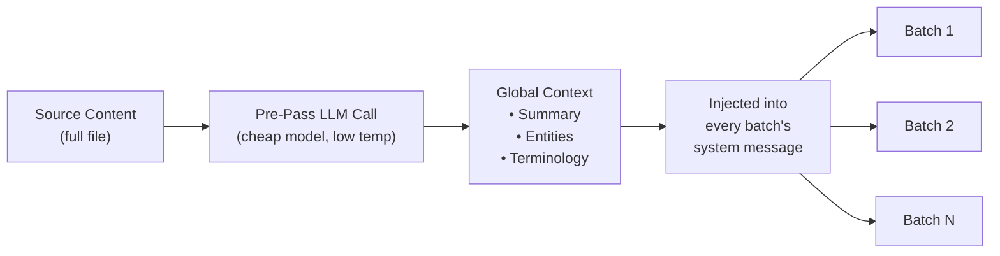

# معالجة الدفعات بترحيل السياق

يُعد ترحيل السياق (Context rollover) ميزة لضمان اتساق الترجمة على مستوى المستند، حيث تقوم بنقل نافذة من الترجمات السابقة إلى الدفعات اللاحقة، مما يمنح نموذج اللغة الكبير (LLM) "ذاكرة قصيرة المدى" عبر حدود الدفعات.

## سبب وجود هذه الميزة

عند ترجمة ملفات كبيرة (أكثر من 100 مفتاح أو مستندات Markdown طويلة)، يُقسّم Champollion العمل إلى دفعات. وبدون الترحيل، تُترجم كل دفعة بشكل مستقل — حيث لا يمتلك نموذج اللغة الكبير (LLM) أي ذاكرة لما ترجمه في الدفعة السابقة. ويتسبب هذا في:

- **انحراف المصطلحات (Terminology drift)**: يُترجم المصطلح الإنجليزي نفسه بشكل مختلف عبر الدفعات (على سبيل المثال، "dashboard" ← "tableau de bord" في الدفعة 1، و"panneau" في الدفعة 3)
- **فشل الإحالة المشتركة (Coreference failure)**: تفقد الضمائر والإشارات التي تمتد عبر حدود الدفعات مرجعها السابق
- **عدم اتساق الأسلوب (Register inconsistency)**: قد تختلف النبرة بين الدفعات (رسمي ← غير رسمي ← رسمي)

تُعد هذه المشكلة موثقة جيداً في الأدبيات البحثية الخاصة بالترجمة الآلية (MT). ويدعم نهج النافذة المنزلقة أبحاث منشورة في الترجمة الآلية على مستوى المستند (ورش عمل ACL وWMT).

## كيف تعمل

### النافذة المنزلقة

عند تفعيل `contextRollover`، يحتفظ مسار الترجمة بنافذة من أزواج المفاتيح والقيم المترجمة مؤخراً. وبعد اكتمال كل دفعة، يُرحَّل جزء من مخرجاتها (افتراضياً: 20% من `batchSize`) إلى موجه الأوامر للدفعة التالية كـ "ترجمات مرجعية".

```
Batch 1: Translate keys 1-80         → LLM sees: system prompt + keys 1-80
Batch 2: Translate keys 81-160       → LLM sees: system prompt + [16 reference translations from batch 1] + keys 81-160
Batch 3: Translate keys 161-240      → LLM sees: system prompt + [16 reference translations from batch 2] + keys 161-240
```

تُحقن الترجمات المرجعية في رسالة المستخدم بتسمية واضحة:

```
--- Previous translations for context (do NOT re-translate these) ---
"nav.dashboard": "Tableau de bord"
"nav.settings": "Paramètres"
"header.welcome": "Bienvenue sur la plateforme"
---

{
  "content.main_heading": "Getting Started with Your Dashboard",
  ...
}
```

### استراتيجية الاختيار

يوجد وضعان لاختيار الترجمات التي سيتم ترحيلها:

| الاستراتيجية | السلوك | الأنسب لـ |
|----------|----------|----------|
| `tail` (افتراضي) | آخر N من الترجمات من الدفعة السابقة | المستندات المتسلسلة، ومحتوى Markdown |
| `diverse` | يختار مدخلات تغطي أنواعاً مختلفة من المفاتيح (أزرار، عناوين، أوصاف) | ملفات JSON الكبيرة ذات الأنواع المتنوعة من عناصر واجهة المستخدم |

### ميزانية الرموز

تستهلك نافذة الترحيل رموز إدخال. يحسب Champollion التكلفة التقريبية للرموز ويُطلق تحذيراً إذا تجاوزت النافذة 15% من نافذة السياق التقديرية للنموذج. يتضمن التحذير اقتراحاً بتخفيض القيمة:

```
[WARN] Rollover window is ~2400 tokens (18% of model context).
       Consider reducing rolloverSize to 0.15 or lowering batchSize.
```

## مرحلة التمرير المسبق للسياق العام

استدعاء اختياري أولي لنموذج LLM يُنفَّذ **قبل** بدء الترجمة. يحلل نموذج LLM محتوى المصدر بالكامل ويُنتج:

1. **ملخص المستند** — وصف من جملتين إلى 3 جمل لما يتم ترجمته
2. **الكيانات المسماة** — أسماء المنتجات، والمصطلحات التقنية، وأسماء الأعلام مع اقتراحات لكيفية التعامل معها
3. **قائمة اتساق المصطلحات** — المصطلحات الرئيسية التي حدد نموذج LLM أنها تتطلب ترجمة متسقة

يُحقن هذا السياق العام في **رسالة النظام** لكل دفعة، مما يمنح كل دفعة إدراكاً بالمستند بأكمله على الرغم من أنها لا ترى سوى جزء منه.


```mermaid
flowchart LR
    A["Source Content\n(full file)"] --> B["Pre-Pass LLM Call\n(cheap model, low temp)"]
    B --> C["Global Context\n• Summary\n• Entities\n• Terminology"]
    C --> D["Injected into\nevery batch's\nsystem message"]
    D --> E["Batch 1"]
    D --> F["Batch 2"]
    D --> G["Batch N"]
```

### نموذج التمرير المسبق

يستخدم استخراج السياق العام استدعاءً منفصلاً ومنخفض التكلفة لنموذج LLM (افتراضياً: `google/gemini-3.8-flash` بدرجة حرارة 0.1) بغض النظر عن نموذج الترجمة الذي قام المستخدم بتكوينه. هذه مهمة استخراج بيانات وصفية وليست مهمة ترجمة — فالسرعة والتكلفة أهم من جودة المخرجات الإبداعية.

## تقسيم المحتوى إلى أجزاء {#content-chunking}

بالنسبة لمستندات Markdown الطويلة (ترجمة المحتوى)، قد يتجاوز متن المستند نافذة السياق الفعالة لنموذج LLM، أو قد يقتطع النموذج مخرجاته. يعمل تقسيم المحتوى على تقسيم المستند إلى أجزاء متداخلة تُترجم كل منها بشكل مستقل، ثم يُعاد تجميعها.

### استراتيجية التقسيم

يتبع التقسيم تسلسلاً هرمياً للأولويات — حيث يحاول التقسيم عند النقطة الأكثر دلالة من حيث المعنى أولاً:

1. **حدود العناوين** — تُنشئ علامات `##` و`###` وحدات ترجمة طبيعية؛ فكل قسم يكون قائماً بذاته بما يكفي لترجمته بشكل مستقل، وتمنح العناوين نموذج LLM سياقاً هيكلياً حول ما يقوم بترجمته.
2. **حدود الفقرات** — إذا تجاوز قسم عنوان واحد حجم الجزء المحدد، يتم التقسيم عند الأسطر الجديدة المزدوجة (`\n\n`). تُعد الفقرات الحد الأفضل التالي لأنها تمثل أفكاراً مكتملة.
3. **حدود الجمل** — الملاذ الأخير للفقرات الطويلة للغاية (مثل الجداول الكبيرة، والنصوص النثرية الكثيفة). يتم التقسيم عند حدود النقطة المتبوعة بمسافة مع مراعاة الاختصارات.

لا يتم تقسيم الكتل المحمية مطلقاً عبر الأجزاء (كتل الشيفرات البرمجية، والرموز القصيرة — راجع [كيفية عمل المزامنة](/docs/concepts/how-sync-works)). وإذا كان هناك احتمال لقطع كتلة محمية، تُنقل نقطة التقسيم إلى ما قبلها أو بعدها.

### محفزات التقسيم التلقائي

يتم تفعيل التقسيم بطريقتين:

| المُحفز | السلوك |
|---------|----------|
| تعيين `contentChunkSize` في ملف الإعدادات | تقسيم استباقي لجميع المستندات التي تتجاوز هذا العدد من الرموز |
| إرجاع النموذج لـ `finish_reason: "length"` | تقسيم تلقائي كإجراء بديل احتياطي، حتى بدون إعداد مسبق |

يعني محفز الإجراء الاحتياطي أن التقسيم يعمل كشبكة أمان حتى لو لم تقم بتكوينه — فإذا قام النموذج باقتطاع النص، يُعيد Champollion المحاولة تلقائياً باستخدام أجزاء مقسمة.

### الإعدادات

- **`contentChunkSize`**: الحد الأقصى للرموز لكل جزء (افتراضياً: null = إرسال المتن بالكامل؛ عيّنه على سبيل المثال إلى 4000 للمستندات الطويلة)
- **`contentOverlap`**: التداخل في الرموز بين الأجزاء (افتراضياً: 200). يضمن التداخل انتقالاً سلساً عند حدود الأجزاء.

عند تفعيل التقسيم، يُطبَّق ترحيل السياق تلقائياً بين الأجزاء — حيث تتم إضافة مخرجات الترجمة للفقرة الأخيرة من الجزء السابق في بداية موجه الأوامر للجزء التالي.

```json title="champollion.config.json"
{
  "contentChunkSize": 4000,
  "contentOverlap": 200
}
```

> للاطلاع على نظام المرونة الكامل لترجمة المحتوى (إعادة المحاولة التشخيصية، والتبديل الاحتياطي للنموذج، وحصر حالات الفشل)، راجع [مرونة المحتوى](/docs/concepts/content-resilience).

## الإعدادات

### البدء السريع

```json title="champollion.config.json"
{
  "contextRollover": true,
  "globalContext": true,
  "contentChunkSize": 4000,
  "contentOverlap": 200
}
```

### الخيارات الكاملة

```json title="champollion.config.json (advanced)"
{
  "contextRollover": {
    "size": 0.2,
    "strategy": "tail",
    "maxTokens": null
  },
  "globalContext": {
    "model": "google/gemini-3.8-flash",
    "maxEntities": 20,
    "temperature": 0.1
  },
  "contentChunkSize": 4000,
  "contentOverlap": 200,
  "contentFallbackChain": [
    "google/gemini-3.8-flash",
    "anthropic/claude-sonnet-4"
  ]
}
```

| الحقل | النوع | الافتراضي | الوصف |
|-------|------|---------|-------------|
| `contextRollover` | `boolean \| object` | `false` | تفعيل ترحيل النافذة المنزلقة |
| `contextRollover.size` | `number` | `0.2` | نسبة `batchSize` المراد ترحيلها (0.0–1.0) |
| `contextRollover.strategy` | `string` | `"tail"` | استراتيجية الاختيار: `"tail"` أو `"diverse"` |
| `contextRollover.maxTokens` | `number \| null` | `null` | حد أقصى صارم لميزانية رموز الترحيل |
| `globalContext` | `boolean \| object` | `false` | تفعيل مرحلة التمرير المسبق للسياق العام |
| `globalContext.model` | `string` | `"google/gemini-3.8-flash"` | النموذج المستخدم لاستدعاء التمرير المسبق |
| `globalContext.maxEntities` | `number` | `20` | الحد الأقصى للكيانات المسماة المراد استخراجها |
| `globalContext.temperature` | `number` | `0.1` | درجة الحرارة لاستدعاء التمرير المسبق |
| `contentChunkSize` | `number \| null` | `null` | الحد الأقصى للرموز لكل جزء من المحتوى (null = بدون تقسيم) |
| `contentOverlap` | `number` | `200` | رموز التداخل بين أجزاء المحتوى |
| `contentFallbackChain` | `string[]` | `[]` | نماذج بديلة احتياطية لترجمة المحتوى عند فشل النموذج المكوّن هيكلياً |

## متى تستخدم هذه الميزة

| السيناريو | التوصية |
|----------|---------------|
| ملفات JSON صغيرة (أقل من 50 مفتاحاً) | غير ضرورية — دفعة واحدة، ولا توجد مشاكل في الحدود |
| ملفات JSON كبيرة (أكثر من 100 مفتاح) | فعّل `contextRollover` للحفاظ على اتساق المصطلحات |
| مستندات Markdown طويلة | فعّل `contextRollover` + `contentChunkSize` + `globalContext` |
| التوثيق التقني | فعّل `globalContext` لاستخراج الكيانات |
| نصوص واجهة المستخدم ذات الأساليب المتنوعة | استخدم `contextRollover` مع `strategy: "diverse"` |

## حالة التنفيذ

| الميزة | الحالة |
|---------|--------|
| ترحيل النافذة المنزلقة (مفتاح-قيمة) | 🔲 مخطط لها |
| ترحيل النافذة المنزلقة (المحتوى) | 🔲 مخطط لها |
| التمرير المسبق للسياق العام | 🔲 مخطط لها |
| تقسيم المحتوى إلى أجزاء | 🔲 مخطط لها |
| التقسيم التلقائي عند الاقتطاع | 🔲 مخطط لها |
| استراتيجية اختيار `diverse` | 🔲 مخطط لها |

## المراجع والأبحاث

تستند هذه الميزة إلى أبحاث منشورة في مجال الترجمة الآلية على مستوى المستند:

- **نهج النافذة المنزلقة**: تم إثبات فعاليته في تحسين مقاييس BLEU وchrF وCOMET عند استخدام نماذج LLM للترجمة (ورش عمل ACL للأعوام 2023–2025 حول الترجمة الآلية على مستوى المستند)
- **دمج المعارف المتعددة**: يُحسّن حقن ملخصات المستندات وقوائم الكيانات كسياق عام من اتساق المصطلحات عبر المستندات الطويلة
- **الحث الواعي بالسياق (CAP)**: اختيار السياق المناسب عبر درجات الانتباه أو التشابه الدلالي للتعلم في سياق النموذج

## انظر أيضًا

- [مرونة المحتوى](/docs/concepts/content-resilience) — إعادة المحاولة التشخيصية، والتبديل الاحتياطي للنموذج، وحصر حالات الفشل
- [كيفية عمل المزامنة](/docs/concepts/how-sync-works) — مسار الدفعات الذي يعززه الترحيل
- [بيانات التوجيه](/docs/concepts/coaching-data) — ميزة مكملة لحقن القواعد والمعاجم
- [ذاكرة الترجمة](/docs/concepts/translation-memory) — ذاكرة التخزين المؤقت للترجمة التي تعمل جنباً إلى جنب مع الترحيل
