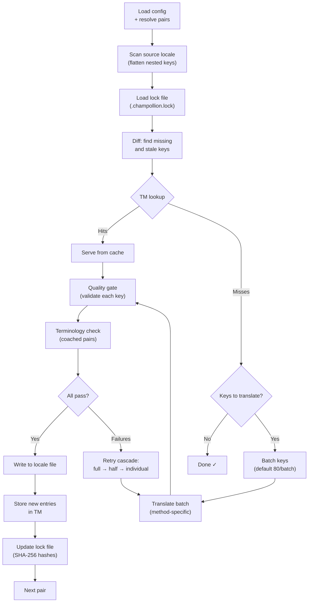

# كيف تعمل المزامنة

يُعد الأمر `sync` العملية الأساسية في Champollion. إليك ما يحدث عند تشغيل `npx champollion sync`.

## نظرة عامة على مسار العمل



## خطوة بخطوة

### 1. تحليل الإعدادات

يقوم Champollion بتحميل `champollion.config.json` (أو يكتشف الإعدادات تلقائيًا). ويقوم بتحديد:
- اللغة المصدر واللغات المستهدفة
- مخطط الأزواج (مجموعات المصدر→الهدف التي ستتم معالجتها)
- إعدادات الطريقة، والنموذج، والجودة لكل زوج

قبل فحص الملفات، يطبع Champollion ترويسة بدء التشغيل:

```
champollion v0.1.0

[INFO] Detected format: json (auto)
[INFO] Detected framework: Hugo
```

- **شعار الإصدار (Version banner)**: يعرض الإصدار المثبت لأغراض تصحيح الأخطاء والإبلاغ عن المشكلات.
- **اكتشاف التنسيق (Format detection)**: يُبلغ عن تنسيق الملف وما إذا تم اكتشافه تلقائيًا `(auto)` أو تم تكوينه صراحةً `(config)`. يدعم `json`، و`toml`، و`yaml`.
- **اكتشاف إطار العمل (Framework detection)**: عند تعيين `contentDir`، يحدد إطار العمل (`Hugo`) لتأكيد تنشيط مزامنة المحتوى.

### 2. فحص المصدر

يتم تحميل ملف لغة المصدر وتسطيحه (flattened) إلى خريطة مفتاح→قيمة (key→value map):

```json
// Input (nested)
{ "hero": { "title": "Welcome", "subtitle": "Build" } }

// Flattened
{ "hero.title": "Welcome", "hero.subtitle": "Build" }
```

### 3. اكتشاف التغييرات

يقرأ Champollion ملف `.champollion.lock`، والذي يخزن تجزئات SHA-256 لقيم المصدر المترجمة مسبقًا. لكل مفتاح، يتحقق مما يلي:

| الحالة | الإجراء |
|-----------|--------|
| المفتاح مفقود من الهدف | **ترجمة (Translate)** |
| تغيرت تجزئة المصدر منذ آخر مزامنة | **إعادة ترجمة (Re-translate)** (قديم) |
| القيمة المستهدفة تبدأ بـ `[EN]` | **إعادة ترجمة (Re-translate)** (علامة احتياطية قديمة) |
| تجزئة المصدر لم تتغير، والمفتاح موجود | **تخطي (Skip)** |

لهذا السبب يترجم Champollion ما تغير فقط — فهو لا يعيد ترجمة ملفك بالكامل في كل عملية مزامنة.

### 4. التجميع في دفعات (Batching)

يتم تجميع المفاتيح في دفعات (الافتراضي: 80 مفتاحًا/دفعة للنماذج اللغوية الكبيرة LLM، و128 لـ Google Translate). يقلل التجميع من رحلات الذهاب والإياب لواجهة برمجة التطبيقات (API) مع الحفاظ على إمكانية إدارة المطالبات (prompts).

أثناء الترجمة، يعرض Champollion شريط تقدم مضمن يتم تحديثه بعد اكتمال كل دفعة:

```
[INFO] fr.json — 2,847 missing
     ████████████████░░░░░░░░░░░░░░░░ 1,440/2,847 keys
```

يتم عرض الشريط باستخدام إرجاع السطر `\r` للتحديثات في نفس المكان — بدون تمرير (scrolling). يتم إخفاؤه في وضعي `--quiet` و`--json`.

### 4ب. ذاكرة الترجمة (Translation Memory)

قبل التجميع، يتحقق Champollion من ذاكرة التخزين المؤقت لذاكرة الترجمة (`.champollion/tm.json`). المفاتيح التي يتطابق نصها المصدر + اللغة + الطريقة مع ترجمة سابقة يتم تقديمها فورًا من ذاكرة التخزين المؤقت — دون الحاجة إلى استدعاء واجهة برمجة التطبيقات (API).

```
  [TM] 142 key(s) served from cache
  Translating 3 key(s) to French (llm)... [OK]
```

تُعد ذاكرة الترجمة (TM) الآلية الأساسية لتوفير التكاليف. إعادة تشغيل المزامنة بعد تغيير مفتاح واحد فقط يؤدي إلى ترجمة ذلك المفتاح فقط، وليس الملف بأكمله. راجع [ذاكرة الترجمة](/docs/concepts/translation-memory) للحصول على التفاصيل.

لتجاوز ذاكرة التخزين المؤقت لتشغيل واحد: `champollion sync --no-tm`

### 5. الترجمة

يتم إرسال كل دفعة إلى طريقة الترجمة المكونة:

- **`llm`**: مطالبة مهيكلة (Structured prompt) إلى OpenRouter مع تعليمات توجيهية حول مستوى اللغة (register) والجنس
- **`llm-coached`**: نفس الشيء، ولكن مع إدراج القواعد النحوية، والقاموس، وملاحظات الأسلوب
- **`google-translate`**: طلب مجمع لواجهة برمجة تطبيقات Google Cloud Translation API v2
- **`api`**: طلب HTTP POST إلى نقطة نهاية بعيدة (remote endpoint)

تكون رسالة النظام (مستوى اللغة، توجيهات الجنس، القواعد) متطابقة عبر الدفعات للغة معينة، مما يتيح **التخزين المؤقت للمطالبات (prompt caching)** — يقوم مزودون مثل Anthropic وGoogle بتخزين رسائل النظام المتكررة مؤقتًا، مما يقلل من تكاليف الرموز (tokens).

### 6. بوابة الجودة (Quality Gate)

يتم التحقق من صحة كل ترجمة قبل كتابتها على القرص. يتم تشغيل خمسة فحوصات:

| الفحص | ما يكتشفه | مثال |
|-------|----------------|---------|
| **فارغ/خالٍ (Empty/blank)** | لم يُرجع النموذج شيئًا | `""` |
| **صدى المصدر (Source echo)** | أرجع النموذج الإدخال الإنجليزي | `"Welcome"` للغة اليابانية |
| **حلقة الهلوسة (Hallucination loop)** | تكرار الثلاثيات (trigrams) | `"Qo' Qo' Qo' Qo'"` |
| **تضخم الطول (Length inflation)** | المخرجات أطول بـ 4 أضعاف أو أكثر من المصدر | مصدر من 10 أحرف → مخرجات من 50 حرفًا |
| **الامتثال لنظام الكتابة (Script compliance)** | نظام كتابة خاطئ للغة | نص لاتيني للغة العربية |

يتم تسجيل حالات الفشل ببادئة `[GATE]`. لا توجد إجراءات احتياطية صامتة (silent fallbacks).

راجع [بوابة الجودة](/docs/concepts/quality-gate) للحصول على التفاصيل.

### 6ب. التحقق من المصطلحات

بالنسبة للأزواج الموجهة (coached pairs) التي تحتوي على قاموس، يتحقق Champollion مما إذا كان النموذج اللغوي الكبير (LLM) قد استخدم بالفعل المصطلحات المطلوبة بعد الترجمة. يتم تسجيل الانتهاكات كتحذيرات `[TERM]`:

```
[TERM] en→fr: 2 term violation(s)
  • "dashboard" → expected "tableau de bord" but got "panneau"
```

هذه مجرد تحذيرات، وليست أخطاء حظر — لا يزال يتم كتابة الترجمة.

### 7. سلسلة إعادة المحاولة (Retry Cascade)

عند فشل تحليل JSON أو حدوث أخطاء على مستوى الدفعة، يعيد Champollion المحاولة بدفعات أصغر تدريجيًا:

```
Full batch (80 keys) → Failed
  └→ Half batch (40 keys) → 1 failure
      └→ Individual keys (1 each) → Isolates the problem key
```

يتم تحديد سقف ميزانية إعادة المحاولة بواسطة `maxRetries` (الافتراضي: 3) لمنع الإنفاق المفرط للرموز (tokens).

### 8. الكتابة والقفل (Write & Lock)

تتم كتابة الترجمات الناجحة في ملف اللغة المستهدفة، مع الحفاظ على بنية التداخل الأصلية (nesting structure). يتم تحديث ملف القفل (lock file) بتجزئات SHA-256 جديدة.

### 9. التحقق (Verification)

بعد معالجة جميع الأزواج، يعيد Champollion قراءة ملفات اللغة المكتوبة من القرص ويقوم بتشغيل دورة تحقق (ما لم يتم تعيين `--no-verify`). يكتشف هذا الفجوة بين إبلاغ المزامنة بالنجاح وكون المفاتيح خاطئة في الواقع:

- **تكافؤ المفاتيح (Key parity)** — جميع مفاتيح المصدر موجودة في كل هدف
- **علامات `[EN]` الاحتياطية** — علامات قديمة من عمليات تشغيل سابقة
- **ترجمات فارغة** — قيم فارغة تسربت
- **الامتثال لنظام الكتابة** — لغات غير لاتينية تحتوي على ترجمات ASCII فقط
- **الحفاظ على العناصر النائبة** — تطابق العناصر النائبة لـ ICU مع المصدر
- **مشكلات الترميز** — علامات BOM، أحرف غير مرئية

يتوفر هذا أيضًا كأمر `champollion verify` مستقل لبوابات التكامل المستمر (CI gates).

## ترجمة المحتوى (المرحلة 2)

بالنسبة لمشاريع Docusaurus وHugo، يقوم `sync` بتشغيل مرحلة ثانية بعد ترجمة مفاتيح JSON. تترجم هذه المرحلة ملفات Markdown وMDX (المستندات، منشورات المدونة، البرامج التعليمية) باستخدام نفس الطرق وبوابة الجودة.

### كيف تعمل

1. يكتشف Champollion جميع ملفات المحتوى المصدر (`.md`، `.mdx`) من خلال تصفح دليل المحتوى/المستندات (content/docs)
2. لكل زوج من الملف × اللغة، يتحقق من ملف قفل محتوى منفصل (`.champollion-content.lock`) بحثًا عن تغييرات في تجزئة SHA-256
3. يتم تجميع الملفات المتغيرة أو المفقودة في تجمع عناصر عمل مسطح (flat work-item pool)
4. تتم معالجة التجمع باستخدام **التزامن المتوازي (parallel concurrency)** (الافتراضي: 12 استدعاء متزامن لواجهة برمجة التطبيقات)

```
Phase 2: content (79 translations to process, 341 skipped, concurrency: 48)

    [1/79] (1%)  docs/concepts/security.md → ja [RE-TRANSLATE] (~3328s left)
    [2/79] (3%)  docs/concepts/security.md → th [RE-TRANSLATE] (~1821s left)
    ...
    [79/79] (100%) blog/v3-2-quality.md → de [OK]

  [OK] Created 79 content file(s), 341 unchanged
```

### التوازي (Parallelism)

تعمل الآن كل من المرحلة 1 (مفاتيح JSON) والمرحلة 2 (المحتوى) بالتوازي:

- **المرحلة 1**: يتم تشغيل جميع ترجمات اللغات بشكل متزامن (الافتراضي: 50 لغة متزامنة). داخل كل لغة، تعمل دفعات واجهة برمجة التطبيقات (API) أيضًا بالتوازي (4 دفعات متزامنة). تكتمل مزامنة 12 لغة مع 120 مفتاحًا في حوالي دقيقة واحدة بدلاً من حوالي 15 دقيقة.
- **المرحلة 2**: تتم ترجمة جميع مجموعات الملف×اللغة كتجمع مسطح (الافتراضي: 12 استدعاء متزامن لواجهة برمجة التطبيقات). تتم ترجمة ملفات مختلفة ولغات مختلفة في وقت واحد.

تحكم في التوازي باستخدام `--json-concurrency`، أو `--content-concurrency`، أو `--concurrency` (يضبط كليهما):

```bash
# Faster JSON sync (more parallel locale translations)
npx champollion sync --json-concurrency 30

# Faster content sync (more parallel API calls)
npx champollion sync --content-concurrency 20

# Slower (gentler on rate limits)
npx champollion sync --concurrency 4
```

### حماية المحتوى

أثناء الترجمة، يحمي Champollion المحتوى غير القابل للترجمة:

- **كتل التعليمات البرمجية (Code blocks)** (المحاطة بأسوار والمسافة البادئة) يتم استبدالها بعناصر نائبة
- **حقول Frontmatter** غير الموجودة في قائمة `translatableFields` يتم الحفاظ عليها كما هي
- **الروابط (Links)**، ومسارات الصور، وعلامات HTML يتم حمايتها
- **الرموز القصيرة (Shortcodes)** ومتغيرات الاستيفاء (مثل `{count}`، `{{.Params.title}}`) يتم حمايتها

بعد الترجمة، تتم استعادة جميع العناصر النائبة والتحقق من صحتها. إذا كان أي منها مفقودًا أو تالفًا، يتم رفض الترجمة وإعادة المحاولة.

## النجاح الجزئي

فشل دفعة واحدة لا يعيق الباقي. إذا نجحت 9 دفعات من أصل 10، تتم كتابة هذه الـ 9. يتم تسجيل الدفعة الفاشلة، ويمكنك إعادة تشغيل `sync` لإعادة المحاولة.

## التشغيل التجريبي (Dry Run)

معاينة ما سيتغير دون كتابة أي ملفات:

```bash
npx champollion sync --dry-run
```

## فرض إعادة الترجمة (Force Re-translate)

فرض إعادة ترجمة مفاتيح معينة حتى لو لم تتغير:

```bash
npx champollion sync --force-keys "hero.title,nav.about"
```

## تقدير التكلفة

قبل الترجمة، يُنشئ Champollion **تقرير تكلفة ما قبل المزامنة (pre-sync cost report)** يوضح التكاليف المقدرة لكل زوج. يتم تشغيل هذا تلقائيًا أثناء كل `sync` — حيث تراه قبل إجراء أي استدعاءات لواجهة برمجة التطبيقات (API).

```
╔══════════════════════════════════════════════════════════╗
║  Cost Estimate                                          ║
╠════════════╦═══════╦════════════╦════════════════════════╣
║ Pair       ║ Keys  ║ Est. Cost  ║ Method                 ║
╠════════════╬═══════╬════════════╬════════════════════════╣
║ en → fr    ║   142 ║ $0.07      ║ google-translate       ║
║ en → ja    ║    38 ║   —        ║ llm (model-dependent)  ║
║ en → crk   ║    38 ║   —        ║ llm-coached            ║
╚════════════╩═══════╩════════════╩════════════════════════╝
```

### ما يتم تقديره

توفر كل طريقة ترجمة تقدير التكلفة الخاص بها:

| الطريقة | أساس التكلفة | الدقة |
|--------|-----------|-----------|
| `google-translate` | السعر المعلن من Google (20 دولارًا/مليون حرف) | دقيق |
| `llm` | يختلف حسب نموذج OpenRouter | يعتمد على النموذج — تحقق من [أسعار OpenRouter](https://openrouter.ai/models) |
| `llm-coached` | نفس `llm` بالإضافة إلى رموز سياق التوجيه (coaching context tokens) | يعتمد على النموذج |
| `api` | يحدده الخادم | غير معروف — لا يمكن التقدير دون الاستعلام من نقطة النهاية |

عندما لا تتمكن طريقة ما من تحديد التكلفة (طرق النماذج اللغوية الكبيرة LLM، واجهات برمجة التطبيقات البعيدة)، يُبلغ Champollion بـ `—` بدلاً من التخمين. استخدم `--dry` لرؤية تقديرات التكلفة دون الترجمة فعليًا.

---

## انظر أيضًا

- [مرجع واجهة سطر الأوامر (CLI) — المزامنة (sync)](/docs/reference/cli#sync) — علامات وخيارات الأوامر
- [ذاكرة الترجمة](/docs/concepts/translation-memory) — التخزين المؤقت وتوفير التكاليف
- [بوابة الجودة](/docs/concepts/quality-gate) — كيفية التحقق من صحة الترجمات
- [طرق الترجمة](/docs/guides/translation-methods) — كيفية عمل كل طريقة
- [العمل مع المترجمين المحترفين](/docs/guides/professional-translators) — سير عمل XLIFF
- [الإعدادات](/docs/getting-started/configuration) — مرجع التكوين
- [دليل CI/CD](/docs/guides/ci-cd) — أتمتة عمليات المزامنة في مسار عملك
