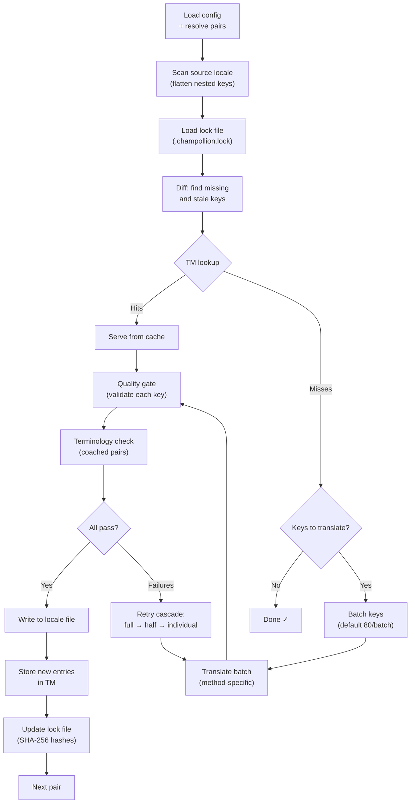

# آلية عمل المزامنة

يُعد الأمر `sync` العملية الأساسية في Champollion. إليك ما يحدث عند تشغيل `npx champollion sync`.

## نظرة عامة على مسار العمليات


```mermaid
flowchart TD
    A["Load config\n+ resolve pairs"] --> B["Scan source locale\n(flatten nested keys)"]
    B --> C["Load lock file\n(.champollion.lock)"]
    C --> D["Diff: find missing\nand stale keys"]
    D --> TM{"TM lookup"}
    TM -->|Hits| TC["Serve from cache"]
    TM -->|Misses| E{"Keys to translate?"}
    E -->|No| F["Done ✓"]
    E -->|Yes| G["Batch keys\n(default 80/batch)"]
    G --> H["Translate batch\n(method-specific)"]
    H --> I["Quality gate\n(validate each key)"]
    I --> TERM["Terminology check\n(coached pairs)"]
    TERM --> J{"All pass?"}
    J -->|Yes| K["Write to locale file"]
    J -->|Failures| L["Retry cascade:\nfull → half → individual"]
    L --> H
    TC --> I
    K --> TMS["Store new entries\nin TM"]
    TMS --> M["Update lock file\n(SHA-256 hashes)"]
    M --> N["Next pair"]
```

## خطوة بخطوة

### 1. استبانة الإعدادات

يقوم Champollion بتحميل `champollion.config.json` (أو يكتشف الإعدادات تلقائيًا). ويقوم باستبانة ما يلي:
- لغة المصدر واللغات المستهدفة
- مخطط الأزواج (أي تركيبات المصدر←الهدف التي ستتم معالجتها)
- إعدادات الطريقة، والنموذج، والجودة لكل زوج

قبل فحص الملفات، يطبع Champollion ترويسة بدء التشغيل:

```
champollion v0.1.0

[INFO] Detected format: json (auto)
[INFO] Detected framework: Hugo (hugo.toml)
[INFO] Content directory: content — each translation is written beside its source as <name>.<locale>.md (Hugo's translation-by-filename)
```

- **شعار الإصدار**: يعرض الإصدار المثبت لأغراض تصحيح الأخطاء والإبلاغ عن المشكلات.
- **اكتشاف التنسيق**: يُبلغ عن تنسيق الملف وما إذا كان قد تم اكتشافه تلقائيًا `(auto)` أو تكوينه صراحةً `(config)`. يدعم `json` و`toml` و`yaml`.
- **دليل المحتوى**: عند تعيين `contentDir`، يحدد اسم المجلد ومكان حفظ ترجماته (بجوار كل ملف مصدر، كـ `<name>.<locale>.md`). يظهر `Detected framework: Hugo` فقط عندما يكون المشروع بالفعل موقع Hugo، ويذكر السطر اسم الملف الذي أشار إلى ذلك (`hugo.toml`، أو `config.toml` بإعدادات Hugo، أو `archetypes/`، ...). ويتم التعامل مع أي مجلد Markdown آخر كمجلد لملفات Markdown/MDX وتتم ترجمته بالطريقة نفسها. راجع [ترجمة المحتوى](/docs/guides/content-translation).

### 2. فحص المصدر

يتم تحميل ملف لغة المصدر وتسطيحه إلى خريطة مفتاح←قيمة:

```json
// Input (nested)
{ "hero": { "title": "Welcome", "subtitle": "Build" } }

// Flattened
{ "hero.title": "Welcome", "hero.subtitle": "Build" }
```

### 3. اكتشاف التغييرات

يقرأ Champollion الملف `.champollion.lock`، الذي يخزن تجزئات SHA-256 لقيم المصدر المترجمة سابقًا. ويتحقق لكل مفتاح مما يلي:

| الشرط | الإجراء |
|-----------|--------|
| المفتاح غير موجود في الهدف | **ترجمة** |
| تغيرت تجزئة المصدر منذ آخر مزامنة | **إعادة ترجمة** (قديم) |
| تبدأ القيمة المستهدفة بـ `[EN]` | **إعادة ترجمة** (علامة احتياطية قديمة) |
| لم تتغير تجزئة المصدر، والمفتاح موجود | **تخطي** (لا يُرسل، ولا يُبحث عنه في ذاكرة التخزين المؤقت) |
| تركت إعادة التنفيذ المفتاح في حالة **معلق** | **إعادة ترجمة** لمرة واحدة، من النموذج |
| رفضت بوابة الجودة إجابة هذا النموذج للنص الحالي | **حجب** (لا يُعاد إرساله؛ يطلب `--redo keys:` مجددًا) |

لهذا السبب، يترجم Champollion التغييرات فقط — فهو لا يعيد ترجمة ملفك بالكامل في كل عملية مزامنة.

### 4. التجميع في دفعات

تُجمع المفاتيح في دفعات (الافتراضي: 80 مفتاحًا/دفعة لنماذج اللغة الكبيرة LLM، و128 لـ Google Translate). يقلل التجميع في دفعات من رحلات الذهاب والإياب عبر واجهة برمجة التطبيقات (API) مع الحفاظ على حجم موجهات الإدخال ضمن حدود معقولة.

أثناء الترجمة، يعرض Champollion شريط تقدم مضمنًا يُحدَّث بعد اكتمال كل دفعة:

```
[INFO] fr.json — 2,847 missing
     ████████████████░░░░░░░░░░░░░░░░ 1,440/2,847 keys
```

يتم عرض الشريط باستخدام محرف الرجوع `\r` (carriage return) للتحديث في نفس المكان — دون التمرير للأسفل. ويتم تعطيله في وضعي `--quiet` و`--json`.

### 4ب. ذاكرة الترجمة

قبل التجميع في دفعات، يتحقق Champollion من ذاكرة التخزين المؤقت لذاكرة الترجمة (`.champollion/tm.json`). تُسترجع المفاتيح التي يتطابق نص مصدرها ولغتها وطريقتها مع ترجمة سابقة فورًا من الذاكرة المؤقتة — دون الحاجة إلى أي استدعاء لواجهة برمجة التطبيقات.

```
  [TM] 142 key(s) served from cache
  Translating 3 key(s) to French (llm)... [OK]
```

تُعد ذاكرة الترجمة (TM) الآلية الأساسية لتوفير التكاليف. إعادة تشغيل المزامنة بعد تغيير مفتاح واحد يؤدي فقط إلى ترجمة ذلك المفتاح، وليس الملف بأكمله. راجع [ذاكرة الترجمة](/docs/concepts/translation-memory) للحصول على التفاصيل.

لتجاوز الذاكرة المؤقتة لتشغيل واحد: `champollion sync --no-tm`

### 5. الترجمة

تُرسل كل دفعة إلى طريقة الترجمة المحددة في الإعدادات:

- **`llm`**: موجه مهيكل إلى OpenRouter مع تعليمات حول النبرة (Register) وتوجيهات الجنس النحوي
- **`llm-coached`**: الأمر نفسه، ولكن مع إدراج القواعد النحوية والقاموس وملاحظات الأسلوب
- **`google-translate`**: طلب دفعة عبر Google Cloud Translation API v2
- **`api`**: طلب HTTP POST إلى نقطة نهاية بعيدة

تكون رسالة النظام (النبرة، وتوجيهات الجنس النحوي، والقواعد) متطابقة عبر جميع الدفعات للغة معينة، مما يتيح **التخزين المؤقت للموجهات (Prompt Caching)** — حيث يقوم مزودون مثل Anthropic وGoogle بتخزين رسائل النظام المتكررة مؤقتًا، مما يقلل من تكاليف الرموز (Tokens).

### 6. بوابة الجودة

يتم التحقق من صحة كل ترجمة قبل كتابتها على القرص. حيث يتم تشغيل خمسة فحوصات:

| الفحص | ما يكتشفه | مثال |
|-------|----------------|---------|
| **فارغ/أبيض** | لم يُرجع النموذج أي شيء | `""` |
| **تكرار المصدر** | أرجع النموذج النص الإنجليزي المدخل كما هو | `"Welcome"` لليابانية |
| **حلقة الهلوسة** | تكرار ثلاثيات الكلمات (trigrams) | `"Qo' Qo' Qo' Qo'"` |
| **تضخم الطول** | المخرجات أطول بأكثر من 4 أضعاف طول المصدر (4 أضعاف تمامًا يجتاز) | مصدر بطول 10 أحرف ← مخرج بطول 50 حرفًا |
| **التوافق مع نظام الكتابة** | استخدام نظام كتابة خاطئ للغة المعنية | نص لاتيني للغة العربية |

تُسجل حالات الفشل بالبادئة `[GATE]`. لا توجد بدائل احتياطية صامتة.

راجع [بوابة الجودة](/docs/concepts/quality-gate) للحصول على التفاصيل.

### 6ب. التحقق من المصطلحات

بالنسبة للأزواج المدعومة بالتوجيه (Coached) مع وجود قاموس، يتحقق Champollion مما إذا كان النموذج قد استخدم بالفعل المصطلحات المطلوبة بعد الترجمة. تُسجل المخالفات كتحذيرات `[TERM]`:

```
[TERM] en→fr: 2 term violation(s)
  • "dashboard" → expected "tableau de bord" but got "panneau"
```

هذه تحذيرات وليست أخطاء مانعة — حيث تتم كتابة الترجمة على أي حال.

### 7. تتابع المحاولات

عند فشل تحليل JSON أو حدوث أخطاء على مستوى الدفعة، يعيد Champollion المحاولة بدفعات أصغر تدريجيًا:

```
Full batch (80 keys) → Failed
  └→ Half batch (40 keys) → 1 failure
      └→ Individual keys (1 each) → Isolates the problem key
```

يتم تقييد ميزانية إعادة المحاولة بواسطة `maxRetries` (الافتراضي: 3) لمنع استهلاك الرموز بشكل خارج عن السيطرة.

### 8. الكتابة والقفل

تُكتب الترجمات الناجحة في ملف اللغة المستهدفة، مع الحفاظ على بنية التداخل الأصلية. ويتم تحديث ملف القفل بتجزئات SHA-256 الجديدة.

### 9. التحقق

بعد معالجة جميع الأزواج، يعيد Champollion قراءة ملفات اللغات المكتوبة من القرص ويشغّل مرحلة تحقق (ما لم يتم تعيين `--no-verify`). يكتشف هذا الفجوة بين إبلاغ المزامنة عن النجاح ووجود أخطاء فعلية في المفاتيح:

- **تكافؤ المفاتيح** — وجود جميع مفاتيح المصدر في كل هدف
- **علامات الرجوع الاحتياطي `[EN]`** — علامات قديمة من عمليات تشغيل سابقة
- **الترجمات الفارغة** — القيم الفارغة التي لم يتم التقاطها مسبقًا
- **التوافق مع نظام الكتابة** — اللغات غير اللاتينية التي تحتوي على ترجمات لاتينية فقط (وفقًا لنظام كتابة Unicode: تُحسب الأحرف اللاتينية ذات العلامات التشكيلية وتلك كاملة العرض كأحرف لاتينية)
- **الحفاظ على العناصر النائبة** — تطابق العناصر النائبة بصيغة ICU مع المصدر
- **مشكلات الترميز** — علامات BOM والمحارف غير المرئية

يتوفر هذا أيضًا كأمر مستقل `champollion verify` لبوابات التكامل المستمر (CI).

## ترجمة المحتوى (المرحلة 2)

بالنسبة لمواقع Docusaurus، ولأي مشروع يحتوي على `contentDir` (مجلد Hugo `content/` أو أي مجلد لملفات Markdown)، يشغّل `sync` مرحلة ثانية بعد ترجمة مفاتيح JSON. تترجم هذه المرحلة ملفات Markdown وMDX (المستندات، والمقالات، والنشرات الإخبارية) باستخدام الطرق وبوابة الجودة ذاتها. وتُحفظ التعديلات التي يُجريها المراجع على ترجمة `contentDir` عند تغير المصدر في مكان آخر. راجع [مراجعة الترجمات وتعديلها](/docs/guides/content-translation#reviewing-and-editing-translations).

### آلية العمل

1. يكتشف Champollion جميع ملفات المحتوى المصدر (`.md`، `.mdx`) عبر مسح دليل content/docs
2. لكل زوج من الملف × اللغة، يتحقق من ملف قفل محتوى منفصل (`.champollion-content.lock`) بحثًا عن أي تغييرات في تجزئة SHA-256
3. تُجمع الملفات المتغيرة أو المفقودة في تجمع موحد لعناصر العمل
4. تتم معالجة التجمع باستخدام **التزامن المتوازي** (الافتراضي: 12 استدعاءً متزامنًا لواجهة برمجة التطبيقات)

```
Phase 2: content (79 translations to process, 341 skipped, concurrency: 48)

    [1/79] (1%)  docs/concepts/security.md → ja [RE-TRANSLATE] (~3328s left)
    [2/79] (3%)  docs/concepts/security.md → th [RE-TRANSLATE] (~1821s left)
    ...
    [79/79] (100%) blog/v3-2-quality.md → de [OK]

  [OK] Created 79 content file(s), 341 unchanged
```

### التوازي

تعمل كل من المرحلة 1 (مفاتيح JSON) والمرحلة 2 (المحتوى) بالتوازي الآن:

- **المرحلة 1**: تنطلق ترجمات جميع اللغات في وقت واحد (الافتراضي: 50 لغة متزامنة). وداخل كل لغة، تعمل دفعات واجهة برمجة التطبيقات بالتوازي أيضًا (4 دفعات متزامنة). تكتمل مزامنة 12 لغة تحتوي على 120 مفتاحًا في غضون دقيقة واحدة تقريبًا بدلاً من 15 دقيقة تقريبًا.
- **المرحلة 2**: تُترجم جميع تركيبات الملف × اللغة كتجمع موحد (الافتراضي: 12 استدعاءً متزامنًا لواجهة برمجة التطبيقات). وتتم ترجمة الملفات المختلفة واللغات المختلفة في آنٍ واحد.

يمكنك التحكم في التوازي باستخدام `--json-concurrency` أو `--content-concurrency` أو `--concurrency` (يحدد كليهما):

```bash
# Faster JSON sync (more parallel locale translations)
npx champollion sync --json-concurrency 30

# Faster content sync (more parallel API calls)
npx champollion sync --content-concurrency 20

# Slower (gentler on rate limits)
npx champollion sync --concurrency 4
```

### حماية المحتوى

أثناء الترجمة، يحمي Champollion المحتوى غير القابل للترجمة:

- **كتل الشيفرات البرمجية** (المحاطة بسياج والبادئة بمسافة) تُستبدل بعناصر نائبة
- **حقول Frontmatter** غير المدرجة في قائمة `translatableFields` يتم الحفاظ عليها كما هي
- **الروابط** ومسارات الصور ووسوم HTML تخضع للحماية
- **الأكواد القصيرة (Shortcodes)** ومتغيرات الاستيفاء (مثل `{count}`، `{{.Params.title}}`) تكون محمية

بعد الترجمة، تتم استعادة جميع العناصر النائبة والتحقق من صحتها. إذا فُقد أي منها أو كان تالفًا، يتم رفض الترجمة وإعادة المحاولة.

## النجاح الجزئي

لا تؤدي دفعة فاشلة واحدة إلى حظر بقية الدفعات. فإذا نجحت 9 دفعات من أصل 10، تتم كتابة تلك الدفعات التسع. ويتم تسجيل الدفعة الفاشلة في السجل، ويمكنك إعادة تشغيل `sync` للمحاولة مرة أخرى.

## التشغيل التجريبي

معاينة ما سيتغير دون كتابة أي ملفات:

```bash
npx champollion sync --dry-run
```

## فرض إعادة الترجمة

فرض إعادة ترجمة مفاتيح محددة حتى لو لم تتغير:

```bash
npx champollion sync --force-keys "hero.title,nav.about"
```

## تقدير التكلفة

قبل البدء في الترجمة، يُنشئ Champollion **تقرير تكلفة يسبق المزامنة** يوضح التكاليف المقدرة لكل زوج. يعمل هذا تلقائيًا أثناء كل عملية `sync` — حيث يمكنك رؤيته قبل إجراء أي استدعاءات لواجهة برمجة التطبيقات.

```
╔══════════════════════════════════════════════════════════╗
║  Cost Estimate                                          ║
╠════════════╦═══════╦════════════╦════════════════════════╣
║ Pair       ║ Keys  ║ Est. Cost  ║ Method                 ║
╠════════════╬═══════╬════════════╬════════════════════════╣
║ en → fr    ║   142 ║ $0.07      ║ google-translate       ║
║ en → ja    ║    38 ║   —        ║ llm (model-dependent)  ║
║ en → crk   ║    38 ║   —        ║ llm-coached            ║
╚════════════╩═══════╩════════════╩════════════════════════╝
```

### ما يتم تقديره

تقدم كل طريقة ترجمة تقدير التكلفة الخاص بها:

| الطريقة | أساس التكلفة | الدقة |
|--------|-----------|-----------|
| `google-translate` | السعر المعلن من Google (20 دولارًا/مليون محرف) | دقيقة |
| `llm` | تختلف حسب نموذج OpenRouter | تعتمد على النموذج — تحقق من [أسعار OpenRouter](https://openrouter.ai/models) |
| `llm-coached` | مثل `llm` بالإضافة إلى رموز سياق التوجيه | تعتمد على النموذج |
| `api` | يحددها الخادم | غير معروفة — لا يمكن التقدير دون الاستعلام من نقطة النهاية |

عندما يتعذر على طريقة ما تحديد التكلفة (طرق نماذج اللغة الكبيرة LLM، وواجهات برمجة التطبيقات البعيدة)، يبلغ Champollion بـ `—` بدلاً من التخمين. استخدم `--dry` للاطلاع على تقديرات التكلفة دون إجراء الترجمة فعليًا.

---

## انظر أيضًا

- [مرجع واجهة سطر الأوامر (CLI) — sync](/docs/reference/cli#sync) — خيارات الأمر وراياته
- [ذاكرة الترجمة](/docs/concepts/translation-memory) — التخزين المؤقت وتوفير التكاليف
- [بوابة الجودة](/docs/concepts/quality-gate) — كيفية التحقق من صحة الترجمات
- [طرق الترجمة](/docs/guides/translation-methods) — كيفية عمل كل طريقة
- [العمل مع مترجمين محترفين](/docs/guides/professional-translators) — مسار عمل XLIFF
- [الإعدادات](/docs/getting-started/configuration) — مرجع التكوين
- [دليل التكامل والنشر المستمرين (CI/CD)](/docs/guides/ci-cd) — أتمتة عمليات المزامنة في مسار العمل لديك
