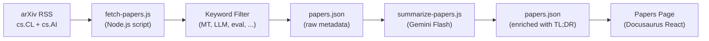

# موجز الأوراق البحثية

يحتفظ Champollion بموجز منسق للأوراق البحثية الخاصة بالترجمة الآلية ومعالجة اللغات الطبيعية (NLP) من arXiv، حيث تتم تصفيتها وتلخيصها للممارسين. هذا الموجز شبه آلي: تُجلب الأوراق وتُصفى يوميًا، وتُلخص بواسطة الذكاء الاصطناعي، ثم تُنشر على الموقع الإلكتروني.

## سبب وجوده

يُبنى مسار الترجمة في champollion على تقنيات مستمدة من الأبحاث المنشورة — التلقين الموجه بالسجل، وحقن بيانات التوجيه، وترحيل السياق، وبوابات الجودة. يخدم موجز الأوراق البحثية ثلاثة أغراض:

1. **الشفافية**: يمكن للمستخدمين الاطلاع على الأبحاث التي تدعم كل ميزة
2. **الاكتشاف**: قد تُوجه التقنيات الجديدة المنشورة على arXiv الميزات المستقبلية أو تكوينات المستخدم
3. **المجتمع**: يضع champollion كأداة مبنية على الأبحاث، وليس مجرد غلاف واجهة برمجة تطبيقات (API wrapper) آخر

## البنية



### خطوات المسار

#### 1. الجلب (يوميًا)

يستعلم `scripts/fetch-papers.js` من واجهة برمجة تطبيقات arXiv Atom عن الأوراق البحثية الحديثة في:
- `cs.CL` (الحوسبة واللغة)
- `cs.AI` (الذكاء الاصطناعي)

يُرجع: العنوان، والمؤلفين، والملخص، ومعرف arXiv، ورابط PDF، وتاريخ النشر، والفئات.

#### 2. التصفية

تُصفى الأوراق البحثية بناءً على صلة الكلمات الرئيسية. يجب أن تتطابق الورقة مع كلمة رئيسية أساسية واحدة على الأقل:

**الكلمات الرئيسية الأساسية** (يجب أن تتطابق مع ≥1):
- `machine translation`, `neural machine translation`, `NMT`
- `LLM`, `large language model`
- `multilingual`, `cross-lingual`
- `document-level translation`
- `low-resource language`, `endangered language`
- `translation evaluation`, `BLEU`, `COMET`, `chrF`
- `tokenization`, `morphology`, `polysynthetic`
- `context window`, `sliding window`
- `prompt engineering` (في سياق الترجمة)

**كلمات التعزيز الرئيسية** (تزيد من درجة الصلة):
- `i18n`, `internationalization`, `localization`
- `few-shot`, `in-context learning`
- `terminology`, `glossary`, `consistency`
- `quality estimation`, `hallucination`

#### 3. التلخيص (بمساعدة الذكاء الاصطناعي)

يعالج `scripts/summarize-papers.js` الأوراق البحثية الجديدة (غير الملخصة):

لكل ورقة بحثية، يُرسل الملخص إلى Gemini 3.5 Flash مع:
```
Read this ML research abstract and produce:
1. A 2-sentence TL;DR accessible to a software developer (not a researcher)
2. A single bullet: "Why this matters for MT" — how could this technique
   improve machine translation quality, cost, or speed in production?

Abstract: {abstract}
```

تُخزن المخرجات مرة أخرى في `papers.json` بجانب البيانات الوصفية الأولية.

#### 4. النشر

تعرض صفحة الأوراق البحثية في Docusaurus (`website/src/pages/papers.js`) `papers.json` كشبكة بطاقات قابلة للتصفية ومقسمة إلى صفحات.

تعرض كل بطاقة:
- **العنوان** (مرتبط بـ arXiv)
- **المؤلفون** (أول 3 + "وآخرون")
- **التاريخ** (تاريخ النشر أو آخر تحديث)
- **الخلاصة (TL;DR)** (منشأة بواسطة الذكاء الاصطناعي)
- **سبب الأهمية** (منشأ بواسطة الذكاء الاصطناعي)
- **الفئات** (علامات arXiv)
- **رابط PDF**

### الأتمتة

يُشغل سير عمل GitHub Actions المسار يوميًا:

```yaml title=".github/workflows/fetch-papers.yml"
name: Fetch MT Research Papers
on:
  schedule:
    - cron: '0 6 * * *'  # 06:00 UTC daily
  workflow_dispatch: {}   # Manual trigger

jobs:
  fetch:
    runs-on: ubuntu-latest
    steps:
      - uses: actions/checkout@v4
      - uses: actions/setup-node@v4
        with:
          node-version: 20
      - run: node scripts/fetch-papers.js
      - run: node scripts/summarize-papers.js
        env:
          GEMINI_API_KEY: ${{ secrets.GEMINI_API_KEY }}
      - name: Commit if changed
        run: |
          git config user.name "github-actions[bot]"
          git config user.email "github-actions[bot]@users.noreply.github.com"
          git add website/src/data/papers.json
          git diff --cached --quiet || git commit -m "chore: update research papers feed"
          git push
```

## مخطط البيانات

```typescript
interface Paper {
  id: string;           // arXiv ID (e.g., "2406.12345")
  title: string;
  authors: string[];
  abstract: string;
  published: string;    // ISO date
  updated: string;      // ISO date
  pdfUrl: string;
  categories: string[];
  primaryCategory: string;

  // Computed by filter
  relevanceScore: number;
  matchedKeywords: string[];

  // Computed by summarizer (null until processed)
  tldr: string | null;
  whyItMatters: string | null;
  summarizedAt: string | null;
}
```

## مواقع الملفات

| الملف | الغرض |
|------|---------|
| `scripts/fetch-papers.js` | جالب arXiv RSS ومصفي الكلمات الرئيسية |
| `scripts/summarize-papers.js` | التلخيص بالذكاء الاصطناعي عبر Gemini |
| `website/src/data/papers.json` | بيانات الورقة البحثية (مُودعة في المستودع) |
| `website/src/pages/papers.js` | مكون صفحة Docusaurus |
| `website/src/pages/papers.module.css` | أنماط الصفحة |
| `.github/workflows/fetch-papers.yml` | الأتمتة اليومية |

## حالة التنفيذ

| الميزة | الحالة |
|---------|--------|
| `fetch-papers.js` (جلب arXiv + تصفية) | 🔲 مخطط لها |
| `summarize-papers.js` (ملخص الذكاء الاصطناعي) | 🔲 مخطط لها |
| صفحة الأوراق البحثية (مكون React) | 🔲 مخطط لها |
| سير عمل GitHub Actions | 🔲 مخطط لها |
| تصفية الفئة/الكلمة الرئيسية في الصفحة | 🔲 مخطط لها |
| تقسيم الصفحات | 🔲 مخطط لها |

## انظر أيضًا

- [البنية](/docs/concepts/architecture) — كيف ترتبط مكونات champollion ببعضها
- [ترحيل السياق](/docs/concepts/context-rollover) — ميزة مستوحاة مباشرة من موجز الأبحاث هذا
