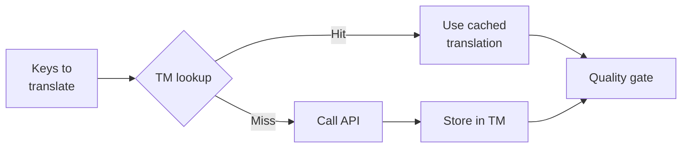

# ذاكرة الترجمة

ذاكرة الترجمة (TM) هي طبقة التخزين المؤقت المدمجة في Champollion. تقوم بتخزين كل ترجمة مفهرسة بناءً على النص المصدر + اللغة المحلية + الطريقة، لذلك فإن إعادة تشغيل `sync` تستدعي واجهة برمجة التطبيقات (API) فقط للمفاتيح التي تغيرت بالفعل.

## لماذا توجد ذاكرة الترجمة (TM)

بدون ذاكرة الترجمة (TM)، يقوم كل `sync` بإعادة ترجمة كل مفتاح معدل — حتى لو كنت قد ترجمت نفس النص الإنجليزي بالضبط لنفس اللغة المحلية في عملية تشغيل سابقة. السيناريوهات الشائعة التي تهدر فيها هذه العملية الأموال:

| السيناريو | بدون ذاكرة الترجمة (TM) | مع ذاكرة الترجمة (TM) |
|----------|-----------|---------|
| إعادة تشغيل المزامنة بعد تغيير مفتاح واحد (500 مفتاح × 10 لغات محلية) | 5,000 استدعاء لواجهة برمجة التطبيقات (API) | 10 استدعاءات لواجهة برمجة التطبيقات (API) |
| إعادة مفتاح إلى قيمة إنجليزية سابقة | استدعاء كامل لواجهة برمجة التطبيقات (API) | إصابة فورية في ذاكرة التخزين المؤقت (Cache hit) |
| ظهور نفس العبارة في 3 ملفات لغات محلية | 3 × استدعاءات لواجهة برمجة التطبيقات (API) | استدعاء واحد لواجهة برمجة التطبيقات (API) + إصابتان في ذاكرة التخزين المؤقت |
| تشغيل تجريبي (Dry-run) → مزامنة حقيقية | استدعاءات كاملة لواجهة برمجة التطبيقات (API) في كليهما | التشغيل الأول يُخزن مؤقتاً، والثاني يعيد الاستخدام |

ذاكرة الترجمة (TM) **مفعلة افتراضياً** ولا تتطلب أي إعدادات. يتم تخزين الترجمات مؤقتاً بشكل تلقائي أثناء كل `sync` ويتم تقديمها في عمليات التشغيل اللاحقة.

## كيف تعمل

### مفتاح التخزين المؤقت (Cache Key)

يتم فهرسة كل إدخال في ذاكرة الترجمة (TM) بواسطة تجزئة SHA-256 لثلاث قيم:

```
SHA-256( sourceValue + '\x00' + locale + '\x00' + method )
```

| المكون | سبب وجوده في المفتاح |
|-----------|-------------------|
| `sourceValue` | نص إنجليزي مختلف → ترجمة مختلفة |
| `locale` | تُترجم "Hello" بشكل مختلف إلى الفرنسية مقارنة باليابانية |
| `method` | مخرجات Google Translate ≠ مخرجات GPT-4o |

يمنع الفاصل البايت الصفري (null byte) (`\x00`) حدوث تعارض بين `"ab" + "c"` و `"a" + "bc"`.

### أثناء المزامنة



1. قبل استدعاء واجهة برمجة تطبيقات (API) الترجمة، يقوم Champollion بتقسيم المفاتيح إلى **إصابات في ذاكرة الترجمة (TM hits)** و **إخفاقات في ذاكرة الترجمة (TM misses)**
2. يتم تقديم الإصابات (Hits) فوراً من ذاكرة التخزين المؤقت — بدون استدعاء لواجهة برمجة التطبيقات (API)، وبدون تأخير، وبدون تكلفة
3. تمر الإخفاقات (Misses) عبر مسار الترجمة الطبيعي
4. يتم تخزين الترجمات الجديدة الواردة من واجهة برمجة التطبيقات (API) في ذاكرة الترجمة (TM) لعمليات التشغيل المستقبلية
5. تمر جميع الترجمات (المخزنة مؤقتاً + الجديدة) عبر بوابة الجودة (quality gate)

### التخزين

يتم تخزين ذاكرة الترجمة (TM) في `.champollion/tm.json` في الدليل الجذري لمشروعك. يستخدم الملف تنسيق JSON مضغوط (بدون تنسيق مرئي أو pretty-printing) للحفاظ على حجم الملف قابلاً للإدارة. يخزن كل إدخال:

| الحقل | الوصف |
|-------|-------------|
| `t` | النص المترجم |
| `ts` | طابع زمني بتنسيق ISO-8601 لوقت تخزينه مؤقتاً |
| `l` | رمز اللغة المحلية المستهدفة (للإحصائيات/التصفية) |
| `m` | اسم طريقة الترجمة (للإحصائيات/التصفية) |

عند 50 لغة × 500 مفتاح = 25,000 إدخال، يجب أن يكون حجم الملف حوالي 2-3 ميغابايت.

## إدارة ذاكرة التخزين المؤقت

### عرض الإحصائيات

```bash
champollion tm stats
```

يعرض عدد الإدخالات، وحجم الملف، وتفصيلاً لكل لغة محلية:

```
  Translation Memory — .champollion/tm.json

  Entries:      2,847
  File size:    1.2 MB
  Created:      2026-05-20
  Last entry:   2026-05-24

  By locale:
    fr       482 entries  (llm: 380, llm-coached: 102)
    de       471 entries  (llm: 471)
    ja       465 entries  (llm: 465)
```

### مسح ذاكرة التخزين المؤقت

```bash
# Clear everything (with confirmation prompt)
champollion tm clear

# Clear without prompt (CI environments)
champollion tm clear --yes

# Clear only one locale
champollion tm clear --locale fr
```

### تخطي ذاكرة الترجمة (TM) لعملية تشغيل واحدة

```bash
# Force fresh API calls for all keys (useful when switching providers)
champollion sync --no-tm
```

هذا لا يحذف ذاكرة التخزين المؤقت — بل يتجاهلها فقط في عملية التشغيل هذه ولا يقوم بتخزين النتائج الجديدة.

## متى لا تكون ذاكرة الترجمة (TM) مفيدة

لن تُنتج ذاكرة الترجمة (TM) إصابة في ذاكرة التخزين المؤقت (cache hit) عندما:

- **تغير النص المصدر** — تتغير التجزئة (hash)، لذا فهي إخفاق (miss)
- **تغيرت الطريقة** — التبديل من `llm` إلى `google-translate` يعني مفاتيح تخزين مؤقت مختلفة
- **التشغيل الأول** — بداية باردة (cold start)، لا توجد إدخالات بعد
- **علامة `--no-tm`** — تتجاوز ذاكرة التخزين المؤقت بشكل صريح

## هل يجب عليك إيداع (Commit) `.champollion/tm.json`؟

**بشكل عام لا.** ذاكرة الترجمة (TM) هي تحسين محلي للمطور. يتم ملؤها تلقائياً أثناء المزامنة وتساعد فقط عند إعادة تشغيل المزامنة على نفس الجهاز. ومع ذلك، قد تفكر في إيداعها (committing) إذا:

- كان فريقك يشارك مشغل تكامل مستمر (CI runner) واحد يقوم بمزامنة الترجمات
- كنت تريد بناءات قابلة لإعادة الإنتاج (reproducible builds) بدون استدعاءات لواجهة برمجة التطبيقات (API)
- كنت تقوم بأرشفة الترجمات لأغراض الامتثال

أضف `.champollion/tm.json` إلى `.gitignore` للاستخدام المعتاد.

---

## انظر أيضًا

- [كيف تعمل المزامنة](/docs/concepts/how-sync-works) — أين تتناسب ذاكرة الترجمة (TM) في مسار العمل
- [مرجع واجهة سطر الأوامر (CLI) — tm](/docs/reference/cli#tm) — مرجع الأوامر
- [مرجع واجهة سطر الأوامر (CLI) — sync --no-tm](/docs/reference/cli#sync) — تجاوز ذاكرة الترجمة (TM)
