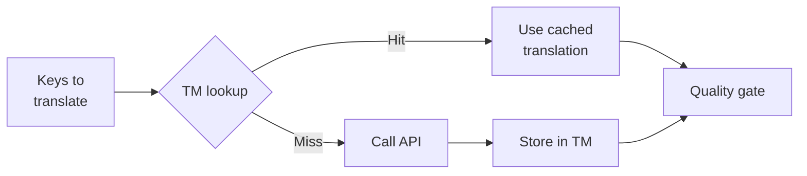

# ذاكرة الترجمة (Translation Memory)

ذاكرة الترجمة (TM) هي طبقة التخزين المؤقت المضمنة في champollion. تقوم بتخزين كل ترجمة مفهرسة بالنص المصدر + اللغة الهدف (locale) + الطريقة، بحيث يؤدي إعادة تشغيل `sync` إلى استدعاء واجهة برمجة التطبيقات (API) فقط للمفاتيح التي تغيرت بالفعل.

## لماذا توجد ذاكرة الترجمة

بدون ذاكرة الترجمة، تقوم كل عملية `sync` بإعادة ترجمة كل مفتاح معدل — حتى لو كنت قد ترجمت بالفعل نفس النص الإنجليزي تمامًا لنفس اللغة الهدف في تشغيل سابق. السيناريوهات الشائعة التي يؤدي فيها هذا إلى إهدار التكلفة:

| السيناريو | بدون TM | مع TM |
|----------|-----------|---------|
| إعادة تشغيل المزامنة بعد تغيير مفتاح واحد (500 مفتاح × 10 لغات) | 5,000 استدعاء API | 10 استدعاءات API |
| التراجع عن مفتاح إلى قيمة إنجليزية سابقة | استدعاء API كامل | إصابة فورية لذاكرة التخزين المؤقت (Cache Hit) |
| تكرار نفس العبارة في 3 ملفات لغات | 3 × استدعاءات API | استدعاء API واحد + 2 إصابة لذاكرة التخزين المؤقت |
| تشغيل تجريبي (Dry-run) ← مزامنة فعلية | استدعاءات API كاملة في كليهما | التشغيل الأول يحفظ في التخزين المؤقت، والثاني يعيد الاستخدام |

ذاكرة الترجمة **مفعلة افتراضيًا** ولا تتطلب أي تكوين. يتم تخزين الترجمات مؤقتًا تلقائيًا أثناء كل `sync` وتقديمها في عمليات التشغيل اللاحقة.

## كيف تعمل

### مفتاح التخزين المؤقت (Cache Key)

يتم إنشاء مفتاح لكل إدخال في ذاكرة الترجمة بواسطة تجزئة SHA-256 لثلاث قيم:

```
SHA-256( sourceValue + '\x00' + locale + '\x00' + method )
```

| المكون | سبب وجوده في المفتاح |
|-----------|-------------------|
| `sourceValue` | نص إنجليزي مختلف ← ترجمة مختلفة |
| `locale` | تختلف ترجمة "Hello" إلى الفرنسية عنها إلى اليابانية |
| `method` | مخرجات Google Translate ≠ مخرجات GPT-4o |

يمنع فاصل البايت الفارغ (null byte) (`\x00`) التعارض بين `"ab" + "c"` و`"a" + "bc"`.

إن `sourceValue` هو النص الذي يُترجم المفتاح منه، مدمجًا معه كل ما يميز نصين متطابقين عن بعضهما:

- **سياق gettext.** يتم تخزين الإدخال الذي يحتوي على `msgctxt` مؤقتًا مع سياقه: فالفعل "Open" والصفة "Open" يُعدان إدخالين مختلفين.
- **صيغ الجمع التي لا توجد في المصدر.** يخزن i18next صيغ الجمع كمفاتيح متبوعة بلواحق، ويمكن أن تحتوي اللغة الهدف على صيغ تفتقر إليها لغة المصدر: تضيف الفرنسية والإسبانية `count_many`، والتي تُترجم من نص `count_other` الإنجليزي. يرسل كلا المفتاحين نفس النص، لكن يُطلب من النموذج صيغ مختلفة (`"2 recettes"` و`"1 000 000 de recettes"`)، لذا يحصل كل منهما على إدخال خاص به: يحتفظ `count_other` بالإدخال العادي، ويتم تخزين `count_many` مؤقتًا تحت النص مضافًا إليه صيغته. ينطبق الأمر نفسه على كل صيغة مترجمة من نص فئة أخرى (في العربية `_zero`، `_two`، `_few`، `_many`؛ وفي الروسية `_few`، `_many`؛ وصيغ الأعداد الترتيبية).
- **صيغة الجمع `msgid_plural` في gettext وARB / ICU** عبارة عن رسالة واحدة لكل مفتاح (كل الصيغ في قيمة واحدة)، لذا فهي تشكل إدخالًا واحدًا، كما في السابق.

قبل الإصدار 0.4.0، كانت الصيغة المستعارة تشترك في إدخال الصيغة التي تُترجم منها، وكان الإدخال يحتفظ بآخر إجابة تم تخزينها، لذا كان بإمكان `--redo all` كتابة صيغة واحدة لكلا المفتاحين. يتم إصلاح ذاكرة التخزين المؤقت التي تعود لتلك الفترة أثناء استخدامها. عندما يحتوي الإدخال المشترك على نص الصيغة المستعارة، فإنه ينتقل إلى الإدخال الخاص بتلك الصيغة، وتتم إعادة ترجمة الصيغة الأخرى في المرة التالية التي تُوضع فيها في قائمة الانتظار. خلاف ذلك، يبقى الإدخال مع الصيغة التي يستعير منها، وتُرسل الصيغة المستعارة إلى النموذج مرة واحدة، في أول مرة تُوضع فيها في قائمة الانتظار (يوضح التشغيل ذلك). يحذر `champollion verify` عندما تحتوي صيغة مستعارة على نفس نص الصيغة التي تستعير منها تمامًا ولا تظهر ذاكرة التخزين المؤقت أن النموذج قد كتبها بهذه الطريقة. تكتب بعض اللغات بالفعل صيغتين بصورة متطابقة، لذا فإن هذا مجرد تحذير؛ ويعيد `--redo keys:<key>` الطلب مجددًا.

### أثناء المزامنة


```mermaid
flowchart LR
    A["Keys to\ntranslate"] --> B{"TM lookup"}
    B -->|Hit| C["Use cached\ntranslation"]
    B -->|Miss| D["Call API"]
    D --> E["Store in TM"]
    C --> F["Quality gate"]
    E --> F
```

1. قبل استدعاء واجهة برمجة تطبيقات الترجمة، يقسم champollion المفاتيح إلى **إصابات TM (hits)** و**إخفاقات TM (misses)**
2. يتم تقديم الإصابات فورًا من ذاكرة التخزين المؤقت — بدون استدعاء واجهة برمجة التطبيقات، وبدون زمن انتقال، وبدون تكلفة
3. تمر الإخفاقات عبر خط أنابيب الترجمة المعتاد
4. يتم تخزين الترجمات الجديدة الواردة من واجهة برمجة التطبيقات في ذاكرة الترجمة لعمليات التشغيل المستقبلية
5. تمر جميع الترجمات (المخزنة مؤقتًا + الجديدة) عبر بوابة الجودة (Quality Gate)

### التخزين

يتم تخزين TM في `.champollion/tm.json` في جذر مشروعك. يستخدم الملف تنسيق JSON مضغوطًا (بدون تنسيق تجميلي pretty-printing) للحفاظ على حجم معقول للملف. يخزن كل إدخال:

| الحقل | الوصف |
|-------|-------------|
| `t` | النص المترجم |
| `ts` | طابع زمني بتنسيق ISO-8601 لوقت حفظه في التخزين المؤقت |
| `l` | رمز اللغة الهدف (للإحصاءات/التصفية) |
| `m` | اسم طريقة الترجمة (للإحصاءات/التصفية) |

عند وجود 50 لغة × 500 مفتاح = 25,000 إدخال، ينبغي أن يكون حجم الملف حوالي 2-3 ميغابايت.

## إدارة ذاكرة التخزين المؤقت

### عرض الإحصاءات

```bash
champollion tm stats
```

يعرض عدد الإدخالات وحجم الملف وتفصيلًا لكل لغة:

```
  Translation Memory — .champollion/tm.json

  Entries:      2,847
  File size:    1.2 MB
  Created:      2026-05-20 09:14 MDT
  Last entry:   2026-05-24 17:52 MDT

  By locale:
    fr       482 entries
               380  llm · model google/gemini-3.8-flash · register formal-vous
               102  llm-coached · model google/gemini-3.8-flash · register formal-vous · coaching 3f2a9c1b
    de       471 entries
               471  llm · model google/gemini-3.8-flash · register formal-Sie
    ja       465 entries
               465  llm · model google/gemini-3.8-flash · register polite
```

تكون التواريخ بالتوقيت المحلي لهذا الجهاز، مع ذكر اسم المنطقة الزمنية (يحمل `--json`
أيضًا الطوابع الزمنية المخزنة بتوقيت UTC كـ `createdAt` و`lastEntryAt`).
يمثل كل سطر تحت لغة معينة ما أنشأ تلك الإدخالات: الطريقة والنموذج
ودرجة الرسمية (register) (وبصمة لنص التوجيه coaching text، لكل طريقة يحمل
طلبها (prompt) هذا النص: `llm`، `local`، `openai`، `anthropic`، `gemini`،
`llm-coached`؛ حيث يُقرأ ملف `coachingFile` الخاص بزوج اللغات أو اللغة نفسها أو البديل (fallback)
لهذا الغرض، ويُعتمد نصه لا مساره). يشير وجود
نموذجين تحت لغة واحدة عادةً إلى التبديل بين النماذج؛ ويوضح `champollion status`
ما إذا كانت ملفات اللغة نفسها تدمج الآن بين نصوص النموذجين.

### مسح ذاكرة التخزين المؤقت

```bash
# Clear everything (with confirmation prompt)
champollion tm clear

# Clear without prompt (CI environments)
champollion tm clear --yes

# Clear only one locale
champollion tm clear --locale fr
```

### تخطي ذاكرة الترجمة لتشغيل واحد

```bash
# Fresh API calls for everything queued (useful when debugging quality)
champollion sync --redo all --fresh     # --fresh = --no-tm
```

لا يؤدي هذا إلى حذف ذاكرة التخزين المؤقت ولا يقرأ منها أثناء هذا التشغيل — ولكن ما يترجمه التشغيل (وتدفع تكلفته) يظل مخزنًا، بحيث يستفيد التشغيل التالي من التخزين المؤقت مجددًا.

## تبديل النموذج

**كيفية التبديل.** النموذج عبارة عن إعداد في `champollion.config.json`: قم بتعديل `"model"` (و`"defaultMethod"` عند تغيير الطريقة أيضًا)، أو `"model"` الخاص بزوج لغات في `"pairs"`. وسيستخدمه أمر `champollion sync` التالي.

يحدد `sync --model <name>` (و`--method <name>`) نموذجًا **لتشغيل واحد فقط**: لا يتم تغيير الملف، وتوضح المزامنة ذلك، ويستخدم أمر `sync` العادي التالي النموذج المكوّن مسبقًا مجددًا. ما يترجمه هذا التشغيل يبقى في الملفات. توضح المزامنة العادية لاحقًا الترجمات التي كتبها نموذج آخر، مع تقديم كلا الخيارين للحل: الاحتفاظ بها بجعل ذلك النموذج هو النموذج المعتمد (عيّن `"model"` إليه — ولن يتم إرسال أي شيء)، أو جعل النموذج المعتمد يترجمها (أمر إعادة التنفيذ redo الذي يطبعه، مع تكلفته). يوضح `champollion status` الأمر نفسه. لا يلزم تشغيل `champollion init` مرة أخرى للتبديل؛ حيث يعيد `init --force` كتابة ما تحدده خياراته فقط، ويحتفظ بجميع الإعدادات الأخرى ([مرجع CLI](/docs/reference/cli#init)).

لا يؤدي تغيير النموذج إلى التخلص من ذاكرة التخزين المؤقت. عندما لا يحتوي النص على إدخال تحت النموذج الجديد، تعيد المزامنة استخدام الترجمة التي تمت تحت النموذج السابق، طالما بقيت الطريقة ودرجة الرسمية والتوجيه دون تغيير. تخضع الإدخالات المعاد استخدامها لنفس عمليات التحقق من الجودة كأي إصابة أخرى لذاكرة التخزين المؤقت. قبل تقدير التكلفة، توضح المزامنة عدد الترجمات التي ستعيد استخدامها والنموذج الذي كتبها — وينطبق ذلك على التشغيل التجريبي أيضًا، وكذلك بعد اكتمال التبديل: فالنص الذي أُعيد إلى نص لم يترجمه سوى النموذج السابق يحصل على ترجمة ذلك النموذج، ويوضح التشغيل ذلك قبل إظهار التقدير.

لجعل النموذج الجديد يترجمها بدلًا من ذلك (يقوم بإرسال المفاتيح التي ترجمها نموذج سابق؛ بينما ما ترجمه النموذج الجديد بالفعل يستمر استرجاعه من ذاكرة التخزين المؤقت):

```bash
champollion sync --redo all --fresh-on-model-change
```

بمفرده، يؤثر `--fresh-on-model-change` فقط على المفاتيح التي يترجمها التشغيل
على أي حال (المفاتيح الجديدة أو المعدلة). بعد إعادة الترجمة بالكامل، تتوقف المزامنة
عن الإعلان عن تغيير النموذج لتلك اللغة. والمفاتيح التي فشلت
إجابات النموذج الجديد بشأنها تُسجل كـ **معلقة (pending)** في `.champollion.lock`: يطلب أمر
`champollion sync` التالي هذه المفاتيح من النموذج الجديد مرة أخرى (وليس من ذاكرة التخزين المؤقت)،
ويكتمل التبديل عند الانتهاء منها. يسرد `champollion status` المفاتيح
المعلقة، ويوضح متى تحتوي الملفات على نص من نموذج سابق — سواء كان مدمجًا مع
النموذج الحالي أو كان الملف بالكامل منه ([بوابة الجودة](/docs/concepts/quality-gate#a-redo-that-could-not-finish)).
وهو يعرف النموذج الذي كتب كل قيمة لأن المزامنة تسجل ذلك في
`.champollion.lock` (النموذج الذي قدم الإجابة، أو الذي قُدمت ترجمته المخزنة
مؤقتًا). بالنسبة للقيم المكتوبة قبل الإصدار 0.4.0، فإنه يرجع كبديل إلى ذاكرة
التخزين المؤقت، ويعرض "model unknown" (نموذج غير معروف) عندما يخزن نموذجان نفس النص مؤقتًا. توضح المزامنة
العادية `champollion sync` عندما لا يكون هناك ما يُترجم، في سطر واحد لكل لغة،
ما إذا كانت الملفات قد كُتبت بواسطة نموذج آخر غير النموذج المعتمد، مع عرض
الأمر الموضح أعلاه.
لا تستبدل عملية إعادة التنفيذ الشاملة (bulk redo) أبدًا أي ترجمة عدّلها شخص يدويًا في الملف
([تعديل الترجمات](/docs/guides/professional-translators#editing-key-value-files)).

يؤدي تغيير الطريقة أو درجة الرسمية أو التوجيه إلى إنتاج ترجمات جديدة، لأن هذه التغييرات وُجدت للحصول على نص مختلف. عندما تُرسل المفاتيح إلى النموذج على الرغم من أن ذاكرة التخزين المؤقت تحتوي على ترجمات لنفس النص أُجريت بطريقة أخرى (على سبيل المثال بعد التبديل من `local` ← `llm`)، توضح المزامنة ذلك مرة واحدة لكل لغة، مسمية ما تسبب في إنشائها — ولهذا السبب يُظهر التشغيل أنه لم يتم استرجاع أي شيء من ذاكرة التخزين المؤقت.

لا يؤدي تغيير الطريقة أو درجة الرسمية أو التوجيه إلى إعادة ترجمة أي شيء من تلقاء نفسه: فالمزامنة العادية (أو التشغيل التجريبي) التي لا تحتوي على أي شيء جديد لترجمته تترك الملفات كما هي. وتوضح ذلك لكل لغة: عدد القيم التي كتبتها طريقة أخرى، وأمر إعادة التنفيذ الذي يستبدلها (`champollion sync --pair en:fr --redo all`)، وما ستكلفه هذه العملية.

## متى لا تجدي ذاكرة الترجمة نفعًا

لن تحقق ذاكرة الترجمة إصابة في التخزين المؤقت عندما:

- **يتغير النص المصدر** — تتغير قيمة التجزئة (hash)، مما يؤدي إلى إخفاق (miss)
- **تتغير الطريقة** — التبديل من `llm` إلى `google-translate` يعني مفاتيح تخزين مؤقت مختلفة
- **تتغير درجة الرسمية أو التوجيه** — يتضمن مفتاح التخزين المؤقت هذه القيم (إعادة استخدام الترجمات يقتصر على تغيير النموذج وحده؛ انظر أعلاه). يحتوي البديل (fallback) الخاص بزوج لغات على مفتاحه الخاص (الطريقة، النموذج، درجة الرسمية، التوجيه): بعد تغييره، يحدد `sync` و`status` القيم التي كتبها إعداده السابق وأمر إعادة التنفيذ (`--redo all`؛ مع `--fresh-on-model-change` لتغيير النموذج وحده). كانت ملفات التخزين المؤقت المكتوبة قبل الإصدار 0.4.0 تفهرس التوجيه لـ `llm-coached` فقط؛ وفي أول تشغيل، يتم الاحتفاظ بالإدخالات التي أُنشئت مع التوجيه الخاص بزوج اللغات في ذلك الوقت
- **عناصر ليست جزءًا من المفتاح:** المسرد (glossary)، وقواعد النحو والملاحظات الأسلوبية في `llm-coached` — تعديلها لا يعيد ترجمة أي شيء مخزن مؤقتًا (`--redo keys:… --fresh` يطلب إعادة الترجمة)
- **`--retranslate <glob>`** — تُترجم ملفات المحتوى المحددة من جديد عن قصد
- **التشغيل الأول** — تشغيل أولي، لا توجد إدخالات بعد
- **`--no-tm` / `--fresh`** — يتجاوز ذاكرة التخزين المؤقت صراحة
- **مفتاح معلق (pending key)** — المفتاح الذي تعذر على أمر إعادة التنفيذ إكماله يُطلب من النموذج مجددًا، ولا يُسترجع من ذاكرة التخزين المؤقت

لا تحدد ذاكرة التخزين المؤقت أبدًا ما إذا كان المفتاح *يوضع في قائمة الانتظار*: يتم تخطي المفتاح غير المتغير الذي توجد ترجمته بالفعل في الملف قبل أي عملية بحث (ولا يُحسب كإصابة لذاكرة التخزين المؤقت). والمفتاح الذي رفضته بوابة الجودة من نموذج لا يُرسل إلى ذلك النموذج مرة أخرى في المزامنة العادية — لتجنب دفع تكلفة نفس الإجابة ([يتم حجبه](/docs/concepts/quality-gate#refused-keys-are-held-back))؛ ومع ذلك تستمر قراءة ذاكرة التخزين المؤقت لأجله.

## هل يجب عليك تضمين `.champollion/tm.json` في Git؟

**بشكل عام، لا.** تعد ذاكرة الترجمة ميزة تحسين محلية خاصة بالمطور. يتم ملؤها تلقائيًا أثناء المزامنة وتفيد فقط عند إعادة تشغيل المزامنة على نفس الجهاز. ومع ذلك، قد تفكر في تضمينها إذا:

- كان فريقك يتشارك بيئة تشغيل تكامل مستمر (CI runner) موحدة لمزامنة الترجمات
- كنت تريد عمليات بناء قابلة للتكرار (reproducible builds) دون استدعاء واجهات برمجة التطبيقات
- كنت تقوم بأرشفة الترجمات لأغراض الامتثال

أضف `.champollion/tm.json` إلى `.gitignore` للاستخدام النموذجي.

---

## انظر أيضًا

- [كيف تعمل المزامنة](/docs/concepts/how-sync-works) — موقع TM في خط الأنابيب
- [مرجع CLI — tm](/docs/reference/cli#tm) — مرجع الأوامر
- [مرجع CLI — sync --no-tm](/docs/reference/cli#sync) — تجاوز ذاكرة الترجمة
