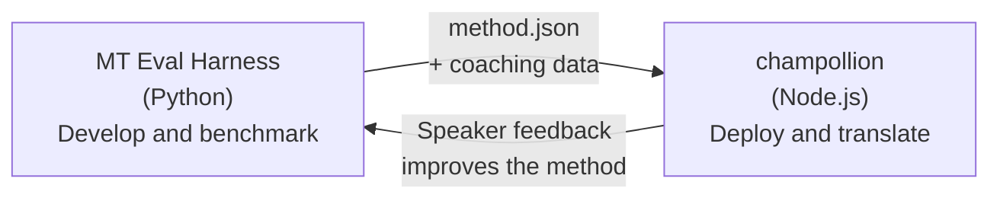

# جسر Eval Harness

يعد champollion و MT Eval Harness أداتين منفصلتين تشكلان نظاماً بيئياً واحداً. الـ harness هو المكان الذي يتم فيه **إثبات** طرق الترجمة. بينما Champollion هو المكان الذي يتم فيه **نشر** الطرق المُثبتة. ويتصلان ببعضهما من خلال تنسيق إضافات (plugin) مشترك.



## سير العمل: من البحث → إلى الإنتاج

### 1. بناء طريقة في الـ harness

أي فئة Python تنفذ `async translate(entries, config) → [{id, predicted}]` يمكن توصيلها بالـ harness. لا يهتم الـ harness بما يحدث بالداخل — سواء كان نموذج لغوي كبير (LLM) موجه، أو نموذج مدرب خصيصاً، أو قواعد حتمية، أو أي شيء آخر.

### 2. قياس الأداء (Benchmark)

يقوم الـ harness بتقييم طريقتك مقابل مجموعة نصوص موحدة باستخدام مقاييس قابلة لإعادة الإنتاج: chrF++، وقبول FST (للغات الغنية صرفياً)، والدقة الصرفية، والتقييم الدلالي.

### 3. التصدير كإضافة (Plugin)

عندما تصل طريقتك إلى جودة مقبولة، قم بحزمها كإضافة champollion — وهو ملف بيان (manifest) `method.json` مع بيانات توجيه (coaching data) اختيارية.

:::info[مخطط لإضافة واجهة سطر أوامر (CLI) للتصدير]
حالياً، تقوم بإنشاء ملف البيان method.json يدوياً. سيقوم الأمر `mt-eval export` بأتمتة ذلك. راجع [واجهة الطريقة](/docs/network/specifications/methods) للحصول على التنسيق الكامل للإضافة.
:::

### 4. التثبيت في champollion

```bash
champollion plugin install ./my-method-plugin/
```

### 5. ترجمة محتوى حقيقي

```bash
champollion sync
```

طريقتك التي تم قياس أدائها تنتج الآن ترجمات حقيقية في بيئة الإنتاج.

## سير العمل: من الإنتاج → إلى البحث

تتم مراجعة الترجمات المنشورة من قبل متحدثين ثنائيي اللغة. وتحدد ملاحظاتهم الأخطاء المنهجية (أنماط أزمنة خاطئة، مفردات مفقودة، صياغة غير طبيعية). يقوم الباحث بتحديث الطريقة في الـ harness، وإعادة قياس الأداء، وإعادة التصدير، وإعادة النشر. يتعلم النظام من الاستخدام.

## تنسيق الإضافة (Plugin Format)

يعد ملف البيان `method.json` بمثابة العقد بين الأداتين:

```json
{
  "name": "crk-coached-v3",
  "type": "llm-coached",
  "version": "3.0.0",
  "description": "Coached LLM translation for Plains Cree",
  "locales": ["crk"],
  "config": {
    "model": "google/gemini-3.5-flash",
    "temperature": 0.3
  },
  "benchmarks": {
    "crk": {
      "composite_score": 0.67,
      "fst_acceptance": 0.82,
      "corpus_size": 150
    }
  }
}
```

راجع [مواصفات الإضافة](/docs/reference/plugin-spec) للحصول على التنسيق الكامل.

## ما تم بناؤه مقابل ما هو مخطط له

| المكون (Component) | الحالة (Status) |
|-----------|--------|
| بروتوكول TranslationMethod | ✅ تم بناؤه |
| مشغل قياس الأداء Harness | ✅ تم بناؤه |
| تنسيق الإضافة method.json | ✅ تم بناؤه |
| `champollion plugin install/remove/list` | ✅ تم بناؤه |
| تحميل بيانات التوجيه (Coaching data) | ✅ تم بناؤه |
| واجهة سطر الأوامر `mt-eval export` | 🔲 مخطط له |
| واجهة مراجعة المجتمع | 🔲 مخطط له |
| تقييم مجموعة الاختبار المشفرة | 🔲 مخطط له |

## قراءات إضافية

- [طرق الترجمة](/docs/guides/translation-methods) — جميع الطرق المتاحة وكيفية عملها
- [مواصفات الإضافة](/docs/reference/plugin-spec) — تنسيق method.json
- [تقديم طريقة عبر واجهة برمجة التطبيقات (API)](/docs/guides/serving-a-method) — استضافة طريقة على جانب الخادم
- [سيادة البيانات](/docs/network/sovereignty/data-sovereignty) — مبادئ سيادة بيانات الشعوب الأصلية، وCARE، والحماية التشفيرية
- [لباحثي الترجمة الآلية (MT)](/docs/network/leaderboard/rules) — وثائق eval harness
