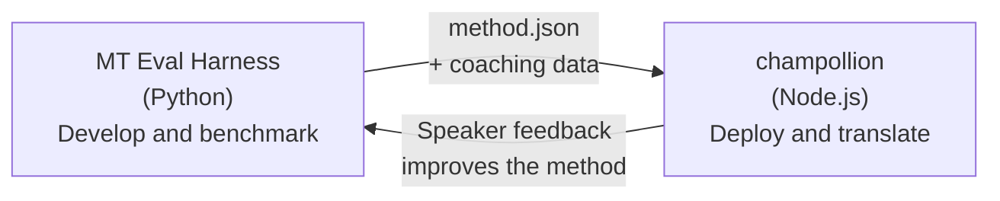

# جسر إطار عمل التقييم (Eval Harness)

يُعدّ كل من Champollion وMT Eval Harness أداتين منفصلتين تُشكّلان معًا منظومة بيئية متكاملة. إطار التقييم (harness) هو المكان الذي يتم فيه **إثبات كفاءة** أساليب الترجمة، بينما Champollion هو المكان الذي تُنشر فيه الأساليب المُثبتة في **بيئة الإنتاج**. وترتبط الأداتان معًا عبر تنسيق إضافة (plugin) مشترك.


```mermaid
graph LR
    H["MT Eval Harness\n(Python)\nDevelop and benchmark"] -->|"method.json\n+ coaching data"| R["champollion\n(Node.js)\nDeploy and translate"]
    R -->|"Speaker feedback\nimproves the method"| H
```

## مسار العمل: من البحث إلى الإنتاج

### 1. بناء أسلوب ترجمة في إطار التقييم

يمكن لأي فئة (class) في Python تُنفّذ `async translate(entries, config) → [{id, predicted}]` أن تتكامل مع إطار التقييم. ولا يهم الإطار ما يجري في الداخل — سواء كان نموذج لغوي كبير يعمل بالمطالبات (prompted LLM)، أو نموذجًا مُدرّبًا خصيصًا، أو قواعد حتمية، أو أي شيء آخر.

### 2. إجراء القياس المعياري

يُقيّم الإطار أسلوبك مقابل مدونة نصوص قياسية باستخدام مقاييس قابلة لإعادة الإنتاج: chrF++‎، وقبول محولات الحالات المحدودة (FST) (للغات الغنية صرفيًا)، والدقة الصرفية، والتقييم الدلالي.

### 3. التصدير كإضافة

عندما يصل أسلوبك إلى جودة مقبولة، قم بحزمه كإضافة لـ Champollion — وهو عبارة عن بيان (manifest) `method.json` مع بيانات توجيهية اختيارية.

:::info[واجهة سطر الأوامر للتصدير قيد التخطيط]
حاليًا، تقوم بإنشاء بيان method.json يدويًا. وسيعمل الأمر `mt-eval export` على أتمتة ذلك. راجع [واجهة أسلوب الترجمة](/docs/network/specifications/methods) للاطلاع على تنسيق الإضافة بالكامل.
:::

### 4. التثبيت في Champollion

```bash
champollion plugin install ./my-method-plugin/
```

### 5. ترجمة محتوى حقيقي

```bash
champollion sync
```

يُنتج أسلوبك الذي تم قياسه معياريًا الآن ترجمات حقيقية في بيئة الإنتاج.

## مسار العمل: من الإنتاج إلى البحث

تتم مراجعة الترجمات المنشورة بواسطة متحدثين ثنائيي اللغة. وتُحدّد ملاحظاتهم الأخطاء المنهجية (أنماط أزمنة غير صحيحة، مفردات مفقودة، صياغة غير طبيعية). يقوم الباحث بتحديث الأسلوب في إطار التقييم، وإعادة القياس المعياري، وإعادة التصدير، ثم إعادة النشر. وهكذا يتعلم النظام من الاستخدام الفعلي.

## تنسيق الإضافة

يُمثّل بيان `method.json` العقد المبرم بين الأداتين:

```json
{
  "name": "french-formal-v1",
  "type": "llm-coached",
  "version": "1.0.0",
  "description": "Formal-register French (example manifest; the benchmark values are illustrative)",
  "locales": ["fr"],
  "config": {
    "model": "google/gemini-3.8-flash",
    "temperature": 0.3
  },
  "benchmarks": {
    "fr": {
      "corpus_chrf": 72.3,
      "exact_match_rate": 0.42,
      "corpus_size": 500
    }
  }
}
```

راجع [مواصفات الإضافة](/docs/reference/plugin-spec) للاطلاع على التنسيق بالكامل.

## ما تم بناؤه مقابل ما هو مُخطّط له

| المكوّن | الحالة |
|-----------|--------|
| بروتوكول TranslationMethod | ✅ تم البناء |
| أداة تشغيل القياس المعياري للإطار | ✅ تم البناء |
| تنسيق الإضافة method.json | ✅ تم البناء |
| `champollion plugin install/remove/list` | ✅ تم البناء |
| تحميل بيانات التوجيه | ✅ تم البناء |
| واجهة سطر الأوامر `mt-eval export` | 🔲 مُخطَّط له |
| واجهة مراجعة المجتمع | 🔲 مُخطَّط له |
| تقييم مجموعة الاختبارات المشفّرة | 🔲 مُخطَّط له |

## قراءات إضافية

- [أساليب الترجمة](/docs/guides/translation-methods) — جميع الأساليب المتاحة وكيفية عملها
- [مواصفات الإضافة](/docs/reference/plugin-spec) — تنسيق method.json
- [تقديم أسلوب عبر واجهة برمجة التطبيقات (API)](/docs/guides/serving-a-method) — استضافة أسلوب ترجمة من جانب الخادم
- [سيادة البيانات](/docs/network/sovereignty/data-sovereignty) — مبادئ سيادة بيانات الشعوب الأصلية، ومبادئ CARE، والحماية التشفيرية
- [لباحثي الترجمة الآلية](/docs/network/leaderboard/rules) — وثائق إطار عمل التقييم (eval harness)
