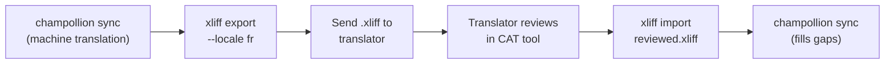

# العمل مع المترجمين المحترفين

يولد Champollion ترجمات آلية، لكن بعض المشاريع تحتاج إلى مراجعة بشرية — مثل المحتوى التنظيمي، أو النصوص الحساسة لهوية العلامة التجارية، أو واجهات المستخدم ذات الأهمية البالغة. يتيح لك سير عمل XLIFF تصدير الترجمات للمراجعة المهنية وإعادة استيرادها بسلاسة.

يغطي XLIFF **ملفات النصوص (strings)** الخاصة بتطبيقك (المفاتيح والقيم). أما محتوى **Markdown** المترجم (النشرات الإخبارية، ومشاركات المدونة، وصفحات التوثيق) فتتم مراجعته بشكل مختلف: يقوم المراجع بتحرير ملف `.md` المترجم مباشرةً، وتحتفظ المزامنة بتلك التعديلات. انظر [مراجعة Markdown المترجم](#reviewing-translated-markdown) أدناه.

## ما هو XLIFF؟

يُعد تنسيق XLIFF (XML Localization Interchange File Format) هو التنسيق القياسي المعتمد في الصناعة للتبادل بين أدوات الترجمة. وتدعمه جميع أدوات CAT (الترجمة بمساعدة الحاسوب) الاحترافية:

- **memoQ** — استيراد XLIFF، والمراجعة ضمن السياق، وتصدير الملف بعد مراجعته
- **SDL Trados Studio** — دعم أصلي لـ XLIFF
- **Phrase (Memsource)** — رفع مهام XLIFF لفرق المترجمين
- **Smartling** — مسار استيعاب ملفات XLIFF
- **OmegaT** — أداة CAT مجانية ومفتوحة المصدر تدعم XLIFF

يولد Champollion ملفات XLIFF 1.2 (الإصدار المدعوم عالميًا) بدلاً من 2.0+ لتحقيق أقصى قدر من التوافق مع الأدوات.

## سير العمل



### الخطوة 1: توليد الترجمات الآلية

شغّل `sync` أولاً للحصول على ترجمة آلية أساسية:

```bash
champollion sync
```

### الخطوة 2: تصدير XLIFF

صدّر زوج المصدر + الهدف كملف XLIFF:

```bash
champollion xliff export --locale fr
```

يكتب هذا الأمر الملف `.champollion/xliff/fr.xliff` متضمنًا:
- كل مفتاح مصدر مع قيمته باللغة الإنجليزية
- الترجمة الآلية الحالية (إن وجدت) كـ `<target>`
- المفاتيح التي ليس لها ترجمات تُميّز بعلامة `state="new"`

```xml
<trans-unit id="hero.title" xml:space="preserve">
  <source>Welcome to our platform</source>
  <target state="translated">Bienvenue sur notre plateforme</target>
</trans-unit>
```

### الخطوة 3: الإرسال إلى المترجم

أرسل ملف `.xliff` إلى المترجم أو ارفعه إلى منصة CAT الخاصة بك. يرى المترجم المصدر والهدف جنبًا إلى جنب، ويمكنه:

- تعديل الترجمات الآلية
- إكمال الترجمات المفقودة
- الإبلاغ عن مشكلات الجودة
- تطبيق ذاكرة الترجمة وقواعد المصطلحات الخاصة به

### الخطوة 4: استيراد الملف بعد مراجعته

عندما يُعيد المترجم ملف `.xliff` بعد مراجعته، قم باستيراده:

```bash
# Preview what will change
champollion xliff import .champollion/xliff/fr.xliff --dry

# Apply changes
champollion xliff import .champollion/xliff/fr.xliff
```

المخرجات:
```
  ✓ Imported 142 translations for fr
    Updated:    23 (changed from existing)
    Added:      0 (new keys)
    Unchanged:  119
    Written to: locales/fr.json
```

### الخطوة 5: سد الثغرات

إذا تمت إضافة مفاتيح جديدة بعد تصدير XLIFF، فشغّل `sync` لترجمتها:

```bash
champollion sync
```

يترجم Champollion المفاتيح التي لا تزال مفقودة فقط — مع الاحتفاظ بالترجمات المُراجَعة المستوردة من XLIFF.

## نصائح

### تصدير مسارات مخصصة

```bash
# Export to a specific directory
champollion xliff export --locale ja --out ./for-review/

# Export with a specific filename
champollion xliff export --locale de --out ./review/german.xliff
```

### لغات متعددة (Locales)

صدّر كل لغة (locale) على حدة:

```bash
for locale in fr de ja ko; do
  champollion xliff export --locale $locale
done
```

### نظام التحكم بالإصدارات

أضف `.champollion/xliff/` إلى `.gitignore` — فملفات XLIFF هي ملفات ناتجة عابرة، وليست من الملفات المصدرية للمشروع:

```gitignore
.champollion/xliff/
```

### متى تستخدم XLIFF مقابل الاكتفاء بـ `sync`

| السيناريو | التوصية |
|----------|---------------|
| تطبيق داخلي، جودة أعلى من 90% مقبولة | الاكتفاء بـ `sync` — الترجمة الآلية كافية |
| نصوص تسويقية موجهة للمستخدمين | تصدير XLIFF للمراجعة البشرية |
| محتوى قانوني / تنظيمي | تصدير XLIFF — المراجعة البشرية مطلوبة |
| أكثر من 50 لغة (locale)، مع موعد نهائي ضيق | `sync` أولاً، ثم تصدير XLIFF لأهم 5 لغات فقط |
| المترجم يستخدم أداة CAT بالفعل | XLIFF هو التنسيق الطبيعي للتسليم |

## تحرير الترجمات في ملفات اللغات (Locale Files) {#editing-key-value-files}

يمكن للمراجع أيضًا تصحيح ترجمة مباشرةً داخل ملف لغة (`messages/fr.json`، `locale/fr/LC_MESSAGES/django.po`، `app_fr.arb`، …) وتثبيتها في git (commit). يُسجل Champollion في `.champollion.lock` بصمة لكل قيمة يكتبها. وأي قيمة لم تعد تطابق بصمتها تُعتبر قد غُيرت بواسطة شخص، وتتعامل معها المزامنة على أنها ملك له:

| الأمر المُشغَّل | ماذا يحدث للقيمة المُعدَّلة |
|-----------|----------------------------------|
| تشغيل `sync` عادي، مع بقاء الإنجليزية دون تغيير | تبقى دون مساس (كما في السابق). |
| `sync --redo all` / `--force`، أو تبديل النموذج (`--redo all --fresh-on-model-change`)، أو إعادة محاولة المفاتيح التي تركتها إعادة التنفيذ معلقة | **يُحتفظ بها.** يوضح التشغيل عدد القيم التي تم الاحتفاظ بها وما هي، وكيفية استبدال إحداها: `--redo keys:<key>`. |
| `sync --redo keys:<key>` مع تحديد المفتاح بالاسم | تُستبدل — لأنك طلبت ذلك المفتاح بالاسم. وتُطبع الصياغة المُعدلة أولاً. |
| **تغيّر المصدر الإنجليزي لذلك المفتاح** | تُترجم مجددًا (فالتعديل كان للنص القديم). تُطبع الصياغة المُعدلة حتى يتسنى إعادة تطبيقها، وتُلحق بملف `.champollion-replaced-edits.jsonl` في جذر المشروع. |

ملف `.champollion-replaced-edits.jsonl` هو ملف مُتتبَّع بجوار ملف القفل (مجلد التخزين المؤقت `.champollion/` خاص بكل جهاز ويتجاهله git): يحتوي على سطر JSON واحد لكل تعديل تم استبداله، متضمنًا اللغة (locale)، والملف، والمفتاح، والصياغة المُعدّلة، وسبب استبدالها، والنص المصدري الجديد. قم بتثبيته (commit) مع ملف القفل — فهو النسخة الوحيدة لتلك الصياغة. ويوضح `champollion status` عدد التعديلات التي يحتويها.

القيم المكتوبة قبل وجود هذا السجل، أو بواسطة أداة أخرى، لا تمتلك بصمة. ولا تُحسب هذه القيمة تابعة لـ Champollion إلا إذا احتوت ذاكرة التخزين المؤقت للترجمة على النص نفسه تمامًا لذلك المفتاح؛ وبخلاف ذلك تُعامل على أنها عمل شخص ويتم الاحتفاظ بها في عمليات إعادة التنفيذ الجماعية (يذكر التشغيل أسماءها كقيم ليس لديه سجل بكتابتها). تُعد القيم المستوردة عبر `champollion xliff import` عملاً بشريًا ويُحتفظ بها بالطريقة نفسها.

## مراجعة Markdown المترجم {#reviewing-translated-markdown}

ملفات المحتوى الناتجة عن `contentDir` (على سبيل المثال `newsletters/2026-10.md` → `newsletters/2026-10.crk.md`) لا يتوفر لها تصدير XLIFF. ويعمل المراجع في الملف المترجم نفسه:

1. شغّل `champollion sync` وثبّت الترجمات (commit) مع `.champollion-content.lock`.
2. يُحرر المراجع الملف المترجم، سواء أكان فقرة أو حقل front-matter مترجم مثل `title`، ويقوم بتثبيته (commit).
3. في عمليات المزامنة اللاحقة، يُحتفظ بهذه التعديلات. وإذا تغيّر المصدر الإنجليزي في فقرات أخرى، تظل فقرات المراجع كما هي نصًا ويقتصر الترجمة على الفقرات التي تغيرت فقط. ويطبع التشغيل `kept the edits made by hand to …`.

هناك استثناءان، وتُحذّر المزامنة بشأنهما معًا. إذا تغيّرت الفقرة الإنجليزية التي صححها المراجع أيضًا، فتُترجم تلك الفقرة مجددًا وتُطبع صياغة المراجع حتى يتسنى إعادة تطبيقها. وإذا أضاف المراجع فقرات أو أزالها ثم تغيّر المصدر، يُترك الملف كما هو، ويُدرج في كل مزامنة، إلى أن يُحدّثه شخص ما يدويًا.

للتراجع عن التعديلات والعودة إلى الترجمة الآلية، حدد اسم الملف: `champollion sync --redo files:2026-10.md`. القواعد الكاملة موجودة في [ترجمة المحتوى](/docs/guides/content-translation#reviewing-and-editing-translations).

---

## انظر أيضًا

- [مرجع CLI — xliff](/docs/reference/cli#xliff) — مرجع الأوامر
- [ذاكرة الترجمة](/docs/concepts/translation-memory) — التخزين المؤقت للترجمات المُراجَعة
- [طرق الترجمة](/docs/guides/translation-methods) — خيارات الترجمة الآلية
- [ترجمة المحتوى](/docs/guides/content-translation) — ترجمة Markdown، وكيفية الاحتفاظ بتعديلات المراجعين
- [بوابة الجودة](/docs/concepts/quality-gate#refused-keys-are-held-back) — المفاتيح التي رفضتها البوابة، والمفاتيح التي تركتها إعادة التنفيذ معلقة
