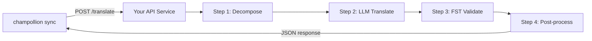

# تقديم طريقة مخصصة كواجهة برمجة تطبيقات (API)

تتيح لك **طريقة `api`** في champollion توجيه أي زوج ترجمة إلى نقطة نهاية HTTP خارجية. هذه هي الطريقة التي تدمج بها مسارات العمل (pipelines) المعقدة جداً بحيث لا يمكن تنفيذها عبر موجه (prompt) نموذج لغوي كبير (LLM) واحد — مثل المحللات الصرفية، أو محولات الحالة المحدودة (FSTs)، أو سلاسل النماذج اللغوية الكبيرة متعددة الخطوات، أو أي طريقة بحث مخصصة قمت ببنائها.

هناك طريقتان لإعداد نقطة النهاية هذه:

1. **`champollion serve`** — أمر واحد يقدم الحزمة المكونة لمشروع champollion الحالي الخاص بك (الطريقة، السجلات، التوجيه، ذاكرة الترجمة، بوابة الجودة) خلف هذا العقد. بدون كتابة أي كود خادم. راجع [مسار انعدام الكود](#the-zero-code-path-champollion-serve).
2. **خدمة مخصصة** — اكتب خادم HTTP الخاص بك الذي ينفذ العقد، لمسارات العمل التي تعيش خارج champollion بالكامل.

## لماذا خدمة واجهة برمجة التطبيقات (API)؟

لا يمكن تشغيل بعض مسارات الترجمة داخل دورة بسيطة من الموجه والاستجابة:

| خطوة مسار العمل | مثال |
|---|---|
| **التحليل الصرفي (Morphological decomposition)** | تقسيم الكلمات متعددة التركيب إلى مقاطع صرفية (morphemes) قبل الترجمة |
| **التحقق باستخدام FST** | رفض المخرجات التي تنتهك القواعد الصوتية أو الصرفية |
| **سلاسل LLM متعددة الخطوات** | دورات التوليد → التحقق → التصحيح باستخدام نماذج مختلفة |
| **البحث في القاموس** | الإسناد الترافقي لقاموس ثنائي اللغة منقح في منتصف مسار العمل |
| **التدخل البشري (Human-in-the-loop)** | وضع الترجمات غير المؤكدة في قائمة انتظار لمراجعة الخبراء |

تتعامل طريقة `api` مع مسار العمل الخاص بك كصندوق أسود — يرسل champollion السلاسل النصية المصدر، وتعيد خدمتك الترجمات. ما يحدث بالداخل متروك لك تماماً.

## البنية



## مسار انعدام الكود: `champollion serve`

إذا كان مسار العمل الخاص بك هو بالفعل مشروع champollion — طريقة مكونة (LLM، أو موجهة، أو محرك)، وسجلات، وملفات توجيه، وذاكرة ترجمة، وبوابة جودة حتمية — فلن تحتاج إلى كتابة خادم على الإطلاق. يقوم `champollion serve` بإعداد **الحزمة المكونة الخاصة بك** خلف العقد الدقيق الموضح أدناه:

```bash
# Owner side — run from the project whose champollion.config.json defines the stack
CHAMPOLLION_SERVE_TOKEN=$(openssl rand -hex 24) npx champollion serve
# [OK] champollion serve listening on http://127.0.0.1:1822/translate
```

يمر كل طلب عبر نفس مسار العمل الذي يستخدمه `champollion sync`:

- **ذاكرة الترجمة (Translation Memory)** — يتم تقديم السلاسل النصية التي تحتفظ بها ذاكرة الترجمة بالفعل من ذاكرة التخزين المؤقت مجاناً، دون المساس بمزود الخدمة الأساسي (upstream provider). يتم تخزين نتائج واجهة برمجة التطبيقات (API) التي تم التحقق من صحتها عبر البوابة مؤقتاً للطلب التالي.
- **بوابة الجودة (Quality gate)** — يتم التحقق من صحة كل استجابة بشكل حتمي (التكرار، نسبة الطول، التوافق مع نظام الكتابة، صدى المصدر). تعود الإخفاقات كأخطاء مهيكلة لكل مفتاح (HTTP 207/422) — ولا تعود أبداً كمخرجات متدهورة بصمت.
- **حارس التكلفة (Cost guard)** — يرفض `--max-cost-per-request` و `--max-session-cost` الطلبات التي تتجاوز تكلفتها الأساسية *المقدرة* الحدود القصوى الخاصة بك، قبل إجراء أي استدعاء للمزود. يتم أيضاً رفض الطرق ذات التسعير غير المعروف بموجب الحد الأقصى: غير المعروف ليس مجانياً. الطلبات المغطاة بذاكرة الترجمة (TM) تكلفتها معروفة وهي 0 دولار وتمر دائماً.

يرتبط الخادم بـ `127.0.0.1` افتراضياً: يمكن لأي شخص يمكنه الوصول إلى المنفذ إنفاق ميزانية واجهة برمجة التطبيقات (API) الأساسية الخاصة بك، لذا فإن كشفه هو قرار صريح — `--bind 0.0.0.0` بالإضافة إلى رمز حامل (bearer token) قوي. يتم قبول `--no-auth` فقط مع ارتباط استرجاعي (loopback bind). يتم تشغيل حد معدل الطلبات لكل عنوان IP وحد أقصى لحجم الطلب افتراضياً؛ راجع `champollion serve --help`.

### توجيه مستهلك إليه

إصدار بيان الإضافة (plugin manifest) الذي يقوم المستهلكون بتثبيته (أمر واحد على كل جانب):

```bash
# Owner side
champollion serve --emit-manifest --endpoint https://translate.example.org
# [OK] Wrote ./my-project-serve/method.json
```

```bash
# Consumer side
champollion plugin install ./my-project-serve
```

```json title="champollion.config.json (consumer)"
{
  "pairs": {
    "en:crk": { "methodPlugin": "my-project-serve" }
  }
}
```

```bash
CHAMPOLLION_API_KEY=<the server's bearer token> champollion sync
```

تقوم طريقة `api` الخاصة بالمستهلك بإرسال (POST) السلاسل النصية المصدر إلى خادمك؛ وتقوم حزمتك بالترجمة، والتحقق عبر البوابة، والتخزين المؤقت؛ ويعد `qualityTier` الخاص بالبيان تمريراً صادقاً للأزواج المكونة الخاصة بك (الطبقة الأكثر تحفظاً عندما تختلف). لا تغادر موجهاتك، وبيانات التوجيه، ومفاتيح المزود جهازك أبداً.

يغطي باقي هذا الدليل كتابة خدمة **مخصصة** — وهو أمر مفيد عندما لا يكون مسار العمل الخاص بك مشروع champollion (سلسلة FST بلغة Python، أو نظام بحث مخصص). عقد الاتصال (wire contract) متطابق في كلتا الحالتين.

## إعداد خدمتك

يجب أن تنفذ خدمة واجهة برمجة التطبيقات (API) الخاصة بك نقطة نهاية واحدة تقبل وتعيد بيانات بتنسيق JSON:

### تنسيق الطلب

يرسل champollion هيكل JSON هذا بالضبط (راجع [api.js](https://github.com/gamedaysuits/Champollion/blob/main/cli/lib/methods/api.js)):

```json
POST /translate
Content-Type: application/json
Authorization: Bearer <CHAMPOLLION_API_KEY>

{
  "source_locale": "en",
  "target_locale": "crk",
  "method": "crk-coached-v1",
  "keys": {
    "greeting": "Hello, welcome to our app",
    "farewell": "Goodbye and thanks"
  }
}
```

| الحقل | النوع | الوصف |
|-------|------|-------------|
| `source_locale` | string | رمز لغة المصدر وفقاً لمعيار BCP 47 |
| `target_locale` | string | رمز اللغة الهدف وفقاً لمعيار BCP 47 |
| `method` | string | اسم الإضافة أو `"default"` |
| `keys` | object | خريطة للمفتاح → السلسلة النصية المصدر المراد ترجمتها |
```

### Response Format

Your service must return a `translations` object. An optional `meta` object can include cost and diagnostic info:

```json
{
  "translations": {
    "greeting": "tânisi, pê-kîwêw ôta",
    "farewell": "ekosi mâka, kinanâskomitin"
  },
  "meta": {
    "model": "my-custom-pipeline/v1",
    "cost_usd": 0.0042,
    "method": "decompose-translate-validate"
  }
}
```

| Field | Type | Required | Description |
|-------|------|----------|-------------|
| `translations` | object | ✅ | Map of key → translated string |
| `meta` | object | — | Optional metadata |
| `meta.cost_usd` | number | — | If present, displayed in champollion's output |
| `errors` | object | — | For partial success (HTTP 207): map of key → `{ message }` |

### Minimal Express Server

```javascript
import express from 'express';

const app = express();
app.use(express.json());

/**
 * عقد واجهة برمجة تطبيقات (API) لـ champollion:
 *
 * الطلب:  { source_locale, target_locale, method, keys: { "key": "source" } }
 * الاستجابة: { translations: { "key": "translated" }, meta: { ... } }
 */
app.post('/translate', async (req, res) => {
  const { source_locale, target_locale, method, keys } = req.body;

  const translations = {};

  for (const [key, source] of Object.entries(keys)) {
    // --- مسار العمل الخاص بك يوضع هنا ---
    // الخطوة 1: التحليل الصرفي
    const morphemes = await decompose(source, source_locale);

    // الخطوة 2: الترجمة باستخدام LLM مع السياق
    const draft = await llmTranslate(morphemes, target_locale);

    // الخطوة 3: التحقق باستخدام FST
    const validated = await fstValidate(draft, target_locale);

    // الخطوة 4: المعالجة اللاحقة (توحيد الإملاء، إلخ.)
    translations[key] = await postProcess(validated);
  }

  res.json({
    translations,
    meta: {
      model: 'my-custom-pipeline/v1',
      method: 'decompose-translate-validate',
    },
  });
});

app.listen(3001, () => {
  console.log('Translation API running on http://localhost:3001');
});
```

## Configuring champollion

Point a translation pair at your running service in `champollion.config.json`:

```json
{
  "inputLocale": "en",
  "pairs": {
    "en:crk": {
      "method": "api",
      "endpoint": "http://localhost:3001/translate",
      "register": "Formal Plains Cree. Use SRO orthography."
    }
  }
}
```

Then run sync as usual:

```bash
npx champollion sync
```

champollion will POST your source strings to the endpoint and write the returned translations to `crk.json`.

## Case Study: Plains Cree Pipeline

:::info[Under Development]
The Plains Cree pipeline described below is **under active development** and is not yet running in production. Details here reflect the current design direction and may change as the project evolves.
:::

The **arena** project demonstrates this pattern. Its Plains Cree pipeline uses:

1. **Morphological decomposition** — Break polysynthetic Cree words into translatable morpheme chains
2. **LLM translation** — Context-enriched GPT-4o translation with coaching data (SRO orthography rules, register instructions)
3. **FST validation** — Finite-state transducer checks that outputs conform to Cree phonological rules
4. **Confidence scoring** — Each translation gets a confidence score based on FST pass rate and dictionary coverage

The entire pipeline runs as a single HTTP endpoint that champollion calls via the `api` method.

### Running Evaluations

After translating, you can evaluate output quality using the harness directly:

```bash
# استنساخ بيئة الاختبار (harness)
git clone https://github.com/gamedaysuits/Champollion.git
cd Champollion/arena
pip install -e .

# تشغيل التقييم مقابل مجموعة نصوص (corpus) حقيقية غير مدمجة
mt-eval run --corpus eval-amh-fra-globalvoices-test-v1 --model gemini-pro --yes
```

This produces structured evaluation records with chrF++, BLEU, and exact match scores that can be used as regression baselines.

## Authentication

If your API requires authentication, set the `apiKey` field or use an environment variable:

```json
{
  "pairs": {
    "en:crk": {
      "method": "api",
      "endpoint": "https://my-mt-service.example.com/translate",
      "apiKey": "${CRK_API_KEY}"
    }
  }
}
```

## Data Sovereignty

The `api` method is particularly important for **Indigenous language communities**. By self-hosting the translation pipeline, a community keeps full control over:

- **Proprietary coaching data** — register instructions, orthography rules, and domain glossaries never leave community infrastructure.
- **Linguistic resources** — curated dictionaries, FST grammars, and elder-verified translations remain under community ownership.
- **Access policies** — the community decides who can call the endpoint and under what terms.

This design follows the direction of [Indigenous data-sovereignty principles](/docs/network/community/low-resource-languages#data-sovereignty-principles) — community ownership and control of language data: sensitive language data stays governed by the community rather than a third-party platform.

:::tip
Combine the `api` method with a private deployment (e.g., a community-hosted VM or on-prem server) for the strongest data-sovereignty posture. `champollion serve` gives a community exactly this self-hosting posture without writing any server code — coaching data, provider keys, and the Translation Memory all stay on community infrastructure. See [Support a Low-Resource Language](/docs/network/community/low-resource-languages) for a full walkthrough.
:::

## Cost Estimation

The `api` method returns `null` for cost estimation by default — your service controls pricing. If you want to provide cost transparency, have your API return a `cost` field in the metadata:

```json
{
  "translations": { "...": "..." },
  "metadata": {
    "cost": {
      "estimatedCost": 0.0042,
      "currency": "USD",
      "source": "my-service-pricing"
    }
  }
}
```

## أفضل الممارسات

1. **إرجاع سلاسل نصية فارغة عند الفشل** — لا تقم بإرجاع السلسلة النصية المصدر كـ "ترجمة". قم بإرجاع `""` وستلتقطها بوابة الجودة الخاصة بـ champollion. سيتم تخطي المفتاح وإعادة المحاولة في المزامنة التالية.
2. **تضمين درجات الثقة (confidence scores)** — إذا كان مسار العمل الخاص بك يمكنه تقدير الجودة، فقم بإرجاعها في البيانات الوصفية (metadata). يساعد هذا في تدقيق الجودة.
3. **تنفيذ فحوصات السلامة (health checks)** — أضف نقطة نهاية `GET /health` حتى يتمكن champollion من التحقق من الاتصال قبل بدء مزامنة كبيرة.
4. **تحديد معدل الطلبات بسلاسة** — إذا كان مسار العمل الخاص بك يحتوي على حدود للإنتاجية، فقم بإرجاع رموز الحالة `429`. سيتراجع نظام الدفعات (batch system) في champollion.
5. **تسجيل كل شيء (Log everything)** — يمكن أن تفشل مسارات العمل متعددة الخطوات بصمت. قم بتسجيل المدخلات/المخرجات لكل خطوة لأغراض تصحيح الأخطاء.

## الترخيص

نمط طريقة `api` مفتوح بالكامل — لا توجد قيود ترخيص على تغليف مسار الترجمة الخاص بك كخدمة HTTP. بيئة التقييم (eval harness) `arena` مرخصة بموجب AGPL-3.0-or-later (مع استثناء §7 eval-standard-plugin)؛ يمكنك دراستها والبناء عليها بموجب هذه الشروط.

## انظر أيضًا

- [طرق الترجمة](/docs/guides/translation-methods) — نظرة عامة على كل طريقة مدمجة (`openai`، `google`، `api`، إلخ.)
- [مواصفات الإضافة](/docs/reference/plugin-spec) — المخطط الكامل لـ `champollion.config.json` بما في ذلك حقول طريقة `api`
- [دعم لغة منخفضة الموارد](/docs/network/community/low-resource-languages) — دليل شامل للغات ذات الموارد المحدودة، بما في ذلك مبادئ سيادة البيانات
- [البنية (Architecture)](/docs/concepts/architecture) — كيف تعمل حلقة المزامنة، ونظام الدفعات، وتوجيه الطرق في champollion
- [تقييم الترجمة الآلية (MT Evaluation)](/docs/network/leaderboard/rules) — منهجية التقييم، والمقاييس، وعملية التقديم للوحة المتصدرين
- [لوحة متصدري الطرق](/leaderboard) — تصنيفات الجودة المباشرة عبر الطرق وأزواج اللغات

