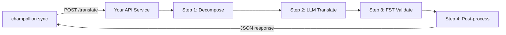

# تقديم طريقة مخصصة كواجهة برمجة تطبيقات (API)

تتيح لك **طريقة `api`** في champollion توجيه أي زوج ترجمة إلى نقطة نهاية HTTP خارجية. وهذه هي الطريقة التي تدمج بها خطوط المعالجة شديدة التعقيد بالنسبة لموجه LLM واحد — مثل المحللات الصرفية، ومحولات الحالات المحدودة (FSTs)، وسلاسل LLM متعددة الخطوات، أو أي طريقة بحثية مخصصة قمت ببنائها.

هناك طريقتان لإنشاء نقطة نهاية كهذه:

1. **`champollion serve`** — أمر واحد يقدم الحزمة المضبوطة في مشروع champollion الحالي لديك (الطريقة، والسجلات اللغوية، والتوجيه، وذاكرة الترجمة، وبوابة الجودة) خلف هذا العقد البرمجي. دون الحاجة لأي كود خادم. راجع [مسار العمل بدون كود](#the-zero-code-path-champollion-serve).
2. **خدمة مخصصة** — كتابة خادم HTTP خاص بك يطبق هذا العقد البرمجي، وذلك لخطوط المعالجة التي تعمل خارج champollion تماماً.

## لماذا نستخدم خدمة API؟

لا يمكن لبعض خطوط معالجة الترجمة أن تعمل ضمن دورة بسيطة من الطلب والاستجابة (prompt-response):

| خطوة خط المعالجة | مثال |
|---|---|
| **التحليل الصرفي** | تقسيم الكلمات متعددة التركيب إلى وحدات صرفية (مورفيمات) قبل الترجمة |
| **التحقق عبر FST** | رفض المخرجات التي تنتهك القواعد الصوتية أو الصرفية |
| **سلاسل LLM متعددة الخطوات** | دورات توليد ← تحقق ← تصحيح باستخدام نماذج مختلفة |
| **البحث في المعاجم** | مطابقة معجم ثنائي اللغة منقح أثناء خط المعالجة |
| **المراجعة البشرية (Human-in-the-loop)** | وضع الترجمات غير المؤكدة في قائمة انتظار لمراجعة الخبراء |

تتعامل طريقة `api` مع خط المعالجة الخاص بك كصندوق أسود — يرسل champollion النصوص المصدرية، وتُرجع خدمتك الترجمات. وما يحدث في الداخل متروك لك بالكامل.

## البنية المعمارية


```mermaid
graph LR
    A[champollion sync] -->|POST /translate| B[Your API Service]
    B --> C[Step 1: Decompose]
    C --> D[Step 2: LLM Translate]
    D --> E[Step 3: FST Validate]
    E --> F[Step 4: Post-process]
    F -->|JSON response| A
```

## مسار العمل بدون كود: `champollion serve`

إذا كان خط المعالجة لديك مشروع champollion بالفعل — طريقة مضبوطة (LLM، أو coached، أو محرك ترجمة)، وسجلات لغوية، وملفات توجيه، وذاكرة الترجمة (Translation Memory)، وبوابة الجودة الحتمية — فلن تحتاج إلى كتابة خادم على الإطلاق. يقوم `champollion serve` بتشغيل **حزمتك المضبوطة ذاتها** خلف العقد البرمجي الدقيق الموضح أدناه:

```bash
# Owner side — run from the project whose champollion.config.json defines the stack
CHAMPOLLION_SERVE_TOKEN=$(openssl rand -hex 24) npx champollion serve
# [OK] champollion serve listening on http://127.0.0.1:1822/translate
```

يمر كل طلب عبر خط المعالجة نفسه الذي يستخدمه `champollion sync`:

- **ذاكرة الترجمة (Translation Memory)** — النصوص الموجودة بالفعل في ذاكرة الترجمة تُقدَّم من التخزين المؤقت مجاناً، دون الاتصال بمزودك الرئيسي. تُخزَّن نتائج API التي تم التحقق منها عبر البوابة مؤقتاً للطلب التالي.
- **بوابة الجودة (Quality gate)** — يتم التحقق من كل استجابة بشكل حتمي (التكرار، ونسبة الطول، والامتثال لنظام الكتابة، وتكرار النص المصدر). وتعود حالات الفشل كأخطاء مهيكلة لكل مفتاح على حدة (HTTP 207/422) — وليس كمخرجات متدهورة في صمت أبداً.
- **حماية التكلفة (Cost guard)** — يرفض `--max-cost-per-request` و`--max-session-cost` الطلبات التي تتجاوز تكلفتها التقديرية لدى المزود *الحدود القصوى* التي وضعتها، وذلك قبل إجراء أي اتصال بالمزود. كما تُرفض الطرق ذات التسعير غير المعروف في ظل وجود حد أقصى: فغير المعروف ليس مجانياً. أما الطلبات المغطاة بذاكرة الترجمة فتبلغ تكلفتها المعروفة 0 دولار وتمر دائماً.

يرتبط الخادم بـ `127.0.0.1` افتراضياً: يمكن لأي شخص يستطيع الوصول إلى المنفذ استهلاك ميزانية API الخاصة بك لدى المزود الرئيسي، لذا فإن إتاحته علناً هو قرار صريح — `--bind 0.0.0.0` بالإضافة إلى رمز حامل (bearer token) قوي. لا يُقبل `--no-auth` إلا مع الارتباط بعنوان الاسترجاع المحلي (loopback). يتم تفعيل حد معدل الطلبات لكل عنوان IP وحد أقصى لحجم الطلب افتراضياً؛ راجع `champollion serve --help`.

### توجيه مستهلك نحو الخدمة

قم بإنشاء بيان الملحق (plugin manifest) الذي يثبته المستهلكون (أمر واحد على كل جانب):

```bash
# Owner side
champollion serve --emit-manifest --endpoint https://translate.example.org
# [OK] Wrote ./my-project-serve/method.json
```

```bash
# Consumer side
champollion plugin install ./my-project-serve
```

```json title="champollion.config.json (consumer)"
{
  "pairs": {
    "en:crk": { "methodPlugin": "my-project-serve" }
  }
}
```

```bash
CHAMPOLLION_API_KEY=<the server's bearer token> champollion sync
```

تقوم طريقة `api` لدى المستهلك بإرسال طلبات POST بالنصوص المصدرية إلى خادمك؛ حيث تقوم حزمتك بالترجمة، والتحقق عبر البوابة، والتخزين المؤقت؛ ويكون `qualityTier` الخاص بالبيان نقلاً صادقاً للأزواج اللغوية المضبوطة لديك (المستوى الأكثر تحفظاً عند وجود اختلاف). لا تغادر موجهاتك، وبيانات التوجيه، ومفاتيح المزود جهازك أبداً.

يغطي باقي هذا الدليل كتابة خدمة **مخصصة** — وهو أمر مفيد عندما لا يكون خط المعالجة لديك مشروع champollion (مثل سلسلة FST بلغة Python، أو نظام بحثي مخصص). ويكون عقد الاتصال البرمجي متطابقاً في الحالتين.

## إعداد خدمتك

يجب أن تطبق خدمة API الخاصة بك نقطة نهاية واحدة تستقبل وترجع بيانات بتنسيق JSON:

### صيغة الطلب

يرسل champollion نص JSON هذا تماماً (راجع [api.js](https://github.com/gamedaysuits/Champollion/blob/main/cli/lib/methods/api.js)):

```json
POST /translate
Content-Type: application/json
Authorization: Bearer <CHAMPOLLION_API_KEY>

{
  "source_locale": "en",
  "target_locale": "crk",
  "method": "my-project-serve",
  "keys": {
    "greeting": "Hello, welcome to our app",
    "farewell": "Goodbye and thanks"
  }
}
```

| الحقل | النوع | الوصف |
|-------|------|-------------|
| `source_locale` | string | رمز لغة المصدر وفق BCP 47 |
| `target_locale` | string | رمز اللغة الهدف وفق BCP 47 |
| `method` | string | اسم الملحق أو `"default"` |
| `keys` | object | خريطة المفتاح ← النص المصدر المراد ترجمته |
| `instructions` | object | فقط عندما تعلن نقطة النهاية عن `"acceptsInstructions": true`: المفتاح ← ملاحظات لكل مفتاح (صيغ الجمع التي تحتاجها الرسالة، وملاحظات إعادة محاولة بوابة الجودة) |
| `text_format` | string | `"markdown"` لنصوص مستندات Markdown (راجع أدناه)؛ غائب لنصوص التطبيق |

### صيغة الاستجابة

يجب أن ترجع خدمتك كائن `translations`. ويمكن لكائن `meta` اختياري أن يتضمن معلومات التكلفة والتشخيص:

```json
{
  "translations": {
    "greeting": "<the greeting, translated>",
    "farewell": "<the farewell, translated>"
  },
  "meta": {
    "model": "my-custom-pipeline/v1",
    "cost_usd": 0.0042,
    "method": "decompose-translate-validate"
  }
}
```

| الحقل | النوع | مطلوب | الوصف |
|-------|------|----------|-------------|
| `translations` | object | ✅ | خريطة المفتاح ← النص المترجم |
| `meta` | object | — | بيانات وصفية اختيارية |
| `meta.cost_usd` | number | — | إذا وُجد، يُعرض في مخرجات champollion |
| `errors` | object | — | في حالة النجاح الجزئي (HTTP 207): خريطة المفتاح ← `{ message }` |

### خادم Express في أبسط صورة

```javascript
import express from 'express';

const app = express();
app.use(express.json());

/**
 * champollion API contract:
 *
 * Request:  { source_locale, target_locale, method, keys: { "key": "source" } }
 * Response: { translations: { "key": "translated" }, meta: { ... } }
 */
app.post('/translate', async (req, res) => {
  const { source_locale, target_locale, method, keys } = req.body;

  const translations = {};

  for (const [key, source] of Object.entries(keys)) {
    // --- Your pipeline goes here ---
    // Step 1: Morphological decomposition
    const morphemes = await decompose(source, source_locale);

    // Step 2: LLM translation with context
    const draft = await llmTranslate(morphemes, target_locale);

    // Step 3: FST validation
    const validated = await fstValidate(draft, target_locale);

    // Step 4: Post-processing (orthography normalization, etc.)
    translations[key] = await postProcess(validated);
  }

  res.json({
    translations,
    meta: {
      model: 'my-custom-pipeline/v1',
      method: 'decompose-translate-validate',
    },
  });
});

app.listen(3001, () => {
  console.log('Translation API running on http://localhost:3001');
});
```

## ضبط champollion

قم بتوجيه زوج ترجمة نحو خدمتك المشغلة في `champollion.config.json`:

```json
{
  "inputLocale": "en",
  "pairs": {
    "en:crk": {
      "method": "api",
      "endpoint": "http://localhost:3001/translate",
      "register": "Formal Plains Cree. Use SRO orthography."
    }
  }
}
```

ثم شغّل المزامنة كالمعتاد:

```bash
npx champollion sync
```

سيرسل champollion نصوص المصدر عبر طلب POST إلى نقطة النهاية ويكتب الترجمات المُرجعة في `crk.json`.

### هل تتبع نقطة النهاية التعليمات؟

وضّح ذلك باستخدام `"acceptsInstructions"` على الزوج (أو في المستوى الأعلى لملف `method.json` الخاص بالملحق):

- **`false`** — نموذج ترجمة آلية عصبية (NMT) مدرب، مثل النماذج التي يقدمها `nmt-forge serve`، يترجم النص ولا شيء غيره؛ وإذا سُئل مرتين يجيب بالإجابة نفسها. عندما ترفض بوابة الجودة إحدى إجاباته، فإن champollion **لا** يسأله مرة أخرى (لأن ذلك سيكون استدعاءً مهدوراً)؛ بل يحكم على الإجابة الأولى كما يُحكم على الإجابة الثانية (يُقبل الاسم المحفوظ كما كُتب) ويرسل الباقي إلى `fallback` الخاص بالزوج.
- **`true`** — يمكن لنموذج LLM خلف نقطة النهاية استخدام ملاحظات كل مفتاح: تحمل الطلبات كائن `instructions`، ويُعاد السؤال عن المفتاح المرفوض مع تضمين ملاحظات البوابة.
- **غير محدد (unset)** — لا يستطيع champollion تحديد ذلك. يُسأل عن المفتاح المرفوض مرة أخرى دون ملاحظات، ويوضح التشغيل أن نقطة النهاية قد تتجاهلها.

```json
{
  "pairs": {
    "en:crk": {
      "method": "api",
      "endpoint": "http://127.0.0.1:8378/translate",
      "acceptsInstructions": false,
      "fallback": { "method": "llm-coached" }
    }
  }
}
```

الطريقة الاحتياطية (fallback) هنا هي نموذج مستضاف. لإبقاء كل شيء على هذا الجهاز، استخدم `"fallback": { "method": "local", "model": "<your local model>" }` بدلاً من ذلك (راجع [طريقة الاحتياط (Fallback)](/docs/getting-started/configuration#fallback) لمعرفة متى تستخدم كلاً منهما).

## دراسة حالة: خط معالجة لغة Plains Cree

:::info[قيد التطوير]
خط معالجة لغة Plains Cree الموضح أدناه **قيد التطوير النشط** ولا يعمل في بيئة الإنتاج بعد. التفاصيل الواردة هنا تعكس توجه التصميم الحالي وقد تتغير مع تطور المشروع.
:::

يوضح مشروع **arena** هذا النمط. ويستخدم خط معالجة Plains Cree الخاص به ما يلي:

1. **التحليل الصرفي** — تفكيك كلمات لغة Cree متعددة التركيب إلى سلاسل مورفيمات قابلة للترجمة
2. **ترجمة LLM** — ترجمة معززة بالسياق عبر GPT-4o مع بيانات التوجيه (قواعد إملاء SRO، وتعليمات السجل اللغوي)
3. **التحقق عبر FST** — فحص محول الحالات المحدودة للتأكد من توافق المخرجات مع القواعد الصوتية للغة Cree
4. **تسجيل درجة الثقة** — تحصل كل ترجمة على درجة ثقة بناءً على معدل اجتياز FST وتغطية المعجم

يعمل خط المعالجة بأكمله كنقطة نهاية HTTP واحدة يستدعيها champollion عبر طريقة `api`.

### تشغيل التقييمات

بعد الترجمة، يمكنك تقييم جودة المخرجات باستخدام بيئة الاختبار (harness) مباشرة:

```bash
# Clone the harness
git clone https://github.com/gamedaysuits/Champollion.git
cd Champollion/arena
python3 -m pip install -e .

# Run the evaluation against a real, non-bundled corpus
mt-eval run --corpus eval-amh-fra-globalvoices-test-v1 --model google/gemini-3.1-pro-preview --yes
```

يؤدي هذا إلى إنتاج سجلات تقييم مهيكلة تحتوي على درجات chrF++‎ وBLEU والتطابق التام، والتي يمكن استخدامها كخطوط أساس لاختبارات الانحدار.

## المصادقة

إذا كانت واجهة برمجة التطبيقات (API) تتطلب مصادقة، فحدد اسم متغير البيئة الذي يحتوي على الرمز الخاص بها في إعدادات الزوج (`"${VAR}"`، ويُقرأ من البيئة أو من `.env.local`)، أو قم بتعيين `CHAMPOLLION_API_KEY`. لا يرسل Champollion سوى ذلك الرمز إلى نقطة النهاية — ولا يرسل أبداً مفتاح مزود آخر. ولا تحتاج نقطة نهاية الاسترجاع المحلي (`nmt-forge serve`, `champollion serve`) إلى أي رمز.

```json
{
  "pairs": {
    "en:crk": {
      "method": "api",
      "endpoint": "https://my-mt-service.example.com/translate",
      "apiKey": "${CRK_API_KEY}"
    }
  }
}
```

يتم نقل المحتوى (متون نصوص Markdown) عبر العقد البرمجي ذاته: كل كتلة تمثل مفتاحاً (`segment.<N>`، أو `body` لصفحة كاملة) ويحمل الطلب `"text_format": "markdown"`، مما يتيح للخادم التمييز بين نص المستند ونصوص التطبيق. ويمكن للخوادم التي لا تتعرف على هذا الحقل أن تتجاهله.

## سيادة البيانات

تكتسب طريقة `api` أهمية خاصة بالنسبة **لمجتمعات لغات الشعوب الأصلية**. فمن خلال الاستضافة الذاتية لخط معالجة الترجمة، يحتفظ المجتمع بالتحكم الكامل في:

- **بيانات التوجيه المملوكة للمجتمع** — لا تغادر تعليمات السجلات اللغوية، وقواعد الإملاء، ومسارد المصطلحات المتخصصة البنية التحتية للمجتمع أبداً.
- **الموارد اللغوية** — تظل المعاجم المنقحة، وقواعد FST، والترجمات المعتمدة من كبار السن والشيوخ ملكاً للمجتمع.
- **سياسات الوصول** — يحدد المجتمع من يمكنه استدعاء نقطة النهاية وبأي شروط.

يتبع هذا التصميم نهج [مبادئ سيادة بيانات الشعوب الأصلية](/docs/network/community/low-resource-languages#data-sovereignty-principles) — ملكية المجتمع لبيانات اللغة والتحكم فيها: تظل البيانات اللغوية الحساسة خاضعة لحوكمة المجتمع بدلاً من منصات الطرف الثالث.

:::tip
اجمع بين طريقة `api` والنشر الخاص (مثل جهاز افتراضي يستضيفه المجتمع أو خادم محلي on-prem) لتحقيق أعلى مستوى من سيادة البيانات. يمنح `champollion serve` المجتمع وضعية الاستضافة الذاتية هذه تماماً دون كتابة أي كود خادم — حيث تظل بيانات التوجيه، ومفاتيح المزودين، وذاكرة الترجمة (Translation Memory) جميعها ضمن البنية التحتية للمجتمع. راجع [دعم لغة منخفضة الموارد](/docs/network/community/low-resource-languages) للاطلاع على دليل إرشادي كامل.
:::

## تقدير التكلفة

تُرجع طريقة `api` القيمة `null` لتقدير التكلفة افتراضياً — حيث تتحكم خدمتك في التسعير. وإذا أردت توفير شفافية التكلفة، فاجعل واجهة برمجة التطبيقات (API) الخاصة بك تُرجع حقل `cost` في البيانات الوصفية:

```json
{
  "translations": { "...": "..." },
  "metadata": {
    "cost": {
      "estimatedCost": 0.0042,
      "currency": "USD",
      "source": "my-service-pricing"
    }
  }
}
```

## أفضل الممارسات

1. **لا ترجع ترجمة لحالات الفشل** — لا ترجع النص المصدر على أنه "ترجمة". اترك المفتاح خارج `translations` (أو أبلغ عنه تحت `errors` مع كود الحالة HTTP 207): سيتم تخطي المفتاح وإعادة طلبه في المزامنة التالية. إن الإجابة التي ترفضها بوابة الجودة — كنص فارغ أو تكرار للنص المصدر — يتم تذكرها، ولا ترسل المزامنة العادية ذلك المفتاح إلى نقطة النهاية مرة أخرى حتى يحدده شخص ما باستخدام `--redo keys:` (لأنه سيحاسب على الإجابة نفسها مجدداً).
2. **تضمين درجات الثقة** — إذا كان بإمكان خط المعالجة تقدير الجودة، فقم بإرجاعها في البيانات الوصفية. فهذا يساعد في تدقيق الجودة.
3. **تطبيق فحوصات الحالة (Health checks)** — أضف نقطة نهاية `GET /health` لكي يتمكن champollion من التحقق من الاتصال قبل بدء مزامنة كبيرة.
4. **التعامل السلس مع حدود المعدل (Rate limiting)** — إذا كانت هناك حدود لمعدل المعالجة في خط الأنابيب، فأرجع رموز الحالة `429`. سيتراجع نظام الدُفعات في champollion تدريجياً.
5. **تسجيل كل شيء في السجلات (Logging)** — قد تفشل خطوط المعالجة متعددة الخطوات دون إظهار أخطاء واضحة. قم بتسجيل مدخلات ومخرجات كل خطوة لأغراض تصحيح الأخطاء.

## الترخيص

نمط طريقة `api` مفتوح بالكامل — لا توجد قيود ترخيص على تغليف خط معالجة الترجمة الخاص بك كخدمة HTTP. وتخضع بيئة تقييم `arena` لترخيص AGPL-3.0-or-later (مع استثناء §7 eval-standard-plugin)؛ يمكنك دراستها والبناء عليها وفقاً لتلك الشروط.

## انظر أيضًا

- [طرق الترجمة](/docs/guides/translation-methods) — نظرة عامة على كل طريقة مدمجة (`openai`، و`google`، و`api`، إلخ.)
- [مواصفات الملحقات](/docs/reference/plugin-spec) — المخطط الكامل لملف `champollion.config.json` بما في ذلك حقول طريقة `api`
- [دعم لغة منخفضة الموارد](/docs/network/community/low-resource-languages) — دليل شامل للغات شحيحة الموارد، بما في ذلك مبادئ سيادة البيانات
- [البنية المعمارية](/docs/concepts/architecture) — كيفية عمل حلقة المزامنة وتجميع الدُفعات وتوزيع الطرق في champollion
- [تقييم الترجمة الآلية](/docs/network/leaderboard/rules) — منهجية التقييم، والمقاييس، وعملية الإرسال إلى لوحة الصدارة
- [لوحة صدارة الطرق](/leaderboard) — تصنيفات الجودة المباشرة عبر الطرق والأزواج اللغوية
