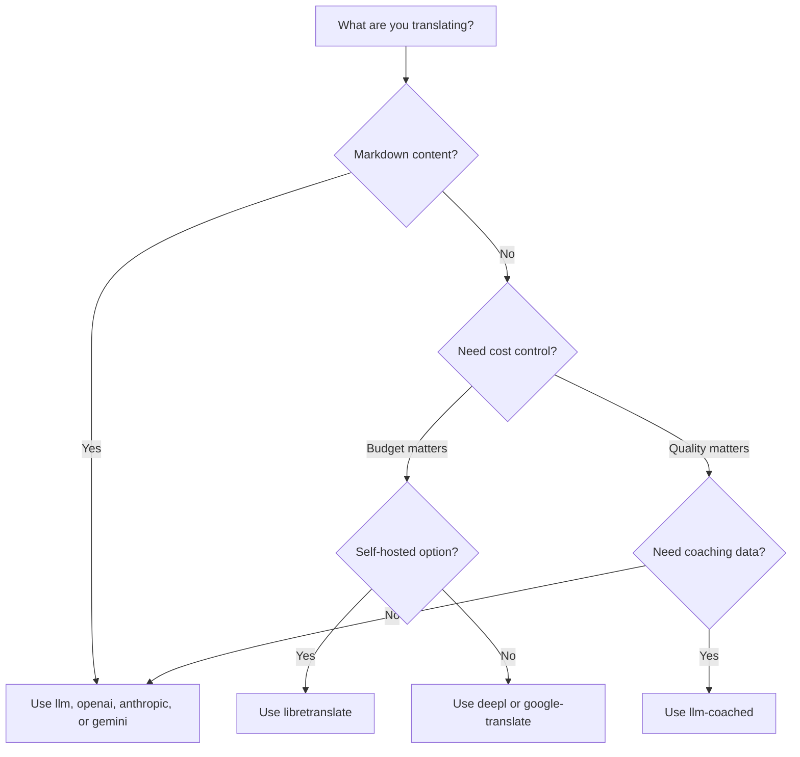

# طرق الترجمة

يدعم Champollion طرق ترجمة متعددة. يمكن لكل زوج لغوي استخدام طريقة مختلفة — لست مقيدًا بنهج واحد لمشروعك بأكمله.

## مقارنة الطرق

### مزودو النماذج اللغوية الكبيرة (LLM)

تركز على الجودة، وتدعم Markdown، ومتوافقة مع التوجيه (coaching). الأفضل للمشاريع الغنية بالمحتوى.

| الطريقة | المفتاح | الوظيفة |
|--------|-----|-------------|
| `llm` (الافتراضي) | `OPENROUTER_API_KEY` | LLM عبر OpenRouter — أكثر من 200 نموذج، توجيه تلقائي |
| `llm-coached` | `OPENROUTER_API_KEY` | LLM + قواعد نحوية، قواميس، ملاحظات الأسلوب |
| `openai` | `OPENAI_API_KEY` | واجهة برمجة تطبيقات OpenAI المباشرة (gpt-4o, gpt-4o-mini) |
| `anthropic` | `ANTHROPIC_API_KEY` | واجهة برمجة تطبيقات Anthropic المباشرة (Claude Sonnet, Haiku, Opus) |
| `gemini` | `GEMINI_API_KEY` | واجهة برمجة تطبيقات Google Gemini المباشرة (Flash, Pro) — باقة مجانية |

### الترجمة الآلية التقليدية (MT)

تركز على السرعة والتكلفة. الأفضل لأزواج المفتاح-القيمة (key-value) ذات الحجم الكبير.

| الطريقة | المفتاح | الوظيفة |
|--------|-----|-------------|
| `google-translate` | `GOOGLE_TRANSLATE_API_KEY` | واجهة برمجة تطبيقات Google Cloud Translation v2 (194 لغة) |
| `deepl` | `DEEPL_API_KEY` | واجهة برمجة تطبيقات DeepL مع دعم المسرد (33 لغة) |
| `microsoft-translator` | `MICROSOFT_TRANSLATOR_API_KEY` | Azure Cognitive Services Translator (135 لغة) |
| `libretranslate` | *(استضافة ذاتية)* | LibreTranslate باستضافة ذاتية (AGPL، مجاني) |
| `tilde` | `TILDE_API_KEY` | Tilde MT — محركات مطورة في الاتحاد الأوروبي، قوية في لغات البلطيق واللغات الأوروبية |
| `translated` | `LARA_ACCESS_KEY_ID` + `LARA_ACCESS_KEY_SECRET` | Translated's Lara — ترجمة آلية تكيفية احترافية (200 لغة) |

### البنية التحتية

| الطريقة | المفتاح | الوظيفة |
|--------|-----|-------------|
| `api` | *(لكل مزود)* | عميل HTTP خفيف لأي نقطة نهاية (endpoint) لترجمة REST |

## شجرة اتخاذ القرار



---

## `llm` — ترجمة LLM (الافتراضية)

تترجم عبر أي نموذج لغوي كبير (LLM) على [OpenRouter](https://openrouter.ai). هذه هي الطريقة الافتراضية والأكثر تنوعًا.

**كيف تعمل:**
1. تُجمّع المفاتيح في دفعات (الافتراضي 80/دفعة) مع تعليمات السياق ومستوى اللغة (register)
2. تُرسل إلى OpenRouter كموجه (prompt) مهيكل
3. تُحلل استجابة JSON
4. تُتحقق من صحة كل ترجمة من خلال [بوابة الجودة](/docs/concepts/quality-gate)
5. تُكتب الترجمات الناجحة، وتُعاد المحاولة أو تُرفض الترجمات الفاشلة

**متى تستخدمها:** في معظم المشاريع. خاصة المواقع الغنية بالمحتوى التي تستخدم Markdown، حيث يجب حماية كتل الأكواد البرمجية (code blocks) والأكواد القصيرة (shortcodes).

**الإعدادات:**

```json
{
  "defaultMethod": "llm",
  "model": "google/gemini-3.5-flash"
}
```

## `llm-coached` — ترجمة LLM الموجهة (Coached)

نفس طريقة `llm`، ولكن مع حقن القواعد النحوية، وقواميس المصطلحات، وملاحظات الأسلوب في كل موجه (prompt).

**كيف تعمل:**
1. تُحمّل بيانات التوجيه (coaching data) من `.champollion/coaching/<locale>.json` أو من دليل `coaching/` الخاص بالإضافة (plugin)
2. تُحقن القواعد النحوية، ومصطلحات القاموس، وملاحظات الأسلوب في موجه النظام (system prompt)
3. تُدرج مصطلحات القاموس المطابقة للمفاتيح المصدرية كمصطلحات مطلوبة
4. تستمر الترجمة كما هو الحال مع `llm`، مع إضافة بيانات التوجيه لمزيد من الدقة

**متى تستخدمها:** اللغات منخفضة الموارد، والمصطلحات الخاصة بمجال معين (قانوني، طبي)، ومستويات اللغة الرسمية، أو أي حالة لا تكون فيها مخرجات LLM العامة دقيقة بما يكفي.

**تنسيق بيانات التوجيه:**

```json title=".champollion/coaching/fr.json"
{
  "grammar_rules": [
    "French adjectives agree in gender and number with the noun they modify",
    "Use 'vous' for formal contexts, 'tu' for informal"
  ],
  "dictionary": {
    "dashboard": "tableau de bord",
    "deployment": "déploiement",
    "settings": "paramètres"
  },
  "style_notes": "Prefer active voice. Avoid anglicisms where a native French term exists."
}
```

انظر أيضًا: [دليل اللغات منخفضة الموارد](/docs/network/community/low-resource-languages)

---

## `openai` — واجهة برمجة تطبيقات OpenAI المباشرة

تترجم مباشرة عبر واجهة برمجة تطبيقات OpenAI Chat Completions. بدون وسيط OpenRouter — مفتاحك، وحسابك، ولوحة معلومات الاستخدام الخاصة بك.

**النماذج:** `gpt-4o` (الافتراضي)، `gpt-4o-mini`

**الميزات:**
- ✅ تدعم Markdown (ترجمة المحتوى)
- ✅ دعم التوجيه (القواعد النحوية، تجاوزات القاموس، ملاحظات الأسلوب)
- ✅ وضع JSON لمخرجات المفتاح-القيمة (key-value) المهيكلة
- ✅ التراجع الأسي (Exponential backoff) مع إعادة المحاولة

**الإعدادات:**

```json
{
  "pairs": {
    "en:fr": { "method": "openai", "model": "gpt-4o-mini" }
  }
}
```

```bash
export OPENAI_API_KEY=sk-proj-...
```

احصل على مفتاحك من [platform.openai.com/api-keys](https://platform.openai.com/api-keys).

## `anthropic` — واجهة برمجة تطبيقات Anthropic المباشرة

تترجم مباشرة عبر واجهة برمجة تطبيقات Anthropic Messages. تستخدم المعلمة `system` لبيانات التوجيه، مما يُفعل ميزة التخزين المؤقت للموجهات (prompt caching) الخاصة بـ Anthropic.

**النماذج:** `claude-sonnet-4-6` (الافتراضي)، `claude-haiku-4-5`، `claude-opus-4-7`

**الميزات:**
- ✅ تدعم Markdown (ترجمة المحتوى)
- ✅ دعم التوجيه (القواعد النحوية، تجاوزات القاموس، ملاحظات الأسلوب)
- ✅ التخزين المؤقت لموجه النظام (يوزع تكلفة التوجيه عبر الدفعات)
- ✅ التراجع الأسي (Exponential backoff) مع إعادة المحاولة

**الإعدادات:**

```json
{
  "pairs": {
    "en:ja": { "method": "anthropic", "model": "claude-haiku-4-5" }
  }
}
```

```bash
export ANTHROPIC_API_KEY=sk-ant-...
```

احصل على مفتاحك من [console.anthropic.com](https://console.anthropic.com/settings/keys).

## `gemini` — واجهة برمجة تطبيقات Google Gemini المباشرة

تترجم مباشرة عبر واجهة برمجة تطبيقات Google Gemini `generateContent`. **تتوفر باقة مجانية** — أفضل نقطة انطلاق بدون تكلفة.

**النماذج:** `gemini-2.5-flash` (الافتراضي)، `gemini-2.5-pro`

**الميزات:**
- ✅ تدعم Markdown (ترجمة المحتوى)
- ✅ دعم التوجيه (القواعد النحوية، تجاوزات القاموس، ملاحظات الأسلوب)
- ✅ وضع استجابة JSON عبر `responseMimeType`
- ✅ باقة مجانية (حصة يومية سخية)
- ✅ التراجع الأسي (Exponential backoff) مع إعادة المحاولة

**الإعدادات:**

```json
{
  "pairs": {
    "en:ko": { "method": "gemini", "model": "gemini-2.5-pro" }
  }
}
```

```bash
export GEMINI_API_KEY=AI...
```

احصل على مفتاحك من [aistudio.google.com/apikey](https://aistudio.google.com/apikey).

### التحقق من صحة النموذج {#model-validation}

يتحقق مزودو LLM المباشرون (`openai`، `anthropic`، `gemini`) من صحة سلسلة النموذج (model string) عند الاستخدام الأول. يكتشف هذا ثلاث فئات من الأخطاء:

**تنسيق الطريقة خاطئ** — استخدام مسار نموذج بأسلوب OpenRouter مع مزود مباشر:

```
[WARN] OpenAI: model "google/gemini-3.5-flash" looks like an OpenRouter path.
       Direct providers use bare model names (e.g., "gpt-4o").
       To use OpenRouter models, set method to 'llm' instead.
```

**مزود خاطئ** — استخدام نموذج من مزود مختلف تمامًا:

```
[WARN] Gemini: model "claude-sonnet-4-6" is an Anthropic model.
       This provider (gemini) cannot serve Anthropic models.
       Use --method anthropic or set "method": "anthropic" in config.
```

**نموذج مهمل أو مكتوب بشكل خاطئ** — عند أول استدعاء لواجهة برمجة التطبيقات (API)، يجلب champollion قائمة النماذج الحية للمزود ويتحقق من نموذجك مقابلها:

```
[WARN] Gemini: model "gemini-1.5-flash" not found in available models.
       Similar models: gemini-2.0-flash, gemini-2.5-flash, gemini-2.5-pro
       The API call will proceed — the provider will give the final verdict.
```

:::note[هذه تحذيرات، وليست أخطاء]
يُسجل التحقق من صحة النموذج تحذيرات ولكنه لا يحظر استدعاء واجهة برمجة التطبيقات (API). تُعطي واجهة برمجة تطبيقات المزود الحكم النهائي — قد يتطابق اسم نموذج مستقبلي مع نمط مختلف، ولا نريد وضع قيود بناءً على الاستدلالات (heuristics).
:::

---

## `google-translate` — واجهة برمجة تطبيقات Google Cloud Translation

تكامل مباشر مع واجهة برمجة تطبيقات Google Cloud Translation v2. تستخدم واجهة برمجة تطبيقات REST — بدون حزمة تطوير برمجيات (SDK)، وبدون حساب خدمة. فقط مفتاح واجهة برمجة التطبيقات (API key).

**متى تستخدمها:** أزواج السلاسل النصية للمفتاح-القيمة (key-value) ذات الحجم الكبير حيث تكون السرعة والتكلفة أكثر أهمية من الفروق الدقيقة. تدعم 194 لغة بشكل افتراضي ([قائمة Google المنشورة](https://docs.cloud.google.com/translate/docs/languages)).

**القيود:**
- ⚠️ **لا تدعم Markdown.** ستؤدي إلى إتلاف كتل الأكواد البرمجية، والأكواد القصيرة، ومتغيرات الاستيفاء (interpolation variables).
- لا يوجد تحكم في مستوى اللغة/النبرة
- لا يوجد توجيه أو فرض للمصطلحات

```bash
npx champollion sync --method google-translate
```

:::tip[الاكتشاف التلقائي]
إذا تم تعيين `GOOGLE_TRANSLATE_API_KEY` فقط (بدون مفتاح OpenRouter)، فسيقوم champollion بالتبديل تلقائيًا إلى Google Translate. لا حاجة لتغيير الإعدادات.
:::

## `deepl` — واجهة برمجة تطبيقات DeepL

تكامل مباشر مع واجهة برمجة تطبيقات الترجمة DeepL. تدعم المسارد (glossaries) للحصول على مصطلحات متسقة.

**متى تستخدمها:** اللغات الأوروبية التي تتفوق فيها DeepL (الألمانية، الفرنسية، الإسبانية، الهولندية، البولندية، إلخ). يفرض دعم المسرد مصطلحات متسقة بدون الحاجة إلى بيانات توجيه.

**الميزات:**
- ✅ اكتشاف تلقائي لنقاط النهاية (endpoints) المجانية/الاحترافية (لاحقة `:fx` في المفاتيح المجانية)
- ✅ إنشاء وإدارة المسارد
- ✅ التحكم في مستوى الرسمية
- ⚠️ **لا تدعم Markdown** — أزواج المفتاح-القيمة (key-value) فقط

**الإعدادات:**

```json
{
  "pairs": {
    "en:de": { "method": "deepl" }
  }
}
```

```bash
export DEEPL_API_KEY=your-key-here
```

احصل على مفتاحك من [deepl.com/pro-api](https://www.deepl.com/pro-api).

## `microsoft-translator` — Azure Cognitive Services

تكامل مباشر مع واجهة برمجة تطبيقات Microsoft Translator Text v3.

**متى تستخدمها:** بيئات المؤسسات التي تمتلك بنية تحتية حالية على Azure. تدعم 135 لغة، بما في ذلك بعض اللغات التي لا تغطيها Google Translate (التبتية، الفاروية، الإنكتيتوتية، وغيرها).

**الميزات:**
- ✅ ما يصل إلى 100 مقطع لكل طلب (إنتاجية عالية)
- ✅ معلمة منطقة (region) اختيارية لتحسين زمن الانتقال (latency)
- ⚠️ **لا تدعم Markdown** — أزواج المفتاح-القيمة (key-value) فقط
- ⚠️ **لا تدعم ترجمة المحتوى** — أزواج المفتاح-القيمة (key-value) فقط

**الإعدادات:**

```json
{
  "pairs": {
    "en:ar": { "method": "microsoft-translator" }
  }
}
```

```bash
export MICROSOFT_TRANSLATOR_API_KEY=your-key
export MICROSOFT_TRANSLATOR_REGION=global  # optional
```

احصل على مفتاحك من [Azure Portal](https://portal.azure.com) ← Cognitive Services ← Translator.

## `libretranslate` — الترجمة ذاتية الاستضافة

ترجمة مفتوحة المصدر ذاتية الاستضافة باستخدام LibreTranslate. تعمل محليًا أو على بنيتك التحتية الخاصة — بدون تكاليف لواجهة برمجة التطبيقات (API)، مع سيادة كاملة على البيانات.

**متى تستخدمها:** المشاريع التي تتطلب ترجمة دون اتصال بالإنترنت، أو الامتثال لخصوصية البيانات (GDPR)، أو التشغيل بدون تكلفة. مفيدة بشكل خاص لمسارات التكامل المستمر (CI pipelines) التي لا ينبغي أن تعتمد على واجهات برمجة تطبيقات خارجية.

**الميزات:**
- ✅ استضافة ذاتية — لا توجد استدعاءات لواجهات برمجة تطبيقات خارجية
- ✅ مجانية ومفتوحة المصدر (AGPL-3.0)
- ✅ يتوفر النشر عبر Docker
- ⚠️ **لا تدعم Markdown** — أزواج المفتاح-القيمة (key-value) فقط
- ⚠️ **لا تدعم ترجمة المحتوى** — أزواج المفتاح-القيمة (key-value) فقط
- ⚠️ تختلف الجودة حسب الزوج اللغوي

**الإعداد:**

```bash
# Run LibreTranslate locally with Docker
docker run -d -p 5000:5000 libretranslate/libretranslate

# Configure (optional — defaults to localhost:5000)
export LIBRETRANSLATE_API_URL=http://localhost:5000/translate
```

```json
{
  "pairs": {
    "en:es": { "method": "libretranslate" }
  }
}
```

---

## `api` — واجهة برمجة تطبيقات الترجمة عن بُعد

عميل HTTP خفيف لنقاط نهاية (endpoints) الترجمة المستضافة مجتمعيًا أو المحمية بحقوق الملكية الفكرية (IP). يُرسل Champollion المفاتيح ويتلقى الترجمات — ولا يحتوي على أي منطق ترجمة داخلي.

**متى تستخدمها:** عندما تُستضاف طرق الترجمة على جانب الخادم (مثل بيانات التوجيه الاحتكارية، أو النماذج المضبوطة بدقة (fine-tuned)، أو مسارات FST التي لا يمكن توزيعها).

```json
{
  "pairs": {
    "en:crk": {
      "method": "api",
      "endpoint": "https://api.example.com/v1/translate",
      "apiKey": "your-key"
    }
  }
}
```

:::note[الترجمة الخاضعة لسيطرة المجتمع (نهج طامح إلى السيادة)]
تُعد طريقة `api` الجسر نحو **الترجمة المستضافة مجتمعيًا والخاضعة لسيطرة المجتمع (sovereignty-aspirant)**. يمكن لمجتمعات الشعوب الأصلية ولغات الأقليات استضافة نقاط نهاية الترجمة الخاصة بهم — مع إبقاء بيانات التوجيه، والنماذج المضبوطة بدقة، والملكية الفكرية اللغوية تحت سيطرة المجتمع — بينما يتصل Champollion بها كعميل خفيف.

راجع [دعم لغة منخفضة الموارد](/docs/network/community/low-resource-languages) للحصول على إرشادات الاستضافة المجتمعية الكاملة، و[تقديم طريقة عبر واجهة برمجة التطبيقات](/docs/guides/serving-a-method) لمعرفة متطلبات نقطة النهاية.
:::

---

## الإعدادات لكل زوج لغوي

تكمن القوة الحقيقية في مزج الطرق لكل زوج لغوي:

```json title="champollion.config.json"
{
  "version": 3,
  "pairs": {
    "en:fr": { "method": "deepl" },
    "en:ja": { "method": "openai", "model": "gpt-4o" },
    "en:ko": { "method": "gemini" },
    "en:ar": { "method": "microsoft-translator" },
    "en:crk": { "methodPlugin": "crk-coached-v1" }
  }
}
```

يُترجم هذا الفرنسية عبر DeepL (دعم المسرد)، واليابانية عبر OpenAI (الجودة)، والكورية عبر Gemini (الباقة المجانية)، والعربية عبر Microsoft Translator (التغطية)، ولغة Plains Cree عبر إضافة موجهة (متخصصة).

## الإضافات (Plugins)

الإضافات هي وصفات ترجمة معبأة مسبقًا لأزواج لغوية محددة. إنها عبارة عن ملفات بيان (manifests) بتنسيق JSON — وليست أكواد برمجية — تخبر champollion بالطريقة التي يجب استخدامها، والإعدادات المطلوبة، ومستوى الجودة الذي تم قياسه.

:::tip[من بيئة التقييم إلى الإنتاج بأمر واحد]
يمكن تثبيت الإضافات التي تم تطويرها وإثبات كفاءتها في [بيئة التقييم (eval harness)](/docs/network/specifications/harness) مباشرة — الطريقة التي تتحقق من صحتها هناك تُنشر هنا بأمر `plugin install` واحد. راجع [تقييم الترجمة الآلية](/docs/network/leaderboard/rules) لمعرفة سير عمل التقييم بالكامل.
:::

```bash
champollion plugin install ./french-formal-v1/
champollion plugin list
champollion plugin remove french-formal-v1
```

راجع [مواصفات الإضافة](/docs/reference/plugin-spec) لمعرفة تنسيق ملف البيان (manifest) بالكامل.

---

## التبديل بين المزودين

هل تنتقل بين الطرق؟ يتغير تنسيق النموذج ومتغير البيئة (env var) — إليك الخريطة:

### OpenRouter ← مزود مباشر

```diff title="champollion.config.json"
 {
   "pairs": {
     "en:fr": {
-      "method": "llm",
-      "model": "openai/gpt-4o"
+      "method": "openai",
+      "model": "gpt-4o"
     }
   }
 }
```

```diff title="Environment variables"
- export OPENROUTER_API_KEY=sk-or-v1-...
+ export OPENAI_API_KEY=sk-proj-...
```

**الاختلافات الرئيسية:**
- يستخدم OpenRouter تنسيق `provider/model` (مثل `openai/gpt-4o`). يستخدم المزودون المباشرون أسماء النماذج المجردة (مثل `gpt-4o`).
- لكل مزود مباشر متغير بيئة (env var) خاص به (`OPENAI_API_KEY`، `ANTHROPIC_API_KEY`، `GEMINI_API_KEY`).
- إذا استخدمت تنسيق نموذج خاطئ، فسيقوم champollion بتحذيرك — راجع [التحقق من صحة النموذج](#model-validation).

### مزود مباشر ← OpenRouter

```diff title="champollion.config.json"
 {
   "pairs": {
     "en:ja": {
-      "method": "anthropic",
-      "model": "claude-sonnet-4-6"
+      "method": "llm",
+      "model": "anthropic/claude-sonnet-4-6"
     }
   }
 }
```

:::tip[متى تستخدم OpenRouter مقابل المزود المباشر]
**استخدم OpenRouter** عندما تريد التبديل بين النماذج دون تغيير متغيرات البيئة (env vars)، أو عندما تريد الوصول إلى أكثر من 200 نموذج من مفتاح واحد. **استخدم المزودين المباشرين** عندما تريد فوترة أبسط، أو زمن انتقال أقل (بدون وسيط)، أو الوصول إلى ميزات خاصة بالمزود مثل التخزين المؤقت للموجهات (prompt caching) من Anthropic.
:::

---

## مقارنة التكاليف

التكلفة التقريبية لكل 1,000 مفتاح مترجم (بافتراض ~10 رموز (tokens) لكل مفتاح، و80 مفتاحًا لكل دفعة):

| الطريقة | التكلفة / 1000 مفتاح | السرعة | الجودة | الأفضل لـ |
|--------|----------------|-------|---------|----------|
| `gemini` (Flash) | **مجاني** (ضمن الباقة) | سريعة | جيدة | البدء، المشاريع الشخصية |
| `google-translate` | ~$0.02 | الأسرع | مقبولة | الحجم الكبير، اللغات الأوروبية |
| `deepl` | ~$0.02 | سريعة | جيدة | اللغات الأوروبية، المصطلحات |
| `microsoft-translator` | ~$0.01 | سريعة | مقبولة | بيئات Azure، التغطية اللغوية الواسعة |
| `libretranslate` | **مجاني** (استضافة ذاتية) | متفاوتة | متوسطة | البيئات المعزولة (Air-gapped)، الامتثال لـ GDPR، مسارات CI |
| `gemini` (Pro) | ~$0.07 | متوسطة | جيدة جدًا | الحساسية للجودة، الحصة المجانية |
| `openai` (GPT-4o-mini) | ~$0.01 | سريعة | جيدة | LLM اقتصادي |
| `openai` (GPT-4o) | ~$0.10 | متوسطة | جيدة جدًا | الحساسية للجودة |
| `anthropic` (Haiku) | ~$0.01 | سريعة | جيدة | LLM اقتصادي |
| `anthropic` (Sonnet) | ~$0.10 | متوسطة | جيدة جدًا | الحساسية للجودة |
| `anthropic` (Opus) | ~$0.50 | بطيئة | ممتازة | الجودة القصوى |
| `llm` (OpenRouter) | تختلف حسب النموذج | متفاوتة | متفاوتة | مقارنة النماذج، التجريب |

:::note[هذه تقديرات]
تعتمد التكاليف الفعلية على طول النص المصدر، وحجم الدفعة، وتغييرات أسعار المزود. تحقق من صفحة التسعير الحالية لكل مزود لمعرفة الأسعار الدقيقة.
:::

---

## انظر أيضًا

- [اللغات المدعومة](/docs/reference/supported-languages)
- [بيانات التوجيه](/docs/concepts/coaching-data)
- [دعم لغة منخفضة الموارد](/docs/network/community/low-resource-languages)
- [مواصفات الإضافة](/docs/reference/plugin-spec)
- [تقديم طريقة عبر واجهة برمجة التطبيقات](/docs/guides/serving-a-method)
- [بوابة الجودة](/docs/concepts/quality-gate)
- [البنية](/docs/concepts/architecture)
- [استكشاف الأخطاء وإصلاحها](/docs/guides/troubleshooting) — أخطاء النماذج، مشكلات واجهة برمجة التطبيقات

