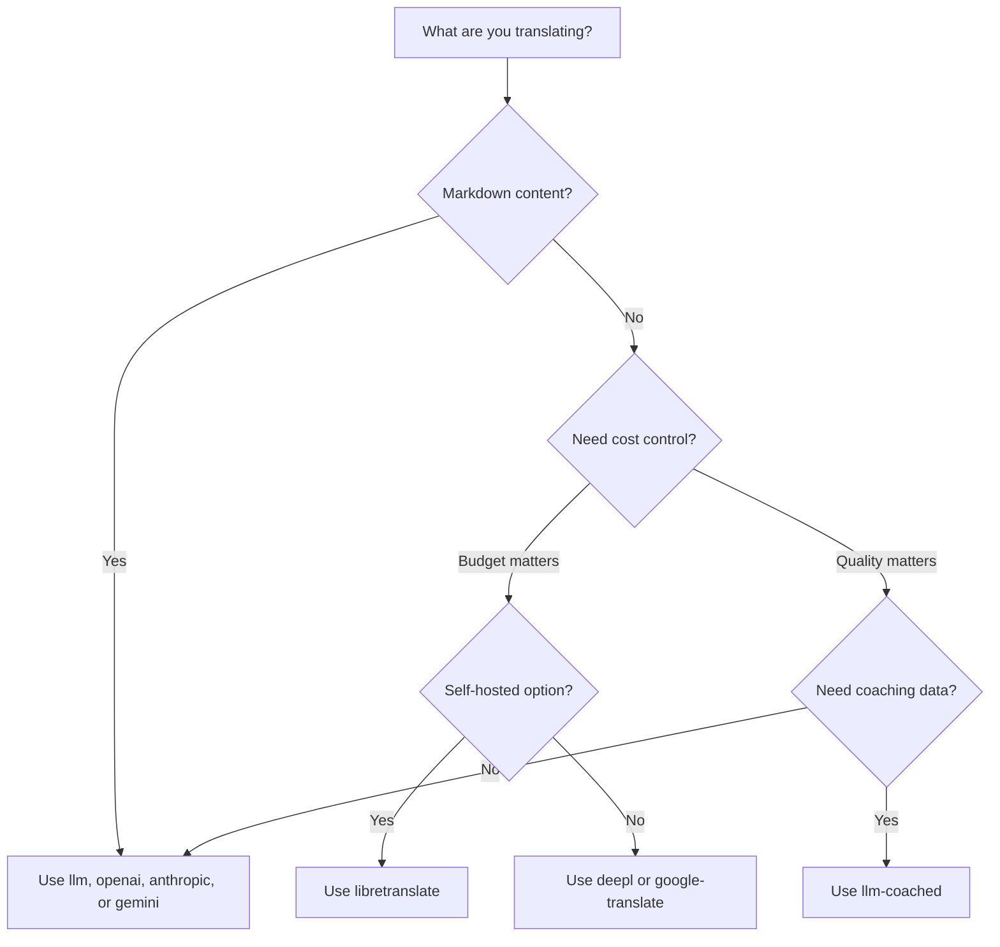

# طرق الترجمة

يدعم Champollion عدة طرق للترجمة. يمكن لكل زوج لغوي استخدام طريقة مختلفة — فلست مقيداً بنهج واحد لمشروعك بأكمله.

## مقارنة الطرق

### مزودو نماذج اللغة الكبيرة (LLM)

تركز على الجودة، وتراعي بنية Markdown، ومتوافقة مع التوجيه التدريبي (coaching). مثالية للمشاريع الغنية بالمحتوى.

| الطريقة | المفتاح | وظيفتها |
|--------|-----|-------------|
| `llm` (افتراضي) | `OPENROUTER_API_KEY` | LLM عبر OpenRouter — أكثر من 200 نموذج، وتوجيه تلقائي |
| `llm-coached` | `OPENROUTER_API_KEY` | LLM + قواعد نحوية، وقواميس، وملاحظات أسلوبية |
| `openai` | `OPENAI_API_KEY` | واجهة API المباشرة لـ OpenAI (gpt-4o، gpt-4o-mini) |
| `anthropic` | `ANTHROPIC_API_KEY` | واجهة API المباشرة لـ Anthropic (Claude Sonnet، Haiku، Opus) |
| `gemini` | `GEMINI_API_KEY` | واجهة API المباشرة لـ Google Gemini (Flash، Pro) — فئة مجانية |
| `local` | *(لا يوجد)* | نموذج على جهازك أو خادمك الخاص: Ollama، أو vLLM، أو LM Studio، أو llama.cpp، أو نموذج قمت بتدريبه باستخدام `nmt-forge`. لا يغادر النص بنيتك التحتية مطلقاً |

### الترجمة الآلية التقليدية (MT)

تركز على السرعة والتكلفة. الأنسب للأعداد الكبيرة من أزواج المفتاح والقيمة.

| الطريقة | المفتاح | وظيفتها |
|--------|-----|-------------|
| `google-translate` | `GOOGLE_TRANSLATE_API_KEY` | Google Cloud Translation API v2 (194 لغة) |
| `deepl` | `DEEPL_API_KEY` | DeepL API مع دعم المسارد (33 لغة) |
| `microsoft-translator` | `MICROSOFT_TRANSLATOR_API_KEY` | Azure Cognitive Services Translator (135 لغة) |
| `libretranslate` | *(استضافة ذاتية)* | LibreTranslate مستضاف ذاتياً (ترخيص AGPL، مجاني) |
| `tilde` | `TILDE_API_KEY` | Tilde MT — محركات طُوّرت داخل الاتحاد الأوروبي، قوية في لغات البلطيق واللغات الأوروبية |
| `translated` | `LARA_ACCESS_KEY_ID` + `LARA_ACCESS_KEY_SECRET` | Translated's Lara — ترجمة آلية تكيفية احترافية (200 لغة) |

### البنية التحتية

| الطريقة | المفتاح | وظيفتها |
|--------|-----|-------------|
| `api` | *(لكل مزود)* | عميل HTTP خفيف لأي نقطة نهاية ترجمة تعتمد REST |

## شجرة اتخاذ القرار


```mermaid
flowchart TD
    A["What are you translating?"] --> B{"Markdown content?"}
    B -->|Yes| C["Use llm, openai, anthropic, or gemini"]
    B -->|No| D{"Need cost control?"}
    D -->|Budget matters| E{"Self-hosted option?"}
    D -->|Quality matters| F{"Need coaching data?"}
    E -->|Yes| G["Use libretranslate"]
    E -->|No| H["Use deepl or google-translate"]
    F -->|Yes| I["Use llm-coached"]
    F -->|No| C
```

---

## `llm` — ترجمة LLM (الافتراضية)

تترجم عبر أي نموذج LLM على [OpenRouter](https://openrouter.ai). هذه هي الطريقة الافتراضية والأكثر مرونة.

**آلية العمل:**
1. تجميع المفاتيح على دفعات (افتراضياً 80/دفعة) مع تعليمات الأسلوب والسياق
2. الإرسال إلى OpenRouter كموجّه مهيكل (structured prompt)
3. تحليل استجابة JSON
4. التحقق من صحة كل ترجمة من خلال [بوابة الجودة](/docs/concepts/quality-gate)
5. حفظ الترجمات الناجحة، وإعادة محاولة الفاشلة أو رفضها

**متى تُستخدم:** في معظم المشاريع. خاصة المواقع الغنية بالمحتوى المكتوب بـ Markdown، حيث تتطلب كتل التعليمات البرمجية والأكواد القصيرة (shortcodes) الحماية من الترجمة.

**الإعدادات:**

```json
{
  "defaultMethod": "llm",
  "model": "google/gemini-3.8-flash"
}
```

## `llm-coached` — ترجمة LLM الموجّهة تدريبياً

مطابقة لـ `llm`، ولكن مع حقن قواعد نحوية، وقواميس مصطلحات، وملاحظات أسلوبية في كل موجّه.

**آلية العمل:**
1. تحميل بيانات التوجيه من `.champollion/coaching/<locale>.json` أو من دليل `coaching/` الخاص بإضافة ما
2. حقن القواعد النحوية، ومصطلحات القاموس، وملاحظات الأسلوب في موجّه النظام (system prompt)
3. تضمين مصطلحات القاموس المطابقة للمفاتيح المصدرية كمصطلحات إلزامية
4. المتابعة في الترجمة كما هو الحال مع `llm`، مع إضفاء دقة أعلى بفضل بيانات التوجيه

**متى تُستخدم:** اللغات منخفضة الموارد، والمصطلحات التخصصية (قانونية، طبية)، والأساليب الرسمية، أو أي حالة لا تكون فيها مخرجات LLM العامة دقيقة بما يكفي.

**تنسيق بيانات التوجيه التدريبي:**

```json title=".champollion/coaching/fr.json"
{
  "grammar_rules": [
    "French adjectives agree in gender and number with the noun they modify",
    "Use 'vous' for formal contexts, 'tu' for informal"
  ],
  "dictionary": {
    "dashboard": "tableau de bord",
    "deployment": "déploiement",
    "settings": "paramètres"
  },
  "style_notes": "Prefer active voice. Avoid anglicisms where a native French term exists."
}
```

انظر أيضاً: [دليل اللغات منخفضة الموارد](/docs/network/community/low-resource-languages)

---

## `openai` — واجهة API المباشرة لـ OpenAI

تترجم مباشرة عبر OpenAI Chat Completions API. دون وسيط OpenRouter — مفتاحك الخاص، وحسابك الخاص، ولوحة استخدامك الخاصة.

**النماذج:** `gpt-5.4-mini-2026-03-17` (الافتراضي — لقطة مؤرخة snapshot)، أو أي معرف نموذج دقيق تدرجه OpenAI

**الميزات:**
- ✅ مراعاة بنية Markdown (ترجمة المحتوى)
- ✅ الموجّه نفسه المستخدم في `llm` — الأسلوب، وتوجيهات الجنس النحوي، وسياق الموجّه، والمصطلحات المحمية، وإرشادات `coachingFile` ومصطلحات المسرد لكل دفعة ([انظر أدناه](#one-prompt-every-llm-method))
- ✅ وضع JSON لمخرجات مهيكلة من المفاتيح والقيم
- ✅ تراجع أسي (exponential backoff) مع إعادة المحاولة

**الإعدادات:**

```json
{
  "pairs": {
    "en:fr": { "method": "openai", "model": "gpt-4o-mini" }
  }
}
```

```bash
export OPENAI_API_KEY=sk-proj-...
```

احصل على مفتاحك من [platform.openai.com/api-keys](https://platform.openai.com/api-keys).

## `local` — نموذجك الخاص (Ollama، vLLM، LM Studio، نموذج مدرّب)

تترجم باستخدام أي نموذج خلف نقطة نهاية **متوافقة مع OpenAI** تقوم بتشغيلها: Ollama، أو vLLM، أو LM Studio، أو خادم llama.cpp، أو نموذج درّبته باستخدام `nmt-forge`. لا يلزم وجود مفتاح API، ولا يُرسل أي نص إلى أطراف خارجية. هذه هي الطريقة الأنسب للنصوص الحساسة، وهي الطريقة التي تتيح لك نشر نموذج قمت ببنائه بنفسك.

```json
{ "defaultMethod": "local", "model": "llama3.1" }
```

```bash
# Optional: only if your server is not at Ollama's default address
export LOCAL_API_BASE=http://localhost:11434/v1
npx champollion sync --method local
```

تُقرأ نقطة النهاية، بالترتيب، من: `LOCAL_API_BASE`، ثم `OPENAI_API_BASE`، ثم `OPENAI_BASE_URL`، ثم القيمة الافتراضية لـ Ollama وهي `http://localhost:11434/v1`. عندما تكون نقطة النهاية على هذا الجهاز (`localhost`، `127.0.0.1`، `::1`)، تظهر التكلفة كـ **0$ لتكلفة API (يعمل على هذا الجهاز)** — لا توجد فاتورة API؛ ولا يُحسب عتادك الخاص أو استهلاك الطاقة — ويسمح `--max-cost` بتنفيذ العملية. أما أي نقطة نهاية أخرى (Groq، Together، أو خادم على شبكتك) فيُشار إليها كـ **غير معروفة (unknown)**، وليس 0$ مطلقاً، لأن الأداة لا يمكنها معرفة الرسوم المفروضة، ولذا يرفض `--max-cost` التنفيذ بدلاً من التخمين. وفي `--json`، يحمل صف التقدير `"estimatedCost": 0, "local": true` في الحالة الأولى و`"estimatedCost": null` في الحالة الثانية. (أي بروكسي على هذا الجهاز يعيد التوجيه إلى واجهة API مدفوعة — مثل LiteLLM أو بوابة عبور — تتم فوترته لدى المزود الأصلي، وهو ما لا يستطيع Champollion معرفته: خطط لميزانيته هناك).

قبل الترجمة، يتحقق أمر المزامنة (sync) من استجابة خادم عند نقطة النهاية. إذا لم يستجب أي خادم، فإن أي عملية يُفترض أن ترسل إليه شيئاً ستتوقف قبل إرسال أي شيء (رمز الخروج `1`)، مع ذكر العنوان. أما العملية التي لا ترسل إليه شيئاً — لعدم وجود عناصر في قائمة الانتظار، أو لأن جميع المفاتيح المطلوبة مأخوذة من الذاكرة المؤقتة (cache) كما في حالة إعادة معالجة نصوص مترجمة مسبقاً — فستصدر تحذيراً بأن الخادم متوقف وتتابع العمل. على بيئة تشغيل CI (عند تعيين `CI` أو `GITHUB_ACTIONS`)، يؤدي عدم استجابة الخادم إلى إيقاف كل عملية، حتى لو لم يكن هناك شيء في قائمة الانتظار، بحيث يفشل مسار العمل الذي لا يزال يستخدم `local` عند أول دفع للكود بدلاً من الانتظار حتى يتغير نص ما ([دليل CI](/docs/guides/ci-cd)).

تقبل طريقة `openai` التجاوز نفسه `OPENAI_API_BASE` / `OPENAI_BASE_URL` للوصول إلى أي مزود متوافق مع OpenAI (مثل Groq و Together وغيرها) باستخدام مفتاح.

## `anthropic` — واجهة API المباشرة لـ Anthropic

تترجم مباشرة عبر Anthropic Messages API. تُمرر التعليمات في المعامل `system`، مما يتيح ميزة التخزين المؤقت للموجّهات (prompt caching) من Anthropic.

**النماذج:** `claude-sonnet-4-6` (الافتراضي)، `claude-haiku-4-5`، `claude-opus-4-7`

**الميزات:**
- ✅ مراعاة بنية Markdown (ترجمة المحتوى)
- ✅ الموجّه نفسه المستخدم في `llm` — الأسلوب، وتوجيهات الجنس النحوي، وسياق الموجّه، والمصطلحات المحمية، وإرشادات `coachingFile` ومصطلحات المسرد لكل دفعة ([انظر أدناه](#one-prompt-every-llm-method))
- ✅ تخزين موجّه النظام مؤقتاً (يوزع تكلفة التعليمات على مختلف الدفعات)
- ✅ تراجع أسي مع إعادة المحاولة

**الإعدادات:**

```json
{
  "pairs": {
    "en:ja": { "method": "anthropic", "model": "claude-haiku-4-5" }
  }
}
```

```bash
export ANTHROPIC_API_KEY=sk-ant-...
```

احصل على مفتاحك من [console.anthropic.com](https://console.anthropic.com/settings/keys).

## `gemini` — واجهة API المباشرة لـ Google Gemini

تترجم مباشرة عبر Google Gemini `generateContent` API. **تتوفر فئة مجانية** — أفضل نقطة انطلاق بتكلفة صفرية.

**النماذج:** `gemini-3.8-flash` (الافتراضي)، أو أي معرف نموذج دقيق تدرجه Google

**الميزات:**
- ✅ مراعاة بنية Markdown (ترجمة المحتوى)
- ✅ الموجّه نفسه المستخدم في `llm` — الأسلوب، وتوجيهات الجنس النحوي، وسياق الموجّه، والمصطلحات المحمية، وإرشادات `coachingFile` ومصطلحات المسرد لكل دفعة ([انظر أدناه](#one-prompt-every-llm-method))
- ✅ وضع استجابة JSON عبر `responseMimeType`
- ✅ فئة مجانية (حصة يومية سخية)
- ✅ تراجع أسي مع إعادة المحاولة

**الإعدادات:**

```json
{
  "pairs": {
    "en:ko": { "method": "gemini", "model": "gemini-2.5-pro" }
  }
}
```

```bash
export GEMINI_API_KEY=AI...
```

احصل على مفتاحك من [aistudio.google.com/apikey](https://aistudio.google.com/apikey).

### موجّه واحد لجميع طرق LLM {#one-prompt-every-llm-method}

ترسل طرق `llm` و`openai` و`anthropic` و`gemini` و`local` التعليمات نفسها للمشروع نفسه؛ ولا يختلف سوى وجهة الطلب. تحمل رسالة النظام كلاً من الأسلوب، وتوجيهات الجنس النحوي للغة، ونصوص `promptContext` و`protectedTerms` و`coachingFile` الخاصة بك؛ بينما تحمل رسالة كل دفعة مصطلحات المسرد التي تحتوي عليها (وهي `dictionary` في `.champollion/coaching/<locale>.json`)، والتعليمات الخاصة بكل مفتاح (صيغ الجمع، وسياق gettext، والأوصاف) والنصوص. عاين ذلك بنفسك — دون إرسال أي شيء:

```bash
npx champollion sync --dry --method local --show-prompt
```

تُقرأ القواعد النحوية وملاحظات الأسلوب من ملف التوجيه التدريبي بواسطة `llm-coached`، عبر أي مزود: `{ "method": "llm-coached", "provider": "openai" }`.

### أسماء النماذج {#model-names}

يُرسل إلى المزود المباشر اسمه الخاص للنموذج. ويتم تحويل المعرّف المكتوب بنمط OpenRouter عندما يوفر المزود ذلك النموذج: `openai/gpt-5.5` ← `gpt-5.5` على `openai`، و`anthropic/claude-haiku-4.5` ← `claude-haiku-4-5` على `anthropic`، و`google/gemini-3.8-flash` ← `gemini-3.8-flash` على `gemini`. أما المعرّف الذي لا يملك المزود نموذجاً له فيؤدي إلى إيقاف التشغيل قبل إرسال أي شيء:

```
[ERR] sync failed: en:fr: model "google/gemini-3.8-flash" (from the top-level "model") is an OpenRouter model id
      — openai calls OpenAI directly, which has no model by that name. Use an OpenAI model (e.g. --model gpt-4o),
      --method gemini (its name for it: "gemini-3.8-flash") or --method llm to run it through OpenRouter.
```

ترسل طريقة `local`، وكذلك `openai` الموجهة إلى خادم آخر عبر `OPENAI_API_BASE`، الاسم تماماً كما كتبته — وذلك الخادم هو من يحدد دلالته.

### الأسماء الدقيقة (Slugs) فقط {#exact-slugs}

يُسمى كل نموذج بالاسم المعرّف الدقيق (slug) الخاص به في جميع الطرق: `google/gemini-3.8-flash` على OpenRouter، والاسم الدقيق الخاص بالمزود المباشر (`gpt-5.5`) على `openai`. لا يؤدي أي اسم مختصر إلى الوصول لنموذج، كما تُرفض المعرفات العائمة (مثل معرفات توجيه `~vendor/…` في OpenRouter، أو أي اسم `…-latest` أو `:latest`): لأنها تشير إلى أي نموذج يوجهها إليه المزود في ذلك اليوم، فلن تتمكن العملية من تحديد أي نموذج قام بالترجمة. ويؤدي كلاهما إلى إيقاف العملية قبل إرسال أي شيء:

```
[ERR] sync failed: "gemini-flash" (from --model) is not a model id — Champollion takes exact model slugs only,
      no aliases. Did you mean google/gemini-3.8-flash (what "gemini-flash" used to stand for)? List models:
      https://openrouter.ai/models (OpenRouter slugs), or champollion models --method <gemini|openai|anthropic>
      (a direct provider's own names).
```

### التحقق من صحة النموذج {#model-validation}

يتحقق مزودو LLM المباشرون (`openai`، `anthropic`، `gemini`) أيضاً من اسم النموذج الخاص بك عند الاستخدام الأول (وليس عند الاتصال بخادم آخر عبر `OPENAI_API_BASE`). يكتشف هذا فئتين من الأخطاء:

**مزود غير صحيح** — استخدام نموذج ينتمي إلى مزود آخر تماماً:

```
[WARN] Gemini: model "claude-sonnet-4-6" is an Anthropic model.
       This provider (gemini) cannot serve Anthropic models.
       Use --method anthropic or set "method": "anthropic" in config.
```

**نموذج مهجور أو خطأ إملائي في اسمه** — عند أول استدعاء لـ API، يجلب champollion قائمة النماذج الحية للمزود ويتحقق من نموذجك مقابلها:

```
[WARN] Gemini: model "gemini-1.5-flash" not found in available models.
       Similar models: gemini-2.0-flash, gemini-2.5-flash, gemini-2.5-pro
       The API call will proceed — the provider will give the final verdict.
```

:::note[هذه تحذيرات وليست أخطاء قاطعة]
يسجل التحقق من النموذج تحذيرات ولكنه لا يمنع استدعاء API. فالقرار النهائي يعود لواجهة API الخاصة بالمزود — فقد يتطابق اسم نموذج مستقبلي مع نمط مختلف، ولا نريد تقييد العمل بناءً على توقعات تخمينية.
:::

---

## `google-translate` — واجهة برمجة تطبيقات Google Cloud Translation

تكامل مباشر مع Google Cloud Translation API v2. يستخدم REST API مباشرة — دون حاجة إلى حزمة تطوير برمجيات (SDK) أو حساب خدمة. يكفي وجود مفتاح API فقط.

**متى تُستخدم:** سلاسل نصوص المفتاح والقيمة ذات الحجم الكبير، حيث تكون السرعة والتكلفة أهم من الدقة الأسلوبية. تدعم 194 لغة جاهزة للاستخدام ([قائمة Google المنشورة](https://docs.cloud.google.com/translate/docs/languages)).

**القيود:**
- ⚠️ **لا تراعي بنية Markdown.** ستؤدي إلى إتلاف كتل التعليمات البرمجية والأكواد القصيرة ومتغيرات الاستيفاء (interpolation variables).
- عدم وجود تحكم في الأسلوب/النبرة
- عدم دعم التوجيه التدريبي أو فرض المصطلحات

```bash
npx champollion sync --method google-translate
```

:::tip[الكشف التلقائي]
إذا تم تعيين `GOOGLE_TRANSLATE_API_KEY` فقط (دون وجود مفتاح OpenRouter)، يتحول champollion تلقائياً إلى Google Translate. لا يلزم أي تغيير في الإعدادات.
:::

## `deepl` — واجهة API لـ DeepL

تكامل مباشر مع واجهة برمجة تطبيقات الترجمة الخاصة بـ DeepL. تدعم المسارد لضمان اتساق المصطلحات.

**متى تُستخدم:** اللغات الأوروبية التي تتفوق فيها DeepL (الألمانية، الفرنسية، الإسبانية، الهولندية، البولندية، إلخ). يضمن دعم المسرد اتساق المصطلحات دون الحاجة لبيانات توجيه تدريبي.

**الميزات:**
- ✅ كشف تلقائي لنقاط نهاية الحساب المجاني/الاحترافي (لاحقة `:fx` في المفاتيح المجانية)
- ✅ إنشاء المسارد وإدارتها
- ✅ التحكم في مستوى الرسمية
- ⚠️ **لا تراعي بنية Markdown** — أزواج المفتاح والقيمة فقط

**الإعدادات:**

```json
{
  "pairs": {
    "en:de": { "method": "deepl" }
  }
}
```

```bash
export DEEPL_API_KEY=your-key-here
```

احصل على مفتاحك من [deepl.com/pro-api](https://www.deepl.com/pro-api).

## `microsoft-translator` — خدمات Azure Cognitive Services

تكامل مباشر مع Microsoft Translator Text API v3.

**متى تُستخدم:** بيئات المؤسسات التي تمتلك بنية تحتية حالية على Azure. تدعم 135 لغة، بما في ذلك لغات لا تغطيها ترجمة Google (مثل التبتية، والفاروية، والإنوكتيتوتية، وغيرها).

**الميزات:**
- ✅ ما يصل إلى 100 مقطع لكل طلب (إنتاجية عالية)
- ✅ معلمة منطقة اختيارية لتحسين زمن الاستجابة
- ⚠️ **لا تراعي بنية Markdown** — أزواج المفتاح والقيمة فقط
- ⚠️ **لا تدعم ترجمة المحتوى** — أزواج المفتاح والقيمة فقط

**الإعدادات:**

```json
{
  "pairs": {
    "en:ar": { "method": "microsoft-translator" }
  }
}
```

```bash
export MICROSOFT_TRANSLATOR_API_KEY=your-key
export MICROSOFT_TRANSLATOR_REGION=global  # optional
```

احصل على مفتاحك من [Azure Portal](https://portal.azure.com) ← Cognitive Services ← Translator.

## `libretranslate` — الترجمة المستضافة ذاتياً

ترجمة مفتوحة المصدر ومستضافة ذاتياً باستخدام LibreTranslate. تعمل محلياً أو على بنيتك التحتية الخاصة — دون أي تكاليف لـ API، مع سيادة كاملة على البيانات.

**متى تُستخدم:** المشاريع التي تتطلب ترجمة بلا اتصال بالإنترنت، أو الامتثال لخصوصية البيانات (GDPR)، أو تشغيلاً بتكلفة صفرية. مفيدة بشكل خاص لمسارات عمل التكامل المستمر (CI) التي يجب ألا تعتمد على واجهات برمجة تطبيقات خارجية.

**الميزات:**
- ✅ مستضافة ذاتياً — لا توجد استدعاءات لواجهات API خارجية
- ✅ مجانية ومفتوحة المصدر (ترخيص AGPL-3.0)
- ✅ يتوفر نشر عبر Docker
- ⚠️ **لا تراعي بنية Markdown** — أزواج المفتاح والقيمة فقط
- ⚠️ **لا تدعم ترجمة المحتوى** — أزواج المفتاح والقيمة فقط
- ⚠️ تتفاوت الجودة باختلاف الزوج اللغوي

**الإعداد:**

```bash
# Run LibreTranslate locally with Docker
docker run -d -p 5000:5000 libretranslate/libretranslate

# Configure (optional — defaults to localhost:5000)
export LIBRETRANSLATE_API_URL=http://localhost:5000/translate
```

```json
{
  "pairs": {
    "en:es": { "method": "libretranslate" }
  }
}
```

---

## `api` — واجهة API للترجمة عن بُعد

عميل HTTP خفيف لنقاط نهاية الترجمة المستضافة مجتمعياً أو المحمية بالملكية الفكرية. يرسل Champollion المفاتيح ويستقبل الترجمات — فهو لا يحتوي على أي منطق داخلي للترجمة.

**متى تُستخدم:** عندما تُستضاف طرق الترجمة على جانب الخادم (مثل: بيانات التوجيه التدريبي الخاصة، النماذج المضبوطة بدقة، أو مسارات FST التي لا يمكن توزيعها).

```json
{
  "pairs": {
    "en:crk": {
      "method": "api",
      "endpoint": "https://api.example.com/v1/translate",
      "apiKey": "your-key"
    }
  }
}
```

:::note[الترجمة المدارة مجتمعياً (الساعية للسيادة اللغوية)]
تُعد طريقة `api` الجسر نحو **الترجمة المستضافة مجتمعياً والخاضعة لسيطرة المجتمع (الساعية للسيادة اللغوية)**. يمكن لمجتمعات اللغات الأصلية ولغات الأقليات استضافة نقاط نهاية الترجمة الخاصة بها — مع الاحتفاظ ببيانات التوجيه والنماذج المضبوطة بدقة والملكية الفكرية اللغوية تحت السيطرة المجتمعية — بينما يتصل Champollion بها كعميل خفيف.

راجع [دعم لغة منخفضة الموارد](/docs/network/community/low-resource-languages) للاطلاع على الدليل الكامل للاستضافة المجتمعية، و[تقديم طريقة عبر API](/docs/guides/serving-a-method) لمعرفة متطلبات نقطة النهاية.
:::

---

## الإعداد المخصص لكل زوج لغوي

تكمن القوة الحقيقية في المزج بين الطرق المختلفة لكل زوج لغوي:

```json title="champollion.config.json"
{
  "version": 3,
  "pairs": {
    "en:fr": { "method": "deepl" },
    "en:ja": { "method": "openai", "model": "gpt-4o" },
    "en:ko": { "method": "gemini" },
    "en:ar": { "method": "microsoft-translator" },
    "en:crk": { "method": "llm-coached" }
  }
}
```

يترجم هذا الإعداد الفرنسية عبر DeepL (دعم المسرد)، واليابانية عبر OpenAI (الجودة)، والكورية عبر Gemini (الفئة المجانية)، والعربية عبر Microsoft Translator (التغطية الشاملة)، وكري السهول (Plains Cree) عبر طريقة LLM الموجهة تدريبياً، مع تزويدها بملاحظات نحوية وقاموس من إعدادك.

## الطريقة البديلة (Fallback) — طريقة ثانية لزوج لغوي واحد {#fallback}

نادراً ما تستطيع طريقة واحدة معالجة كل شيء بنجاح. فالنموذج الصغير الذي دربته بنفسك قد يترجم معظم الجمل جيداً، ولكنه قد يسقط معرّفات `{name}`، أو يكسر صيغ الجمع، أو يحول كلمة "Home" إلى جملة كاملة. يمكنك تزويد الزوج بـ `fallback`:

```json title="champollion.config.json"
{
  "pairs": {
    "en:crk": {
      "method": "api",
      "endpoint": "http://127.0.0.1:8378/translate",
      "fallback": { "method": "llm-coached", "model": "google/gemini-3.8-flash" }
    }
  }
}
```

عندما يتعذر خروج أي بيانات من أجهزتك، استخدم نموذجاً تشغله بنفسك كطريقة بديلة: `"fallback": { "method": "local", "model": "<your local model>" }` (خادم متوافق مع OpenAI على هذا الجهاز؛ [`local`](#local--your-own-model-ollama-vllm-lm-studio-a-trained-model)). عادةً ما يمثل النموذج المستضاف رأياً ثانياً أقوى ويُحاسب لكل طلب؛ بينما يحافظ `local` على بقاء النصوص محلياً بتكلفة 0$ للـ API.

يترجم نموذجك أولاً. المفاتيح التي ترفضها بوابة الجودة منه، وكتل Markdown التي يسقطها أو يتلفها، تُمرر إلى الطريقة البديلة مرة واحدة وتخضع لبوابة الجودة نفسها. وأي نص تعجز الطريقتان عن ترجمته يظل دون ترجمة، كما هو الحال بدون طريقة بديلة. يطبع `sync` سطراً `[FALLBACK]` لكل زوج موضحاً عدد العناصر التي أُحيلت إلى الطريقة البديلة وعدد ما تم إصلاحه منها. يغير كل من `--method` و`--model` الطريقة الأساسية للزوج فقط، ولا يؤثران على الطريقة البديلة مطلقاً. مع `--max-cost`، يتم تسعير كل دفعة بديلة قبل تشغيلها ويتم تخطيها إذا كانت ستتجاوز الحد الأقصى. التفاصيل: [طريقة Fallback](/docs/getting-started/configuration#fallback).

## الإضافات (Plugins)

الإضافات هي وصفات ترجمة مُعدة مسبقاً لأزواج لغوية محددة. وهي عبارة عن ملفات بيان (manifests) بتنسيق JSON — وليست شفرة برمجية — تخبر champollion بالطريقة الواجب استخدامها، وبالإعدادات المناسبة، ومستوى الجودة الذي تم قياسه مسبقاً.

:::tip[من أداة التقييم إلى الإنتاج بأمر واحد]
يمكن تثبيت الإضافات التي تم تطويرها وإثبات كفاءتها في [أداة التقييم](/docs/network/specifications/harness) مباشرة — فالطريقة التي تتحقق منها هناك تُنشر هنا بأمر واحد: `plugin install`. راجع [تقييم الترجمة الآلية](/docs/network/leaderboard/rules) للاطلاع على سير عمل التقييم بالكامل.
:::

```bash
champollion plugin install ./french-formal-v1/
champollion plugin list
champollion plugin remove french-formal-v1
```

راجع [مواصفات الإضافات](/docs/reference/plugin-spec) للاطلاع على تنسيق ملف البيان كاملاً.

---

## التبديل بين المزودين

هل تنتقل بين الطرق؟ يتغير تنسيق اسم النموذج ومتغير البيئة (env var) — إليك جدول المطابقة:

### من OpenRouter إلى مزود مباشر

```diff title="champollion.config.json"
 {
   "pairs": {
     "en:fr": {
-      "method": "llm",
-      "model": "openai/gpt-4o"
+      "method": "openai",
+      "model": "gpt-4o"
     }
   }
 }
```

```diff title="Environment variables"
- export OPENROUTER_API_KEY=sk-or-v1-...
+ export OPENAI_API_KEY=sk-proj-...
```

**الفروق الأساسية:**
- يستخدم OpenRouter تنسيق `provider/model` (مثال: `openai/gpt-4o`). بينما يستخدم المزودون المباشرون أسماء النماذج المجردة (مثال: `gpt-4o`).
- يمتلك كل مزود مباشر متغير بيئة خاص به (`OPENAI_API_KEY`، `ANTHROPIC_API_KEY`، `GEMINI_API_KEY`).
- إذا استخدمت تنسيق نموذج خاطئ، فسيقوم champollion بتحذيرك — راجع [التحقق من صحة النموذج](#model-validation).

### من مزود مباشر إلى OpenRouter

```diff title="champollion.config.json"
 {
   "pairs": {
     "en:ja": {
-      "method": "anthropic",
-      "model": "claude-sonnet-4-6"
+      "method": "llm",
+      "model": "anthropic/claude-sonnet-4.6"
     }
   }
 }
```

:::tip[متى تستخدم OpenRouter مقارنة بالمزود المباشر]
**استخدم OpenRouter** عندما ترغب في التبديل بين النماذج دون تغيير متغيرات البيئة، أو عندما تريد الوصول إلى أكثر من 200 نموذج عبر مفتاح واحد. **استخدم المزودين المباشرين** عندما تريد فوترة أبسط، وزمن استجابة أقل (دون وسيط)، أو الوصول إلى ميزات خاصة بمزود معين مثل التخزين المؤقت للموجّهات في Anthropic.
:::

---

## مقارنة التكلفة

التكلفة التقديرية لكل 1,000 مفتاح مترجم (بافتراض ~10 رموز/tokens لكل مفتاح، و80 مفتاحاً في كل دفعة):

| الطريقة | التكلفة / 1K مفتاح | السرعة | الجودة | الأنسب لـ |
|--------|----------------|-------|---------|----------|
| `gemini` (Flash) | **مجاني** (ضمن الفئة المتاحة) | سريع | جيد | البدايات، والمشاريع الشخصية |
| `google-translate` | ~$0.02 | الأسرع | مقبولة | الأحجام الكبيرة، واللغات الأوروبية |
| `deepl` | ~$0.02 | سريع | جيد | اللغات الأوروبية، والمصطلحات |
| `microsoft-translator` | ~$0.01 | سريع | مقبولة | بيئات Azure، وتغطية اللغات الواسعة |
| `libretranslate` | **مجاني** (مستضاف ذاتياً) | متفاوت | متوسط | البيئات المعزولة، والامتثال لـ GDPR، ومسارات CI |
| `gemini` (Pro) | ~$0.07 | متوسط | جيد جداً | الأعمال الحساسة للجودة، الحصص المجانية |
| `openai` (GPT-4o-mini) | ~$0.01 | سريع | جيد | LLM منخفض التكلفة |
| `openai` (GPT-4o) | ~$0.10 | متوسط | جيد جداً | الأعمال الحساسة للجودة |
| `anthropic` (Haiku) | ~$0.01 | سريع | جيد | LLM منخفض التكلفة |
| `anthropic` (Sonnet) | ~$0.10 | متوسط | جيد جداً | الأعمال الحساسة للجودة |
| `anthropic` (Opus) | ~$0.50 | بطيء | ممتاز | أقصى جودة ممكنة |
| `llm` (OpenRouter) | يتفاوت بحسب النموذج | متفاوت | متفاوت | المقارنة بين النماذج، والتجارب |

:::note[هذه التكاليف تقديرية]
تعتمد التكاليف الفعلية على طول النص المصدري، وحجم الدفعة، والتغيرات في أسعار المزودين. راجع صفحة الأسعار الحالية لكل مزود لمعرفة التعرفة الدقيقة.
:::

---

## انظر أيضًا

- [اللغات المدعومة](/docs/reference/supported-languages)
- [بيانات التوجيه التدريبي](/docs/concepts/coaching-data)
- [دعم لغة منخفضة الموارد](/docs/network/community/low-resource-languages)
- [مواصفات الإضافات](/docs/reference/plugin-spec)
- [تقديم طريقة عبر API](/docs/guides/serving-a-method)
- [بوابة الجودة](/docs/concepts/quality-gate)
- [الهيكلية والبنية العامة](/docs/concepts/architecture)
- [استكشاف الأخطاء وإصلاحها](/docs/guides/troubleshooting) — أخطاء النماذج، ومشكلات API
