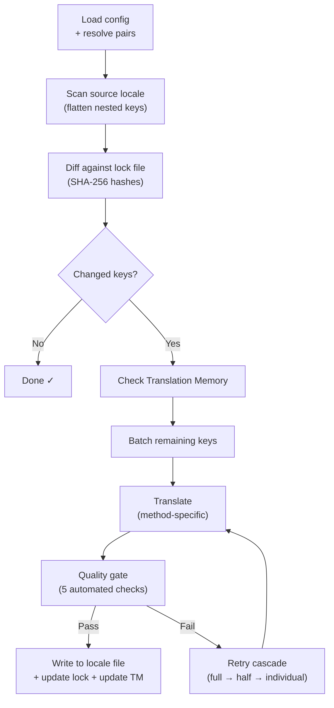

# كيف يعمل champollion

يقوم champollion بترجمة ملفات الترجمة (locale files) الخاصة بتطبيقك بأمر واحد. إليك ما يحدث خلف الكواليس.

## مسار العمل

عند تشغيل `npx champollion sync`، ينفذ champollion مسار عمل يتكون من ست مراحل:



**قرارات التصميم الرئيسية:**

- **اكتشاف التغييرات عبر تجزئات SHA-256.** يتتبع Champollion كل قيمة مصدرية باستخدام تجزئة (hash) في `.champollion.lock`. عندما تقوم بتحديث نص إنجليزي، تتم إعادة ترجمة هذا المفتاح فقط. ولهذا السبب يكون `sync` سريعاً في عمليات التشغيل المتكررة — فهو يقوم بالحد الأدنى من العمل.

- **التخزين المؤقت لذاكرة الترجمة (Translation Memory).** قبل إجراء أي استدعاء لواجهة برمجة التطبيقات (API)، يتحقق champollion من `.champollion/tm.json` بحثاً عن الترجمات المخزنة مؤقتاً (مفهرسة حسب النص المصدري + اللغة + الطريقة). في عملية المزامنة النموذجية بعد تغيير مفتاح واحد، يتم جلب 142 مفتاحاً من ذاكرة التخزين المؤقت بينما يستدعي مفتاح واحد فقط واجهة برمجة التطبيقات.

- **بوابة الجودة قبل الكتابة.** تمر كل ترجمة بخمسة فحوصات آلية (الفراغ، تكرار المصدر، حلقة الهلوسة، تضخم الطول، التوافق مع نظام الكتابة) قبل أن تُكتب في ملفاتك. يتم تسجيل حالات الفشل، ولا تُقبل أبداً بصمت.

- **إعادة المحاولة المتتالية عند الفشل.** إذا فشلت دفعة (خطأ في تحليل JSON، انتهاء مهلة API)، يعيد champollion المحاولة بدفعات أصغر تدريجياً: كاملة ← نصف ← فردية. يؤدي هذا إلى عزل المفتاح المسبب للمشكلة دون حظر البقية.

## طرق الترجمة

يدعم Champollion طرق ترجمة متعددة، كل منها مناسب لسيناريوهات مختلفة. الطرق الأساسية هي:

| الطريقة | كيف تعمل | الأنسب لـ |
|--------|-------------|----------|
| **`llm`** | موجه مهيكل (Structured prompt) لأي نموذج OpenRouter | اللغات ذات الموارد الجيدة |
| **`llm-coached`** | نفس الموجه + قواعد نحوية، قاموس، وملاحظات الأسلوب | اللغات التي ترتكب فيها النماذج اللغوية الكبيرة (LLMs) أخطاء يمكن التنبؤ بها |
| **`google-translate`** | طلب دفعة (batch request) لواجهة برمجة تطبيقات Google Cloud Translation | اللغات ذات الموارد العالية والمدعومة جيداً من ترجمة جوجل (GT) |
| **`api`** | طلب HTTP POST إلى نقطة النهاية (endpoint) الخاصة بك | مسارات العمل المخصصة، النماذج التي يتحكم فيها المجتمع |

تُكوَّن الطرق لكل زوج لغوي. قد تستخدم `google-translate` للغة الفرنسية ولكن `llm-coached` للغة الكري في السهول (Plains Cree) — يحصل كل زوج على الطريقة الأنسب له.

## بيانات التوجيه (Coaching Data)

بالنسبة للأزواج اللغوية التي تستخدم `llm-coached`، تمنح بيانات التوجيه النموذج اللغوي الكبير (LLM) معرفة لغوية صريحة: القواعد النحوية، المصطلحات الإلزامية، وتفضيلات الأسلوب. يتم حقن هذا في كل موجه كسياق مهيكل.

```json title="coaching/crk.json"
{
  "grammar_rules": ["Animate nouns take different plural forms than inanimate nouns"],
  "dictionary": {"welcome": "ᑕᓂᓯ", "settings": "ᐃᑕᐢᑌᐘᐃᓇ"},
  "style_notes": "Use Standard Roman Orthography (SRO) unless explicitly configured otherwise."
}
```

تُعد بيانات التوجيه الآلية الأساسية لتحسين جودة الترجمة دون الحاجة إلى الضبط الدقيق (fine-tuning) للنموذج. غيّر القواعد ← أعد تشغيل المزامنة ← تحقق مما إذا كان ذلك مفيداً. التكرار فوري.

## الإضافات (Plugins)

الإضافات هي وصفات ترجمة معبأة مسبقاً لأزواج لغوية محددة. إنها عبارة عن ملفات بيان (manifests) بتنسيق JSON — وليست تعليمات برمجية — تخبر champollion بالطريقة التي يجب استخدامها، والإعدادات المطلوبة، ومستوى الجودة الذي تم قياسه.

```bash
champollion plugin install ./crk-coached-v3/
champollion sync   # uses the installed plugin for en→crk
```

تسد الإضافات الفجوة بين البحث والإنتاج: الطريقة التي تسجل نتائج جيدة في [الشبكة](/arena) يمكن تعبئتها كإضافة ونشرها هنا.

## الصورة الأكبر

يُعد champollion النصف الأول من نظام بيئي يتكون من جزأين:

- **[الشبكة](/arena)** — حيث يتم **تطوير وإثبات** طرق الترجمة باستخدام قياسات أداء قابلة لإعادة الإنتاج
- **champollion** — حيث يتم **نشر** الطرق المُثبتة لترجمة محتوى حقيقي

يربط [جسر إطار التقييم (Eval Harness Bridge)](/docs/guides/bridge) بين الاثنين. الطريقة التي تثبت كفاءتها في الشبكة يتم نشرها هنا. وتعمل ملاحظات المتحدثين من بيئة الإنتاج على تحسين الإصدار التالي.

---

## تعمق أكثر

- [كيف تعمل المزامنة](/docs/concepts/how-sync-works) — شرح تفصيلي خطوة بخطوة لمسار العمل
- [بوابة الجودة](/docs/concepts/quality-gate) — الفحوصات الآلية الخمسة
- [ذاكرة الترجمة](/docs/concepts/translation-memory) — التخزين المؤقت وتوفير التكاليف
- [طرق الترجمة](/docs/guides/translation-methods) — مقارنة تفصيلية للطرق
- [البنية](/docs/concepts/architecture) — نظرة عامة على تصميم النظام
