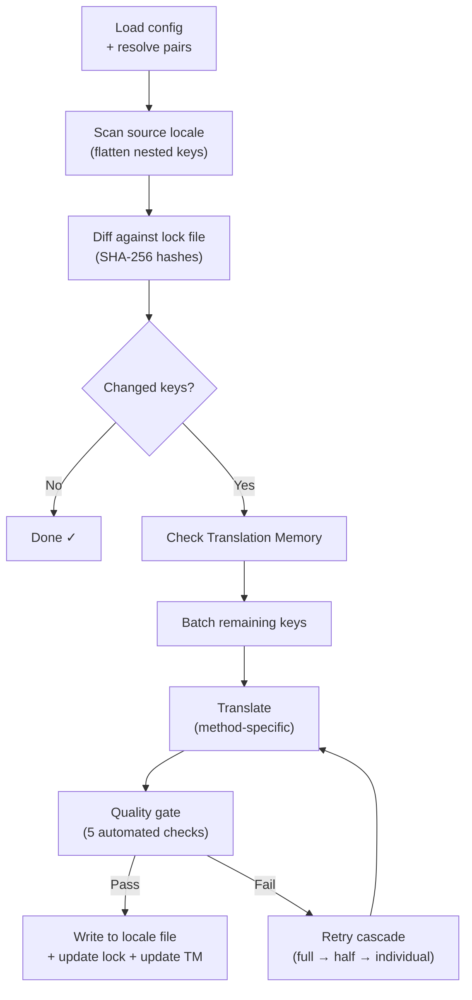

# كيف يعمل Champollion

يترجم Champollion ملفات الترجمة المحلية (locale files) لتطبيقك بأمر واحد. إليك ما يحدث خلف الكواليس.

## مسار المعالجة

عندما تشغّل `npx champollion sync`، ينفّذ Champollion مسار معالجة يتكون من ست مراحل:


```mermaid
flowchart TD
    A["Load config\n+ resolve pairs"] --> B["Scan source locale\n(flatten nested keys)"]
    B --> C["Diff against lock file\n(SHA-256 hashes)"]
    C --> D{"Changed keys?"}
    D -->|No| E["Done ✓"]
    D -->|Yes| F["Check Translation Memory"]
    F --> G["Batch remaining keys"]
    G --> H["Translate\n(method-specific)"]
    H --> I["Quality gate\n(5 automated checks)"]
    I -->|Pass| J["Write to locale file\n+ update lock + update TM"]
    I -->|Fail| K["Retry cascade\n(full → half → individual)"]
    K --> H
```

**قرارات التصميم الأساسية:**

- **اكتشاف التغييرات عبر تجزئات SHA-256.** يتتبع Champollion كل قيمة مصدرية باستخدام تجزئة في `.champollion.lock`. عندما تقوم بتحديث نص باللغة الإنجليزية، يُعاد ترجمة هذا المفتاح فقط. لهذا السبب يكون `sync` سريعًا في عمليات التشغيل المتكررة — فهو ينجز الحد الأدنى من العمل المطلوب.

- **التخزين المؤقت لذاكرة الترجمة (Translation Memory).** قبل إجراء أي استدعاء لواجهة برمجة التطبيقات (API)، يتحقق Champollion من `.champollion/tm.json` للبحث عن ترجمات مخزنة مؤقتًا (بناءً على مفتاح يتضمن: النص المصدري + اللغة المحلية + الطريقة). في عملية إعادة مزامنة نموذجية بعد تغيير مفتاح واحد، يتم جلب 142 مفتاحًا من الذاكرة المؤقتة ويُرسل مفتاح واحد فقط إلى واجهة برمجة التطبيقات.

- **بوابة الجودة قبل الكتابة.** تجتاز كل ترجمة خمسة فحوصات آلية (الفراغ، وترديد المصدر، وحلقة الهلوسة، وتضخم الطول، والتوافق مع نظام الكتابة) قبل أن تُكتب في ملفاتك. تُسجَّل حالات الفشل في السجلات، ولا يتم قبولها ضمنيًا أبدًا.

- **تتابع محاولات الإعادة عند الفشل.** إذا فشلت دفعة (خطأ في تحليل JSON، أو انتهاء مهلة API)، يعيد Champollion المحاولة بدفعات أصغر تدريجيًا: كاملة ← نصفية ← فردية. يعزل هذا المفتاح الذي يواجه المشكلة دون تعطيل بقية المفاتيح.

## طرق الترجمة

يدعم Champollion طرق ترجمة متعددة، كل منها يناسب سيناريوهات مختلفة. الطرق الأساسية هي:

| الطريقة | آلية العمل | الأنسب لـ |
|--------|-------------|----------|
| **`llm`** | مطالبة منظمة (Structured prompt) لأي نموذج OpenRouter | اللغات الغنية بالموارد |
| **`llm-coached`** | المطالبة ذاتها + قواعد نحوية ومعجم وملاحظات أسلوبية | اللغات التي ترتكب فيها نماذج اللغة الكبيرة (LLMs) أخطاء متوقعة |
| **`google-translate`** | طلب دفعات عبر Google Cloud Translation API | اللغات عالية الموارد التي تحظى بدعم جيد من GT |
| **`api`** | طلب HTTP POST لنقطة النهاية الخاصة بك | مسارات المعالجة المخصصة، والنماذج الخاضعة لإدارة المجتمع |

تُهيّأ الطرق لكل زوج لغوي على حدة. قد تستخدم `google-translate` للغة الفرنسية ولكن `llm-coached` للغة Plains Cree — يحصل كل زوج لغوي على الطريقة الأنسب له.

## بيانات التوجيه

بالنسبة للأزواج اللغوية من نوع `llm-coached`، توفر بيانات التوجيه (coaching data) لنموذج اللغة الكبير معرفة لغوية صريحة: قواعد نحوية، ومصطلحات مفروضة، وتفضيلات أسلوبية. وتُحقَن هذه البيانات في كل مطالبة كسياق منظم.

```json title="coaching/qaa.json — a made-up language (qaa is a private-use code); rule and terms are stand-ins"
{
  "grammar_rules": ["Animate nouns take a different plural ending than inanimate nouns"],
  "dictionary": {"welcome": "<your term for welcome>", "settings": "<your term for settings>"},
  "style_notes": "Use the standard Latin orthography unless the config chooses another script."
}
```

تُعدّ بيانات التوجيه الآلية الأساسية لتحسين جودة الترجمة دون الحاجة إلى ضبط دقيق (fine-tuning) للنموذج. عدّل القواعد ← أعد تشغيل المزامنة ← تحقق مما إذا كان ذلك مفيدًا. فالتكرار والتحسين فوريان.

## الإضافات (Plugins)

الإضافات هي وصفات ترجمة مجهزة مسبقًا لأزواج لغوية محددة. وهي عبارة عن ملفات بيان (manifests) بصيغة JSON — وليست كودًا برمجيًا — تخبر Champollion بالطريقة التي يجب استخدامها، والإعدادات المطلوبة، ومستوى الجودة الذي تم قياسه واختباره.

```bash
champollion plugin install ./french-formal-v1/
champollion sync   # uses the installed plugin for en→fr
```

تربط الإضافات الفجوة بين البحث وبيئة الإنتاج: فالطريقة التي تحقق نتائج جيدة في [Network](/arena) يمكن حزمها كإضافة ونشرها هنا.

## الصورة الأكبر

يمثّل Champollion نصف منظومة متكاملة تتكون من جزأين:

- **[the Network](/arena)** — حيث تُطوَّر طرق الترجمة **ويتم إثبات كفاءتها** باختبارات معيارية قابلة للتكرار
- **Champollion** — حيث تُنشر الطرق المثبتة **لترجمة** محتوى حقيقي

يربط [Eval Harness Bridge](/docs/guides/bridge) بين الجزأين؛ فالطريقة التي تُثبت جدارتها في Network تُنشر هنا، وتُسهم ملاحظات المتحدثين باللغة من بيئة الإنتاج في تحسين الإصدار التالي.

---

## لمزيد من التفاصيل

- [كيف تعمل المزامنة](/docs/concepts/how-sync-works) — شرح تفصيلي خطوة بخطوة لمسار المعالجة
- [بوابة الجودة](/docs/concepts/quality-gate) — الفحوصات الآلية الخمسة
- [ذاكرة الترجمة](/docs/concepts/translation-memory) — التخزين المؤقت وتوفير التكاليف
- [طرق الترجمة](/docs/guides/translation-methods) — مقارنة تفصيلية بين الطرق
- [البنية المعمارية](/docs/concepts/architecture) — نظرة عامة على تصميم النظام
