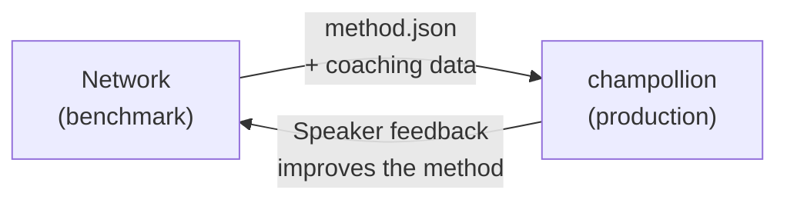

# النشر في بيئة الإنتاج

لقد أثبتَّ أنه يعمل في Network. الآن قم بنشره.

تُستخدم Network لأغراض البحث والتطوير (R&D) — بناء طرق الترجمة، وقياس أدائها، ومقارنتها. يتم **النشر في بيئة الإنتاج** من خلال [champollion](https://champollion.dev)، وهي واجهة سطر أوامر (CLI) للترجمة موجهة للمطورين. ويتصلان ببعضهما من خلال تنسيق إضافات (plugin) مشترك.



---

## مسار النشر

### 1. تصدير طريقتك كإضافة (Plugin)

قم بإنشاء بيان (manifest) `method.json` يحزم نتائج قياس الأداء الخاصة بك:

```json
{
  "name": "crk-coached-v3",
  "type": "llm-coached",
  "version": "3.0.0",
  "description": "Coached LLM translation for Plains Cree",
  "locales": ["crk"],
  "config": {
    "model": "google/gemini-2.5-flash",
    "temperature": 0.3
  },
  "benchmarks": {
    "crk": {
      "composite_score": 0.67,
      "fst_acceptance": 0.82,
      "corpus_size": 150
    }
  }
}
```

قم بتضمين أي بيانات توجيهية (قواعد نحوية، قواميس) إلى جانب البيان.

### 2. التثبيت في Champollion

```bash
champollion plugin install ./my-method-plugin/
```

### 3. تكوين الزوج اللغوي الخاص بك

```json title="champollion.config.json"
{
  "pairs": {
    "en-crk": { "method": "plugin", "plugin": "crk-coached-v3" }
  }
}
```

### 4. ترجمة محتوى حقيقي

```bash
npx champollion sync
```

طريقتك التي تم قياس أدائها تنتج الآن ترجمات حقيقية في بيئة الإنتاج.

---

## للغات الشعوب الأصلية

تتطلب الطرق التي تخدم مجتمعات لغات الشعوب الأصلية **موافقة المجتمع** قبل النشر في بيئة الإنتاج. تحكم مبادئ سيادة بيانات الشعوب الأصلية — ملكية المجتمع للبيانات اللغوية وسيطرته عليها — كيفية تطوير طرق الترجمة وتقييمها ونشرها.

الطريقة التي تصل إلى مستوى قابلية النشر (0.70+) لا تُنشر تلقائيًا — بل تُنشر **فقط إذا وحينما** تمنح الهيئة الإدارية لمجتمع اللغة موافقتها.

راجع [سيادة البيانات](/docs/network/sovereignty/data-sovereignty) و [نقل الملكية](/docs/network/sovereignty/ownership-transfer) للاطلاع على إطار الحوكمة الكامل.

---

## انظر أيضًا

- [جسر Eval Harness](https://champollion.dev/docs/guides/bridge) — شرح تفصيلي لمسار العمل من Network إلى champollion
- [مواصفات الإضافة](https://champollion.dev/docs/reference/plugin-spec) — تنسيق البيان method.json
- [دليل وكيل champollion](https://champollion.dev/docs/guides/agent-guide) — كيفية استخدام champollion للترجمة

