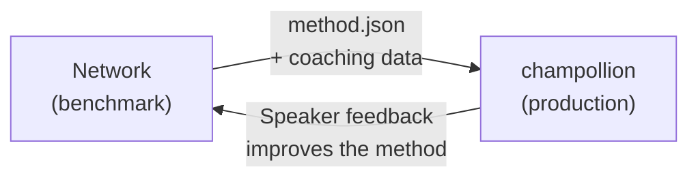

# النشر في بيئة الإنتاج

لقد أثبتّ نجاح الطريقة في Network. حان الآن وقت نشرها.

تُخصص Network للبحث والتطوير — بناء أساليب الترجمة، وتقييم أدائها القياسي، والمقارنة بينها. أما **النشر في بيئة الإنتاج** فيتم عبر [champollion](https://champollion.dev)، وهي أداة CLI للترجمة موجهة للمطورين. ويرتبط كلاهما من خلال تنسيق مكون إضافي (plugin) مشترك.


```mermaid
graph LR
    A["Network\n(benchmark)"] -->|"method.json\n+ coaching data"| B["champollion\n(production)"]
    B -->|"Speaker feedback\nimproves the method"| A
```

---

## مسار النشر

### 1. تصدير أسلوبك كإضافة (Plugin)

أنشئ بيان `method.json` يحزم نتائج التقييم القياسي الخاصة بك:

```json
{
  "name": "french-formal-v1",
  "type": "llm-coached",
  "version": "1.0.0",
  "description": "Formal-register French (example manifest; the benchmark values are illustrative)",
  "locales": ["fr"],
  "config": {
    "model": "google/gemini-2.5-flash",
    "temperature": 0.3
  },
  "benchmarks": {
    "fr": {
      "corpus_chrf": 72.3,
      "exact_match_rate": 0.42,
      "corpus_size": 500
    }
  }
}
```

قم بتضمين أي بيانات تدريبية وتوجيهية (قواعد نحوية، قواميس) إلى جانب ملف البيان.

### 2. التثبيت في Champollion

```bash
champollion plugin install ./french-formal-v1/
```

### 3. إعداد زوج اللغات الخاص بك

```json title="champollion.config.json"
{
  "pairs": {
    "en:fr": { "methodPlugin": "french-formal-v1" }
  }
}
```

### 4. ترجمة محتوى حقيقي

```bash
npx champollion sync
```

يُنتج أسلوبك الذي تم قياسه معياريًا الآن ترجمات حقيقية في بيئة الإنتاج.

---

## للغات الشعوب الأصلية

تتطلب الأساليب التي تخدم مجتمعات لغات الشعوب الأصلية **موافقة المجتمع** قبل النشر في بيئة الإنتاج. تحكم مبادئ سيادة بيانات الشعوب الأصلية — الملكية المجتمعية والتحكم في البيانات اللغوية — كيفية تطوير أساليب الترجمة، وتقييمها، ونشرها.

لا توجد أي درجة تجعل الأسلوب قابلاً للنشر بمفردها — لا نتيجة chrF++ المرتفعة، ولا تجاوز حد الجائزة. لا يتم النشر **إلا إذا ومتى** منحت الهيئة الحاكمة لمجتمع اللغة موافقتها، بعد أن يُقيّم متحدثو اللغة مخرجاتها.

راجع [سيادة البيانات](/docs/network/sovereignty/data-sovereignty) و[نقل الملكية](/docs/network/sovereignty/ownership-transfer) للاطلاع على إطار الحوكمة الكامل.

---

## انظر أيضًا

- [جسر عدة التقييم (The Eval Harness Bridge)](https://champollion.dev/docs/guides/bridge) — شرح تفصيلي لمسار العمل من Network إلى champollion
- [مواصفات المكون الإضافي](https://champollion.dev/docs/reference/plugin-spec) — تنسيق بيان method.json
- [دليل عميل champollion](https://champollion.dev/docs/guides/agent-guide) — كيفية استخدام champollion للترجمة
