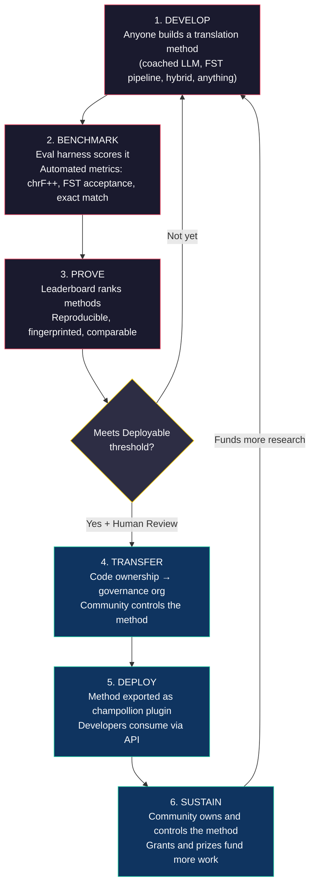
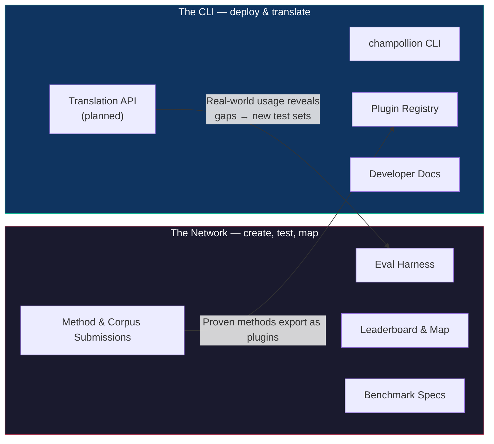
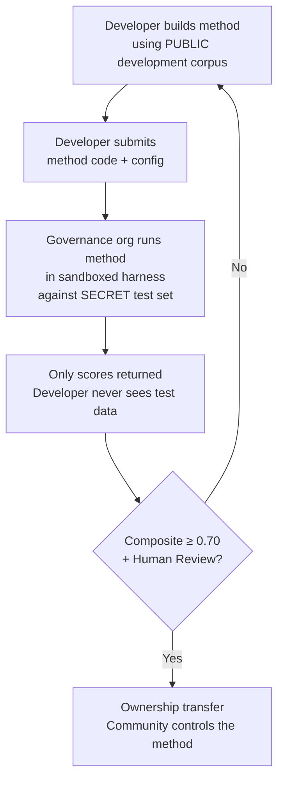

# كيف تعمل الشبكة: البناء، الاختبار، التطوير، النشر

> **ملخص تنفيذي.** إن الترجمة الآلية للغات غير المخدومة في العالم ليست مشكلة تدريب نماذج، بل هي مشكلة *بنية تحتية*. ولن يحلها نموذج أو مختبر أو شركة بمفردها. يصف هذا المستند بنية منصة تحول المجتمع العالمي من مهندسي تعلم الآلة واللغويين والمتحدثين باللغات إلى مختبر أبحاث موزع: حيث يمكن لأي شخص بناء طريقة ترجمة، وتختبر الشبكة ما إذا كانت تعمل — بما في ذلك مقابل بيانات التقييم التي يحتفظ بها المجتمع والتي لا تراها المنصة أبدًا — وتصبح الطرق الناجحة أصولًا مملوكة للمجتمعات التي تخدم لغاتها. الآلية هي تطوير طرق مفتوح وتعاوني مقترن بشروط مرنة يحددها المشرفون — وهو مزيج لا يزال نادرًا في الممارسة العملية، ونعتقد أنه ما تتطلبه هذه المشكلة.

---

> [!IMPORTANT]
> **النطاق.** تقيّم هذه المنصة **ترجمة النصوص المكتوبة الرسمية** — المستندات، والمواد التعليمية، والاتصالات الرسمية، وسلاسل واجهة المستخدم. إنها ليست روبوت محادثة، أو مترجمًا فوريًا، أو نظام محادثة غير مقيد النطاق. تصنف لوحة المتصدرين طرق الترجمة مقابل متون متوازية منسقة في نطاقات نصية محددة (انظر [Benchmark Specification §2.7](/docs/network/specifications/benchmark#27-domain) لتصنيف النطاقات). الترجمة الآلية (MT) هي بنية تحتية لإحياء اللغة، وليست بديلاً عنها. يتعلم الأطفال اللغة من الناس، وليس من الآلات.

### تغطية النطاقات الحالية

اللوحة **مباشرة وقيد التحديث** — تُنشر عمليات التشغيل عليها باستمرار، ويمكن لأي شخص إضافة المزيد. يوضح الجدول أدناه المتون المرجعية العامة *المدعومة* لكل نطاق؛ وتحتوي [لوحة المتصدرين](/leaderboard) على التصنيفات المباشرة.
تُجلب المتون من المصدر في وقت التشغيل، ولا تُستضاف هنا أبدًا.

| النطاق | المتن المرجعي | الحالة | ملاحظات |
|--------|------------------|--------|-------|
| الأخبار / الصحافة | Global Voices (OPUS) | مدعوم — مفتوح للتقديم | 493 زوجًا لغويًا، CC BY 3.0 |
| يومي / مختلط (مكتوب) | Tatoeba | مدعوم — مفتوح للتقديم | 874 زوجًا لغويًا، CC BY 2.0 |
| تعليمي / كتب مدرسية | EdTeKLA (Plains Cree) | للبحث فقط — **غير مصنف**؛ تقييم واجهة برمجة تطبيقات النموذج عن بُعد مشروط بالموافقة | ترخيص CC BY-NC-SA المعدل الخاص بـ EdTeKLA (نطاق السيادة، غير تجاري)؛ مستبعد من لوحة المتصدرين، والجوائز، ومسارات واجهة برمجة التطبيقات/التجارية |
| سردي / أدبي | — | مخطط له | لم يُربط أي متن قابل للتشغيل بعد |
| ديني / نصوص مقدسة | FLORES+ (Bible-domain) | مربوط، نسبي فقط | متن قابل للتشغيل؛ تلوث عالٍ، لذا فهو نسبي فقط — لا يُستخدم أبدًا للتقييم الرسمي |
| منطوق / في الوقت الفعلي | — | خارج النطاق | يقيّم هذا النظام النصوص المكتوبة، وليس الكلام |
| تقني / علمي | — | مستقبلي | يتطلب التحقق من المصطلحات الخاصة بالنطاق |

## ما هو الغرض من الشبكة

قبل الآليات، المهمة. تستند شبكة Champollion إلى أربعة التزامات:

1. **إنشاء مجموعات اختبار ترجمة موثوقة.** بالنسبة لمعظم اللغات، الشيء النادر والقيم ليس نموذجًا آخر — بل هو مجموعة اختبار *موثوقة*: من تأليف بشري، وصادقة النطاق، ومثبتة الإصدار. وُجدت الشبكة لإنشاء مجموعات الاختبار هذه وجعلها موثوقة.
2. **جعل المجال قابلاً للتنقل.** من يمكنه ترجمة ماذا، ومدى جودة كل طريقة في كل نوع من النصوص، وأين تكمن الفجوات — تُعرض كخريطة عامة، وليست مدفونة في أوراق بحثية وملفات PDF متناثرة.
3. **نرحب بكل طريقة — بشرية كانت أم آلية.** نحن براغماتيون نميل إلى الحلول. المترجم المحترف، والنظام القائم على القواعد، والنموذج اللغوي الكبير (LLM) الموجه، والنموذج المضبوط بدقة — كلها من الدرجة الأولى. نهتم بترجمة اللغات، وليس بالأداة التي تفوز.
4. **مبنية *مع* المجتمعات، ولا تُكشط أبدًا — والسيادة غير قابلة للتفاوض.** البيانات اللغوية هي بيانات حيوية؛ والأشخاص الذين يقدمون المتن يمتلكون مفاتيحه، ومفاتيح أي شيء يُقاس مقابله.

كل ما يلي — الحلقة، وإطار التقييم، ولوحة المتصدرين، وجسر النشر — يخدم هذه الالتزامات الأربعة.

---

## 1. المشكلة: الترجمة الآلية ≠ تعلم الآلة

غالبًا ما تُصاغ الترجمة الآلية للغات منخفضة الموارد (LRLs) كمشكلة تعلم آلة: جمع البيانات، وتدريب نموذج، ثم النشر. هذه الصياغة خاطئة، والخطأ له عواقب — فهو يوجه التمويل والمواهب والبنية التحتية نحو نهج لا يمكن أن ينجح هيكليًا مع غالبية لغات العالم.

### 1.1 لماذا تفشل صياغة تعلم الآلة

يتطلب مسار تعلم الآلة القياسي للترجمة الآلية ثلاثة أشياء: متون متوازية كبيرة، ومعايير تقييم معتمدة، ومسار نشر. بالنسبة للغات الـ 194 المدرجة في قائمة Google Cloud Translation والـ 200 لغة التي يغطيها NLLB-200، تتوفر الثلاثة. أما بالنسبة للغات الـ 1,200 تقريبًا في الذيل الطويل لـ OMT-1600 — حساباتنا: الـ 1,600 التي يغطيها ناقص الـ 400+ التي يفيد مؤلفوها بأن النماذج "تفهمها جيدًا بما يكفي" — توجد بيانات تقييم ولكن الجودة في الغالب أقل من الحدود القابلة للاستخدام، وأوزان النموذج غير متاحة للجمهور، ولا يوجد مسار نشر. أما بالنسبة للغات الـ 5,400+ المتبقية، فلا يوجد أي منها على الإطلاق.

| المتطلب | اللغات عالية الموارد | الذيل الطويل لـ OMT-1600 (~1,200 لغة منخفضة الموارد) | اللغات الـ ~5,400 المتبقية |
|-------------|------------------------|-------------------------------|---------------------------|
| **المتون المتوازية** | ملايين أزواج الجمل (Europarl، UN Corpus، OpenSubtitles) | نصوص ثنائية في النطاق الديني، كشط الويب، ترجمة عكسية اصطناعية. لا توجد بيانات منسقة من المجتمع. | مئات إلى بضعة آلاف، إن وجدت |
| **معايير التقييم** | WMT، FLORES، NTREX — موحدة، قابلة للتكرار | BOUQuET (النطاق الديني)، met-BOUQuET. لا يوجد تحقق صرفي. لا يوجد تقييم مستقل. | لا توجد معايير قياسية؛ تقييم مخصص |
| **مسار النشر** | Google Translate، DeepL، Azure — واجهات برمجة تطبيقات تجارية | أوزان النموذج غير منشورة. لا توجد واجهة سطر أوامر (CLI)، ولا نظام إضافات، ولا واجهة برمجة تطبيقات قابلة للنشر من قبل المجتمع. | لا شيء. لا واجهة برمجة تطبيقات، ولا منتج، ولا سوق. |

ينجح نهج تعلم الآلة عندما تتوفر البيانات للتدريب عليها والسوق للنشر فيه. لقد وسّع OMT-1600 الشرط الأول بشكل كبير — لكن التوسع دون تحقق مستقل من الجودة، أو تحقق صرفي، أو حوكمة مجتمعية هو توسع بلا ثقة. المشكلة ليست مجرد "نحن بحاجة إلى نموذج أفضل" — بل هي "نحن بحاجة إلى بنية تحتية تثبت أن النموذج يعمل، بشروط يتحكم فيها المجتمع."

### 1.2 ما تتطلبه الترجمة الآلية للغات منخفضة الموارد فعليًا

الترجمة للغات غير المخدومة ليست في المقام الأول مشكلة تدريب. إنها مشكلة **هندسة طرق** — التحدي المتمثل في تجميع الموارد المتاحة (النماذج اللغوية الكبيرة، والأدوات الصرفية، والمعرفة المجتمعية، والقواعد اللغوية) في مسارات ترجمة فعالة، ثم إثبات أنها تعمل من خلال تقييم صارم.

هذا التمييز مهم:

| البعد | نهج تعلم الآلة | نهج هندسة الطرق |
|-----------|------------|---------------------------|
| **النشاط الأساسي** | تدريب نموذج على البيانات | دمج الأدوات، والمطالبات، والمعرفة اللغوية في مسار عمل |
| **عنق الزجاجة** | حجم البيانات المتوازية | الإبداع الهندسي + البنية التحتية للتقييم |
| **من يمكنه المساهمة** | فرق تمتلك مجموعات وحدات معالجة الرسومات (GPU) ومجموعات بيانات | أي شخص لديه مفتاح واجهة برمجة تطبيقات، وقاموس، وفكرة |
| **التقييم** | BLEU/chrF على مجموعات اختبار محتجزة | التحقق الصرفي + المراجعة البشرية + المقاييس الآلية |
| **النشر** | تقديم النموذج | حزم الطريقة كإضافة (plugin) |

تحتوي النماذج اللغوية الكبيرة (LLMs) الحديثة بالفعل على معرفة كامنة بالعديد من اللغات منخفضة الموارد — بما يكفي لإنتاج مخرجات *تبدو* معقولة. المشكلة هي أن هذه المخرجات غالبًا ما تكون غير صالحة صرفيًا (يهلوس النموذج بأشكال كلمات غير موجودة في اللغة). التحدي الهندسي هو: كيف تستخرج ما يعرفه النموذج اللغوي الكبير، وتتحقق منه مقابل الواقع اللغوي، وتحزم النتيجة للاستخدام في الإنتاج؟

لهذا السبب نقوم بقياس أداء **الطرق**، وليس النماذج. الطريقة هي الوصفة الكاملة: اختيار النموذج + هندسة المطالبات + استخدام الأدوات + المعالجة المسبقة/اللاحقة + بيانات التوجيه + استراتيجيات إعادة المحاولة. سيحصل فريقان يستخدمان نفس النموذج بطرق مختلفة على درجات مختلفة. هذا هو بيت القصيد.

### 1.3 لماذا تكسر اللغات متعددة التركيب كل شيء

العديد من اللغات الأقل خدمة في العالم هي لغات **متعددة التركيب (polysynthetic)** — فهي تشفر جملاً كاملة في كلمات مفردة من خلال عمليات صرفية إنتاجية. تأمل كلمة Plains Cree:

> **ê-kî-nitawi-kîskinwahamâkosiyân**
> *"عندما ذهبت إلى المدرسة"*

كلمة واحدة. تشفر الزمن (الماضي)، والاتجاه (الذهاب إلى)، والجذر (التعلم)، والصيغة (المبني للمجهول/المنعكس)، والشخص (المتكلم المفرد). تحتاج الإنجليزية إلى ست كلمات للتعبير عما تعبر عنه لغة Cree في كلمة واحدة.

هذا يكسر الترجمة الآلية القياسية على كل المستويات:

- **التقطيع (Tokenization)** — تقوم خوارزميات BPE و SentencePiece بتمزيق الكلمات متعددة التركيب إلى أجزاء لا معنى لها، لأنها صُممت للصرف الإلصاقي.
- **الهلوسة** — تنتج النماذج اللغوية الكبيرة سلاسل تبدو معقولة ولكنها ليست كلمات صالحة. لا يستطيع غير المتحدث باللغة التمييز بينها. بدون التحقق الصرفي، تكون الهلوسات غير مرئية.
- **التقييم** — تعاقب المقاييس على مستوى الكلمة (BLEU) التباين التصريفي الطبيعي الذي يعد أساسيًا لكيفية عمل هذه اللغات. المقاييس على مستوى الحرف (chrF++) أفضل ولكنها لا تزال غير كافية بدون تحقق هيكلي.

الحل ليس نموذجًا أكبر أو بيانات تدريب أكثر. بل هو **بنية تحتية تلتقط الهلوسات قبل أن تصل إلى المستخدمين** — محللات صرفية (FSTs) يمكنها القول بشكل قاطع "هذه ليست كلمة في هذه اللغة."

---

## 2. لماذا لا تنجح المناهج الحالية

### 2.1 الترجمة الآلية التجارية

تاريخيًا، حسّنت خدمات الترجمة التجارية من أجل حجم السوق. يمثل OMT-1600 من Meta (مارس 2026) تحولًا كبيرًا — 1,600 لغة في نظام واحد. ولكن بالنسبة للغات الـ 1,200 تقريبًا في ذيله الطويل (حساباتنا: 1,600 ناقص الـ 400+ التي يفيد مؤلفوها بأن النماذج "تفهمها جيدًا بما يكفي")، فإن الجودة أقل من الحدود القابلة للاستخدام، وأوزان النموذج غير متاحة، ولا يوجد مسار نشر. لقد تطورت مشكلة الحوافز الهيكلية: يمكن لشركات التكنولوجيا الكبرى الآن بناء نماذج للغات منخفضة الموارد، ولكن بدون تقييم مستقل، أو تحقق صرفي، أو حوكمة مجتمعية، فإن التغطية وحدها لا تحل المشكلة.

### 2.2 البحث الأكاديمي

تركز أبحاث الترجمة الآلية الأكاديمية بشكل كبير على أزواج اللغات عالية الموارد لأن هذا هو المكان الذي توجد فيه بيانات التدريب، والمهام المشتركة، وأماكن النشر. يعاني الباحثون الذين يعملون على أزواج منخفضة الموارد في النشر، وفي تمويل الحوسبة، وفي النشر — لأن البنية التحتية للنشر للغات منخفضة الموارد غير موجودة.

### 2.3 المسابقات لمرة واحدة

يمكنك إجراء مسابقة على Kaggle: "الإنجليزية←Plains Cree، أفضل chrF++ يفوز بـ 10,000 دولار." إليك ما يحدث:

1. يفوز شخص ما، ويقدم دفتر ملاحظات (notebook)، ويستلم الجائزة، ويعود إلى منزله.
2. يتعفن دفتر الملاحظات في أرشيف Kaggle. لا أحد ينشره. لا أحد يصونه.
3. تُنشر مجموعة الاختبار في النهاية — ملوثة إلى الأبد.
4. رفعت منظمة الحوكمة بياناتها اللغوية إلى البنية التحتية لشركة Google بموجب شروط خدمة Google، دون سيطرة حقيقية على دورة الحياة.
5. لا يوجد جسر نشر. دفتر الملاحظات الفائز ليس واجهة برمجة تطبيقات (API) تعمل.

المكافأة لمرة واحدة تجذب صائدي المكافآت. أما لوحة المتصدرين المستمرة مع الحوكمة المجتمعية فتخلق تفاعلًا مستدامًا.

### 2.4 الضبط الدقيق (Fine-Tuning)

الضبط الدقيق لنموذج مفتوح على نص متوازٍ هو نهج تعلم الآلة الواضح. ولكن بالنسبة لمعظم اللغات منخفضة الموارد، فإن المتن المتوازي اللازم للضبط الدقيق هو بالضبط البيانات غير الموجودة — وإنشاؤها يتطلب نفس المتحدثين ثنائيي اللغة والمشاركة المجتمعية التي يُفترض أن يحل الضبط الدقيق محلها. لا يمكنك الخروج من مشكلة ندرة البيانات باستخدام تقنية تتطلب بيانات.

---

## 3. الحل: تطوير الطرق التعاوني مع التقييم السيادي

تقلب المنصة النهج التقليدي: بدلاً من فريق واحد يبني نموذجًا واحدًا، **يقوم المجتمع العالمي ببناء واختبار طرق الترجمة معًا**، وتتحقق الشبكة مما يعمل، وتُنشر الطرق الناجحة في الإنتاج مع احتفاظ مجتمع اللغة بالملكية والسيطرة.

### 3.1 الحلقة الكاملة

لكل مرحلة وظيفة محددة:

| المرحلة | ما يحدث | من المستفيد |
|-------|-------------|--------------|
| **التطوير (Develop)** | يقوم باحث أو طالب أو هاوٍ ببناء طريقة ترجمة باستخدام أي أدوات يريدها — مطالبات النماذج اللغوية الكبيرة، مسارات FST، قواميس، نماذج مضبوطة بدقة، أنظمة قائمة على القواعد، أو هجينة | المساهم يتعلم، ويجرب، وينشر |
| **القياس (Benchmark)** | يقوم إطار التقييم بتسجيل الطريقة مقابل متن موحد بمقاييس قابلة للتكرار. تنتج كل عملية تشغيل [بطاقة تشغيل](/docs/network/specifications/benchmark#3-run-card-schema) — سجل كامل لما تم اختباره وكيف كان أداؤه | يحصل الباحثون على نتائج قابلة للتكرار والمقارنة |
| **الإثبات (Prove)** | تظهر النتائج على لوحة المتصدرين العامة. تُصنف الطرق، وتُقارن، وتُفحص. يرى المجتمع ما ينجح وما لا ينجح | يكتسب الجميع رؤية واضحة لأحدث ما توصلت إليه التكنولوجيا |
| **النقل (Transfer)** | بالنسبة للغات الأصلية، الطرق التي تصل إلى عتبة القابلية للنشر (مركب ≥ 0.70) وتجتاز التحقق البشري، تُنقل ملكية كودها إلى منظمة الحوكمة الخاصة بمجتمع اللغة | يمتلك المجتمع الطريقة بالكامل — الكود، والأوزان، وقرارات النشر |
| **النشر (Deploy)** | تُصدّر الطريقة كإضافة [champollion](https://github.com/gamedaysuits/Champollion) يمكن للمجتمع تشغيلها على بنيته التحتية الخاصة. يستهلك المطورون الترجمات دون الحاجة إلى فهم الطريقة الأساسية | يحصل المطورون على ترجمة للغات لا تخدمها واجهات برمجة التطبيقات التجارية |
| **الاستدامة (Sustain)** | تمويل المنح والجوائز المدعومة — والتي يسعى المشروع بنشاط للحصول عليها؛ فهو ممول ذاتيًا اليوم — تدفع مقابل المزيد من المتون، والتحقق من قبل المتحدثين، والأبحاث. Champollion غير تجاري ولا يأخذ أي حصة من أي شيء يكسبه المجتمع من أصل يمتلكه | العمل المدفوع على المتون والطرق المملوكة للمجتمع تدوم أطول من أي منحة فردية |

### 3.2 لماذا ينجح التعاون المفتوح

المشاركة المفتوحة ليست عرضية — إنها الآلية. إليك السبب:

**تنوع المناهج.** قد تكون أفضل طريقة لـ الإنجليزية←Plains Cree هي نموذج لغوي كبير موجه ومقيد بـ FST. قد تكون الأفضل لـ الإنجليزية←Quechua هي مسار عمل معزز بقاموس. قد تكون الأفضل لـ الإنجليزية←Inuktitut هي نموذج مضبوط بدقة ومبني من متن Nunavut Hansard. لن يهيمن فريق واحد أو نهج واحد على جميع اللغات. تكشف لوحة المتصدرين عن *أنواع* المناهج التي تنجح مع *أنواع* اللغات — وهي نتيجة وصفية (meta-result) تمثل في حد ذاتها مساهمة بحثية.

**التفاعل المستدام.** لوحة المتصدرين لا تنتهي أبدًا. هناك دائمًا طريقة أفضل يمكن بناؤها. كل تقديم يتبرع بجهد حاسوبي وفكري لحل المشكلة. على عكس المنحة لمرة واحدة، تولد العملية المفتوحة والمستمرة استثمارًا بحثيًا مستدامًا من المجتمع العالمي.

**حاجز دخول منخفض.** تحتاج إلى مفتاح واجهة برمجة تطبيقات، وقاموس، وفكرة. إطار التقييم مفتوح المصدر. تنسيق المتن هو JSON بسيط. يمكن لطالب لغويات أن يضاهي مختبرًا جيد الموارد — وأحيانًا يتفوق عليه، لأن المعرفة بالمجال (فهم اللغة) يمكن أن تفوق الموارد الحاسوبية.

**جسر النشر.** نفس الطريقة التي تسجل نتائج جيدة في إطار التقييم تُنشر في الإنتاج بتغيير تكوين واحد. "أثبتها هنا، وانشرها هناك." هذه هي الفجوة التي لا تسدها Kaggle، والمهام المشتركة لـ WMT، والمنشورات الأكاديمية.

### 3.3 بنية المنصة

champollion.dev هو **مركز واحد بوجهين**. يستضيف نفس الموقع الشبكة — حيث تُنشأ مجموعات الاختبار، وتُقيّم الطرق، وتُعيّن النتائج — وواجهة سطر الأوامر (CLI)، حيث تُنشر الطرق المثبتة في مشاريع حقيقية. يتشاركان في نطاق واحد، ومجموعة واحدة من المستندات، وطبقة بيانات واحدة؛ تصف التسميات أدناه *دورين*، وليس موقعين.

**[الشبكة](/docs/network/)** هي ساحة الإثبات. جمهورها هم المترجمون، واللغويون، والمجتمعات، والباحثون. كل شيء هنا يتعلق بإنشاء مجموعات اختبار، وتقييم الطرق مقابلها — بشرية كانت أم آلية — وتحديد أماكن الفجوات.

**[واجهة سطر الأوامر (CLI)](https://champollion.dev)** هي جانب النشر. جمهورها هم المطورون الذين يحتاجون إلى ترجمة لتطبيقاتهم. لا يحتاجون إلى فهم كيفية عمل الطريقة — بل يقومون باستدعائها فقط.

الجسر بين الوجهين هو **الطريقة**: تُنشأ وتُعتمد على الشبكة، وتُحزم للنشر من خلال واجهة سطر الأوامر (CLI)، و— بالنسبة للغات المجتمع — يمتلكها المجتمع.

---

## 4. التقييم السيادي: لماذا تهم البنية التحتية

البنية التحتية للتقييم ليست تفصيلاً تقنيًا — إنها جوهر نموذج السيادة. التقييم القياسي (رفع مجموعة الاختبار الخاصة بك إلى منصة مشتركة) لا ينجح مع اللغات الأصلية لأنه يتنازل عن السيطرة على البيانات اللغوية.

### 4.1 آلية السيادة

لا يرى المطور أبدًا بيانات التقييم الذهبية. يقوم بالتطوير مقابل متن تطوير عام، ثم يقدم كود طريقته إلى منظمة الحوكمة، التي تقوم بتشغيله في بيئة معزولة (sandbox) مقابل مجموعة الاختبار السرية. تعود الدرجات فقط. هذا ليس مجرد أمان — بل هو مبني باتجاه **مبادئ سيادة بيانات الشعوب الأصلية** التي تقتضيها ملكية المجتمع للبيانات اللغوية وسيطرته عليها. ما إذا كان يفي بها ليس قرارنا: التحديد يعود للمجتمعات المعنية.

### 4.2 لماذا لا يمكن تشغيل هذا على منصة شخص آخر

على Kaggle، ترفع منظمة الحوكمة بياناتها اللغوية إلى البنية التحتية لشركة Google بموجب شروط خدمة Google. لا يمكنهم إبطال الوصول وفقًا لجدولهم الزمني الخاص. لا يمكنهم إرفاق شروط قانونية مخصصة (مثل نقل الملكية) بالتقديمات. ليس لديهم ضمان تشفيري بأن البيانات لن تُستخدم لأغراض أخرى. سيادة البيانات تعني أن المجتمع يتحكم في نقطة نهاية التقييم، ويمتلك المفاتيح، ويمكنه إغلاقها.

---

## 5. فلسفة التقييم: التقييم الدقيق (Microeval) و LYSS

صُممت مقاييس الترجمة الآلية القياسية (BLEU، chrF++، COMET) للتعميم عبر اللغات. هذه العمومية هي نقطة قوتها — ونقطة ضعفها. بالنسبة للغات متعددة التركيب، فإن الكلمة غير الصالحة صرفيًا والتي تشترك في n-grams الحرفية مع المرجع تسجل نتيجة جيدة في chrF++ ولكن سيتعرف عليها أي متحدث على أنها كلام فارغ.

**تطوير التقييم الدقيق (Microeval)** يعني بناء مقاييس تقييم مصممة خصيصًا للغات معينة باستخدام أفضل الأدوات اللغوية المتاحة. يُسمى الإطار **LYSS** (الإنتاجية المستنيرة لغويًا والتقييم الهيكلي):

| المكون | ما يقيسه | الأداة | الحالة |
|-----------|-----------------|------|--------|
| **LYSS-fst** | الصلاحية الصرفية | محول الحالة المحدودة (Finite-state transducer) | ✅ مُنفذ (Plains Cree) |
| **LYSS-eq** | التكافؤ اللغوي | قواعد المتغيرات المنسقة من قبل اللغويين | ✅ مُنفذ (Plains Cree) |
| **LYSS-sem** | الحفاظ الدلالي | نماذج دلالية خاصة باللغة | ✅ مُنفذ (Plains Cree) |

تعمل المقاييس العالمية (chrF++، BLEU) كخطوط أساس وكإشارات أساسية للغات التي لا تحتوي على أدوات LYSS. أينما توجد أدوات خاصة باللغة، تحمل مكونات LYSS وزن التقييم — لأن الأشياء الأكثر أهمية لكل لغة هي الأشياء التي لا يمكن قياسها إلا بواسطة أدوات خاصة باللغة.

للحصول على مواصفات LYSS الكاملة ومنطق التقييم المركب، انظر [SCORING_SPEC.md §4](/docs/network/specifications/scoring#4-composite-score).

> [!WARNING]
> **قابلية المقارنة عبر عمليات التشغيل.** عند مقارنة عمليات التشغيل ذات التوافر المختلف للمقاييس (على سبيل المثال، عملية تشغيل تحتوي على درجات FST، وأخرى لا تحتوي)، فإن الدرجات المركبة غير قابلة للمقارنة بشكل مباشر. يقوم المركب بالتطبيع مع المقاييس المتاحة، ولكن عملية التشغيل التي تم تقييمها على 5 مقاييس تحمل معلومات أكثر من تلك التي تم تقييمها على 2. تشير لوحة المتصدرين إلى تغطية المقاييس لكل إدخال.

---

## 6. من يخدم هذا

### لمهندسي وباحثي تعلم الآلة

لوحة متصدرين مفتوحة بمعايير موحدة لأزواج اللغات التي لا تغطيها أي مهمة مشتركة. أعد إنتاج أي نتيجة باستخدام إطار التقييم. انشر طريقتك. تغلب على أعلى درجة. يتم أخذ بصمة لكل تقديم لتكوين معين وإصدار مجموعة بيانات — لا يوجد غموض حول ما تم اختباره.

### لمجتمعات اللغات

الملكية والسيطرة على تكنولوجيا الترجمة المبنية للغتك. تعني الديناميكية التنافسية أن فرقًا متعددة تعمل على لغتك في وقت واحد — أنت تستفيد منها جميعًا وتمتلك النتيجة. تتدفق الفائدة من خلال الملكية، والإسناد، والقدرة، وشروط البيانات التي يحكمها المجتمع — وليس أبدًا حصة من الإيرادات: Champollion غير تجاري ولا يأخذ أي نسبة من أي شيء يكسبه المجتمع من أصل يمتلكه.

### للممولين ومراجعي المنح

مقاييس شفافة وقابلة للتكرار لتقييم مقترحات أبحاث الترجمة. نتائج قابلة للقياس تتجاوز المنشورات: مقاييس الجودة بمرور الوقت، وتغطية اللغة، والمتون المبنية والمسجلة تحت سيطرة المشرفين، وساعات المتحدثين المدفوعة المقدمة للمجتمعات. تصبح الطريقة الناجحة أصلًا مملوكًا للمجتمع يعمل على بنية تحتية مفتوحة للتقييم — يتضاعف تأثير المنحة من خلال الطرق القابلة لإعادة الاستخدام والمعايير العامة بدلاً من أن ينتهي بانتهاء التمويل.

### للمطورين

ترجمة للغات لا تخدمها أي واجهة برمجة تطبيقات تجارية. أمر واجهة سطر أوامر واحد (`npx champollion sync`) يترجم ملفات الترجمة (locale files) الخاصة بك باستخدام طرق أثبتها المجتمع. استخدم Google Translate للفرنسية، ونموذج لغوي كبير موجه لـ Plains Cree، وواجهة برمجة تطبيقات مجتمعية لـ Quechua — كل ذلك في نفس المشروع، وكل ذلك بنفس الواجهة.

### للطلاب

تحدٍ مفتوح ذو تأثير في العالم الحقيقي. قم ببناء طريقة ترجمة للغة غير مخدومة، وقس أداءها، وانشر نتائجك. البنية التحتية مجانية، ومجموعات البيانات مفتوحة، ولا تهتم لوحة المتصدرين بما إذا كنت في إحدى أفضل 10 جامعات أو تعمل من محطة في مكتبة.

---

## 7. السياق الاجتماعي والتقني

### 7.1 إحياء اللغة يتسارع

تتزايد جهود إحياء اللغة في جميع أنحاء العالم. تتوسع مدارس الانغماس، وأعشاش لغة المجتمع، ومشاريع الأرشفة الرقمية عبر مجتمعات السكان الأصليين في كندا، والولايات المتحدة، وأستراليا، ونيوزيلندا، وشمال أوروبا. تحتاج هذه الجهود إلى التكنولوجيا — وتحديدًا، تكنولوجيا الترجمة التي تحترم سيادة المجتمع على البيانات اللغوية.

### 7.2 النماذج اللغوية الكبيرة غيرت خط الأساس

قبل عام 2023، كان بناء أي قدرة ترجمة آلية للغة متعددة التركيب يتطلب خبرة كبيرة في معالجة اللغات الطبيعية (NLP)، وتدريب نماذج مخصصة، وميزانيات حوسبة كبيرة. لقد غيرت النماذج اللغوية الكبيرة الحديثة خط الأساس: يمكن لمطالبة مصاغة جيدًا مع بيانات توجيه وتحقق صرفي أن تنتج ترجمات قابلة للاستخدام لبعض أزواج اللغات — دون الحاجة إلى تدريب. هذا يقلل بشكل كبير من حاجز الدخول لتطوير الطرق. لقد تحولت المشكلة من "كيف نبني نموذجًا؟" إلى "كيف نبني مسار عمل يتحقق ويصحح ما ينتجه النموذج؟"

### 7.3 قياس مفتوح وقابل للتكرار

لقد أعاد التقييم العام والمشترك تشكيل كيفية تعلم المجال لما ينجح. أظهرت Chatbot Arena، و LMSYS، و Hugging Face Open LLM Leaderboard أن القياس المفتوح والقابل للتكرار — يمكن لأي شخص تشغيله، ويمكن لأي شخص التحقق منه — يبرز التقدم الحقيقي بشكل أسرع من الادعاءات المغلقة والمبلغ عنها ذاتيًا. نحن نأخذ هذا الدرس، وليس ثقافة البطولات، ونوجهه نحو الترجمة لآلاف اللغات حيث لا توجد الترجمة الآلية التجارية أو لم يتم التحقق منها بشكل مستقل. الهدف هو خريطة مشتركة وقابلة للتحقق لما ينجح مع أي لغات وأي أنواع من النصوص — وليس تصنيفًا لمن تغلب على من.

### 7.4 سيادة بيانات السكان الأصليين غير قابلة للتفاوض

مبادئ سيادة بيانات الشعوب الأصلية — ملكية المجتمع للبيانات اللغوية وسيطرته عليها — ومبادئ CARE (المنفعة الجماعية، وسلطة السيطرة، والمسؤولية، والأخلاق)، وأطر العمل مثل Te Mana Raraunga (Māori Data Sovereignty) ليست إضافات اختيارية — إنها متطلبات هيكلية لأي تكنولوجيا تمس الموارد اللغوية للسكان الأصليين. تم بناء البنية التحتية للتقييم لدينا لتتوافق مع هذه المبادئ معماريًا، وليس فقط في بيانات السياسة — وما إذا كانت تفي بها هو تحديد يعود للمجتمعات، وليس لنا.

---

## 8. التوترات والقيود {#8-tensions-and-limitations}

يستخدم هذا المشروع آلية غربية — القياس التنافسي — لخدمة أنظمة المعرفة التي غالبًا ما تكون مجتمعية، وعلائقية، وموجهة من قبل كبار السن. هذا التوتر حقيقي ويجب تسميته، وليس حله بالتأكيد.

**القياس مقابل المعرفة المجتمعية.** تصنف لوحات المتصدرين الأفراد وتحسن الدرجات العددية. تؤكد تقاليد المعرفة الأصلية على السلطة العلائقية، والتصحيح المجتمعي، والشرعية القائمة على العلاقات. لا يمكننا الادعاء بخدمة أنظمة المعرفة هذه بينما نبني منصة آليتها الأساسية هي التحسين التنافسي الفردي. بنية السيادة (§4) — حيث تمتلك المجتمعات الطرق، وتتحكم في التقييم، وتقرر ما يتم نشره — هي استجابتنا الهيكلية، لكنها لا تبدد التوتر. لوحة المتصدرين تظل لوحة متصدرين.

**ما نفعله حيال ذلك.** تدعم المنصة تقديمات الفرق والمجتمعات إلى جانب التقديمات الفردية. تؤطر لوحة المتصدرين النتائج على أنها "أحدث ما توصلت إليه التكنولوجيا حاليًا" بدلاً من "من يفوز". منظمة الحوكمة — وليس درجة لوحة المتصدرين — هي التي تحدد ما يتم نشره. لا تمنح أي درجة آلية المطور الحق في أي شيء؛ المجتمع هو من يقرر. ونحافظ على حلقة ملاحظات استشارية مستمرة مع المجتمعات الشريكة حول ما إذا كان تأطير المنصة وهيكل الحوافز يخدمهم. إذا لم يكن كذلك، فإننا نغيره.

**الترجمة الآلية ليست إحياءً.** الترجمة تحول النص بين اللغات. الإحياء يخلق متحدثين جدد. نظام الترجمة الآلية المثالي لا يحل مشكلة النقل، أو مشكلة المكانة، أو المشكلة التربوية. بل قد يخلق وهمًا بأن "الكمبيوتر يمكنه التحدث باللغة"، مما يقوض الحاجة الملحة للنقل البشري. نحن نبني الترجمة الآلية كبنية تحتية — مسودة ترجمة للتحرير اللاحق، وأدوات صرفية لتطبيقات تعلم اللغة، ونفوذ سياسي للمجتمعات التي تطالب بخدمات بلغتها — وليس كبديل للنقل بين الأجيال. يتحكم المجتمع في ما إذا كان سيتم نشر التكنولوجيا، ومتى، وكيف.

يوجد هذا القسم لأن هذه التوترات تم تحديدها في نقد مدعو (مايو 2026) والتزمنا بتسميتها علنًا بدلاً من دفنها في مستندات داخلية.

> [!NOTE]
> **درجات لوحة المتصدرين هي وكلاء آليون.** جميع الدرجات المعروضة على لوحة المتصدرين هي قياسات آلية محسوبة بواسطة إطار التقييم تحت ظروف خاضعة للرقابة. إنها تشير إلى الأداء النسبي للطريقة ولكنها لا تشكل ضمانات للجودة. يتم تمييز الطرق المعتمدة من المجتمع بشكل منفصل. لا تمنح أي درجة آلية المطور الحق في النشر — منظمة الحوكمة هي التي تتخذ هذا القرار.

---

## 9. الحالة الحالية

### ما هو موجود اليوم

- **champollion** — أداة واجهة سطر الأوامر (CLI). طرق ترجمة متعددة، وتكوين لكل زوج، وبوابات جودة، ودعم لتنسيقات ملفات الترجمة (locale files) الشائعة.
- **MT Eval Harness** — إطار تقييم يعمل. تم تنفيذ مقاييس chrF++، وقبول FST، والتطابق التام. تم الانتهاء من مخطط بطاقة التشغيل. أخذ البصمات والتحقق من النزاهة يعملان.
- **EDTeKLA Dev v1** — متن تقييم Plains Cree (ترخيص CC BY-NC-SA المعدل الخاص بـ EdTeKLA — نطاق السيادة، غير تجاري)، مصدره مجموعة أبحاث EdTeKLA بجامعة ألبرتا. مستبعد من لوحة المتصدرين، والجوائز، ومسار واجهة برمجة التطبيقات/التجاري (ترخيص غير تجاري)؛ تُذكر أعداد الإدخالات مرة واحدة في [صفحة مجموعات بيانات التقييم](/docs/network/leaderboard/datasets#edtekla-development-set-v1).
- **FLORES+ Devtest** — 1,012 جملة × 870 زوجًا لغويًا مفهرسًا (CC BY-SA 4.0).
- **موقع الشبكة** — موقع توثيق مبني على Docusaurus يحتوي على لوحة المتصدرين، والمواصفات، والبرامج التعليمية، وإطار السيادة.
- **Benchmark Specification** — [المواصفات الأساسية](/docs/network/specifications/benchmark) التي تحدد مخطط المتن، وتنسيق بطاقة التشغيل، وبروتوكول التقييم. لتعريفات المقاييس، والأوزان المركبة، ومستويات الجودة، انظر [SCORING_SPEC.md](/docs/network/specifications/scoring).

### ماذا بعد

| المرحلة | الوصف | الحالة |
|-------|------|--------|
| مسح خط الأساس | 12 نموذجًا × 3 درجات حرارة × 2 تكوينات توجيه على EDTeKLA | ⏸ مشروط بالموافقة — ينتظر الإذن المسجل من صاحب الحقوق لتقييم واجهة برمجة تطبيقات النموذج عن بُعد |
| الدرجة المركبة | تنفيذ المقياس الموزون في إطار التقييم | ✅ مكتمل |
| الدرجة الدلالية | درجة موزونة بالحكم من CrkSemanticMetric (معيار التقييم) | ✅ مكتمل |
| الدقة الصرفية | تقييم لكل مورفيم مقابل تحليل المعيار الذهبي | 🔲 مخطط له |
| التطابق المتكافئ | مطابقة فئة المتغيرات عبر CrkLinterMetric (معيار التقييم) | ✅ مكتمل |
| Champollion API | واجهة برمجة تطبيقات للطرق المملوكة للمجتمع | 🔲 مخطط له |
| لغة ثانية | التوسع إلى زوج لغوي ثانٍ (Inuktitut، أو Quechua، أو Sámi) | 🔲 مخطط له |

---

## 10. البدء

**بناء طريقة:** استنسخ [إطار التقييم](https://github.com/gamedaysuits/Champollion)، وقم بتشغيل تجربة خط الأساس، وانظر أين ستحل على لوحة المتصدرين.

**المساهمة بمتن:** إذا كنت تتحدث لغة غير مخدومة، فحتى 50 زوج ترجمة منسق تكفي لفتح مسار جديد في لوحة المتصدرين. انظر [لمجتمعات اللغات](/docs/network/community/for-language-communities).

**نشر الترجمات:** قم بتثبيت [champollion](https://github.com/gamedaysuits/Champollion) وترجم تطبيقك باستخدام `npx champollion sync`.

**تمويل الجهد:** انظر [النموذج الاقتصادي](/docs/network/sovereignty/economic-model) لأطر التكلفة وتوقعات الاستدامة.

---

## انظر أيضًا

- **[Benchmark Specification](/docs/network/specifications/benchmark)** — تنسيق المتن، ومخطط بطاقة التشغيل، وبروتوكول التقييم، والسيادة
- **[Scoring Specification](/docs/network/specifications/scoring)** — المقاييس، والأوزان المركبة، ومستويات الجودة، وصيغ التكلفة/السرعة
- **[الشبكة](/arena)** — ساحة إثبات البحث والتطوير (R&D)
- **[champollion](https://github.com/gamedaysuits/Champollion)** — منصة النشر
- **[دعم لغة منخفضة الموارد](/docs/network/community/low-resource-languages)** — تعمق في تحديات ومناهج الترجمة الآلية للغات متعددة التركيب

---

*هذا المستند هو نقطة الدخول لأي شخص يصادف المشروع لأول مرة. للحصول على المواصفات الفنية الكاملة، انظر [BENCHMARK_SPEC.md](/docs/network/specifications/benchmark) (البروتوكول) و [SCORING_SPEC.md](/docs/network/specifications/scoring) (المقاييس).*

