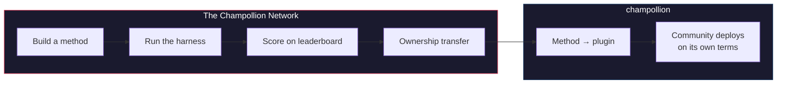

# شبكة Champollion

> **الملخص التنفيذي.** شبكة Champollion هي بنية تحتية مفتوحة *لإنشاء واعتماد* مجموعات اختبار الترجمة لأكبر عدد ممكن من أزواج اللغات — تُبنى *مع* المحترفين والمجتمعات، ولا تُستخلص منهم أبدًا — ولجعل المجال بأكمله قابلاً للاستكشاف: من يمكنه ترجمة ماذا، وما مدى جودة كل طريقة في كل نوع من النصوص، وأين تكمن الفجوات. نرحب بكل الطرق، سواء كانت بشرية أو آلية. يمكنك أيضًا بناء وتقديم طريقة ومعرفة كيفية تقييمها مقابل مدونات لغوية (corpora) حقيقية. بالنسبة للغات التي توفر المجتمعات بياناتها، فإن السيادة أمر غير قابل للتفاوض: فالأشخاص الذين يقدمون المدونة اللغوية يمتلكون مفاتيحها ومفاتيح أي شيء يُقاس بناءً عليها.

هذا القسم هو الموطن الرئيسي للخريطة. تشرح الصفحات المندرجة تحته كيفية بناء شبكة الأزواج المقاسة ([كيف تعمل الشبكة](/docs/network/how-it-works))، ولماذا تقوم قائمة انتظار العمل العامة بتصنيف ما تصنفه ([لماذا قائمة الانتظار](/docs/network/perspectives/why-the-queue) و[مواصفات بناء قائمة الانتظار](/docs/network/specifications/queue-construction))، وكيفية حساب قوة الاتصال ([قوة الاتصال](/docs/network/specifications/connection-strength)). إذا كنت تقرر ما إذا كنت ستثق في المشروع على الإطلاق، فابدأ بـ [القيود الصادقة](/docs/network/honest-limitations)؛ أما إذا كنت تعرف بالفعل ما تريد بناءه، فالأبواب مفتوحة في [ما هو Champollion](/docs/what-is-champollion).

**تعمل الشبكة على نوعين من المعايير.** تستخدم *المعايير العامة* مجموعات بيانات مفتوحة لرسم خرائط وتصنيف كل طريقة بتكلفة زهيدة وبشكل مفتوح — وهو مستوى الأساس للبيانات المستخلصة/المفتوحة، مع الإشارة إلى مخاطر التلوث. أما *المعايير السيادية* فهي المعيار الذهبي: مجموعات اختبار سرية تنشئها المجتمعات اللغوية وتمتلكها وتتحكم فيها، والتي **لا يراها** Champollion أبدًا — حيث تُقيّم بشكل أعمى، وفقط عندما يصرح المجتمع بذلك. البنية التحتية نفسها متاحة المصدر وتُدار بشكل فردي؛ وما يخص المجتمع هو مجموعات الاختبار الخاصة بلغتهم والطرق المبنية لها.

:::info[مرحلة الإطلاق/التأسيس]
الشبكة حديثة العهد ولكنها تعمل: تحتوي لوحة الصدارة على عمليات تشغيل حقيقية منشورة ومفتوحة لتقديمات أي شخص. لمعرفة ما ندعيه وما لا ندعيه بالضبط — التحقق، والمصادقة المجتمعية، والتقييم المستقل (held-out evaluation) — راجع **[القيود الصادقة](/docs/network/honest-limitations)**.
:::

---

## المشكلة

تُدرج خدمة Cloud Translation من Google عدد 194 لغة ([قائمة Google المنشورة](https://docs.cloud.google.com/translate/docs/languages)). ويغطي نموذج NLLB-200 من Meta عدد 200 لغة، بينما يزعم نموذج OMT-1600 (مارس 2026) تغطية 1,600 لغة. يوجد أكثر من 7,000 لغة منطوقة على وجه الأرض. بالنسبة لحوالي 1,200 لغة في الذيل الطويل لنموذج OMT-1600 — بحسب حساباتنا: الـ 1,600 لغة التي يغطيها ناقص أكثر من 400 لغة يفيد مؤلفوه أن النماذج "تفهمها بشكل كافٍ" — فإن أوزان النموذج غير متوفرة، والجودة أقل من الحدود القابلة للاستخدام، واستخدم التقييم نصوصًا من مجال الكتاب المقدس مع مقاييس آلية قياسية — دون تحقق صرفي، أو اختبار مستقل، أو حوكمة مجتمعية. أما بالنسبة للغات المتبقية البالغ عددها حوالي 5,400 لغة، فلا يوجد أي نموذج مدرب مسبقًا ينتج أي مخرجات على الإطلاق.

تستثمر شركات التكنولوجيا الكبرى (Big Tech) الآن في تغطية اللغات منخفضة الموارد (LRL) — لكن التغطية بدون تحقق مستقل من الجودة، أو تحقق صرفي، أو حوكمة مجتمعية هي تغطية بلا ثقة. المتحدثون الذين هم في أمس الحاجة إلى أدوات الترجمة هم نفس المجتمعات الأقل حظًا في بناء هذه الأدوات لهم.

**وُجدت الشبكة لتغيير ذلك.** فهي توفر البنية التحتية لإنشاء مجموعات الاختبار، وتقييم أي طريقة مقابلها — سواء كانت بشرية أو آلية — ورسم خرائط النتائج، لأي لغة، مع تسجيل نتائج قابل لإعادة الإنتاج، وتقديم مفتوح، وحوكمة مجتمعية حول من يتحكم في البيانات والنتائج.

البيانات اللغوية هي *بيانات حيوية (biodata)*. فمثل البيانات الجينية أو الصحية، تحمل اللغة هوية وعلاقات الأشخاص الذين يتحدثون بها، ولا يمكن إخفاء هويتها بشكل مجدٍ — لذا فإن الأشخاص الذين يقدمون مدونة لغوية يمتلكون مفاتيحها، ومفاتيح أي شيء يُقاس بناءً عليها. السيادة ليست ميزة إضافية تُلحق هنا؛ بل هي الأساس الذي يُبنى عليه الباقي.

---

## كيف تعمل

1. **أنت تبني طريقة ترجمة** — نموذج لغوي كبير (LLM) موجه، أو نموذج مضبوط بدقة (fine-tuned)، أو مسار عمل يعتمد على محولات الحالة المحدودة (FST-gated pipeline)، أو أي شيء آخر ينتج ترجمات.
2. **تقوم بيئة الاختبار (harness) بقياس أدائها** — مقاييس موحدة (chrF++، التطابق التام، قبول FST)، مع بصمة مرتبطة بتسليمة Git (Git commit) محددة.
3. **تظهر النتائج على لوحة الصدارة** — مباشرة ومفتوحة للتقديمات؛ كل عملية تشغيل منشورة قابلة لإعادة الإنتاج والمقارنة.
4. **عندما تنجح طريقة ما، تنتقل ملكيتها** — بالنسبة للغات الشعوب الأصلية، يُنقل كود الطريقة إلى منظمة الحوكمة المجتمعية.
5. **ينشر المجتمع الطريقة — إذا اختاروا ذلك وبالطريقة التي يفضلونها.** تُصدّر الطريقة كمكون إضافي (plugin) لـ [champollion](https://champollion.dev) ويمكن تشغيلها بالكامل على البنية التحتية للمجتمع. لا يأخذ Champollion أي حصة من أي شيء تكسبه هناك.

**ابنِها هنا. وانشرها هناك.**

:::tip[فك شفرة لغة، اربح، وأعدها لأصحابها]
هذه عملية قياس أداء لتعلم الآلة (ML-benchmarking) عن قصد — فالمنافسة هي الطريقة التي تُحل بها الأزواج اللغوية الصعبة. ندعو باحثي تعلم الآلة وأي مطور قادر إلى بناء أفضل طريقة لزوج لغوي صعب محدد، **والفوز بمكافأة عندما تكون متاحة**، *و*تسليم الطريقة الناتجة إلى منظمة السيادة التي تمتلك تلك اللغة. الطاقة التنافسية حقيقية؛ وهي موجهة نحو المهمة، وليس لتسلق لوحة الصدارة في حد ذاته. راجع [مواصفات الجائزة](/docs/network/specifications/prizes).
:::

---

## لمن هذا المشروع

| أنت... | الشبكة تمنحك... |
|---|---|
| **مهندس / باحث في تعلم الآلة (ML)** | معايير موحدة، وتسجيل نتائج قابل لإعادة الإنتاج، ومدونة لغوية مشتركة للاختبار مقابلها |
| **لغوي** | إطار عمل لتحويل القواعد النحوية والقواميس إلى طرق قابلة للاختبار |
| **مترجم محترف / بشري** | مكانًا لتسجيل خدماتك والعثور عليك — الترجمة البشرية هي طريقة من الدرجة الأولى هنا، تُدرج وتُقاس جنبًا إلى جنب مع الآلات، وليست فكرة ثانوية |
| **عضو في مجتمع لغوي** | حوكمة حول كيفية تطوير ونشر طرق لغتك |
| **ممّول / مراجع منح** | مقاييس شفافة وقابلة لإعادة الإنتاج لتقييم مقترحات أبحاث الترجمة |
| **طالب** | دعوة مفتوحة ذات تأثير حقيقي — ابنِ طريقة، وساهم بنتائجك |

---

## المدونات اللغوية المرجعية المدعومة

**اللوحة تعمل ومباشرة ولا تزال في بداياتها** — تم نشر عمليات المسح الأولى وتصل المزيد منها مع قيام المساهمين بتشغيل عناصر قائمة الانتظار. ما يلي ليس لوحة صدارة؛ بل هو مجموعة المدونات اللغوية المرجعية العامة التي يمكن تقييم أي تقديم مقابلها اليوم. لا تُستضاف المدونات اللغوية هنا أبدًا: تقوم بيئة الاختبار (harness) بجلب المراجع من المصدر الأساسي (upstream) في وقت التشغيل وتقيّم الأداء مقابل البيانات المجلوبة حديثًا.

### Global Voices (OPUS) — مجال الأخبار
- **التغطية:** 493 زوجًا لغويًا مفهرسًا وقابلاً للتشغيل (مثل `eval-amh-fra-globalvoices-test-v1`، الأمهرية ← الفرنسية)
- **الترخيص:** CC BY 3.0
- **المصدر:** [Global Voices عبر OPUS](https://opus.nlpl.eu/)

### Tatoeba — مجال المحادثة / مختلط
- **التغطية:** 874 زوجًا لغويًا مفهرسًا وقابلاً للتشغيل (مثل `eval-afr-eng-tatoeba-dev-v1`، الأفريكانية ← الإنجليزية)
- **الترخيص:** CC BY 2.0
- **المصدر:** [مجتمع Tatoeba](https://tatoeba.org)

:::note[EdTeKLA مخصص للأبحاث فقط — وليس معيارًا للتصنيف]
تحمل مدونة EdTeKLA للغة الكري السهلية (Plains Cree) (*Cree: Language of the Plains*) [ترخيص CC BY-NC-SA **المُعدّل** من EdTeKLA](https://github.com/EdTeKLA/IndigenousLanguages_Corpora) — وهي شروط غير تجارية ومحددة بنطاق السيادة (الكتاب المدرسي الأساسي نفسه يحمل ترخيص CC BY-NC-ND 4.0). وهي **مستبعدة من جميع التصنيفات** — فلا تتأهل للوحة الصدارة، أو لأي جائزة، أو لمسارات واجهة برمجة التطبيقات (API)/المسارات التجارية — كما أن التقييم عن بُعد عبر واجهة برمجة تطبيقات النماذج (model-API) **مشروط بالموافقة**: ترفض بيئة الاختبار إرسال نصوصها إلى واجهات برمجة تطبيقات النماذج التابعة لجهات خارجية ما لم يتم تسجيل إذن صريح من صاحب الحقوق (يظل التقييم المحلي ممكنًا).

إن FLORES+ **مربوطة** وقابلة للتشغيل هنا (870 زوجًا مفهرسًا، مثل `eval-flores-devtest-v1-amh-fra`)، ولكنها **عالية التلوث** — فهي بيانات تقييم عامة ومجمعة من الويب ومن المحتمل جدًا أن النماذج الرائدة (frontier models) قد رأتها بالفعل. ولذلك فهي **نسبية فقط**: يمكن استخدامها لمقارنة الطرق وجهًا لوجه، ولكن **لا يُبلّغ عنها أبدًا كمعيار جودة مطلق**، وهي **للاختبار / التوضيح فقط**. لا تُصنف نتيجة FLORES+ أبدًا كدرجة جودة ولا تُستخدم أبدًا كحافة سلسلة (chain edge) على [خريطة الترجمة](https://champollion.dev). راجع [القيود الصادقة](/docs/network/honest-limitations) لمعرفة ما ندعيه وما لا ندعيه بالضبط.
:::

---

## القاعدة الوحيدة

:::danger[لا تتدرب على بيانات التقييم]
سيتم **استبعاد** الطرق التي تعرضت لمجموعة بيانات القياس — سواء كبيانات تدريب، أو أمثلة قليلة اللقطات (few-shot examples)، أو إدخالات قاموس، أو مواد توجيه (prompt material). قم بالضبط الدقيق (Fine-tune) على أي شيء تريده. فقط ليس على مجموعة الاختبار.
:::

---

## الخطوات التالية

- **[تقديم طريقة](/docs/network/getting-started/submit-a-method)** — كيفية تقديم أول عملية تشغيل قياسية لك
- **[مواصفات المعيار](/docs/network/specifications/benchmark)** — بروتوكول التجربة الكامل
- **[قواعد لوحة الصدارة](/docs/network/leaderboard/rules)** — معايير التقديم وسياسات مكافحة التلاعب
- **[إدارة البيانات](/docs/network/sovereignty/data-sovereignty)** — تبقى المدونات اللغوية مع مديريها؛ مع احترام كل ترخيص
- **[كيف يتم تمويل العمل](/docs/network/sovereignty/economic-model)** — غير تجاري وممول ذاتيًا حاليًا؛ مطلوب ممولين، ويتم نشر وجهة كل دولار

**[→ عرض لوحة الصدارة](https://champollion.dev/leaderboard)**
