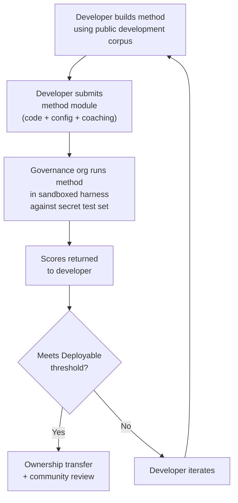

# مواصفات المعيار

> **الملخص التنفيذي.** يحدد هذا المستند بروتوكول التقييم لنظام التقييم البيئي للترجمة الآلية (MT) الخاص بـ Champollion: تنسيق المتن (§2)، ومخطط بطاقة التشغيل (§3)، وبروتوكول المعيار (§6)، ومتطلبات التحقق البشري (§7)، وآليات السيادة (§8)، ولوحة الصدارة ونموذج التقديم (§9)، وإطار التكلفة (§10)، وقابلية التوسعة لتشمل لغات جديدة (§11). للحصول على تعريفات المقاييس، وأوزان التسجيل المركبة، وحدود مستويات الجودة، وصيغ مقاييس التكلفة/السرعة، راجع `SCORING_SPEC.md` — المصدر الوحيد للحقيقة لجميع منطق التسجيل. يشير هذا المستند إلى SCORING_SPEC للحصول على تلك التفاصيل بدلاً من تكرارها.

---

## 1. المبادئ

### 1.1 اللغات هي بيانات حيوية (Biodata)

اللغة ليست مادة اختبار محايدة. فمثل البيانات الجينية أو الصحية، تعد بيانات اللغة **بيانات حيوية (biodata)**: فهي تحمل هوية وقرابة وعلاقات الأشخاص الذين يتحدثون بها، ولا يمكن إخفاء هويتها بشكل مجدٍ — فإذا جردتها من البيانات الوصفية، ستظل اللغة ترمز إلى هوية شعبها. والنتيجة المترتبة على هذه المواصفات ملموسة: فالأشخاص الذين يقدمون المتن (corpus) يمتلكون مفاتيحه، ومفاتيح أي شيء يُقاس بناءً عليه. ولذلك، فإن السيادة (§8) ليست إضافة للبروتوكول؛ بل هي شرط مسبق له، وكل مبدأ آخر أدناه يعمل في إطارها.

### 1.2 المقاييس الآلية هي وكلاء (Proxies)

كل مقياس محدد في هذا المستند يُحسب آليًا. chrF++، وقبول FST، والدقة الصرفية، والتشابه الدلالي — جميعها وكلاء آليون لجودة الترجمة. وهي مفيدة للتكرار السريع، والمقارنة المنهجية، واكتشاف التراجعات. لكنها **ليست بدائل للحكم البشري**.

التسلسل الهرمي للتقييم:

```
Automated metrics (run cards, benchmarks)
    ↓ proxy for
Human review (bilingual speakers validate output)
    ↓ proxy for
Actual utility (does this help a language community?)
```

لا يمكن لأي درجة آلية، مهما كانت مرتفعة، أن تحل محل متحدث طليق يقرأ المخرجات ويؤكد أنها صحيحة وطبيعية ومناسبة ثقافيًا. مستويات الجودة المحددة في §5 هي تصنيفات استدلالية للدرجات المركبة الآلية — مفيدة لتتبع التقدم، ولكنها لا تكفي أبدًا بمفردها.

### 1.3 الأساليب، وليس النماذج

نحن نقيس أداء **الأساليب**، وليس النماذج. النموذج هو مكون واحد. أما الأسلوب فهو الوصفة الكاملة: اختيار النموذج، وتصميم التلقين (prompt)، واستخدام الأدوات، والمعالجة المسبقة/اللاحقة، وبيانات التدريب (coaching data)، واستراتيجيات إعادة المحاولة، وكل شيء. سيحصل فريقان يستخدمان نفس النموذج بأساليب مختلفة على درجات مختلفة. وهذا هو بيت القصيد.

### 1.4 قابلية إعادة الإنتاج

يجب أن تكون كل نتيجة معيارية قابلة لإعادة الإنتاج. تلتقط بطاقة التشغيل (§3) التكوين الكامل للتجربة. وتحدد البصمة (§3.5) إعداد التجربة. ويتحقق تجزئة بطاقة التشغيل (hash) (§3.6) من سلامة النتيجة. يجب أن يحقق أي شخص لديه نفس الأسلوب والمتن والتكوين درجات في حدود ±2% (مع مراعاة عدم الحتمية في أخذ عينات النماذج اللغوية الكبيرة (LLM) عند درجة حرارة > 0).

### 1.5 لا توجد بيانات تقييم اصطناعية

**هذا المشروع لا يولد أو يستخدم أو يدعم بيانات التقييم الاصطناعية.** يجب أن تكون جميع المتون (corpora) مستمدة من نصوص أصلية من تأليف بشري — ترجمات منشورة، أو كتب مدرسية، أو مستندات ثنائية اللغة، أو ترجمات مستنبطة من متحدثين طليقين.

قد تساعد النماذج اللغوية الكبيرة (LLMs) في:
- محاذاة الجمل (العثور على فقرات متوازية في نصوص ثنائية اللغة موجودة)
- تحويل التنسيق (تحويل المواد المنشورة إلى مخطط المتن)
- إثراء البيانات الوصفية (اقتراح مستويات الصعوبة، وتصنيفات السجل)
- اقتراح جمل المصدر للترجمة البشرية (§11.3 — خطوة الترجمة تكون دائمًا بشرية)

يجب **ألا** تقوم النماذج اللغوية الكبيرة (LLMs) أبدًا بإنشاء ترجمات مرجعية أو أزواج تقييم.

**نحن محايدون تنمويًا بشأن بيانات التدريب.** إذا استخدم مطور الأسلوب بيانات تدريب اصطناعية، أو ترجمة عكسية (backtranslation)، أو زيادة البيانات في أسلوبه، فهذا اختياره — نحن نقيم المخرجات، وليس عملية التدريب. يستخدم نموذج OMT-1600 من Meta ما يقرب من 270 مليون جملة متوازية اصطناعية تم إنشاؤها عبر الترجمة العكسية. ليس لدينا أي اعتراض على الأساليب المدربة بهذه الطريقة. نحن نختبر على التنقيح البشري فقط.

> **لماذا لا نستخدم نصوص الكتاب المقدس للتقييم؟** يقيم OMT-1600 أداء 1,560 لغة من أصل 1,600 لغة على نصوص من مجال الكتاب المقدس (Meta AI, *Omnilingual MT*, arXiv:2603.16309, 2026). تتميز ترجمات الكتاب المقدس بسجل لغوي قديم، ومفردات طقسية، وبنية جمل نمطية. تُستمد متون التقييم الخاصة بنا من نصوص منقحة مجتمعيًا ومتنوعة المجالات — المجالات الصحية والقانونية والتعليمية والحكومية والحوارية والتقنية (انظر §2.7). هذا خيار تصميم متعمد. تحتاج المجتمعات إلى الترجمة في المجالات التي يعيشون ويعملون فيها بالفعل، وليس في سجل ديني واحد. الأسلوب الذي يسجل درجة جيدة في سفر التكوين 1:1 لا يخبرك بشيء تقريبًا عن أدائه في جدول أعمال مجلس القبيلة أو نموذج استقبال في عيادة.

---

## 2. مخطط المتن (Corpus Schema)

المتن هو مجموعة منقحة من أزواج النصوص المتوازية مع بيانات وصفية منظمة. وهو يمثل الحقيقة الأساسية (ground truth) التي تُقاس بناءً عليها جميع الأساليب.

### 2.1 غلاف مجموعة البيانات

هيكل المستوى الأعلى لملف المتن:

```json
{
  "dataset": {
    "id": "edtekla-dev-v1",
    "version": "1.0",
    "language_pair": "EN→CRK",
    "source_language": "en",
    "target_language": "crk",
    "created": "2026-05-01",
    "license": "LicenseRef-EdTeKLA-Modified-CC-BY-NC-SA-4.0",
    "provenance": ["gold_standard", "textbook"]
  },
  "entries": [ ... ]
}
```

| الحقل | النوع | مطلوب | الوصف |
|-------|------|----------|-------------|
| `id` | string | ✅ | معرف فريد لمجموعة البيانات، يُستخدم في بطاقات التشغيل ولوحة الصدارة |
| `version` | string | ✅ | الإصدار الدلالي. تؤدي زيادته إلى إبطال مقارنات بطاقات التشغيل السابقة |
| `language_pair` | string | ✅ | تسمية العرض (مثل، `EN→CRK`) |
| `source_language` | string | ✅ | رمز لغة المصدر حسب BCP 47 |
| `target_language` | string | ✅ | رمز لغة الهدف حسب BCP 47 |
| `created` | string | ✅ | تاريخ الإنشاء بتنسيق ISO 8601 |
| `license` | string | ✅ | معرف ترخيص SPDX |
| `provenance` | string[] | ✅ | قائمة بعلامات المصدر (provenance tags) المستخدمة عبر الإدخالات |

### 2.2 مخطط الإدخال

يمثل كل إدخال في المتن تحديًا واحدًا للترجمة:

```json
{
  "id": 42,
  "source": "I see the dog",
  "reference": "niwâpamâw atim",
  "segment": "gold_standard",
  "difficulty": 2,
  "provenance": "gold_standard",
  "register": "conversational",
  "context": "declaration",
  "morphological_analysis": "ni-wâpam-âw atim | 1sg-see.TA-3sg.DIR dog.AN",
  "notes": "Animate noun (atim); direct form because speaker is proximate",
  "variant_class": "simple-ta-direct"
}
```

| الحقل | النوع | مطلوب | الوصف |
|-------|------|----------|-------------|
| `id` | integer | ✅ | معرف فريد داخل المتن |
| `source` | string | ✅ | النص المصدر بلغة المصدر |
| `reference` | string | ✅ | الترجمة المرجعية الذهبية بلغة الهدف |
| `segment` | string | 📎 | قسم المتن: `gold_standard`، أو `held_out`، أو `development`، أو `diagnostic` |
| `difficulty` | integer | 📎 | تصنيف الصعوبة 1–5 (انظر §2.4) |
| `provenance` | string | 📎 | أصل هذا الإدخال (انظر §2.5) |
| `register` | string | 📎 | السجل/مستوى الرسمية (انظر §2.6) |
| `context` | string | 📎 | الوظيفة التواصلية (انظر §2.6) |
| `domain` | string | 📎 | مجال حالة الاستخدام من تصنيف الـ 16 رمزًا (انظر §2.7). يجب أن يكون أحد: `conv`، `ecommerce`، `edu`، `financial`، `gov`، `legal`، `literary`، `marketing`، `medical`، `news`، `religious`، `scientific`، `subtitles`، `support`، `tech`، `ui`. يتم التحقق منه في وقت الإنشاء. |

> **📎 = موصى به.** تتعامل بيئة الاختبار (harness) مع الحقول الاختيارية المفقودة بسلاسة عبر القيم الافتراضية. تحتاج متون الجهات الخارجية فقط إلى توفير `id`، و `source`، و `reference` لكل إدخال.
| `morphological_analysis` | string | ❌ | التحليل الصرفي المعياري الذهبي |
| `notes` | string | ❌ | ملاحظات المترجم، والمتغيرات اللهجية، وعلامات الغموض |
| `variant_class` | string | ❌ | تسمية الفئة التي تجمع متغيرات الترجمة المقبولة |

### 2.3 أقسام المتن

ينقسم المتن إلى أقسام بمستويات وصول مختلفة:

| القسم | الغرض | الوصول | الحد الأدنى للحجم |
|---------|---------|--------|-------------|
| `development` | تطوير الأسلوب والتكرار. يستخدمها المطورون بحرية. | **عام** | 30 إدخالاً |
| `diagnostic` | اختبارات مستهدفة لظواهر لغوية محددة. | **عام** | 10 إدخالات |
| `gold_standard` | التقييم المعياري الرسمي. تأتي درجات لوحة الصدارة من هنا. | **سري** — تحتفظ به منظمة الحوكمة | 50 إدخالاً |
| `held_out` | محجوز للتقييم المستقبلي. لا يُستخدم أبدًا حتى يتم تنشيطه. | **سري** — تحتفظ به منظمة الحوكمة | 10 إدخالات |

> **الحالة الحالية:** يوجد القسم `development` فقط في مجموعات البيانات المشحونة. تم تحديد الأقسام `diagnostic`، و `gold_standard`، و `held_out` للاستخدام المستقبلي مع نمو المتون.

القسمان `gold_standard` و `held_out` سريان بالكامل. يتم الاحتفاظ بكل من الجمل المصدر والترجمات المرجعية في بنية تحتية خاضعة لسيطرة الحوكمة. لا يرى مطورو الأساليب الأسئلة أو الإجابات أبدًا. انظر §8 للتعرف على آلية السيادة.

### 2.4 مستويات الصعوبة

| المستوى | الوصف | أمثلة |
|------|-------------|----------|
| 1 — مفردات أساسية | كلمات مفردة، تحيات شائعة، أرقام | "hello" → "tânisi"، "dog" → "atim" |
| 2 — جمل بسيطة | فاعل-فعل أو فاعل-فعل-مفعول (SVO)، زمن المضارع | "I see the dog" → "niwâpamâw atim" |
| 3 — تعقيد متوسط | زمن الماضي/المستقبل، الملكية، الحيوية (animacy) | "I saw his dog yesterday" |
| 4 — صرف معقد | التجنب (obviation)، المبني للمجهول، الترتيب الموصول (conjunct order)، الجمل الموصولة | "the woman whose son went to the store" |
| 5 — متقدم | جمل متعددة المقاطع، سجل رسمي، احتفالي، اصطلاحي | فقرة كاملة بنبرة مناسبة للسجل |

يجب أن يتضمن المتن المبني جيدًا إدخالات عبر جميع مستويات الصعوبة الخمسة، مع التركيز على المستويات 2-4 حيث تقع معظم تحديات الترجمة في العالم الحقيقي.

### 2.5 علامات المصدر (Provenance Tags)

يجب أن يشير كل إدخال إلى أصله:

| العلامة | المعنى |
|-----|---------|
| `gold_standard` | تم التحقق منه بواسطة متحدثين طليقين |
| `textbook` | من مواد تعليمية منشورة |
| `elicited` | تم إنتاجه من خلال جلسات استنباط منظمة |
| `corpus` | مستخرج من متن متوازي |

> **ملاحظة:** من الناحية العملية، قيم المصدر هي سلاسل نصية حرة التنسيق. العلامات المذكورة أعلاه هي اصطلاحات، وليست تعدادًا (enum) تم التحقق من صحته — قد تستخدم مجموعات البيانات سلاسل مصدر وصفية أخرى.

### 2.6 السجل والسياق

يصف **السجل (Register)** مستوى الرسمية والسياق الاجتماعي:

| السجل | الوصف |
|----------|-------------|
| `conversational` | الحديث اليومي بين الأقران |
| `formal` | لغة رسمية أو مؤسسية |
| `technical` | مفردات خاصة بمجال معين |
| `ceremonial` | استخدام لغوي تقليدي أو مقدس |
| `educational` | مواد تعليم اللغة |

يصف **السياق (Context)** الوظيفة التواصلية:

> 🔲 **مخطط له.** تم تعريف الحقل `context` في المخطط ولكنه لم يُعبأ بعد في مجموعات البيانات الحالية. وهو محجوز لإثراء المتن في المستقبل.

| السياق | الوصف |
|---------|-------------|
| `greeting` | تحية اجتماعية أو توديع |
| `declaration` | بيان حقيقة |
| `question` | استفهام |
| `instruction` | أمر أو توجيه |
| `narrative` | سرد قصصي أو وصف |
| `label` | تسمية واجهة المستخدم، أو نص زر، أو عنوان |
| `error` | رسالة خطأ أو تحذير |

### 2.7 المجال {#27-domain}

يصف **المجال (Domain)** حالة الاستخدام في العالم الحقيقي — نوع المحتوى الجاري ترجمته. وهذا مستقل عن السجل والسياق:

- **السجل** يجيب على: *ما مدى رسمية هذا؟*
- **السياق** يجيب على: *ماذا تفعل هذه الجملة؟*
- **المجال** يجيب على: *لأي صناعة/حالة استخدام هذا؟*

قد يكون العقد القانوني (المجال: `legal`) رسميًا (السجل: `formal`) ويحتوي على إقرار (السياق: `declaration`). وقد يكون نص محادثة روبوت دردشة قانوني (المجال: `legal`) حواريًا (السجل: `conversational`) ويحتوي على أسئلة (السياق: `question`). نفس المجال، ولكن بسجل وسياق مختلفين.

| رمز المجال | الوصف | المستهلكون النموذجيون |
|-------------|-------------|-------------------|
| `ui` | سلاسل واجهة البرامج | مطورو التطبيقات، فرق التوطين |
| `legal` | العقود، القوانين، ملفات المحاكم، وثائق الهجرة | مكاتب المحاماة، المحاكم، فرق الامتثال، محامو الملكية الفكرية |
| `medical` | الملاحظات السريرية، ملصقات الأدوية، اتصالات المرضى، بروتوكولات التجارب | المستشفيات، شركات الأدوية، التجارب السريرية، بوابات المرضى |
| `financial` | الخدمات المصرفية، التأمين، الملفات التنظيمية، تقارير التدقيق | البنوك، شركات التأمين، المنظمون، المدققون |
| `edu` | الكتب المدرسية، المناهج، خطط الدروس، المواد الأكاديمية | المدارس، الجامعات، ناشرو الكتب المدرسية |
| `ecommerce` | أوصاف المنتجات، المراجعات، قوائم الأسواق | بائعو التجزئة عبر الإنترنت، بائعو الأسواق |
| `marketing` | نصوص الإعلانات، رسائل العلامة التجارية، الحملات، الشعارات | وكالات الإعلان، فرق العلامات التجارية |
| `gov` | وثائق السياسات، اللوائح، الإشعارات العامة، التشريعات | الوكالات الحكومية، فرق الامتثال |
| `scientific` | الأوراق البحثية، الملخصات، المنهجية، مقترحات المنح | الباحثون، المجلات، وكالات المنح |
| `religious` | النصوص المقدسة، النصوص الطقسية، التعليقات اللاهوتية | المجتمعات الدينية، الناشرون الطقسيون |
| `support` | الأسئلة الشائعة، رسائل الخطأ، أدلة استكشاف الأخطاء وإصلاحها، نصوص روبوتات الدردشة | شركات البرمجيات كخدمة (SaaS)، مكاتب المساعدة |
| `subtitles` | حوارات الأفلام، التلفزيون، البث، والألعاب | منصات البث، الاستوديوهات، شركات الألعاب |
| `news` | الصحافة، تقارير وكالات الأنباء، الافتتاحيات، البيانات الصحفية | المؤسسات الإعلامية، وكالات الأنباء |
| `literary` | الخيال، الشعر، السرد، النصوص الثقافية | الناشرون، منظمات الحفاظ على الثقافة |
| `conv` | المحادثات غير الرسمية، وسائل التواصل الاجتماعي، المراسلة | تطبيقات المستهلكين، المنصات الاجتماعية |
| `tech` | وثائق واجهة برمجة التطبيقات (API)، الأدلة، المواصفات الهندسية، الأدلة الفنية | فرق التوثيق، المؤسسات الهندسية |

> **المعايير الخاصة بالمجال.** يقيم المعيار العام الأسلوب عبر جميع المجالات. لكن الشبكة تدعم أيضًا **المعايير المفلترة حسب المجال** — حيث تُحسب الدرجات فقط على الإدخالات الموسومة بمجال معين. يتيح هذا للمستخدمين الإجابة على: "ما هو الأسلوب الأفضل لترجمة المستندات القانونية إلى الفرنسية؟" مقابل "ما هو الأسلوب الذي يتمتع بأفضل درجة إجمالية للغة الفرنسية؟"
>
> تتيح تصنيفات لوحة الصدارة المفلترة حسب المجال للمستخدمين مقارنة الأساليب ضمن حالة استخدام واحدة. تختلف الأساليب في أدائها عبر المجالات — فالأسلوب الذي تم ضبطه بدقة على المصطلحات القانونية قد يسجل درجة أعلى بكثير في النصوص القانونية مقارنة بالنصوص الحوارية. تساعد الشبكة المستخدمين في العثور على الأسلوب الأفضل لحالة الاستخدام الخاصة بهم.

> **المستقبل: مساعد الشبكة.** مساعد حواري يساعد المستخدمين على وصف حالة استخدام الترجمة الآلية (MT) الخاصة بهم (المجال، زوج اللغات، متطلبات الجودة) ويعرض الأساليب ذات الصلة المعتمدة من المجتمع من لوحة الصدارة — على سبيل المثال، "ما هو الأسلوب الذي يسجل أعلى درجة في معايير المجال الطبي من الإنجليزية إلى اليابانية (EN→JA)؟" — وهو أداة مساعدة للتنقل ندرسها، وتعتمد على توفر بيانات تقييم كافية موسومة بالمجال وتنوع في الأساليب.

---

## 3. مخطط بطاقة التشغيل {#3-run-card-schema}

بطاقة التشغيل هي الوحدة الأساسية للتقييم. إنها مستند JSON مستقل يسجل التكوين الكامل والنتائج لعملية تقييم واحدة: أسلوب واحد، نموذج واحد، تكوين واحد، مجموعة بيانات واحدة.

تلتقط كل بطاقة تشغيل ثلاثة أبعاد:
- **الجودة** — ما مدى جودة الترجمات؟
- **التكلفة** — كم كلف إنتاجها؟
- **السرعة** — كم استغرقت من الوقت؟

### 3.1 حقول المستوى الأعلى

| الحقل | النوع | الوصف |
|-------|------|-------------|
| `run_id` | string | UUID v4 تم إنشاؤه في بداية التشغيل |
| `harness_version` | string | الإصدار الدلالي لبيئة الاختبار (مثل، `2.0`) |
| `timestamp` | string | طابع زمني بتنسيق ISO 8601 UTC عند بدء التشغيل |
| `elapsed_seconds` | number | مدة التشغيل بالكامل حسب ساعة الحائط |

### 3.2 تكوين الأسلوب

تحدد هذه الحقول إعداد التجربة — ما تم اختباره وكيف.

| الحقل | النوع | مطلوب | الوصف |
|-------|------|----------|-------------|
| `model_slug` | string | ✅ | معرف النموذج (مثل، `google/gemini-2.5-flash`) |
| `model_id` | string | ❌ | معرف النموذج الذي تم حله والذي أرجعته واجهة برمجة التطبيقات (API) |
| `condition` | string | ✅ | تسمية التجربة (مثل، `baseline`، `coached-v3`، `few-shot`) |
| `temperature` | number | ✅ | درجة حرارة أخذ العينات (Sampling temperature) |
| `system_prompt_sha256` | string | ✅ | تجزئة SHA-256 لنص تلقين النظام بالكامل |
| `system_prompt_used` | string | ✅ | نص تلقين النظام بالكامل |
| `coaching_data_sha256` | string | ❌ | تجزئة SHA-256 لملف بيانات التدريب (coaching data)، إن وُجد |
| `fst_version` | string | ❌ | إصدار محلل FST، إن وُجد |
| `tools_enabled` | string[] | ❌ | قائمة بالأدوات المتاحة للأسلوب |
| `batch_size` | number | ❌ | الإدخالات لكل دفعة متزامنة لواجهة برمجة التطبيقات (API) |
| `max_retries` | number | ❌ | الحد الأقصى لإعادة المحاولة لرفض FST، إن أمكن |

:::info[بطاقات التشغيل المنشورة تتضمن method_config]
عند نشر بطاقة تشغيل على لوحة الصدارة (عبر `mt-eval publish`)، فإنها تتضمن أيضًا كتلة `method_config` تحتوي على MethodConfig الأساسي المكون من 8 حقول (`model`، `temperature`، `batchSize`، `register`، `coachingFile`، `coachingPrompt`، `promptContext`، `qualityTier` — جميعها بتنسيق camelCase). يتيح هذا الاستيراد بدون إعادة بناء: يقرأ `champollion leaderboard --install` `method_config` مباشرة ويكتبه كبيان إضافي (plugin manifest). تسجل حقول القياس عن بُعد أعلاه (§3.2) ما لاحظته بيئة الاختبار؛ بينما يسجل `method_config` ما قصده المطور.
:::

### 3.3 مرجع مجموعة البيانات

| الحقل | النوع | الوصف |
|-------|------|-------------|
| `dataset.id` | string | معرف مجموعة البيانات |
| `dataset.version` | string | إصدار مجموعة البيانات |
| `dataset.language_pair` | string | تسمية العرض |
| `dataset.sha256` | string | تجزئة SHA-256 لمحتويات ملف مجموعة البيانات |
| `dataset.entry_count` | number | عدد الإدخالات التي تم تقييمها |

يربط تجزئة SHA-256 لمجموعة البيانات النتيجة بإصدار معين من البيانات. إذا تغيرت مجموعة البيانات، فلن تكون بطاقات التشغيل القديمة قابلة للمقارنة.

### 3.4 الدرجات (الجودة)

المقاييس المجمعة للتشغيل بالكامل. جميع مقاييس الجودة **آلية** — انظر §1.2.

| الحقل | النوع | الوصف |
|-------|------|-------------|
| `scores.total` | number | إجمالي الإدخالات التي تم تقييمها |
| `scores.exact_matches` | number | الإدخالات التي تطابقت فيها المخرجات تمامًا مع المرجع |
| `scores.exact_match_rate` | number | 0.0–1.0 |
| `scores.equivalent_matches` | number | الإدخالات المطابقة لمتغير مقبول |
| `scores.equivalent_match_rate` | number | 0.0–1.0 |
| `scores.fst_accepted` | number | الإدخالات المقبولة بواسطة محلل FST |
| `scores.fst_acceptance_rate` | number | 0.0–1.0، `null` إذا لم يتم تكوين FST |
| `scores.morphological_accuracy` | number | 0.0–1.0، مشتق من FST (مطابق للجذر)، `null` إذا لم يكن هناك FST / لا توجد كلمات مطابقة للجذر. استشاري حتى يتم تنشيطه — انظر مواصفات التسجيل §2.2 |
| `scores.morph_coverage` | number | 0.0–1.0، نسبة الكلمات المتوقعة القابلة للتحليل والمطابقة للجذر مع المرجع (يكشف عن مدى تناثر `morphological_accuracy`) |
| `scores.chrf_plus_plus` | number | درجة chrF++ على مستوى المتن (0–100) |
| `scores.semantic_score` | number | التشابه الدلالي القائم على التضمين (0.0–1.0) |
| `scores.ter` | number | معدل تحرير الترجمة (0–∞، الأقل هو الأفضل) |
| `scores.length_ratio` | number | avg(len(predicted)/len(reference))، المثالي = 1.0 |
| `scores.code_switching_rate` | number | 0.0–1.0، نسبة الإدخالات التي بها تسرب للغة المصدر |
| `scores.hallucination_rate` | number | 0.0–1.0، نسبة الإدخالات التي بها محتوى مهلوس |
| `scores.terminology_adherence` | number | 0.0–1.0، الالتزام بمصطلحات المسرد (`null` إذا لم يكن هناك مسرد) |
| `scores.tokens_per_second` | number | إجمالي_الرموز / الثواني_المنقضية |
| `scores.entries_per_minute` | number | الإدخالات المترجمة في الدقيقة |
| `scores.composite` | number | الدرجة المركبة الموزونة (0.0–1.0). انظر SCORING_SPEC §4 |
| `scores.errors` | number | الإدخالات التي فشلت (خطأ في واجهة برمجة التطبيقات، انتهاء المهلة، إلخ) |
| `scores.by_difficulty` | object | الدرجات مقسمة حسب مستوى الصعوبة |
| `scores.by_provenance` | object | الدرجات مقسمة حسب علامة المصدر |
| `scores.by_domain` | object | ✅ مُنفذ — الدرجات مقسمة حسب المجال (§2.7). يتيح تصنيف لوحة الصدارة المفلتر حسب المجال. يُحسب بواسطة tester.py ويُمرر عبر publish.py. |

### 3.5 المجاميع (التكلفة)

| الحقل | النوع | الوصف |
|-------|------|-------------|
| `totals.prompt_tokens` | number | إجمالي رموز الإدخال عبر جميع استدعاءات واجهة برمجة التطبيقات (API) |
| `totals.completion_tokens` | number | إجمالي رموز الإخراج |
| `totals.reasoning_tokens` | number | الرموز المستخدمة لسلسلة الأفكار (0 لمعظم النماذج) |
| `totals.cached_tokens` | number | الرموز المقدمة من ذاكرة التخزين المؤقت للتلقين الخاصة بمزود الخدمة |
| `totals.total_cost_usd` | number | التكلفة الإجمالية بالدولار الأمريكي |
| `totals.cost_per_entry_usd` | number | `total_cost_usd / entry_count` |
| `totals.cost_per_source_char` | number | الدولار الأمريكي لكل حرف مصدر — قابل للمقارنة عبر اللغات |

### 3.6 التوقيت (السرعة)

| الحقل | النوع | الوصف |
|-------|------|-------------|
| `elapsed_seconds` | number | مدة التشغيل بالكامل حسب ساعة الحائط (المستوى الأعلى) |
| `scores.avg_latency_seconds` | number | متوسط وقت الاستجابة لكل إدخال |
| `scores.median_latency_seconds` | number | وسيط وقت الاستجابة لكل إدخال |
| `scores.p95_latency_seconds` | number | النسبة المئوية 95 لوقت الاستجابة لكل إدخال |

### 3.7 النتائج لكل إدخال

يسجل كل إدخال في مصفوفة `results[]` ترجمة واحدة. يتم الاحتفاظ بالبيانات الخاصة بكل إدخال في جدول `run_card_entries` (الترحيل 005) مع أحكام LYSS غير المُطبعة (الترحيل 006).

| الحقل | النوع | الوصف |
|-------|------|-------------|
| `entry_id` | string | يطابق `entries[].id` في المتن |
| `source` | string | النص المصدر الذي تمت ترجمته |
| `expected` | string | الترجمة المرجعية المعيارية الذهبية |
| `raw_predicted` | string \| null | مخرجات النموذج الخام قبل المعالجة اللاحقة |
| `predicted` | string | المخرجات الفعلية للأسلوب (بعد المعالجة اللاحقة) |
| `segment` | string | معرف المقطع (مثل، فهرس الجملة) |
| `difficulty` | string \| null | مستوى الصعوبة من المتن |
| `domain` | string | علامة المجال من المتن (§2.7) |
| `exact_match` | boolean | ما إذا كانت المخرجات تتطابق تمامًا مع المرجع |
| `chrf_score` | number \| null | chrF++ على مستوى الجملة (0–100) |
| `bleu_score` | number \| null | BLEU على مستوى الجملة (0–100) |
| `latency_s` | number \| null | وقت الاستجابة بالثواني |
| `cost_usd` | number \| null | التكلفة بالدولار الأمريكي لهذا الإدخال |
| `tool_call_count` | integer | عدد استدعاءات الأدوات المستخدمة (0 إذا لم يكن هناك أي منها) |
| `error` | string \| null | رسالة الخطأ إذا فشل هذا الإدخال |
| `plugin_metrics` | object | مخرجات الإضافة (plugin) الكاملة لكل إدخال (JSONB) |
| `fst_valid` | boolean \| null | قَبِل GiellaLT FST التوقع (LYSS-fst غير المُطبع) |
| `equivalent_match` | boolean \| null | أكد فاحص CRK التكافؤ الهيكلي (LYSS-eq غير المُطبع) |
| `semantic_verdict` | string \| null | حكم LYSS-sem: `VALID`، `MISMATCH`، `UNKNOWN`، `ERROR` |
| `code_switching_detected` | boolean \| null | تم اكتشاف رموز لغة المصدر في المخرجات |
| `hallucination_detected` | boolean \| null | تم اكتشاف محتوى مُختلق في المخرجات |

### 3.8 البصمة (Fingerprint)

معرف قابلية إعادة الإنتاج. استخدم تشغيلان لهما بصمات متطابقة نفس إعداد التجربة.

البصمة هي تجزئة SHA-256 للتسلسل المرتب لـ:
- `dataset.sha256`
- `model_slug`
- `condition`
- `system_prompt_sha256`
- `temperature`
- `harness_version`
- `batch_size`
- `tools_enabled`

> **لماذا 8 مكونات؟** يؤثر حجم الدفعة واستدعاء الأدوات بشكل جوهري على جودة المخرجات ويجب تضمينهما في الهوية. يعتبر تشغيلان بأحجام دفعات مختلفة أو أدوات مختلفة ممكّنة إعدادات تجريبية مختلفة، حتى لو تطابقت جميع المعلمات الأخرى.

يجب أن ينتج عن تشغيلين لهما بصمات متطابقة نتائج قابلة للمقارنة. ترجع الاختلافات إلى عدم الحتمية في واجهة برمجة التطبيقات (درجة الحرارة > 0) أو تحديثات النموذج من جانب مزود الخدمة.

### 3.9 تجزئة بطاقة التشغيل (Run Card Hash)

تجزئة SHA-256 لملف JSON الخاص ببطاقة التشغيل بالكامل (مع تعيين الحقل `run_card_hash` نفسه إلى `""` أثناء التجزئة). هذا هو ختم اكتشاف التلاعب. إذا تغير أي حقل، تنكسر التجزئة.

---

## 4. المقاييس الآلية

جميع المقاييس في هذا القسم تُحسب آليًا. انظر §1.2.

### 4.1 تعريفات المقاييس

| المقياس | الحالة | ما يقيسه | النطاق |
|--------|--------|-----------------|-------|
| **chrF++** | ✅ مُنفذ | درجة F لـ n-gram الحرف. يعمل على مستوى الحرف، مما يجعله أكثر قوة من المقاييس على مستوى الكلمة (BLEU) للغات الغنية صرفيًا حيث تكون الكلمات طويلة وشديدة التصريف. يُحسب بواسطة sacrebleu. | 0–100 (المقياس الأصلي). يُقسم على 100 عند استخدامه في المركب. |
| **معدل قبول FST** | ✅ مُنفذ | نسبة الكلمات المتوقعة التي يقبلها المحلل الصرفي (GiellaLT HFST) كأشكال صالحة في لغة الهدف. الكلمة التي يقبلها FST هي كلمة حقيقية وصالحة هيكليًا — وليست هلوسة. | 0.0–1.0 |
| **التطابق التام** | ✅ مُنفذ | نسبة التوقعات التي تتطابق تمامًا مع المرجع بعد تسوية Unicode. صارم ولكنه لا لبس فيه — مفيد كفحص للحد الأقصى. | 0.0–1.0 |
| **الدقة الصرفية** | 🔲 مخطط له | للإدخالات ذات التحليل الصرفي المعياري الذهبي: نسبة المورفيمات التي تم إنشاؤها بشكل صحيح. أكثر دقة من قبول FST — يمكن أن تكون الكلمة صالحة لـ FST ولكن لها بنية مورفيم خاطئة (الجذر الصحيح، الزمن الخاطئ). | 0.0–1.0 |
| **التطابق المكافئ** | ⚡ جزئي | النسبة المطابقة لمتغير مقبول للمرجع — مع مراعاة ترتيب الكلمات، والاختلافات اللهجية، والاصطلاحات الإملائية. مُنفذ حاليًا لـ CRK عبر `CrkLinterMetric` لمعيار تقييم CRK (في `eval_standards/crk/`)؛ يُحمل تلقائيًا عبر إعلان `evalMetrics` لبطاقة لغة CRK. يتطلب التنفيذ العام `variants[]` لكل إدخال في المتن. | 0.0–1.0 |
| **الدرجة الدلالية** | ⚡ جزئي | الحفاظ على المعنى بغض النظر عن الشكل السطحي. مُنفذ حاليًا لـ CRK عبر `CrkSemanticMetric` لمعيار تقييم CRK (في `eval_standards/crk/`، وكيل مرجح بالحكم). من المخطط استخدام التشابه العام لجيب التمام القائم على التضمين — انظر SCORING_SPEC §2.3. | 0.0–1.0 |

### 4.2 الدرجة المركبة

الدرجة المركبة هي متوسط مرجح لجميع المقاييس *المتاحة*:

```
composite = Σ (weight_i × metric_i)   for all available metrics
             ─────────────────────
             Σ weight_i              (renormalized to sum to 1.0)
```

عندما يكون المقياس غير متاح (لم يتم تكوين FST، لم يتم تحديد فئات متغيرة، لا يوجد نموذج تضمين)، يتم إعادة توزيع وزنه بشكل متناسب عبر المقاييس المتبقية. هذا يعني أن الدرجة المركبة قابلة للمقارنة دائمًا داخل اللغة — فهي تستخدم أي مقاييس متاحة لتلك اللغة وتقوم بالتسوية وفقًا لذلك.

**جداول الأوزان، وقواعد تسوية الإدخال، والمخزون الكامل للمقاييس محددة في `SCORING_SPEC.md` §4.** هذا المستند هو المصدر الوحيد للحقيقة (SSOT) لـ:
- أوزان الملف الشخصي أ (اللغات التي تغطيها FST — 9 مقاييس، المقاييس الهيكلية تحمل 40%)
- أوزان الملف الشخصي ب (اللغات التي لا تغطيها FST — 8 مقاييس)
- قواعد التسوية (chrF++ ÷ 100، التبديل اللغوي وعكس معدل الهلوسة)
- المقاييس المستبعدة من الدرجة المركبة (BLEU، COMET، TER، نسبة الطول، الاتساق) والسبب

يعكس كود بيئة الاختبار هذه الجداول في `mt_eval_harness/scoring.py`. عندما يتغير SCORING_SPEC، يتم تحديث `scoring.py` للمطابقة ويتحقق `test_scoring_ssot.py` من المحاذاة.

> **لماذا لا نستخدم BLEU؟** يعمل BLEU على مستوى الكلمة ويعاقب الاختلاف الصرفي. بالنسبة للغات متعددة التركيب (polysynthetic)، يمكن أن تكون الكلمة الواحدة عبارة كاملة — سيتعامل BLEU مع الاختلافات التصريفية الطفيفة على أنها أخطاء كاملة. يتعامل chrF++ مع هذا بشكل أفضل من خلال العمل على مستوى الحرف. يُستبعد BLEU من كلا جدولي الأوزان. انظر الملحق أ من SCORING_SPEC للحصول على الأساس المنطقي الكامل.

### 4.3 الدرجة المعدلة حسب التكلفة

بالنسبة للأساليب التي تستخدم واجهات برمجة تطبيقات (APIs) مدفوعة، نبلغ أيضًا عن تصنيف ثانوي. الصيغة المعدلة حسب التكلفة محددة في `SCORING_SPEC.md` §6.3.

---

## 5. مستويات الجودة {#5-quality-tiers}

مستويات الجودة هي تصنيفات استدلالية للدرجات المركبة الآلية. وهي تصف ما تميل الدرجات إلى أن تعنيه في الممارسة العملية، بناءً على المراجعة البشرية للمخرجات في كل مستوى. **وهي ليست أحكام جودة تم التحقق من صحتها** — فالمراجعة البشرية فقط (§6) يمكنها تأكيد قابلية الاستخدام الفعلية.

**حدود المستويات وأوصافها محددة في `SCORING_SPEC.md` §5.** المستويات هي: الأساسي (0.00–0.30)، والناشئ (0.30–0.50)، والوظيفي (0.50–0.70)، والقابل للنشر (0.70–0.85)، والطليق (0.85–1.00).

> [!IMPORTANT]
> **المستويات الآلية مؤقتة.** هذه التصنيفات هي ترشيحات للمراجعة، وليست إعلانات جودة. الأسلوب الذي يصل إلى "قابل للنشر" في المقاييس الآلية هو مرشح للتقييم المجتمعي — وليس منتجًا جاهزًا للإطلاق. المراجعة البشرية فقط (§7) يمكنها تأكيد قابلية الاستخدام الفعلية. قد تختلف حدود المستويات عبر اللغات.

هذه المستويات مؤقتة. سيتم إعادة معايرتها مع تراكم بيانات التحقق البشري ومعرفتنا بمكان الحد الفعلي لـ "يجد المتحدث هذا مفيدًا" لكل لغة. قد تختلف حدود المستويات عبر اللغات.

لا يمكن لأي أسلوب أن يدعي أنه **قابل للنشر (Deployable)** أو أعلى دون مراجعة مجتمعية تؤكد أن المتحدثين ثنائيي اللغة يوافقون على أن المخرجات قابلة للاستخدام.

---

## 6. بروتوكول المعيار

**المعيار (Benchmark)** هو الإنتاج المنهجي لبطاقات التشغيل عبر مساحة معلمات معلنة على مجموعة بيانات معينة. إنه ليس تشغيلاً واحدًا — بل هو استكشاف منظم لكيفية أداء التكوينات المختلفة.

### 6.1 ما ينتجه المعيار

ينتج المعيار **مصفوفة من بطاقات التشغيل** — واحدة لكل مجموعة من قيم المعلمات. تتيح المصفوفة مقارنة متعددة الأوجه عبر:

- **الجودة** — الدرجة المركبة، وتفاصيل المقاييس الفردية
- **التكلفة** — التكلفة الإجمالية والتكلفة لكل إدخال لكل تكوين
- **السرعة** — وقت ساعة الحائط وزمن الانتقال لكل إدخال

لا توجد "درجة معيارية" واحدة. المعيار هو المصفوفة الكاملة. سيهتم أصحاب المصلحة المختلفون بجوانب مختلفة: فالباحث يُحسّن من أجل الدرجة المركبة، ومهندس النشر يُحسّن من أجل التكلفة لكل إدخال، والمجتمع يراجع الجودة.

### 6.2 مساحة المعلمات

يعلن المعيار عن المعلمات التي يتم تبديلها:

| المحور | القيم النموذجية | الغرض |
|------|---------------|---------|
| `model` | 4–12 نموذجًا (رائد + متوسط + اقتصادي) | ما مدى أهمية قدرة النموذج؟ |
| `temperature` | 0.0، 0.3، 0.7 | هل العشوائية في أخذ العينات تساعد أم تضر؟ |
| `prompt_version` | 2–3 استراتيجيات تلقين | ما مدى حساسية الأسلوب لتصميم التلقين؟ |
| `coaching_config` | مع/بدون بيانات تدريب | هل يؤدي حقن المعرفة اللغوية إلى تحسين المخرجات؟ |
| `tool_config` | مع/بدون FST، مع/بدون قاموس | هل تعمل الأدوات اللغوية على تحسين المخرجات؟ |

مساحة التبديل الكاملة:
```
runs = |models| × |temperatures| × |prompts| × |coaching| × |tools|
```

معيار أولي نموذجي: 12 نموذجًا × 3 درجات حرارة × 2 تلقين × 2 تدريب = 144 تشغيلاً.

### 6.3 خط الأساس مقابل تقييم الأسلوب

يخدم المعيار غرضين متميزين:

**تحديد خط الأساس (Baselining)** — رسم خريطة للمشهد باستخدام نُهج ساذجة. "ما الذي يمكن أن تفعله النماذج الحالية لهذه اللغة دون أي هندسة خاصة باللغة؟" هذا يحدد المعيار. تخبرك مصفوفة خط الأساس: أي النماذج تهلوس بشكل أقل، وأي درجات الحرارة تنتج المخرجات الأكثر اتساقًا، وما إذا كانت بيانات التدريب تساعد على الإطلاق، وأين تفشل جميع النماذج بشكل موحد (مما يكشف عن مشاكل لغوية صعبة).

**تقييم الأسلوب** — اختبار أسلوب هندسي محدد. "هل يتفوق مسار التدريب الخاص بي والمقيد بـ FST على خطوط الأساس؟" تتم مقارنة بطاقة تشغيل الأسلوب بمصفوفة خط الأساس. يكون الأسلوب مثيرًا للاهتمام عندما يتفوق على أفضل خط أساس — عندما تضيف الهندسة قيمة على استدعاءات النماذج الساذجة.

ينتج كلا النشاطين بطاقات تشغيل بنفس المخطط. يكمن التمييز في القصد ومساحة المعلمات: تقوم خطوط الأساس بالتبديل عبر النماذج والتكوينات؛ بينما يختبر تقييم الأسلوب أسلوبًا واحدًا مقابل أفضل التكوينات.

### 6.4 التقييم التطويري مقابل التقييم المعياري الذهبي

يكرر مطورو الأساليب بحرية مقابل أقسام المتن `development` و `diagnostic`. هذا غير رسمي — لا توجد حدود، ولا تقديمات، ولا تدخل من الحوكمة. المطور يتعلم ما ينجح.

تأتي درجات لوحة الصدارة الرسمية من تقييم `gold_standard` فقط. هذا رسمي:
1. يقدم المطور أسلوبه الكامل والقابل للتشغيل (الكود + التكوين + بيانات التدريب)
2. تقوم منظمة الحوكمة بتشغيله في بيئة اختبار معزولة (sandboxed) مقابل مجموعة الاختبار السرية
3. تعود الدرجات فقط

انظر §8 للحصول على آلية السيادة الكاملة.

---

## 7. التحقق البشري {#7-human-validation}

المقاييس الآلية هي وكلاء. التحقق البشري هو الحقيقة الأساسية.

### 7.1 ما تلتقطه المراجعة البشرية وتغفله المقاييس

- **صالح صرفيًا ولكنه خاطئ دلاليًا** — يقبل FST الكلمة، و chrF++ مرتفع، لكن الترجمة تعني شيئًا مختلفًا
- **غير مناسب ثقافيًا** — الترجمة صحيحة تقنيًا ولكنها تستخدم سجلاً أو إطارًا قد يرفضه المجتمع
- **معقولية مهلوسة** — تبدو المخرجات مثل لغة الهدف لغير المتحدث بها ولكنها هراء لمتحدث طليق
- **اختلاف مقبول ولكنه غير مميز** — المخرجات صحيحة ولكن المقاييس الآلية تعتبرها خاطئة لأنها تستخدم متغيرًا لهجيًا غير موجود في المرجع

### 7.2 بوابة التحقق

لا يمكن لأي أسلوب أن يتقدم من المستوى **الوظيفي (Functional)** إلى المستوى **القابل للنشر (Deployable)** دون تحقق بشري يؤكد أن المتحدثين ثنائيي اللغة يوافقون على أن المخرجات قابلة للاستخدام. هذا ليس إجراءً شكليًا — بل هو الهدف. توجد المقاييس الآلية لتقليل حجم المخرجات التي تحتاج إلى مراجعة بشرية. ولا يمكنها أن تحل محلها.

### 7.3 بروتوكول المراجعة المجتمعية

> 🔲 **مخطط له**: واجهة المراجعة المجتمعية ليست نشطة بعد. يصف هذا القسم العملية المقصودة.

1. يصل الأسلوب إلى حد "قابل للنشر" في المقاييس الآلية
2. تُعرض عينة من المخرجات (مقسمة حسب مستوى الصعوبة) على متحدثين ثنائيي اللغة
3. يُقيّم المتحدثون كل ترجمة على مقياس: **مرفوض (reject)**، **جوهر (gist)** (المعنى واضح ولكن الصياغة خاطئة)، **مقبول (acceptable)** (صحيح مع مشاكل طفيفة)، **ممتاز (excellent)** (لا يمكن تمييزه عن الترجمة البشرية)
4. تراجع منظمة الحوكمة التقييمات المجمعة
5. إذا قَبِل المجتمع الأسلوب، فإنه ينتقل إلى نقل الملكية والنشر

للمراجعة شكل أدنى قبل أن تتمكن من منح مستوى **معتمد من المجتمع (Community Validated)** (§9.4): تغطي العينة الطبقية **ما لا يقل عن 30 إدخالاً**، و **ما لا يقل عن مراجعين اثنين** — كلاهما مؤهل بموجب بروتوكول المجتمع نفسه — ويجب أن يفي **ما لا يقل عن 70%** من الإدخالات بمعيار القبول الخاص بالمجتمع. يُمنح المستوى فقط من خلال اختبار المجتمع للتشغيلات بنفسه، وفقًا لتقديره، ويكون التخفيض متماثلاً: نفس البروتوكول الذي يتم تشغيله كتدقيق مفاجئ يزيل المستوى بشكل علني تمامًا كما تم منحه.

---

## 8. السيادة

تحتوي مجموعات بيانات التقييم على معرفة لغوية منقحة تنتمي إلى مجتمع اللغة. يحدد هذا القسم الإطار الفني والقانوني لحماية تلك البيانات.

### 8.1 المشكلة

تنشر المعايير التقليدية مجموعات الاختبار بشكل مفتوح. وبمجرد نشرها، لا يمكن التراجع عن نشر البيانات. بالنسبة لمجتمعات لغات السكان الأصليين والأقليات، يخلق هذا ديناميكية استخراجية — حيث تُستخدم البيانات اللغوية دون موافقة مستمرة. باتباع وجهة نظر Dhein البراغماتية حول سيادة البيانات الحيوية، نتعامل مع البيانات اللغوية على أنها "مورد زئبقي ذو إمكانات غير معروفة" يتطلب حوكمة ديناميكية وعلائقية.

### 8.2 التنفيذ المعزول (Sandboxed Execution)

آلية الإنفاذ الأساسية: يسلم المطور وحدة الأسلوب الخاصة به، وتقوم منظمة الحوكمة بتشغيلها مقابل مجموعة الاختبار السرية بالكامل على بنيتها التحتية الخاصة، ويتم إرجاع الدرجات فقط. لا يرى المطور أبدًا الجمل المصدر أو الترجمات المرجعية.



التدفق:
1. **متن التطوير عام.** لا توجد قيود على الأقسام `development` و `diagnostic`.
2. **مجموعة الاختبار المعيارية الذهبية سرية بالكامل.** توجد كل من الجمل المصدر والترجمات المرجعية في بنية تحتية خاضعة لسيطرة الحوكمة.
3. **للحصول على درجة رسمية، يجب عليك تسليم أسلوبك.** تقوم منظمة الحوكمة بتشغيله في بيئة معزولة. تعود الدرجات فقط.
4. **منظمة الحوكمة تمتلك الأسلوب بالفعل.** التقديم هو كود الأسلوب. إذا وصل إلى حد "قابل للنشر"، فإن نقل الملكية يكون قيد التقدم بالفعل.
5. **يتطلب التقديم الموافقة على الشروط.** بما في ذلك شرط نقل الملكية (§8.3).
6. **تتحكم منظمة الحوكمة في الوصول بالكامل.** يمكنهم رفض أو إلغاء التقييم في أي وقت. موافقة ديناميكية.
7. **التشفير في حالة السكون هو دفاع متعمق.** الإنفاذ الأساسي معماري.

### 8.3 نقل الملكية

الأساليب التي تحقق درجة مركبة عند حد "قابل للنشر" (0.70) أو أعلى منه مقابل التقييم المعياري الذهبي، **و** التي تجتاز التحقق البشري (§7)، تخضع لنقل الملكية.

**يحتفظ المطور بـ:**
- الإسناد والائتمان (يبقى الاسم على لوحة الصدارة)
- الحق في النشر حول الأسلوب
- الحق في استخدام الأسلوب لأزواج لغات أخرى

**تكتسب منظمة الحوكمة:**
- الحق في استخدام الأسلوب وتعديله وتوزيعه وتحقيق الدخل منه للغتهم
- الحق في الترخيص من الباطن
- الحيازة المادية لكود الأسلوب (محتفظ به بالفعل من تقديم التقييم)

### 8.4 متطلبات منظمة الحوكمة

للعمل كوصي رئيسي لمعيار لغة:

1. **تمثيل مجتمع اللغة** — علاقة يمكن إثباتها مع المتحدثين والسلطات الثقافية
2. **القدرة على إدارة المفاتيح** — القدرة الفنية على إدارة مفاتيح التشفير
3. **الالتزام بتوافر التقييم** — يجب أن يظل المعيار قابلاً للتقييم
4. **نشر شروط المشاركة** — توثيق واضح لما يوافق عليه المطورون
5. **العمل بموجب مبادئ سيادة البيانات المعترف بها** — ملكية المجتمع للبيانات اللغوية وسيطرته عليها، أو مبادئ CARE، أو ما يعادلها

### 8.5 خدمة مبادئ سيادة البيانات ومبادئ CARE

| المبدأ | التنفيذ |
|-----------|---------------|
| **الملكية** | البيانات اللغوية ملك للمجتمع. تتحكم منظمة الحوكمة في البنية التحتية للتقييم. |
| **التحكم** | تتحكم منظمة الحوكمة في التقييم عبر التنفيذ المعزول. هم يقررون من يقدم وبأي شروط. |
| **الوصول** | يتمتع المجتمع بوصول غير مقيد إلى بياناته الخاصة، والنتائج، والأساليب المطورة بناءً عليها. |
| **الحيازة** | لا تترك مجموعة الاختبار البنية التحتية للحوكمة أبدًا. التشفير في حالة السكون كنسخة احتياطية. |
| **المنفعة الجماعية** (CARE) | يضمن نقل الملكية أن الأساليب تفيد المجتمع، الذي يحتفظ بالأسلوب وكل ما يكسبه — لا تأخذ المنصة أي حصة. |
| **سلطة التحكم** (CARE) | التنفيذ المعزول هو التنفيذ الفني. |
| **المسؤولية** (CARE) | يقبل المطورون المسؤولية من خلال شروط المشاركة. |
| **الأخلاقيات** (CARE) | حقوق المجتمع تفوق راحة الباحث. |

### 8.6 فئات التبعية وسياسة شبكة البيئة المعزولة (Sandbox)

يعتمد كل من التنفيذ المعزول (§8.2) ونقل الملكية (§8.3) على معرفة ما يحتاجه الأسلوب بالضبط في وقت التشغيل. تحدد [مواصفات واجهة الأسلوب](/docs/network/specifications/methods#method-validity-and-dependency-classes) خمس **فئات تبعية** — S (مستقل)، O (خارجي مفتوح)، A1 (استدلال LLM قابل للاستبدال)، A2 (واجهة برمجة تطبيقات خارجية غير قابلة للاستبدال)، X (مغلق) — وبيان التبعية الذي يجب أن يعلنه كل أسلوب. يسجل هذا القسم الفرعي كيف تفرض سياسة شبكة البيئة المعزولة ذلك.

**الرفض الافتراضي للخروج (Default-deny egress).** تتطلب مواصفات البيئة المعزولة ألا يكون لحاويات الأسلوب أي وصول إلى الشبكة افتراضيًا. هذه ليست قاعدة جدار حماية — فالمواصفات تزيل الشبكة من بيئة التنفيذ، لذلك تفشل تبعية الشبكة غير المعلنة في طبقة البنية، وليس في طبقة السياسة. تعمل أساليب الفئة S و O بالكامل من القطع الأثرية (artifacts) المضمنة في التقديم (يتم تثبيت القطع الأثرية من الفئة O وعكسها في وقت التقديم).

**بوابة LLM (🔲 مخطط لها).** تستدعي معظم الأساليب النماذج اللغوية الكبيرة (LLMs)، لذلك تحدد مواصفات البيئة المعزولة استثناء خروج واحدًا بالضبط: **بوابة LLM** تديرها البنية التحتية للتقييم. البوابة:

- تقوم بتمرير طلبات الاستدلال إلى **قائمة سماح صريحة من النماذج المثبتة** — معرفات النماذج المسجلة في بيان الأسلوب وبطاقة التشغيل؛
- **تسجل كل طلب واستجابة** في سجل تدقيق متسلسل بالتجزئة للإلحاق فقط، بحيث يمكن مراجعة حركة مرور البوابة بحثًا عن محاولات تسريب البيانات قبل إصدار الدرجات؛
- هي مسار الشبكة *الوحيد* — لا يوجد خروج عام، ولا DNS، ولا نقاط نهاية أخرى.

هذا ما يجعل أساليب الفئة A1 قابلة للتقييم دون التخلي عن ضمانات قابلية التحقق في §8.2 — لكنها مقايضة حقيقية، وتسميها المواصفات بوضوح: ترجمة جملة مصدر سرية من خلال نموذج خارجي **يكشف عن تلك الجملة المصدر لمزود النموذج**. لا تغادر الترجمات المرجعية أبدًا (يتم الاحتفاظ بها بواسطة بيئة الاختبار، خارج الحاوية؛ انظر §8.2)، ولا يزال الأسلوب نفسه غير قادر على تسريب أي شيء يتجاوز ما تحتويه استدعاءات الاستدلال المسجلة والمسموح بها. ما إذا كان هذا الكشف المحدود مقبولاً لمتن معين هو قرار الوصي: تفويض تقييم الفئة A1 يعني تفويضه عن علم، لكل تشغيل، مثل كل استخدام آخر للبيانات.

**الحالة.** تم **تنفيذ البيئة المعزولة** لتنفيذ الأسلوب المعزول عن الشبكة للمسابقات التي يديرها المنظمون (تم شحنها في 2026-07-08؛ انظر [القيود الصادقة](/docs/network/honest-limitations) لمعرفة ما تم بناؤه وما لم يتم بناؤه بالضبط). **بوابة LLM محددة ولكن لم يتم بناؤها بعد.** حتى تصبح البوابة جاهزة للعمل، يمكن فقط لأساليب الفئة S و O إنتاج درجات معيارية ذهبية؛ تظل أساليب الفئة A1 مؤهلة للحصول على جوائز من حيث المبدأ (انظر [مواصفات الجائزة §1.6](/docs/network/specifications/prizes)) ولكن لا يمكن تقييمها بعد مقابل الأقسام السرية. لا يمكن لتبعيات الفئة A2 دخول البيئة المعزولة على الإطلاق حتى يمنح صاحب الحقوق الإذن — يجب السماح للقطعة الأثرية *بالوجود* في البيئة المعزولة قبل ظهور أي سؤال يتعلق بالشبكة.

---

## 9. لوحة الصدارة والتقديم

### 9.1 متطلبات التقديم

يجب أن يتضمن التقديم الصالح للوحة الصدارة ما يلي:

1. بطاقة تشغيل كاملة (§3) مع جميع الحقول المطلوبة
2. كود الأسلوب — قابل للتشغيل بالكامل، مع تعليمات التثبيت
3. جميع التبعيات — بيانات التدريب، القواميس، ثنائيات FST، التلقينات
4. تقرير التكلفة
5. ملف README يصف نهج الأسلوب وقيوده

### 9.2 معايير الشرعية

1. **لا تدريب على بيانات التقييم.** يجب ألا تكون الأساليب قد تعرضت لإدخالات `gold_standard` أو `held_out`. (مفروض معماريًا — لا يمكنك التدريب على بيانات لم ترها من قبل.)
2. **الإعلان عن استخدام بيانات التطوير.** يُسمح باستخدام إدخالات `development` للتلقين بلقطات قليلة (few-shot prompting) ولكن يجب الإعلان عنه.
3. **قابلية إعادة الإنتاج.** يجب أن تكون منظمة الحوكمة قادرة على إعادة التشغيل وتحقيق درجات في حدود ±2%.
4. **التعميم.** يجب أن تعمل الأساليب على إدخالات غير مرئية، وليس فقط الأمثلة المحفوظة.

### 9.3 مكافحة التلاعب (Anti-Gaming)

1. **فحص فئة المتغيرات** — يتم وضع علامة على الأداء المثالي بشكل مريب في الإدخالات ذات المتغيرات المعروفة
2. **تدوير المتن** — يمكن لمنظمة الحوكمة تدوير الإدخالات بين الأقسام دون إشعار
3. **المراجعة المجتمعية** — تلتقط بوابة التحقق البشري (§7) الأساليب التي تتلاعب بالمقاييس ولكنها تنتج مخرجات سيئة

### 9.4 مستويات التحقق

تصف مستويات التحقق **من تحقق من النتيجة** — وهي مستقلة عن مستويات الجودة (§5)، التي تصف ما تعنيه الدرجة الآلية.

| المستوى | المعنى | كيفية التحقيق |
|------|---------|--------------|
| **تم قياسه ذاتيًا (Self-benchmarked)** | قام المطور بتشغيل بيئة الاختبار وقدم بطاقة التشغيل | طلب سحب (PR) أو علامة `--publish` مقابل قسم `development` |
| **تم التحقق منه بواسطة Champollion** | أعاد المشرفون إنتاج النتيجة بشكل مستقل | تقديم الأسلوب كإضافة قابلة للتثبيت؛ يعيد المشرفون التشغيل |
| **معتمد من المجتمع (Community Validated)** | قام متحدثون ثنائيو اللغة، مؤهلون بموجب بروتوكول المجتمع نفسه، بمراجعة عينة طبقية من المخرجات (≥30 إدخالاً، ≥2 مراجعين) واستوفى ≥70% معيار المجتمع. يُمنح فقط من خلال اختبار المجتمع نفسه؛ التخفيض عن طريق التدقيق المفاجئ متماثل | تقديم كود الأسلوب إلى منظمة الحوكمة (§8.2)؛ يقومون بتشغيله مقابل `gold_standard` وتجتاز المخرجات التحقق البشري (§7) |

يمكن أن يكون الأسلوب مقاسًا ذاتيًا في مستوى جودة وظيفي. مستوى الجودة ومستوى التحقق هما محوران مستقلان على لوحة الصدارة.

### 9.5 نموذج التقديم متعدد الطبقات

تعتمد آلية التقديم على قسم المتن الذي تقيّم مقابله:

| القسم | مسار التقديم | التحقق | هل كود الأسلوب مطلوب؟ |
|---------|----------------|-------------|----------------------|
| `development` | الخدمة الذاتية: تشغيل بيئة الاختبار، تقديم بطاقة التشغيل عبر PR أو API | تم قياسه ذاتيًا | لا — أنت تحتفظ بالكود الخاص بك |
| `development` | إعادة تشغيل المشرف: تقديم الأسلوب كإضافة | تم التحقق منه بواسطة Champollion | نعم — يجب أن يكون الأسلوب قابلاً للتثبيت |
| `gold_standard` | تقديم الأسلوب إلى منظمة الحوكمة؛ يقومون بتشغيله في بيئة معزولة | معتمد من المجتمع | نعم — يتم تقديم الأسلوب والاحتفاظ به |

لا توجد قيود على مسار الخدمة الذاتية (قسم التطوير). يتطلب المسار السيادي (القسم المعياري الذهبي) تقديم الأسلوب بالكامل لأن (أ) المطور لا يرى مجموعة الاختبار أبدًا، و (ب) الأساليب التي تصل إلى "قابل للنشر" تخضع لنقل الملكية (§8.3).

### 9.6 فئات الأساليب

تُصنف الأساليب حسب النوع. تم تعريف التعداد (enum) الأساسي في قاعدة بيانات بيئة الاختبار (`VALID_METHOD_CLASSES` في `config.py`):

| الفئة | الوصف |
|-------|-------------|
| `raw-llm` | استدعاء LLM مباشر بدون هندسة خاصة باللغة |
| `coached-llm` | LLM مع بيانات تدريب (أمثلة، ملاحظات نحوية، إدخالات قاموس) |
| `pipeline` | مسار متعدد الخطوات (مثل، ترجمة ← تحقق FST ← إعادة محاولة) |
| `custom-plugin` | إضافة `TranslationMethod` مخصصة |
| `api` | واجهة برمجة تطبيقات ترجمة خارجية (Google Translate، DeepL، إلخ) |
| `human` | خط أساس لمترجم بشري |

### 9.7 حقول لوحة الصدارة

| الحقل | الوصف |
|-------|-------------|
| الترتيب (Rank) | المركز حسب الدرجة المركبة |
| اسم الأسلوب | معرف يختاره المطور |
| الدرجة المركبة | المتوسط المرجح للمقاييس المتاحة (§4.2) |
| chrF++ | درجة n-gram الحرف (0–100) |
| قبول FST | معدل الصلاحية الصرفية (0.0–1.0) |
| التطابق التام | معدل التطابق الصارم (0.0–1.0) |
| الدرجة الدلالية | الحفاظ على المعنى (0.0–1.0) — 🔲 عند توفرها |
| التكلفة لكل إدخال | الدولار الأمريكي لكل إدخال في المتن |
| السرعة | متوسط زمن الانتقال لكل إدخال (بالثواني) |
| الدرجة المعدلة حسب التكلفة | تصنيف ثانوي (§4.3) |
| فئة الأسلوب | من تعداد §9.6 |
| النموذج | LLM/المحرك المستخدم |
| مستوى الجودة | النطاق المركب الآلي (§5) |
| مستوى التحقق | من تحقق من النتيجة (§9.4) |
| التاريخ | متى تم التقييم |

> [!NOTE]
> **جميع الدرجات المعروضة على لوحة الصدارة هي قياسات وكيلة آلية.** وهي تشير إلى الأداء النسبي للأسلوب في ظل ظروف خاضعة للرقابة ولكنها لا تشكل ضمانات للجودة. يتم تمييز الأساليب المعتمدة من المجتمع بشكل منفصل عبر عمود مستوى التحقق. للحصول على تفاصيل المنهجية، راجع [SCORING_SPEC.md](/docs/network/specifications/scoring).

---

## 10. إطار التكلفة {#10-cost-framework}

### 10.1 التكلفة لكل تشغيل

```
run_cost = entries × api_calls_per_entry × cost_per_api_call
```

التكاليف النموذجية لكل تشغيل لمتن مكون من 150 إدخالاً:

| الأسلوب | النموذج | التكلفة المقدرة |
|--------|-------|---------------|
| LLM ساذج | Gemini 2.5 Flash | $0.15–0.30 |
| LLM مدرب | Gemini 2.5 Flash | $0.30–0.60 |
| مقيد بـ FST (3 إعادات محاولة) | Gemini 2.5 Flash | $0.45–1.20 |
| LLM ساذج | Claude Sonnet 4 | $0.45–0.90 |
| LLM مدرب | GPT-4.1 | $0.60–1.50 |

### 10.2 تكلفة المعيار (المسح)

```
sweep_cost = Σ run_cost(i)   for each parameter combination i
```

المسح النموذجي: 12 نموذجًا × 3 درجات حرارة × 2 تلقين × 2 تدريب = 144 تشغيلاً بمتوسط ~$0.50 = **~$72 لكل مسح**.

### 10.3 التأسيس لكل لغة

| المكون | نطاق التكلفة | ملاحظات |
|-----------|-----------|-------|
| تعويض المتحدث (المتن) | $2,500–6,000 | 50–150 إدخالاً بسعر $50–65/ساعة |
| تعويض المتحدث (المراجعة) | $500–1,500 | مراجعة مخرجات الأسلوب |
| الحوسبة (مسوحات المعيار) | $100–500 | مسوحات متعددة أثناء التطوير |
| الحوسبة (لوحة الصدارة المستمرة) | $50–200/سنة | تشغيل الأساليب المقدمة |
| البنية التحتية (البيئة المعزولة) | $200–500/سنة | البنية التحتية للتقييم الخاصة بمنظمة الحوكمة |
| **إجمالي التأسيس** | **$3,350–8,500** | |

### 10.4 نطاق البرنامج

| النطاق | التكلفة السنوية | ملاحظات |
|-------|------------|-------|
| لغة واحدة (صيانة) | $1,000–3,000 | بعد التأسيس |
| 5 لغات (تأسيس + صيانة) | $25,000–65,000 | السنة الأولى |
| 10 لغات (حالة مستقرة) | $15,000–40,000 | سنويًا بعد التأسيس |

---

## 11. التوسع إلى لغات جديدة {#11-extending-to-new-languages}

### 11.1 الحد الأدنى من المتطلبات

1. **50+ إدخالاً** في قسم `gold_standard`
2. **30+ إدخالاً** في قسم `development`
3. **10+ إدخالات** في قسم `diagnostic` تستهدف ظواهر لغوية محددة
4. **المصدر (Provenance)** لكل إدخال
5. **توزيع الصعوبة** — 3 على الأقل من أصل 5 مستويات
6. **توزيع السجل** — سجلان على الأقل
7. **موافقة المجتمع** — اتفاق موثق من مجتمع اللغة

### 11.2 اختياري ولكنه قيم

- **محلل FST الصرفي** — يتيح المقياس الأقوى للغات متعددة التركيب
- **قاموس ثنائي اللغة** — يتيح الأساليب القائمة على القاموس، ويقلل من الهلوسة
- **تحليل صرفي معياري ذهبي** — يتيح مقياس الدقة الصرفية
- **فئات المتغيرات** — تتيح مقياس التطابق المكافئ وفحص مكافحة التلاعب
- **منظمة الحوكمة** — تتيح السيادة التشفيرية ونقل الملكية

### 11.3 المسار بمساعدة الوكيل (Agent-Assisted Path)

> 🔲 **مخطط له**: إنشاء المتن بمساعدة الوكيل هو قدرة مستقبلية.

بالنسبة للغات التي لا تحتوي على موارد حالية واسعة النطاق:

1. يقوم وكيل بإنشاء جمل مصدر مرشحة عبر مستويات الصعوبة والسجلات
2. يقوم متحدث ثنائي اللغة بترجمتها (هذه الخطوة بشرية دائمًا)
3. يقترح الوكيل تحليلاً صرفيًا (يتم التحقق منه بواسطة FST إذا كان متاحًا، وإلا بواسطة المتحدث)
4. يقوم الوكيل بتنسيق كل شيء في مخطط المتن
5. يقوم لغوي أو متحدث بمراجعة المتن النهائي

يقلل هذا من وقت المتحدث من ~80 ساعة إلى ~30–40 ساعة لكل لغة.

---

*هذه المواصفات هي مستند حي. بينما نؤسس معايير لمزيد من اللغات، سنتعلم ما ينجح ونقوم بالتحسين وفقًا لذلك. الهدف هو أن تكون صارمة بما يكفي لتكون ذات مصداقية، ومرنة بما يكفي لتكون مفيدة، ومفتوحة بما يكفي ليتمكن أي شخص من المشاركة — بشروط المجتمع.*

