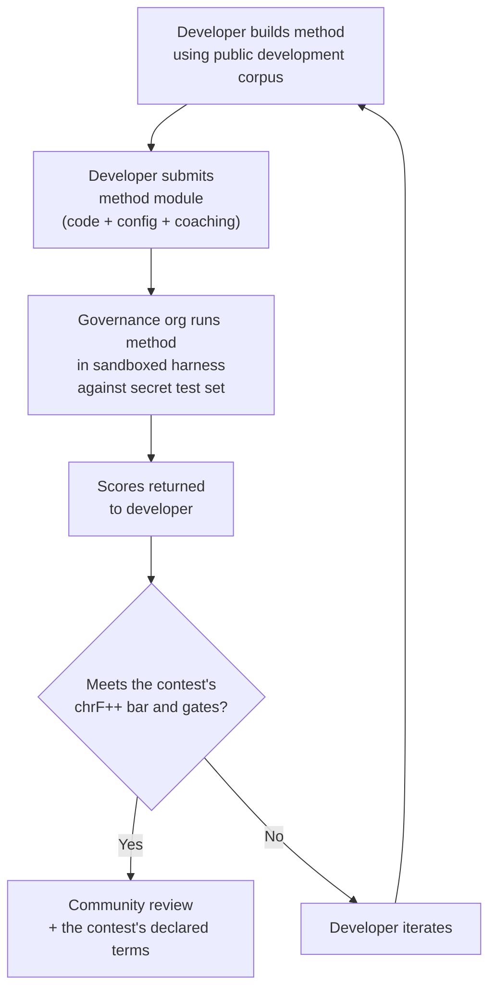

# مواصفات المعيار التقييمي (Benchmark Specification)

> **ملخص تنفيذي.** تحدد هذه الوثيقة بروتوكول التقييم لمنظومة تقييم الترجمة الآلية في Champollion: تنسيق المدونة اللغوية (§2)، ومخطط بطاقة التشغيل (§3)، وبروتوكول المعيار التقييمي (§6)، ومتطلبات التحقق البشري (§7)، وآليات السيادة (§8)، ونموذج لوحة الصدارة وتقديم المشاركات (§9)، وإطار العمل الخاص بالتكلفة (§10)، وإمكانية التوسع لتشمل لغات جديدة (§11). للاطلاع على كيفية احتساب درجات التشغيل (المقياس الرئيسي chrF++، والمقاييس القياسية المصاحبة له، والتشخيصات) وصيغ مقاييس التكلفة/السرعة، راجع `SCORING_SPEC.md` — وهو المصدر الوحيد المعتمد لجميع منطق احتساب الدرجات. تشير هذه الوثيقة إلى SCORING_SPEC لتلك التفاصيل بدلاً من تكرارها.


---

## 1. المبادئ

### 1.1 اللغات هي بيانات حيوية (Biodata)

اللغة ليست مادة اختبار حيادية. مثل البيانات الجينية أو الصحية، تعد بيانات اللغة **بيانات حيوية (biodata)**: فهي تحمل هوية الأشخاص الذين يتحدثون بها، وقرابتهم، وعلاقاتهم، ولا يمكن إخفاء هويتها بطريقة ذات مغزى — فحتى إذا جُرّدت من البيانات الوصفية، تظل اللغة ترمز إلى هوية أصحابها. والنتيجة المترتبة على هذه المواصفة واضحة وملموسة: الأشخاص الذين يقدمون مدونة لغوية يمتلكون مفاتيحها، ومفاتيح أي شيء يُقاس استناداً إليها. ولذلك، فإن السيادة (§8) ليست إضافة ملحقة بالبروتوكول؛ بل هي شرط مسبق له، وتعمل جميع المبادئ الأخرى أدناه في إطارها.

### 1.2 المقاييس الآلية هي مؤشرات تقريبية

كل مقياس محدد في هذه الوثيقة يتم حسابه آلياً. فمقياس chrF++، وقبول محول الحالات المحدودة (FST)، والدقة الصرفية، والتشابه الدلالي — كلها مؤشرات آلية تقريبية لجودة الترجمة. وهي مفيدة للتكرار السريع، والمقارنة المنهجية، واكتشاف التراجعات. لكنها **ليست بديلاً عن الحكم البشري**.

التسلسل الهرمي للتقييم:

```
Automated metrics (run cards, benchmarks)
    ↓ proxy for
Human review (bilingual speakers validate output)
    ↓ proxy for
Actual utility (does this help a language community?)
```

لا يمكن لأي درجة آلية، مهما بلغت درجة ارتفاعها، أن تحل محل متحدث طليق يقرأ المخرجات ويؤكد أنها صحيحة، وطبيعية، وملائمة ثقافياً. ولهذا السبب لا تحمل أي درجة تلقائية تصنيفاً للجودة (§5): فالمقاييس التلقائية مفيدة لتتبع التقدم، ولكنها لا تكفي وحدها أبداً.

### 1.3 الطرق وليس النماذج

نحن نضع **الطرق** في معيار التقييم، وليس النماذج. النموذج هو مجرد مكون واحد. أما الطريقة فهي الوصفة الكاملة: اختيار النموذج، وتصميم التوجيه (prompt)، واستخدام الأدوات، والمعالجة القبلية/البعدية، وبيانات التدريب والتوجيه (coaching data)، واستراتيجيات إعادة المحاولة، وكل شيء. سيحصل فريقان يستخدمان نفس النموذج بطرق مختلفة على درجات مختلفة. وهذا هو بيت القصيد.

### 1.4 قابلية التكرار وإعادة الإنتاج

يجب أن تكون كل نتيجة في المعيار التقييمي قابلة لإعادة الإنتاج. تسجل بطاقة التشغيل (§3) التكوين الكامل للتجربة. وتحدد البصمة (§3.5) الإعداد التجريبي. كما يتحقق تجزئة بطاقة التشغيل (§3.6) من سلامة النتيجة. ويجب على أي شخص يستخدم نفس الطريقة، والمدونة اللغوية، والتكوين أن يحصل على درجات ضمن نطاق ±2% (مع مراعاة عدم الحتمية في أخذ العينات لنماذج اللغات الكبيرة عند درجة حرارة > 0).

### 1.5 منع استخدام بيانات التقييم التوليدية

**لا يقوم هذا المشروع بإنشاء، أو استخدام، أو تأييد بيانات التقييم التوليدية (الاصطناعية).** يجب استخراج جميع المدونات اللغوية من نصوص أصلية كتبها بشر — ترجمات منشورة، أو كتب دراسية، أو وثائق ثنائية اللغة، أو ترجمات مستنبطة من متحدثين طلقاء.

يمكن لنماذج اللغات الكبيرة (LLMs) المساعدة في:
- محاذاة الجمل (العثور على المقاطع المتوازية في النصوص ثنائية اللغة الحالية)
- تحويل التنسيق (تحويل المواد المنشورة إلى مخطط المدونة اللغوية)
- إثراء البيانات الوصفية (اقتراح مستويات الصعوبة، وتصنيفات الأسلوب اللغوي)
- اقتراح جمل المصدر للترجمة البشرية (§11.3 — خطوة الترجمة تكون دائماً بشرية)

يجب ألا تقوم نماذج اللغات الكبيرة **أبداً** بإنشاء ترجمات مرجعية أو أزواج تقييم.

**نحن محايدون من حيث التطوير فيما يتعلق ببيانات التدريب.** إذا استخدم مطور الطريقة بيانات تدريب اصطناعية، أو ترجمة عكسية (backtranslation)، أو زيادة البيانات في طريقته، فهذا خياره — فنحن نقيّم المخرجات، وليس عملية التدريب. يستخدم نموذج OMT-1600 من Meta ما يقرب من 270 مليون جملة متوازية اصطناعية تم إنشاؤها عبر الترجمة العكسية. وليس لدينا أي اعتراض على الطرق المدربة بهذه الطريقة. نحن نختبر بناءً على التنقيح البشري فقط.

> **لماذا لا نستخدم نصوص الكتاب المقدس للتقييم؟** يقيّم OMT-1600 ما مقداره 1,560 من أصل 1,600 لغة على نصوص من نطاق الكتاب المقدس (Meta AI, *Omnilingual MT*, arXiv:2603.16309, 2026). تتميز ترجمات الكتاب المقدس بأسلوب لغوي قديم، ومفردات طقسية، وتركيب جمل نمطي. وتُستمد مدونات التقييم الخاصة بنا من نصوص متنوعة المجالات ومنسقة مجتمعياً — النطاقات الصحية، والقانونية، والتعليمية، والحكومية، والمحادثة، والتقنية (انظر §2.7). هذا اختيار تصميم مقصود؛ فالمجتمعات بحاجة إلى الترجمة في المجالات التي يعيشون ويعملون فيها فعلياً، وليس لأسلوب لغوي ديني واحد. فالطريقة التي تحقق درجات جيدة في سفر التكوين 1:1 لا تخبرك بأي شيء تقريباً عن أدائها في جدول أعمال مجلس محلي أو نموذج استقبال في عيادة طبية.

---

## 2. مخطط المدونة اللغوية (Corpus Schema)

المدونة اللغوية هي مجموعة منتقاة من أزواج النصوص المتوازية ذات بيانات وصفية منظمة. إنها الحقيقة الميدانية (ground truth) التي تُقاس على أساسها جميع الطرق.

### 2.1 غلاف مجموعة البيانات (Dataset Envelope)

الهيكل الأعلى لمستوى ملف المدونة اللغوية:

```json
{
  "dataset": {
    "id": "edtekla-dev-v1",
    "version": "1.0",
    "language_pair": "EN→CRK",
    "source_language": "en",
    "target_language": "crk",
    "created": "2026-05-01",
    "license": "LicenseRef-EdTeKLA-Modified-CC-BY-NC-SA-4.0",
    "provenance": ["gold_standard", "textbook"]
  },
  "entries": [ ... ]
}
```

| الحقل | النوع | مطلوب | الوصف |
|-------|------|----------|-------------|
| `id` | string | ✅ | المعرّف الفريد لمجموعة البيانات، يُستخدم في بطاقات التشغيل ولوحة الصدارة |
| `version` | string | ✅ | الإصدار الدلالي. تؤدي زيادته إلى إبطال المقارنات السابقة لبطاقات التشغيل |
| `language_pair` | string | ✅ | تسمية العرض (مثل، `EN→CRK`) |
| `source_language` | string | ✅ | رمز لغة المصدر وفق BCP 47 |
| `target_language` | string | ✅ | رمز اللغة الهدف وفق BCP 47 |
| `created` | string | ✅ | تاريخ الإنشاء بتنسيق ISO 8601 |
| `license` | string | ✅ | معرّف ترخيص SPDX |
| `provenance` | string[] | ✅ | قائمة وسوم المصدر المستخدمة عبر الإدخالات |

### 2.2 مخطط الإدخال (Entry Schema)

يمثل كل إدخال في المدونة اللغوية تحدياً ترجمياً واحداً:

```json
{
  "id": 42,
  "source": "I see the dog",
  "reference": "niwâpamâw atim",
  "segment": "gold_standard",
  "difficulty": 2,
  "provenance": "gold_standard",
  "register": "conversational",
  "context": "declaration",
  "morphological_analysis": "ni-wâpam-âw atim | 1sg-see.TA-3sg.DIR dog.AN",
  "notes": "Animate noun (atim); direct form because speaker is proximate",
  "variant_class": "simple-ta-direct"
}
```

| الحقل | النوع | مطلوب | الوصف |
|-------|------|----------|-------------|
| `id` | integer | ✅ | معرّف فريد داخل المدونة اللغوية |
| `source` | string | ✅ | نص المصدر بلغة المصدر |
| `reference` | string | ✅ | الترجمة المرجعية للمعيار الذهبي باللغة الهدف |
| `segment` | string | 📎 | قسم المدونة: `gold_standard`، أو `held_out`، أو `development`، أو `diagnostic` |
| `difficulty` | integer | 📎 | تقييم الصعوبة 1–5 (انظر §2.4) |
| `provenance` | string | 📎 | أصل هذا الإدخال (انظر §2.5) |
| `register` | string | 📎 | الأسلوب اللغوي/مستوى الرسمية (انظر §2.6) |
| `context` | string | 📎 | الوظيفة التواصلية (انظر §2.6) |
| `domain` | string | 📎 | نطاق حالة الاستخدام من تصنيف الـ 16 رمزاً (انظر §2.7). يجب أن يكون واحداً من: `conv`، `ecommerce`، `edu`، `financial`، `gov`، `legal`، `literary`، `marketing`، `medical`، `news`، `religious`، `scientific`، `subtitles`، `support`، `tech`، `ui`. يتم التحقق منه أثناء الإنشاء. |
| `morphological_analysis` | string | ❌ | التحليل الصرفي للمعيار الذهبي |
| `notes` | string | ❌ | ملاحظات المترجم، المتغيرات اللهجية، علامات الغموض |
| `variant_class` | string | ❌ | تسمية الفئة التي تجمع متغيرات الترجمة المقبولة |

> **📎 = يُوصى به.** يتعامل إطار الاختبار (harness) مع الحقول الاختيارية المفقودة بسلاسة عبر القيم الافتراضية. تحتاج مدونات الطرف الثالث فقط إلى توفير `id` و`source` و`reference` لكل إدخال.


### 2.3 أجزاء المدونة اللغوية

تنقسم المدونة اللغوية إلى أجزاء ذات مستويات وصول مختلفة:

| الجزء | الغرض | الوصول | الحد الأدنى للحجم |
|---------|---------|--------|-------------|
| `development` | تطوير الطرق والتكرار. يستخدمها المطورون بحرية. | **عام** | 30 إدخالاً |
| `diagnostic` | اختبارات موجهة لظواهر لغوية محددة. | **عام** | 10 إدخالات |
| `gold_standard` | تقييم المعيار التقييمي الرسمي. درجات لوحة الصدارة تأتي من هنا. | **سري** — تحتفظ به مؤسسة الحوكمة | 50 إدخالاً |
| `held_out` | مخصص للتقييم المستقبلي. لا يُستخدم حتى يتم تفعيله. | **سري** — تحتفظ به مؤسسة الحوكمة | 10 إدخالات |

> **الحالة الحالية:** يوجد جزء `development` فقط في مجموعات البيانات المشحونة. الأجزاء `diagnostic` و`gold_standard` و`held_out` محددة للاستخدام المستقبلي مع نمو المدونات.

الجزآن `gold_standard` و`held_out` سريان تماماً. حيث يتم الاحتفاظ بكل من جمل المصدر والترجمات المرجعية على بنية تحتية خاضعة لسيطرة مؤسسة الحوكمة. ولا يرى مطورو الطرق الأسئلة أو الإجابات مطلقاً. انظر §8 لمعرفة آلية السيادة.

### 2.4 مستويات الصعوبة

| المستوى | الوصف | أمثلة |
|------|-------------|----------|
| 1 — مفردات أساسية | كلمات مفردة، تحيات شائعة، أرقام | "hello" ← "tânisi"، "dog" ← "atim" |
| 2 — جمل بسيطة | فاعل-فعل أو فاعل-فعل-مفعول، زمن المضارع | "I see the dog" ← "niwâpamâw atim" |
| 3 — تعقيد متوسط | الماضي/المستقبل، الملكية، الحيوية (animacy) | "I saw his dog yesterday" |
| 4 — صرف معقد | التحييد (Obviation)، المبني للمجهول، صيغة الربط، جمل الصلة | "the woman whose son went to the store" |
| 5 — متقدم | متعدد الجمل، أسلوب رسمي، طقسي، تعبيرات اصطلاحية | فقرة كاملة بنبرة مناسبة للأسلوب اللغوي |

يجب أن تتضمن المدونة اللغوية المصممة جيداً إدخالات عبر جميع مستويات الصعوبة الخمسة، مع التركيز على المستويات 2–4 حيث تقع معظم تحديات الترجمة في العالم الحقيقي.

### 2.5 وسوم المصدر

يجب أن يشير كل إدخال إلى مصدره:

| الوسم | المعنى |
|-----|---------|
| `gold_standard` | تم التحقق منه بواسطة متحدثين طلقاء |
| `textbook` | من مواد تعليمية منشورة |
| `elicited` | تم إنتاجه من خلال جلسات استنباط منظمة |
| `corpus` | مستخرج من مدونة متوازية |

> **ملاحظة:** من الناحية العملية، تعد قيم المصدر سلاسل نصية حرة. وتعتبر الوسوم أعلاه مجرد اصطلاحات وليست تعداداً محدداً — قد تستخدم مجموعات البيانات سلاسل نصية وصفية أخرى للمصدر.

### 2.6 الأسلوب والسياق

يصف **الأسلوب اللغوي (Register)** درجة الرسمية والسياق الاجتماعي:

| الأسلوب اللغوي | الوصف |
|----------|-------------|
| `conversational` | حديث يومي بين أقران متساوين |
| `formal` | لغة رسمية أو مؤسسية |
| `technical` | مفردات خاصة بمجال معين |
| `ceremonial` | استخدام لغوي تقليدي أو مقدس |
| `educational` | مواد تعليم اللغة |

يصف **السياق (Context)** الوظيفة التواصلية:

> 🔲 **مخطط له.** الحقل `context` محدد في المخطط ولكنه غير معبأ بعد في مجموعات البيانات الحالية. وهو مخصص لإثراء المدونة مستقبلاً.

| السياق | الوصف |
|---------|-------------|
| `greeting` | تحية اجتماعية أو وداع |
| `declaration` | تقرير حقيقة |
| `question` | استفهام |
| `instruction` | أمر أو توجيه |
| `narrative` | سرد قصصي أو وصف |
| `label` | تسمية واجهة مستخدم، أو نص زر، أو عنوان |
| `error` | رسالة خطأ أو تحذير |

### 2.7 النطاق (Domain) {#27-domain}

يصف **النطاق** حالة الاستخدام في العالم الحقيقي — أي نوع المحتوى المترجم. وهذا متعامد ومستقل عن الأسلوب اللغوي والسياق:

- **الأسلوب اللغوي** يجيب عن: *ما مدى رسمية هذا النص؟*
- **السياق** يجيب عن: *ما الذي تفعله هذه الجملة؟*
- **النطاق** يجيب عن: *لأي قطاع/حالة استخدام هذا النص؟*

قد يكون العقد القانوني (النطاق: `legal`) رسمياً (الأسلوب: `formal`) ويحتوي على إقرار (السياق: `declaration`). في حين قد يكون نص محادثة روبوت دردشة قانوني (النطاق: `legal`) محادثياً (الأسلوب: `conversational`) ويحتوي على أسئلة (السياق: `question`). نفس النطاق، بأسلوب وسياق مختلفين.

| رمز النطاق | الوصف | المستهلكون النموذجيون |
|-------------|-------------|-------------------|
| `ui` | نصوص واجهة البرمجيات | مطورو التطبيقات، فرق التوطين |
| `legal` | العقود، والقوانين، ومستندات المحاكم، ووثائق الهجرة | مكاتب المحاماة، والمحاكم، وفرق الامتثال، ومحامو الملكية الفكرية |
| `medical` | الملاحظات السريرية، ملصقات الأدوية، اتصالات المرضى، بروتوكولات التجارب | المستشفيات، شركات الأدوية، التجارب السريرية، بوابات المرضى |
| `financial` | الخدمات المصرفية، التأمين، الإيداعات التنظيمية، تقارير التدقيق | البنوك، شركات التأمين، الجهات التنظيمية، مدققو الحسابات |
| `edu` | الكتب المدرسية، المناهج، خطط الدروس، المواد الأكاديمية | المدارس، الجامعات، ناشرو الكتب المدرسية |
| `ecommerce` | أوصاف المنتجات، المراجعات، قوائم الأسواق الإلكترونية | تجار التجزئة عبر الإنترنت، بائعو الأسواق الإلكترونية |
| `marketing` | النصوص الإعلانية، الرسائل التجارية، الحملات، الشعارات | وكالات الإعلان، فرق العلامات التجارية |
| `gov` | وثائق السياسات، اللوائح، الإخطارات العامة، التشريعات | الوكالات الحكومية، فرق الامتثال |
| `scientific` | الأوراق البحثية، الملخصات، المنهجية، مقترحات المنح | الباحثون، المجلات العلمية، وكالات المنح |
| `religious` | النصوص المقدسة، النصوص الطقسية، التفاسير اللاهوتية | المجتمعات الدينية، ناشرو النصوص الطقسية |
| `support` | الأسئلة الشائعة، رسائل الخطأ، أدلة استكشاف الأخطاء، نصوص روبوتات الدردشة | شركات برمجيات SaaS، مكاتب الدعم الفني |
| `subtitles` | حوارات الأفلام، والتلفزيون، والبث المباشر، والألعاب | منصات البث، الاستوديوهات، شركات الألعاب |
| `news` | الصحافة، تقارير وكالات الأنباء، المقالات الافتتاحية، البيانات الصحفية | المؤسسات الإعلامية، وكالات الأنباء |
| `literary` | الأدب، الشعر، السرد، النصوص الثقافية | دور النشر، منظمات الحفاظ على التراث الثقافي |
| `conv` | محادثات غير رسمية، وسائل التواصل الاجتماعي، الرسائل الفورية | التطبيقات الاستهلاكية، المنصات الاجتماعية |
| `tech` | وثائق API، الأدلة الإرشادية، المواصفات الهندسية، الأدلة التقنية | فرق التوثيق، المؤسسات الهندسية |

> **معايير تقييمية خاصة بالنطاق.** يقيّم المعيار العام الطريقة عبر جميع النطاقات. ولكن الشبكة تدعم أيضاً **معايير تقييمية مصفاة حسب النطاق** — حيث تُحسب الدرجات فقط على الإدخالات الموسومة بنطاق معين. يتيح ذلك للمستخدمين الإجابة عن: "ما هي أفضل طريقة لترجمة المستندات القانونية إلى الفرنسية؟" مقابل "ما هي الطريقة التي حصلت على أفضل درجة إجمالية في الفرنسية؟"
>
> تتيح تصنيفات لوحة الصدارة المصفاة حسب النطاق للمستخدمين مقارنة الطرق ضمن حالة استخدام واحدة. وتختلف الطرق في أدائها عبر النطاقات — فالطريقة التي تم ضبطها بدقة (fine-tuned) للمصطلحات القانونية قد تحقق درجات أعلى بكثير في النصوص القانونية مقارنة بنصوص المحادثة. وتساعد الشبكة المستخدمين في العثور على الطريقة الأنسب لحالة استخدامهم الخاصة.

> **مستقبلاً: مساعد الشبكة.** نعتزم توفير مساعد محادثة يساعد المستخدمين في وصف حالة استخدام الترجمة الآلية الخاصة بهم (النطاق، وزوج اللغات، ومتطلبات الجودة) وعرض الطرق المعتمدة مجتمعياً والمناسبة من لوحة الصدارة — على سبيل المثال، "ما الطريقة التي حققت أعلى الدرجات في معايير التقييم الطبية للزوج EN→JA؟" — كأداة مساعدة في التصفح، وذلك شريطة توفر قدر كافٍ من بيانات التقييم الموسومة بالنطاق وتنوع الطرق.

---

## 3. مخطط بطاقة التشغيل (Run Card Schema) {#3-run-card-schema}

تعد بطاقة التشغيل الوحدة الذرية للتقييم. وهي عبارة عن مستند JSON قائم بذاته يسجل التكوين الكامل والنتائج لعملية تقييم واحدة: طريقة واحدة، ونموذج واحد، وتكوين واحد، ومجموعة بيانات واحدة.

تسجل كل بطاقة تشغيل ثلاثة أبعاد:
- **الجودة** — ما مدى جودة الترجمات؟
- **التكلفة** — كم بلغت تكلفة إنتاجها؟
- **السرعة** — كم من الوقت استغرقت؟

### 3.1 الحقول ذات المستوى الأعلى

| الحقل | النوع | الوصف |
|-------|------|-------------|
| `run_id` | string | معرف فريد UUID v4 يتم إنشاؤه عند بدء التشغيل |
| `harness_version` | string | الإصدار الدلالي لإطار الاختبار (مثل، `2.0`) |
| `timestamp` | string | الطابع الزمني بتنسيق ISO 8601 UTC لبدء التشغيل |
| `elapsed_seconds` | number | المدة الزمنية الحقيقية المنقضية للتشغيل بأكمله |
| `score_caveats` | array | موجود فقط عندما يكون هناك ما يقيّد الدرجات: قائمة بكائنات `{kind, source, severity, message, …}`، مثل مجموعة اختبار تحتوي صفوفها على مطابقات شبه تامة في بيانات التدريب، أو مخرجات أطول بكثير أو أقصر بكثير من مراجعها، أو مخرجات تنسخ المصدر، أو مخرج واحد يُعطى لعدة مصادر مختلفة. معلوماتي فقط: لا يغير الدرجة أبداً، ويُعرض بجانب النتيجة الرئيسية chrF++ أينما وُجدت الدرجات. انظر [مواصفات بطاقة التشغيل](/docs/network/specifications/run-card#score_caveats) |

### 3.2 تكوين الطريقة

تحدد هذه الحقول الإعداد التجريبي — ما تم اختباره وكيفية اختباره.

| الحقل | النوع | مطلوب | الوصف |
|-------|------|----------|-------------|
| `model_slug` | string | ✅ | معرّف النموذج (مثل، `google/gemini-2.5-flash`) |
| `model_id` | string | ❌ | معرّف النموذج الذي تم حله والمرجع من واجهة API |
| `condition` | string | ✅ | تسمية التجربة (مثل، `baseline`، `coached-v3`، `few-shot`) |
| `temperature` | number | ✅ | درجة حرارة أخذ العينات (Sampling temperature) |
| `system_prompt_sha256` | string | ✅ | تجزئة SHA-256 لتوجيه النظام الكامل |
| `system_prompt_used` | string | ✅ | النص الكامل لتوجيه النظام |
| `coaching_data_sha256` | string | ❌ | تجزئة SHA-256 لملف بيانات التدريب والتوجيه، إن استُخدم |
| `fst_version` | string | ❌ | إصدار محلل FST، إن استُخدم |
| `tools_enabled` | string[] | ❌ | قائمة الأدوات المتاحة للطريقة |
| `batch_size` | number | ❌ | عدد الإدخالات لكل دفعة API متزامنة |
| `max_retries` | number | ❌ | الحد الأقصى لإعادة المحاولة عند رفض FST، إن انطبق ذلك |

:::info[تتضمن بطاقات التشغيل المنشورة method_config]
عند نشر بطاقة تشغيل إلى لوحة الصدارة (عبر `mt-eval publish`)، فإنها تتضمن أيضاً كتلة `method_config` تحتوي على MethodConfig القياسي المكون من 8 حقول (`model`، `temperature`، `batchSize`، `register`، `coachingFile`، `coachingPrompt`، `promptContext`، `qualityTier` — جميعها بنمط camelCase؛ ويكون `qualityTier` دائماً null في أي بطاقة جديدة، نظراً لإلغاء فئات الجودة). يتيح ذلك الاستيراد دون الحاجة لإعادة البناء: يقرأ `champollion leaderboard --install` الحقل `method_config` مباشرة ويكتبه كبيان للملحق (plugin manifest). وتسجل حقول القياس عن بُعد أعلاه (§3.2) ما لاحظه إطار الاختبار؛ بينما يسجل `method_config` ما قصده المطور.
:::

### 3.3 مرجع مجموعة البيانات

| الحقل | النوع | الوصف |
|-------|------|-------------|
| `dataset.id` | string | معرّف مجموعة البيانات |
| `dataset.version` | string | إصدار مجموعة البيانات |
| `dataset.language_pair` | string | تسمية العرض |
| `dataset.sha256` | string | تجزئة SHA-256 لمحتويات ملف مجموعة البيانات |
| `dataset.entry_count` | number | عدد الإدخالات التي تم تقييمها |

تثبّت تجزئة SHA-256 الخاصة بمجموعة البيانات النتيجة بإصدار محدد من البيانات. وإذا تغيرت مجموعة البيانات، فإن بطاقات التشغيل القديمة لن تكون قابلة للمقارنة.

### 3.4 الدرجات (الجودة)

المقاييس الإجمالية لعملية التشغيل بأكملها. جميع مقاييس الجودة **آلية** — انظر §1.2.

| الحقل | النوع | الوصف |
|-------|------|-------------|
| `scores.total` | number | إجمالي الإدخالات التي تم تقييمها |
| `scores.exact_matches` | number | الإدخالات التي طابقت فيها المخرجات المرجع تماماً |
| `scores.exact_match_rate` | number | 0.0–1.0 |
| `scores.equivalent_matches` | number | الإدخالات المطابقة لمتغير مقبول |
| `scores.equivalent_match_rate` | number | 0.0–1.0 |
| `scores.fst_accepted` | number | كلمات المخرجات التي قبلها محلل FST، محسوبة على مستوى كافة الإدخالات (عدد الكلمات، وليس عدد الإدخالات) |
| `scores.fst_acceptance_rate` | number | 0.0–1.0، متوسط معدلات القبول لكل إدخال (الكلمات المقبولة لكل إدخال ÷ عدد كلماته)؛ `null` إذا لم يتم تكوين FST |
| `scores.morphological_accuracy` | number | 0.0–1.0، مستخرج من FST (مطابق للجذع)، `null` في حال عدم وجود FST / عدم وجود كلمات متطابقة الجذع. استشاري حتى يتم تفعيله — انظر مواصفات احتساب الدرجات §2.2 |
| `scores.morph_coverage` | number | 0.0–1.0، نسبة الكلمات المتوقعة القابلة للتحليل والمطابقة في الجذع مع المرجع (توضح مدى تناثر `morphological_accuracy`) |
| `scores.chrf_plus_plus` | number | **المقياس الرئيسي ومقياس التصنيف:** مقياس chrF++ على مستوى المدونة (0–100). فاصل الثقة 95% بواسطة bootstrap هو `scores.confidence_intervals.corpus_chrf` وتوقيع sacreBLEU الخاص به هو `scores.sacrebleu_signatures.chrf` |
| `scores.scoring_standard` | string | `"standard/1"` في كل بطاقة جديدة. غير موجود في البطاقات المنشورة قبل المعيار، والتي تُقرأ كـ `legacy-composite` |
| `scores.primary_metric` | string | `"chrf_plus_plus"` |
| `scores.spbleu` | number | spBLEU (FLORES-200 SentencePiece)، يُعرض بجانب chrF++ |
| `scores.sacrebleu_signatures` | object | توقيع كل مقياس sacreBLEU تم حسابه (`chrf`، `chrf_plain`، `bleu`، `spbleu`، `ter`) |
| `scores.semantic_score` | number | التشابه الدلالي المعتمد على التضمين (Embedding-based) (0.0–1.0) |
| `scores.ter` | number | معدل تعديل الترجمة TER (من 0 إلى ∞، الأقل هو الأفضل) |
| `scores.length_ratio` | number | avg(len(predicted)/len(reference))، القيمة المثالية = 1.0 |
| `scores.code_switching_rate` | number | 0.0–1.0، نسبة الإدخالات التي حدث فيها تسرب من لغة المصدر |
| `scores.hallucination_rate` | number | 0.0–1.0، نسبة الإدخالات التي تحتوي على محتوى مختلق (هلوسة) |
| `scores.terminology_adherence` | number | 0.0–1.0، الالتزام بمصطلحات المسرد (`null` في حال عدم وجود مسرد) |
| `scores.tokens_per_second` | number | total_tokens / elapsed_seconds |
| `scores.entries_per_minute` | number | الإدخالات المترجمة في الدقيقة |
| `scores.composite` | number \| null | **ملغى.** `null` في كل بطاقة جديدة؛ تحتفظ البطاقة القديمة بالمركب المخزن بها، ويُعرض كـ "مركب قديم (ملغى)". انظر SCORING_SPEC §4 |
| `scores.quality_tier` | string \| null | **ملغى.** `null` في كل بطاقة جديدة. انظر SCORING_SPEC §5 |
| `scores.cost_adjusted` | number \| null | **ملغى** مع النتيجة المركبة؛ `null` في كل بطاقة جديدة |
| `scores.errors` | number | الإدخالات التي فشلت (خطأ API، مهلة زمنية، إلخ) |
| `scores.by_difficulty` | object | درجات مفصلة حسب مستوى الصعوبة |
| `scores.by_provenance` | object | درجات مفصلة حسب وسم المصدر |
| `scores.by_domain` | object | ✅ مُنفّذ — درجات مفصلة حسب النطاق (§2.7). يتيح ترتيب لوحة الصدارة بعد التصفية حسب النطاق. يتم حسابه بواسطة tester.py وتمريره عبر publish.py. |

### 3.5 الإجماليات (التكلفة)

| الحقل | النوع | الوصف |
|-------|------|-------------|
| `totals.prompt_tokens` | number | إجمالي رموز الإدخال (input tokens) عبر جميع استدعاءات API |
| `totals.completion_tokens` | number | إجمالي رموز الإخراج (output tokens) |
| `totals.reasoning_tokens` | number | الرموز المستخدمة في سلسلة الأفكار (chain-of-thought) (تساوي 0 لمعظم النماذج) |
| `totals.cached_tokens` | number | الرموز المستفادة من التخزين المؤقت لتوجيهات المزود |
| `totals.total_cost_usd` | number | التكلفة الإجمالية بالدولار الأمريكي |
| `totals.cost_per_entry_usd` | number | `total_cost_usd / entry_count` |
| `totals.cost_per_source_char` | number | التكلفة بالدولار الأمريكي لكل حرف في المصدر — قابلة للمقارنة عبر اللغات |

### 3.6 التوقيت (السرعة)

| الحقل | النوع | الوصف |
|-------|------|-------------|
| `elapsed_seconds` | number | المدة الزمنية الكاملة للتشغيل (المستوى الأعلى) |
| `scores.avg_latency_seconds` | number | متوسط زمن الاستجابة لكل إدخال |
| `scores.median_latency_seconds` | number | الوسيط لزمن الاستجابة لكل إدخال |
| `scores.p95_latency_seconds` | number | زمن الاستجابة للإدخال عند الشريحة المئوية 95 |

### 3.7 نتائج كل إدخال

يسجل كل إدخال في مصفوفة `results[]` ترجمة واحدة. يتم حفظ بيانات كل إدخال في جدول `run_card_entries` (الترحيل 005) مع أحكام LYSS غير المعيارية (denormalized) (الترحيل 006).

| الحقل | النوع | الوصف |
|-------|------|-------------|
| `entry_id` | string | يطابق `entries[].id` في المدونة اللغوية |
| `source` | string | نص المصدر الذي تمت ترجمته |
| `expected` | string | الترجمة المرجعية للمعيار الذهبي |
| `raw_predicted` | string \| null | مخرجات النموذج الأولية قبل المعالجة البعدية |
| `predicted` | string | المخرجات الفعلية للطريقة (بعد المعالجة) |
| `segment` | string | معرّف الجزء (مثل فهرس الجملة) |
| `difficulty` | string \| null | مستوى الصعوبة من المدونة اللغوية |
| `domain` | string | وسم النطاق من المدونة اللغوية (§2.7) |
| `exact_match` | boolean | ما إذا كانت المخرجات تطابق المرجع تماماً |
| `chrf_score` | number \| null | درجة chrF++ على مستوى الجملة (0–100) |
| `bleu_score` | number \| null | درجة BLEU على مستوى الجملة (0–100) |
| `latency_s` | number \| null | زمن الاستجابة بالثواني |
| `cost_usd` | number \| null | التكلفة بالدولار الأمريكي لهذا الإدخال |
| `tool_call_count` | integer | عدد استدعاءات الأدوات المستخدمة (0 إذا لم تُستخدم) |
| `error` | string \| null | رسالة الخطأ في حال فشل هذا الإدخال |
| `plugin_metrics` | object | المخرجات الكاملة للملحق لكل إدخال (JSONB) |
| `fst_valid` | boolean \| null | قبول GiellaLT FST للتوقع (LYSS-fst غير المعياري) |
| `equivalent_match` | boolean \| null | تأكيد فاحص لغة CRK على التكافؤ الهيكلي (LYSS-eq غير المعياري) |
| `semantic_verdict` | string \| null | حكم LYSS-sem: `VALID`، `MISMATCH`، `UNKNOWN`، `ERROR` |
| `code_switching_detected` | boolean \| null | اكتشاف رموز من لغة المصدر في المخرجات |
| `hallucination_detected` | boolean \| null | اكتشاف محتوى مختلق في المخرجات |


### 3.8 البصمة (Fingerprint)

معرّف لإمكانية التكرار وإعادة الإنتاج. عمليتا تشغيل ببصمات متطابقة تعنيان استخدام نفس الإعداد التجريبي تماماً.

البصمة هي تجزئة SHA-256 لملف JSON القياسي (بمفاتيح مرتبة) لكل من:
- `dataset.sha256`
- `model_slug`
- `condition`
- `system_prompt_sha256`
- `temperature`
- `harness_version`
- `batch_size`
- `tools_enabled`

> **لماذا 8 مكونات؟** يؤثر حجم الدفعة واستدعاء الأدوات بشكل جوهري على جودة المخرجات ويجب تضمينهما في الهوية. عمليتا تشغيل بأحجام دفعات مختلفة أو بأدوات مفعلة مختلفة تشكلان إعدادين تجريبيين مختلفين، حتى لو تطابقت جميع المعاملات الأخرى.

يضيف **الإصدار 2 (الإصدار 0.2.0 من إطار الاختبار وما بعده)** خمسة مكونات:
- `api_provider`: القناة التي مر عبرها النص (OpenRouter، أو واجهة API خاصة بالمزود، أو نقطة نهاية محلية؛ ومعرّف محرك الترجمة الآلية؛ وبالنسبة لملحق الطريقة، `local` تحت `--attest-local-transport`، وإلا فـ `method-plugin`). سجلات تشغيل الملحقات والمحركات المكتوبة قبل تصحيح ذلك تفيد بـ `openrouter`، وهي قيمة افتراضية لم تُرسل عبرها أبداً؛ ويسجل أمر النشر القيمة المصححة لها أيضاً، مما يغير هويتها في الإصدار الثاني — وذلك عن قصد، حيث كانت القيمة القديمة غير صحيحة
- `endpoint_host_sha256`: تجزئة SHA-256 للمضيف الخاص بنقطة النهاية، وليس عنوان URL الأصلي أبداً، لأنه قد يحمل أسماء مضيفين داخلية أو بيانات اعتماد
- `max_tokens`
- `method_version`: إصدار بطاقة الطريقة، أو الإصدار الذي يحدده `method.json` الخاص بملحق الطريقة
- `method_sha256`: تجزئة الحزمة المنفذة، بالنسبة لطريقة نفذتها عقدة مسابقة، أو التجزئة لملفات ملحق الطريقة (ملف `method.json` وملفات `.py` التابعة له)

تضيف عملية تشغيل **ملحق الطريقة** (`mt-eval run --method <plugin dir>`) مكونين إضافيين:
- `method_model`: النموذج الذي تم تمريره إلى الملحق باستخدام `-m/--model` (يقرأه الملحق كـ `config.method_model`)، أو `null` في حال عدم تحديد أي نموذج
- `method_dependencies_sha256`: تجزئة SHA-256 لقائمة `dependencies` التي يحددها `method.json` الخاص بالملحق (JSON قياسي)، أو `null` عندما لا يحدد أي قائمة

بدون ذلك، فإن تشغيل نفس الملحق على نموذجين مختلفين كان سيشترك في هوية واحدة. يضيف الإصدار 0.2.0 من إطار الاختبار هذه المكونات قبل إطلاقه، بحيث تتغير هوية تشغيل الملحق مرة واحدة، هنا؛ ولا يتأثر أي نوع آخر من التشغيل.

كما يضيف تشغيل محرك ترجمة آلية يشغل نموذجاً **مُعطى له** (`mt-eval run --method local-model -m <model>`) مكونين أيضاً:
- `method_model`: النموذج الذي تم تحميله — معرّفه على Hugging Face، أو اسم دليل النموذج
- `method_model_sha256`: بالنسبة للدليل، تجزئة SHA-256 لقائمة بملفاته على غرار `sha256sum` (سطر `<sha256>  <relative path>` واحد لكل ملف، مرتباً حسب المسار، مع استبعاد الأدلة التي تبدأ بنقطة)؛ وبالنسبة لمعرف Hugging Face، المراجعة (revision) التي تم تحميلها

يُعد استخدام نموذجين عبر نفس المحرك تجربتين منفصلتين. وسجل تشغيل `local-model` الذي لا يذكر أي نموذج (الإصدارات السابقة من 0.2.0 لم تمرر `-m` إلى المحرك، والذي قام بعد ذلك بتشغيل نموذج احتياطي، `Helsinki-NLP/opus-mt-en-es`) لا يمكنه توضيح ما أنتج أرقامه: يرفضه `mt-eval publish` ولن يصدر `contest qualify` إيصالاً له.

في الإصدار 1، اشترك نفس النموذج المستدعى عبر قناتين مختلفتين في هوية واحدة، ولأن البطاقة المنشورة غير قابلة للتغيير، فقد تم رفض الثانية منهما باعتبارها مكررة. تسجل بطاقة التشغيل `fingerprint.version`. ويحتفظ سجل التشغيل من إطار عمل أقدم بالإصدار 1، وبالتالي فإن إعادة نشره تعيد إنتاج هويته الأصلية.

يجب أن تؤدي عمليتا تشغيل ببصمات متطابقة إلى نتائج قابلة للمقارنة. وتعود الاختلافات إلى عدم حتمية واجهة API (درجة الحرارة > 0) أو تحديثات النموذج من جانب المزود.

### 3.9 تجزئة بطاقة التشغيل (Run Card Hash)

تجزئة SHA-256 لملف JSON الخاص ببطاقة التشغيل بأكملها (مع ضبط حقل `run_card_hash` نفسه على `""` أثناء عملية التجزئة). هذا هو الختم الأمني لاكتشاف التلاعب. فإذا تغير أي حقل، تصبح التجزئة غير صالحة.

---

## 4. المقاييس الآلية

جميع المقاييس الواردة في هذا القسم تُحسب آلياً بواسطة الحاسوب. انظر §1.2.

### 4.1 تعريفات المقاييس

| المقياس | الحالة | ما يقيسه | النطاق |
|--------|--------|-----------------|-------|
| **chrF++** | ✅ مُنفّذ | درجة F للجرامات المتعددة على مستوى الأحرف (Character n-gram F-score). يعمل على مستوى الحرف، مما يجعله أكثر متانة من المقاييس المعتمدة على مستوى الكلمة (مثل BLEU) للغات الغنية صرفياً حيث تكون الكلمات طويلة وكثيرة التصريف. يُحسب بواسطة sacrebleu. | 0–100 (المقياس الأصلي). **المقياس الرئيسي ومقياس التصنيف**، ويُنشر مع فاصل الثقة 95% وتوقيع sacreBLEU. |
| **معدل قبول FST** | ✅ مُنفّذ (تشخيصي) | نسبة الكلمات المتوقعة التي يقبلها المحلل الصرفي (GiellaLT HFST) كأشكال صحيحة في اللغة الهدف. الكلمة التي يقبلها FST هي كلمة حقيقية وصحيحة هيكلياً — وليست هلوسة. | 0.0–1.0 |
| **المطابقة التامة (Exact match)** | ✅ مُنفّذ (تشخيصي) | نسبة التوقعات التي تطابق المرجع تماماً بعد تسوية كود يونيكود. صارم ولكنه لا لبس فيه — ومفيد كفحص للحد الأقصى (ceiling check). | 0.0–1.0 |
| **الدقة الصرفية** | ✅ مُنفّذ (تشخيصي) | مستخرج من FST ومطابق للجذع: لكل كلمة متوقعة يظهر جذرها في المرجع، ما إذا كان تصريفها متطابقاً. أكثر تفصيلاً من قبول FST — حيث يمكن للكلمة أن تكون صالحة في FST ولكن بتصريف خاطئ (الجذر صحيح، والزمن خاطئ). يحتاج إلى محلل FST وليس مجرد أداة قبول للتدقيق الإملائي؛ انظر SCORING_SPEC §2.2. | 0.0–1.0 |
| **المطابقة المكافئة** | ⚡ جزئي (تشخيصي) | النسبة المطابقة لمتغير مقبول من المرجع — مع مراعاة ترتيب الكلمات، والاختلافات اللهجية، والاصطلاحات الإملائية. مُنفّذ حالياً للغة CRK عبر `CrkLinterMetric` لمعيار تقييم CRK (في `eval_standards/crk/`)؛ ويتم تحميله تلقائياً عبر إعلان `evalMetrics` لبطاقة لغة CRK. يتطلب التنفيذ العام وجود `variants[]` لكل إدخال في المدونة اللغوية. | 0.0–1.0 |
| **الدرجة الدلالية** | ⚡ جزئي (تشخيصي) | الحفاظ على المعنى بغض النظر عن الشكل السطحي. مُنفّذ حالياً للغة CRK عبر `CrkSemanticMetric` لمعيار تقييم CRK (في `eval_standards/crk/`، مؤشر تقريبي مرجح بالأحكام). يُخطط لاستخدام تشابه جيب التمام الشامل المعتمد على التضمين — انظر SCORING_SPEC §2.3. | 0.0–1.0 |

### 4.2 المقياس الرئيسي والمعيار المصاحب له

يتم احتساب درجات عمليات التشغيل بموجب معيار احتساب الدرجات `standard/1`، على النحو الذي تعتمده مهام WMT وFLORES-200 والمهام المشتركة لـ AmericasNLP في تقارير تقييم الترجمة الآلية:

- **مقياس رئيسي وتصنيفي واحد:** مقياس chrF++ للمدونة اللغوية مع فاصل الثقة 95% بواسطة bootstrap وتوقيع sacreBLEU، ويُكتب `chrF++ 47.5 [45.9, 49.0]`.
- **المقاييس القياسية الأخرى بجانبه، دون دمجها أبداً:** BLEU وspBLEU وTER وCOMET عند حسابها (مع معرف النموذج الخاص بها).
- **التشخيصات تُعرض بشكل منفصل:** المطابقة التامة، وقبول FST، والدقة الصرفية، والمطابقة المكافئة، والدرجة الدلالية، والتحول اللغوي (code-switching)، والهلوسة، والمصطلحات، وأسلوب الكتابة، وكل تحفظات الدرجات. وظيفتها تفسير الدرجة وليست هي الدرجة نفسها مطلقاً.
- **تحديد الأفضلية يتم عبر اختبار الدلالة الإحصائية المقترن** على مقياس chrF++ ([الدلالة الإحصائية](/docs/network/specifications/significance))، وليس بمجرد مقارنة رقمين.

**التعريف الكامل موجود في `SCORING_SPEC.md`** ([كيفية احتساب درجات التشغيل](/docs/network/specifications/scoring#how-runs-are-scored)). وتعكس شيفرة إطار الاختبار ذلك في `mt_eval_harness/scoring.py`.

> **لماذا لا نعتمد BLEU كمقياس رئيسي؟** يعمل BLEU على مستوى الكلمة ويعاقب الاختلافات الصرفية. بالنسبة للغات التركيبية التعددية (polysynthetic languages)، يمكن لكلمة واحدة أن تمثل جملة كاملة — وبالتالي سيعامل BLEU الاختلافات التصريفية الطفيفة على أنها أخطاء كاملة. يتعامل chrF++ مع هذا الأمر بشكل أفضل بكثير من خلال العمل على مستوى الحرف. ويتم إدراج BLEU بجانبه. انظر ملحق SCORING_SPEC Appendix A.

### 4.3 المقياس المركب الملغى

قبل اعتماد المعيار، كان يتم ترتيب عمليات التشغيل من خلال مقياس مركب مرجح يجمع بين chrF++، والمطابقة التامة، وقبول FST، والدقة الصرفية والمقاييس السلوكية. لقد تم **إلغاؤه**: تنشر البطاقات الجديدة `composite: null` و`cost_adjusted: null`. فقد كان من الممكن التلاعب به — فالنموذج غير المدرب الذي كرر جملة صالحة واحدة بلغة سامي الشمالية لكل المدخلات حقق 0.6244 مع نتيجة chrF++ بلغت 5.5 — كما أن مزيج الإشارات التي تعني أشياء مختلفة للغات مختلفة لا يمكن قراءته بشكل موضوعي. تحتفظ البطاقات القديمة بمركبها المخزن وتظل قابلة للتحقق؛ انظر [SCORING_SPEC §4](/docs/network/specifications/scoring#4-composite-score).

---

## 5. فئات الجودة (ملغاة) {#5-quality-tiers}

**لا يحمل أي تقييم تلقائي تصنيفاً للجودة.** ففئات الجودة (أساسي، ناشئ، وظيفي، قابل للنشر، طليق) التي كانت تُقرأ من المقياس المركب قد أُلغيت معه: تنشر البطاقات الجديدة `quality_tier: null`، ولا تطبع أي مخرجات فئة معينة. إن تسمية مثل "وظيفي" لدرجة تلقائية تدّعي أمراً لا يمكن إلا للمتحدثين تأكيده — كما أن الفئات الملغاة وصفت نظاماً يكرر جملة واحدة لكل المدخلات بأنه "وظيفي". يتم اعتماد الجودة عبر التحقق البشري فقط (§7). ولا تزال البطاقات القديمة تخزن فئة؛ ويبقي [SCORING_SPEC §5](/docs/network/specifications/scoring#5-quality-tiers) على الحدود القديمة فقط حتى يتسنى قراءة تلك البطاقات.

---

## 6. بروتوكول المعيار التقييمي (Benchmark Protocol)

**المعيار التقييمي (benchmark)** هو الإنتاج المنهجي لبطاقات التشغيل عبر مساحة معاملات محددة لمجموعة بيانات معينة. وهو ليس مجرد عملية تشغيل فردية — بل استكشاف منظم لكيفية أداء التكوينات المختلفة.

### 6.1 مخرجات المعيار التقييمي

ينتج المعيار التقييمي **مصفوفة من بطاقات التشغيل** — واحدة لكل مجموعة من قيم المعاملات. تتيح هذه المصفوفة مقارنة متعددة الأوجه عبر:

- **الجودة** — chrF++ مع فاصل الثقة، والمقاييس القياسية الأخرى، والتشخيصات
- **التكلفة** — التكلفة الإجمالية ولكل إدخال لكل تكوين
- **السرعة** — الوقت الحقيقي وزمن الاستجابة لكل إدخال

لا توجد "درجة معيارية" واحدة. المعيار التقييمي هو المصفوفة الكاملة. وستولي الأطراف المعنية المختلفة اهتماماً لجوانب متباينة: يبحث الباحث عن تحسن ذي دلالة إحصائية في chrF++، ويحسن مهندس النشر التكلفة لكل إدخال، ويراجع المجتمع الجودة.

### 6.2 مساحة المعاملات

يحدد المعيار التقييمي المعاملات التي يتم تبديلها وتجربتها:

| المحور | القيم النموذجية | الغرض |
|------|---------------|---------|
| `model` | 4–12 نموذجاً (رائدة + متوسطة + اقتصادية) | ما مدى أهمية قدرة النموذج؟ |
| `temperature` | 0.0، 0.3، 0.7 | هل العشوائية في أخذ العينات مفيدة أم ضارة؟ |
| `prompt_version` | 2–3 استراتيجيات توجيه | ما مدى حساسية الطريقة لتصميم التوجيه؟ |
| `coaching_config` | مع/بدون بيانات تدريب وتوجيه | هل يؤدي إدخال المعرفة اللغوية إلى تحسين المخرجات؟ |
| `tool_config` | مع/بدون FST، مع/بدون قاموس | هل تؤدي الأدوات اللغوية إلى تحسين المخرجات؟ |

مساحة التبديل الكاملة:
```
runs = |models| × |temperatures| × |prompts| × |coaching| × |tools|
```

معيار تقييمي أولي نموذجي: 12 نموذجاً × 3 درجات حرارة × 2 توجيه × 2 تدريب وتوجيه = 144 عملية تشغيل.

### 6.3 التقييم الأساسي مقابل تقييم الطرق

يخدم المعيار التقييمي غرضين متميزين:

**تحديد خط الأساس (Baselining)** — رسم خريطة المشهد باستخدام النُهج البسيطة والمباشرة. "ما الذي يمكن للنماذج الحالية فعله لهذه اللغة دون أي هندسة خاصة باللغة؟" يحدد هذا الإجراء الحد الأدنى. وتوضح لك مصفوفة خط الأساس: النماذج الأقل هلوسة، ودرجات الحرارة التي تنتج أكثر المخرجات اتساقاً، وما إذا كانت بيانات التوجيه تساعد على الإطلاق، وأين تفشل جميع النماذج بشكل موحد (مما يكشف عن المشكلات اللغوية الصعبة).

**تقييم الطريقة (Method evaluation)** — اختبار طريقة هندسية محددة. "هل يتفوق المسار الموجه والمقيد بـ FST على خطوط الأساس؟" تتم مقارنة بطاقة تشغيل الطريقة بمصفوفة خط الأساس. وتكون الطريقة محل اهتمام عندما تتفوق على أفضل خط أساس — أي عندما تضيف الهندسة قيمة تفوق مجرد استدعاءات النماذج البسيطة.

ينتج كلا النشاطين بطاقات تشغيل بنفس المخطط. والفرق يكمن في الهدف ومساحة المعاملات: فخطوط الأساس تبدل بين النماذج والتكوينات؛ بينما يختبر تقييم الطريقة طريقة واحدة في مواجهة أفضل التكوينات.

### 6.4 التقييم التطويري مقابل تقييم المعيار الذهبي

يكرر مطورو الطرق اختباراتهم بحرية على أجزاء المدونة `development` و`diagnostic`. وهذا أمر غير رسمي — لا قيود، ولا طلبات تقديم، ولا تدخل من هيئات الحوكمة. فالمطور يستكشف ما ينجح.

تأتي درجات لوحة الصدارة الرسمية من تقييم `gold_standard` فقط. وهذا إجراء رسمي:
1. يرسل المطور طريقته الكاملة والقابلة للتشغيل (الشيفرة البرمجية + التكوين + بيانات التدريب والتوجيه)
2. تقوم مؤسسة الحوكمة بتشغيلها في إطار اختبار معزول (sandbox) على مجموعة الاختبار السرية
3. لا يعود للمطور سوى الدرجات فقط

انظر §8 لمعرفة آلية السيادة الكاملة.

---

## 7. التحقق البشري {#7-human-validation}

المقاييس الآلية هي مجرد مؤشرات تقريبية. أما التحقق البشري فهو الحقيقة الميدانية المعتمدة.

### 7.1 ما يكشفه التدقيق البشري وتغفل عنه المقاييس

- **صحيحة صرفياً لكنها خاطئة دلالياً** — يقبل FST الكلمة، وتكون درجة chrF++ مرتفعة، لكن الترجمة تعني شيئاً مختلفاً تماماً
- **غير ملائمة ثقافياً** — الترجمة صحيحة تقنياً ولكنها تستخدم أسلوباً لغوياً أو صياغة يرفضها المجتمع
- **هلوسة تبدو معقولة** — المخرجات تبدو كأنها من اللغة الهدف لغير المتحدث بها، لكنها مجرد هراء بالنسبة لمتحدث طليق
- **اختلاف مقبول ولكنه غير مسجل** — المخرجات صحيحة لكن المقاييس الآلية تعتبرها خاطئة لأنها تستخدم متغيراً لهجياً غير موجود في المرجع

### 7.2 بوابة التحقق (Validation Gate)

لا يمكن وصف أي طريقة بأنها قابلة للاستخدام دون تحقق بشري يؤكد فيه المتحدثون ثنائيو اللغة أن المخرجات صالحة للاستخدام. هذا ليس مجرد إجراء شكلي — بل هو جوهر العملية برمتها. إن المقاييس الآلية وُجدت لتقليل حجم المخرجات التي تحتاج إلى مراجعة بشرية، لكنها لا يمكن أن تحل محلها أبداً.

### 7.3 بروتوكول مراجعة المجتمع

> 🔲 **مخطط له**: واجهة مراجعة المجتمع ليست متاحة بعد. يصف هذا القسم العملية المستهدفة.

1. تُطرح الطريقة للمراجعة — من قِبل مطورها، أو لأنها استوفت الحدود التلقائية لمسابقة معينة (حد أدنى لمقياس chrF++ وأي بوابات تشخيصية حددتها المسابقة)
2. تُعرض عينة من المخرجات (مقسمة حسب مستويات الصعوبة) على متحدثين ثنائيي اللغة
3. يقيّم المتحدثون كل ترجمة وفق مقياس: **مرفوضة**، **المعنى العام مفهوم** (المعنى واضح لكن الصياغة خاطئة)، **مقبولة** (صحيحة مع وجود مشكلات طفيفة)، **ممتازة** (لا يمكن تمييزها عن الترجمة البشرية)
4. تراجع مؤسسة الحوكمة التقييمات الإجمالية
5. إذا قبل المجتمع الطريقة، فإنها تنتقل إلى ما تنص عليه شروط الجوائز المعلنة للمسابقة (§8.3) ومن ثم إلى النشر الفعلي

تتطلب المراجعة حداً أدنى من الشروط قبل أن تمنح فئة **معتمد مجتمعياً**
(§9.4): يجب أن تغطي العينة الطبقية **ما لا يقل عن 30 إدخالاً**، و**ما لا يقل عن مراجعَين اثنين** — كلاهما مؤهل وفق البروتوكول الخاص بالمجتمع — ويجب أن يحقق **ما لا يقل عن 70%** من الإدخالات معيار القبول لدى المجتمع. وتُمنح الفئة فقط من خلال الاختبارات التي يجريها المجتمع بنفسه، وفقاً لتقديره، ويكون سحب الفئة متماثلاً: فنفس البروتوكول الذي يُجرى كتدقيق مفاجئ يلغي الفئة بنفس القدر من العلنية التي مُنحت بها.

---

## 8. السيادة

تحتوي مجموعات بيانات التقييم على معرفة لغوية منتقاة تخص مجتمع اللغة. ويحدد هذا القسم الإطار التقني والقانوني لحماية تلك البيانات.

### 8.1 المشكلة

تنشر المعايير التقييمية التقليدية مجموعات الاختبار علناً. وبمجرد نشرها، لا يمكن التراجع عن هذا النشر. بالنسبة لمجتمعات اللغات الأصلية ولغات الأقليات، يخلق هذا نمطاً استغلالياً — حيث تُستخدم البيانات اللغوية دون موافقة مستمرة. واستناداً إلى رؤية ديهين (Dhein) البراغماتية لسيادة البيانات الحيوية، فإننا نتعامل مع البيانات اللغوية باعتبارها "مورداً متقلباً ذا إمكانات لا يمكن التنبؤ بها" يتطلب حوكمة ديناميكية وتشاركية.

### 8.2 التنفيذ المعزول (Sandboxed Execution)

آلية الإنفاذ الأساسية: يسلم المطور وحدة الطريقة الخاصة به، وتقوم مؤسسة الحوكمة بتشغيلها على مجموعة الاختبار السرية تماماً عبر بنيتها التحتية الخاصة، ولا تُعاد إلا الدرجات فقط. ولا يرى المطور جمل المصدر أو الترجمات المرجعية أبداً.


```mermaid
graph TD
    A["Developer builds method\nusing public development corpus"] --> B["Developer submits\nmethod module\n(code + config + coaching)"]
    B --> C["Governance org runs method\nin sandboxed harness\nagainst secret test set"]
    C --> D["Scores returned\nto developer"]
    D --> E{"Meets the contest's\nchrF++ bar and gates?"}
    E -->|Yes| F["Community review\n+ the contest's declared terms"]
    E -->|No| G["Developer iterates"]
    G --> A
```

مسار العمل:
1. **مدونة التطوير عامة.** لا قيود على الجزأين `development` و`diagnostic`.
2. **مجموعة اختبار المعيار الذهبي سرية تماماً.** تتواجد كل من جمل المصدر والترجمات المرجعية على بنية تحتية تابعة لمؤسسة الحوكمة.
3. **للحصول على درجة رسمية، عليك تسليم طريقتك.** تشغلها مؤسسة الحوكمة في بيئة معزولة. وتُعاد الدرجات فقط.
4. **تمتلك مؤسسة الحوكمة الطريقة بالفعل.** فالطريقة أو النموذج المسلّم هما المشاركة ذاتها؛ والحيازة هي ما يجعل منح درجة سيادية أمراً ممكناً أصلاً. وما يحدث لها بعد ذلك يتبع شروط الجوائز المعلنة للمسابقة (§8.3).
5. **يتطلب التقديم الموافقة على الشروط.** شروط تقديم الطريقة دائماً، وعندما تعلن المسابقة عن شروط للجوائز، يتطلب ذلك قبولاً صريحاً لها، عبر التجزئة (§8.3).
6. **تتحكم مؤسسة الحوكمة في الوصول بشكل كامل.** ويمكنها رفض أو إلغاء التقييم في أي وقت. إنها موافقة ديناميكية.
7. **التشفير أثناء التخزين هو دفاع إضافي.** فالإنفاذ الأساسي يعتمد على البنية الهيكلية للنظام.

### 8.3 ما يحدث للطريقة بعد ذلك {#8-3-method-transfer}

هناك أمر بنيوي غير قابل للتفاوض: التقييم السيادي يعني أن مؤسسة الحوكمة لديها **حيازة مادية لما قامت بتشغيله** — فقد وصل النموذج أو الطريقة إلى عقدتها ليتم تقييمها في المقام الأول. وكل ما يتجاوز الحيازة يخضع **لشروط الجوائز المعلنة للمسابقة**، والتي يحددها المضيف وتُنشر قبل اشتراك أي طرف.

وهذا الشرط هو واحد من ثلاثة، يُعلن عنه لكل مسابقة: `pass_to_holders` (تنتقل الطريقة إلى حاملي المعيار السيادي، الذين يقيّمونها ويحتفظون بها في كل الأحوال)، أو `retain_ip` (يحتفظ المطور بالملكية؛ ويحتفظ المضيف بنسخة مغلقة للتدقيق على الأكثر) أو `release_open` (يحتفظ المطور بالملكية ولكن يجب عليه نشر الطريقة بموجب ترخيص مفتوح، ويعد هذا النشر شرطاً لنيل الجائزة). وما يعنيه كل خيار بالتفصيل — ما يتم الاحتفاظ به، وما إذا كانت الحقوق تنتقل، ولأي أغراض يمكن للمضيف استخدامها، ومتى يستحق النشر — يُشتق من الخيار نفسه، وتوجد تفاصيل كيفية التحقق من كل منها قبل الصرف في [مواصفات الجوائز §1.3](/docs/network/specifications/prizes#1-3-declared-terms). أما المسابقة التي لا تعلن عن شروط للجوائز فليس لها جائزة، ولا ينتقل أي شيء يخص المشاركة.

**في جميع الحالات، يحتفظ المطور بما يلي:**
- نسبة العمل والتقدير الأدبي (يبقى الاسم في لوحة الصدارة)
- الحق في النشر عن الطريقة
- الحق في استخدام الطريقة لأزواج لغات أخرى

**ما تكتسبه مؤسسة الحوكمة** هو بالضبط ما تنص عليه شروطها المعلنة — بدءاً من "لا شيء؛ تم حذف الملف بعد احتساب الدرجات" وصولاً إلى التنازل الكامل مع الحق في استخدام الطريقة وتعديلها وتوزيعها وتحقيق الدخل منها ومنح تراخيص فرعية لها لصالح لغتهم. إن استيفاء الحدود المعلنة للمسابقة (حد أدنى لـ chrF++ وأي بوابات تشخيصية) في تقييم المعيار الذهبي واجتياز التحقق البشري (§7) هو ما يجعل الطريقة *مؤهلة للجائزة*؛ ولا ينقل هذا بحد ذاته أي حقوق تلقائياً.

### 8.4 متطلبات مؤسسة الحوكمة

لتكون المؤسسة أمينة على المفاتيح لمعيار تقييمي للغة ما:

1. **تمثيل مجتمع اللغة** — علاقة مثبتة بالمتحدثين والسلطات الثقافية
2. **القدرة على إدارة المفاتيح** — القدرة التقنية على إدارة المفاتيح التشفيرية
3. **الالتزام بإتاحة التقييم** — يجب أن يظل المعيار التقييمي متاحاً للتقييم
4. **نشر شروط المشاركة** — توثيق واضح لما يوافق عليه المطورون
5. **العمل وفق مبادئ سيادة البيانات المعترف بها** — ملكية المجتمع للبيانات اللغوية وسيطرته عليها، أو مبادئ CARE، أو ما يعادلها

### 8.5 خدمة سيادة البيانات ومبادئ CARE

**ما يملكه المجتمع.** البيانات اللغوية ملك للمجتمع، وتدير مؤسسة الحوكمة
البنية التحتية للتقييم التي تُقاس على أساسها. وتحدد تلك المنظمة
من يحق له التقديم وبأي شروط، ويعد التنفيذ المعزول هو الوسيلة التي يتم بها
*إنفاذ* القرار بدلاً من مجرد التصريح به. ويتمتع المجتمع
بوصول غير مقيد إلى بياناته الخاصة، والنتائج، والطرق
المطورة بالاعتماد عليها. ولا تغادر مجموعة الاختبار المغلقة
البنية التحتية التابعة لمؤسسة الحوكمة أبداً؛ ويشكل التشفير أثناء التخزين خط الدفاع الثاني بعد ذلك.

**مبادئ CARE.**

| المبدأ | آلية التنفيذ |
|-----------|---------------|
| **المنفعة الجماعية (Collective Benefit)** | يحدد المضيف شروط الجائزة، بحيث يمكن للمجتمع الذي يريد أن تعود المشاركات بالنفع عليه أن يشترط ذلك بدقة — ويحتفظ بالطريقة وكل ما تحققه من أرباح؛ ولا تحصل المنصة على أي حصة في جميع الأحوال. |
| **سلطة التحكم (Authority to Control)** | يمثل التنفيذ المعزول (Sandboxed execution) التطبيق التقني لذلك. |
| **المسؤولية (Responsibility)** | يقبل المطورون المسؤولية من خلال شروط المشاركة. |
| **الأخلاقيات (Ethics)** | تقديم حقوق المجتمع على راحة الباحثين. |

### 8.6 فئات التبعية وسياسة شبكة البيئة المعزولة

يعتمد كل من التنفيذ المعزول (§8.2) ونقل الملكية (§8.3) على المعرفة الدقيقة بما تتطلبه الطريقة في وقت التشغيل. وتحدد [مواصفات واجهة الطريقة](/docs/network/specifications/methods#method-validity-and-dependency-classes) خمس **فئات للتبعية** — S (قائمة بذاتها)، O (مفتوحة خارجية)، A1 (استدلال بنماذج LLM قابلة للاستبدال)، A2 (واجهة API خارجية غير قابلة للاستبدال)، X (مغلقة) — وبيان التبعيات الذي يجب على كل طريقة التصريح به. ويوضح هذا القسم الفرعي كيفية إنفاذ سياسة شبكة البيئة المعزولة لهذه الفئات.

**حظر الاتصال الصادر افتراضياً (Default-deny egress).** تتطلب مواصفات البيئة المعزولة ألا تتوفر لحاويات الطرق إمكانية الوصول إلى الشبكة افتراضياً. هذه ليست مجرد قاعدة جدار حماية — بل تزيل المواصفات الشبكة بالكامل من بيئة التنفيذ، بحيث تفشل أي تبعية شبكية غير معلنة على مستوى البنية الهيكلية وليس على مستوى السياسة. وتعمل الطرق من الفئتين S وO بالكامل من ملفات مدمجة ومضمنة في المشاركة (يتم تثبيت ملفات الفئة O ونسخها محلياً وقت التقديم).

**بوابة نماذج اللغات الكبيرة (LLM gateway) (🔲 مخطط لها).** تستدعي معظم الطرق نماذج LLM، لذا تحدد مواصفات البيئة المعزولة استثناءً واحداً فقط للاتصال الصادر: **بوابة LLM** تديرها البنية التحتية للتقييم. وتقوم البوابة بما يلي:

- تفويض طلبات الاستدلال إلى **قائمة مسموحات صريحة لنماذج مثبتة** — وهي معرفات النماذج المسجلة في بيان الطريقة وبطاقة التشغيل؛
- **تسجيل كل طلب واستجابة** في سجل تدقيق لا يمكن التعديل عليه، ومرتبط بسلسلة تجزئات، بحيث يمكن مراجعة حركة مرور البوابة لاكتشاف أي محاولات لتسريب البيانات قبل نشر الدرجات؛
- تكون هي المسار الشبكي *الوحيد* — فلا يوجد اتصال صادر عام، ولا DNS، ولا أي نقاط نهاية أخرى.

هذا ما يجعل طرق الفئة A1 قابلة للتقييم دون التخلي عن ضمانات التحقق الواردة في §8.2 — ولكنه مقايضة حقيقية، وتسميها المواصفات بصراحة: ترجمة جملة مصدر سرية عبر نموذج خارجي **يكشف جملة المصدر تلك لمزود النموذج**. الترجمات المرجعية لا تخرج أبداً (يحتفظ بها إطار الاختبار خارج الحاوية؛ انظر §8.2)، ولا يمكن للطريقة نفسها تسريب أي شيء يتجاوز ما تحتويه استدعاءات الاستدلال المسجلة والمدرجة في قائمة المسموحات. وتحديد ما إذا كان هذا الكشف المقيد مقبولاً لمدونة معينة هو قرار يعود للمشرفين: فالسماح بتقييم الفئة A1 يعني الترخيص به عن دراية تامة، لكل عملية تشغيل، مثل أي استخدام آخر للبيانات.

**الحالة.** تم **تنفيذ بيئة تشغيل الطرق المعزولة** عن الشبكة للمسابقات التي يديرها المنظمون (تم إطلاقها في 2026-07-08؛ انظر [القيود الصريحة](/docs/network/honest-limitations) لمعرفة ما تم بناؤه وما لم يُبنَ بعد بدقة). أما **بوابة LLM فهي محددة المواصفات ولكنها لم تُبنَ بعد.** وإلى أن تصبح البوابة جاهزة للعمل، يمكن فقط لطرق الفئتين S وO إنتاج درجات المعيار الذهبي؛ وتظل طرق الفئة A1 مؤهلة للجوائز من حيث المبدأ (انظر [مواصفات الجوائز §1.6](/docs/network/specifications/prizes)) ولكن لا يمكن تقييمها بعد على الأجزاء السرية. ولا يمكن لتبعيات الفئة A2 دخول البيئة المعزولة على الإطلاق حتى يمنح صاحب الحقوق الإذن بذلك — إذ يجب السماح للملف بـ *التواجد* في البيئة المعزولة قبل طرح أي مسألة تتعلق بالشبكة.

---

## 9. لوحة الصدارة وتقديم المشاركات

### 9.1 متطلبات التقديم

تعتبر المشاركة في **لوحة الصدارة** صالحة إذا كانت عبارة عن بطاقة تشغيل كاملة (§3) تحتوي على جميع
الحقول المطلوبة ومرجع مجموعة بيانات قابل للحل. هذا هو كل ما يرسله
`mt-eval publish`، وتبقى شيفرتك ملكاً لك.

أما المشاركة **السيادية** (`gold_standard`) فهي أمر مختلف — إنها النموذج
أو الطريقة نفسها، ويجب أن تتضمن:

1. شيفرة الطريقة البرمجية — قابلة للتشغيل بالكامل، مع تعليمات التثبيت — أو
   النموذج، في صورة أوزان معلنة
2. جميع التبعيات، مضمنة محلياً — بيانات التدريب والتوجيه، القواميس، ملفات FST الثنائية، التوجيهات
3. تقرير التكلفة
4. وصف لمنهجية الطريقة والقيود الخاصة بها

انظر §9.5 و[دليل المسابقات السيادية](/docs/network/sovereignty/run-a-sovereign-contest).

### 9.2 معايير المشروعية

1. **منع التدريب على بيانات التقييم.** يجب ألا تكون الطرق قد تعرضت لإدخالات `gold_standard` أو `held_out`. (مفروض بنيوياً — لا يمكنك التدريب على بيانات لم ترها من قبل).
2. **الإفصاح عن استخدام بيانات التطوير.** يُسمح باستخدام إدخالات `development` للتوجيه بالأمثلة القليلة (few-shot prompting) ولكن يجب التصريح بذلك.
3. **قابلية إعادة الإنتاج.** يجب أن تكون مؤسسة الحوكمة قادرة على إعادة التشغيل وتحقيق درجات ضمن نطاق ±2%.
4. **التعميم.** يجب أن تعمل الطرق على إدخالات غير مسبوقة، وليس فقط على أمثلة محفوظة.

### 9.3 مكافحة التلاعب

1. **فحص فئات المتغيرات** — يتم وضع علامة على الأداء المثالي المريب في الإدخالات التي لها متغيرات معروفة
2. **تدوير المدونة اللغوية** — يمكن لمؤسسة الحوكمة تدوير الإدخالات بين الأجزاء دون إشعار مسبق
3. **مراجعة المجتمع** — تكتشف بوابة التحقق البشري (§7) الطرق التي تتلاعب بالمقاييس ولكنها تنتج مخرجات رديئة

### 9.4 فئات التحقق

تصف فئات التحقق **الجهة التي تحققت من النتيجة**. (ولا علاقة لها بفئات الجودة الملغاة، §5).

| الفئة | المعنى | كيفية تحقيقها |
|------|---------|--------------|
| **تقييم ذاتي (Self-benchmarked)** | قام المطور بتشغيل إطار الاختبار وتقديم بطاقة التشغيل | `mt-eval publish` على جزء `development` |
| **معتمد من Champollion** | أعاد المشروع احتساب درجات مخرجاتك المقدمة مقارنة بالمدونة المرجعية المثبتة برمز sha وأعاد إنتاج درجتك | انشر بطاقة تشغيل؛ تقوم دفعة إعادة احتساب الدرجات لدى مسؤولي الصيانة بترقيتها عند إعادة إنتاجها بنجاح. تعد إعادة *تشغيل* الطريقة طبقة منفصلة لم تُبنَ بعد |
| **معتمد مجتمعياً (Community Validated)** | راجع متحدثون طلقاء باللغة الهدف، ومؤهلون وفق بروتوكول المجتمع، عينة طبقية من المخرجات (≥30 إدخالاً، ≥2 مراجعين) وحقق ≥70% منها معايير قبول المجتمع. تُمنح فقط من خلال اختبارات يجريها المجتمع بنفسه؛ وتخضع لسحب متماثل عبر التدقيق المفاجئ | تسليم شيفرة الطريقة إلى مؤسسة الحوكمة (§8.2)؛ حيث يشغلونها على `gold_standard` وتجتاز المخرجات التحقق البشري (§7) |


### 9.5 نموذج التقديم متعدد الطبقات

تعتمد آلية التقديم على جزء المدونة اللغوية الذي تقيّم بناءً عليه:

| الجزء | مسار التقديم | التحقق | هل كود الطريقة مطلوب؟ |
|---------|----------------|-------------|----------------------|
| `development` | خدمة ذاتية: شغّل إطار الاختبار، وانشر بطاقة التشغيل باستخدام `mt-eval publish` | تقييم ذاتي | لا — تحتفظ بشيفرتك البرمجية |
| `development` | تعيد دفعة إعادة الاحتساب لدى مسؤولي الصيانة استخراج درجتك من مخرجاتك المقدمة مقارنة بالمدونة المثبتة برمز sha | معتمد من Champollion | لا — يُعاد احتساب درجات المخرجات، ولا يُعاد تشغيل الطريقة |
| `gold_standard` | تسليم النموذج أو الطريقة لمؤسسة الحوكمة؛ وتقوم عقدتهم بتشغيلها | معتمد من Champollion (قامت العقدة باحتساب درجاته). **معتمد مجتمعياً** فقط إذا أجرى المجتمع مراجعته الخاصة بعد ذلك (§7) — لم تُجرَ أي مراجعة من هذا النوع حتى الآن | نعم — يتم تقديم المشاركة والاحتفاظ بها لغرض التشغيل |

مسار الخدمة الذاتية (جزء التطوير) ليس عليه أي قيود. أما المسار السيادي (جزء المعيار الذهبي) فيتطلب تقديم الطريقة بالكامل لأن المطور لا يرى مجموعة الاختبار أبداً: فالطريقة الوحيدة للحصول على نتيجة هي أن تقوم عقدة مؤسسة الحوكمة بتشغيل الطريقة بنفسها. وما يجوز للمؤسسة فعله بها بعد ذلك تحدده شروط الجوائز المعلنة للمسابقة (§8.3).

### 9.6 فئات الطرق

تُصنف الطرق حسب النوع. التعداد القياسي محدد في قاعدة شيفرة إطار الاختبار (`VALID_METHOD_CLASSES` في `config.py`):

| الفئة | الوصف |
|-------|-------------|
| `raw-llm` | استدعاء مباشر لنموذج LLM دون أي هندسة مخصصة للغة |
| `coached-llm` | نموذج LLM مع بيانات تدريب وتوجيه (أمثلة، ملاحظات قواعدية، إدخالات قواميس) |
| `pipeline` | مسار متعدد الخطوات (مثل، ترجمة ← تحقق عبر FST ← إعادة محاولة) |
| `custom-plugin` | ملحق `TranslationMethod` مخصص |
| `api` | واجهة برمجة تطبيقات خارجية للترجمة (Google Translate، DeepL، إلخ) |
| `human` | خط أساس لمترجم بشري |

### 9.7 حقول لوحة الصدارة

| الحقل | الوصف |
|-------|-------------|
| الترتيب (Rank) | الموضع حسب chrF++ في مجموعة التقييم تلك |
| اسم الطريقة (Method name) | معرّف يختاره المطور |
| chrF++ | المقياس الرئيسي: chrF++ للمدونة (0–100) مع فاصل الثقة 95% وتوقيع sacreBLEU (§4.2) |
| BLEU / spBLEU / TER / COMET | المقاييس القياسية بجانب المقياس الرئيسي (COMET عند حسابه، مع معرف النموذج الخاص به) |
| قبول FST | تشخيصي: معدل الصلاحية الصرفية (0.0–1.0) |
| المطابقة التامة | تشخيصي: معدل المطابقة الصارمة (0.0–1.0) |
| الدرجة الدلالية | تشخيصي: الحفاظ على المعنى (0.0–1.0) — 🔲 عندما تتاح |
| تحفظات الدرجات | تُعرض بجانب المقياس الرئيسي عند إطلاق أي منها |
| التكلفة لكل إدخال | بالدولار الأمريكي لكل إدخال في المدونة |
| السرعة | متوسط زمن الاستجابة لكل إدخال (بالثواني) |
| فئة الطريقة | من تعداد §9.6 |
| النموذج | نموذج LLM/المحرك المستخدم |
| فئة التحقق | الجهة التي تحققت من النتائج (§9.4) |
| التاريخ | وقت إجراء التقييم |

> [!NOTE]
> **جميع الدرجات المعروضة على لوحة الصدارة هي قياسات تقريبية آلية.** وهي تشير إلى الأداء النسبي للطريقة في ظل ظروف خاضعة للرقابة ولكنها لا تشكل ضمانات للجودة. وتُميّز الطرق المعتمدة مجتمعياً بشكل منفصل من خلال عمود فئة التحقق. للاطلاع على تفاصيل المنهجية، انظر [SCORING_SPEC.md](/docs/network/specifications/scoring).

---

## 10. إطار العمل الخاص بالتكلفة {#10-cost-framework}

### 10.1 تكلفة عملية التشغيل الواحدة

```
run_cost = entries × api_calls_per_entry × cost_per_api_call
```

التكاليف النموذجية لعملية تشغيل واحدة لمدونة تضم 150 إدخالاً:

| الطريقة | النموذج | التكلفة التقديرية |
|--------|-------|---------------|
| نموذج LLM بسيط | Gemini 2.5 Flash | $0.15–0.30 |
| نموذج LLM موجه | Gemini 2.5 Flash | $0.30–0.60 |
| مقيد بـ FST (مع 3 محاولات) | Gemini 2.5 Flash | $0.45–1.20 |
| نموذج LLM بسيط | Claude Sonnet 4 | $0.45–0.90 |
| نموذج LLM موجه | GPT-4.1 | $0.60–1.50 |

### 10.2 تكلفة فحص المعيار التقييمي الشامل (Sweep)

```
sweep_cost = Σ run_cost(i)   for each parameter combination i
```

فحص شامل نموذجي: 12 نموذجاً × 3 درجات حرارة × 2 توجيه × 2 تدريب وتوجيه = 144 تشغيلاً بمتوسط تكلفة ~$0.50 = **~$72 لكل فحص شامل**.

### 10.3 تكلفة التأسيس لكل لغة

| المكون | نطاق التكلفة | ملاحظات |
|-----------|-----------|-------|
| تعويض المتحدثين (المدونة) | $2,500–6,000 | 50–150 إدخالاً بمعدل $50–65/ساعة |
| تعويض المتحدثين (المراجعة) | $500–1,500 | مراجعة مخرجات الطريقة |
| الحوسبة (الفحوصات الشاملة للمعيار) | $100–500 | فحوصات متعددة أثناء التطوير |
| الحوسبة (لوحة الصدارة المستمرة) | $50–200/سنة | تشغيل الطرق المقدمة |
| البنية التحتية (البيئة المعزولة) | $200–500/سنة | البنية التحتية للتقييم لدى مؤسسة الحوكمة |
| **إجمالي التأسيس** | **$3,350–8,500** | |

### 10.4 التوسع على مستوى البرنامج

| النطاق | التكلفة السنوية | ملاحظات |
|-------|------------|-------|
| لغة واحدة (صيانة) | $1,000–3,000 | بعد التأسيس |
| 5 لغات (تأسيس + صيانة) | $25,000–65,000 | السنة الأولى |
| 10 لغات (حالة الاستقرار) | $15,000–40,000 | سنوياً بعد التأسيس |

---

## 11. التوسع ليشمل لغات جديدة {#11-extending-to-new-languages}

### 11.1 الحد الأدنى من المتطلبات

1. **أكثر من 50 إدخالاً** في جزء `gold_standard`
2. **أكثر من 30 إدخالاً** في جزء `development`
3. **أكثر من 10 إدخالات** في جزء `diagnostic` تستهدف ظواهر لغوية محددة
4. **المصدر** موثق لكل إدخال
5. **توزيع الصعوبة** — تغطية 3 من أصل 5 مستويات على الأقل
6. **توزيع الأسلوب اللغوي** — أسلوبان لغويان على الأقل
7. **موافقة المجتمع** — اتفاقية موثقة من مجتمع اللغة

### 11.2 متطلبات اختيارية ولكنها قيّمة

- **محلل صرفي بتقنية FST** — يتيح استخدام أقوى مقياس للغات التركيبية التعددية
- **قاموس ثنائي اللغة** — يتيح استخدام الطرق المعتمدة على القواميس، ويقلل من الهلوسة
- **تحليل صرفي وفق المعيار الذهبي** — يتيح تفعيل مقياس الدقة الصرفية
- **فئات المتغيرات** — تتيح تفعيل مقياس المطابقة المكافئة وتدقيق مكافحة التلاعب
- **مؤسسة حوكمة** — تتيح السيادة التشفيرية، وهي الجهة التي تعلن عن شروط الجوائز

### 11.3 المسار المدعوم بالوكلاء الأذكياء (Agent-Assisted Path)

> 🔲 **مخطط له**: يعد إنشاء المدونات بمساعدة الوكلاء الأذكياء إمكانية مستقبلية.

بالنسبة للغات التي لا تتوفر لها موارد حالية واسعة:

1. ينشئ الوكيل جملاً مرشحة للمصدر عبر مختلف مستويات الصعوبة والأساليب اللغوية
2. يترجمها متحدث ثنائي اللغة (هذه الخطوة بشرية دائماً)
3. يقترح الوكيل التحليل الصرفي (يتم التحقق منه بواسطة FST إن وُجد، أو بواسطة المتحدث)
4. ينسق الوكيل كل شيء داخل مخطط المدونة اللغوية
5. يراجع لغوي أو متحدث طليق المدونة اللغوية النهائية

يقلل هذا الإجراء الوقت المطلوب من المتحدثين من نحو 80 ساعة إلى نحو 30–40 ساعة لكل لغة.

---

*تعتبر هذه المواصفات وثيقة حية. ومع تأسيسنا لمعايير تقييمية لمزيد من اللغات، سنتعلم ما ينجح وننقحه وفقاً لذلك. والهدف هو الوصول إلى منهج دقيق بما يكفي ليكون موثوقاً، ومرن بما يكفي ليكون مفيداً، ومفتوح بما يكفي ليتيح للجميع المشاركة — وفق شروط المجتمع.*
