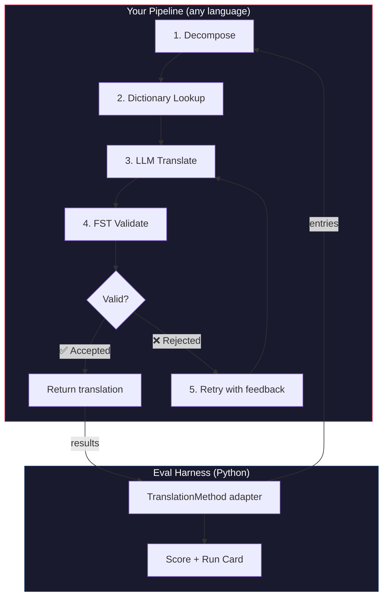
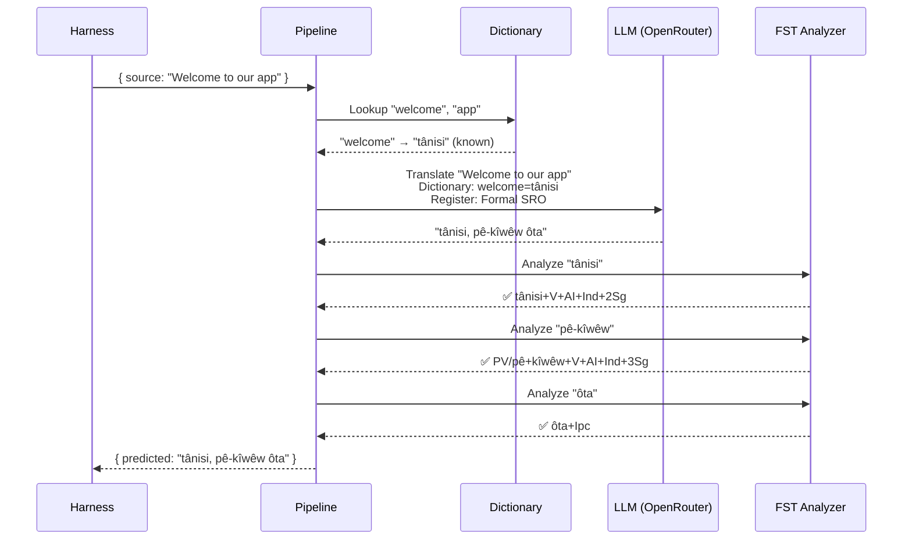
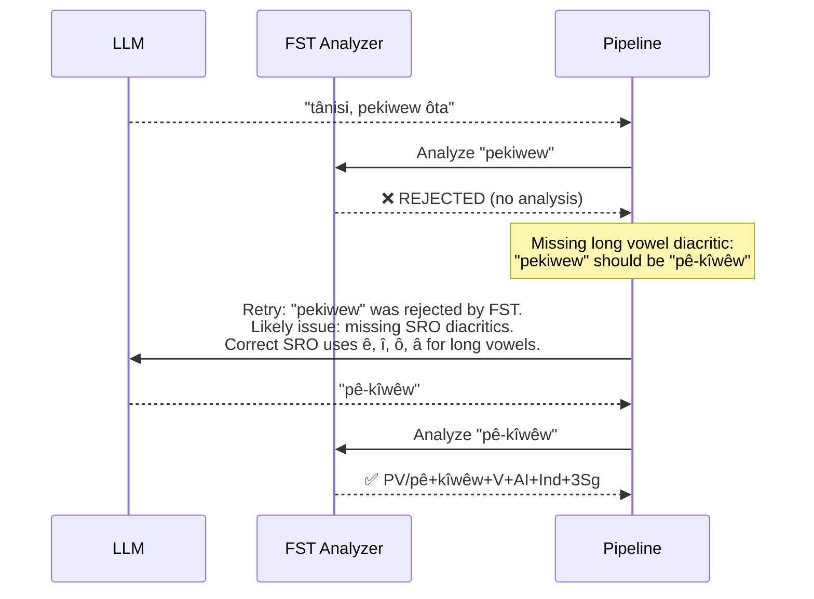

# دليل عملي: مسار الترجمة المحكوم بـ FST

قم ببناء مسار ترجمة متعدد المراحل يقوم بتفكيك النص المصدر، وترجمته عبر نموذج لغوي كبير (LLM)، والتحقق من صحة المخرجات باستخدام محول الحالات المنتهية (FST)، وإعادة المحاولة عندما يرفض FST أشكال الكلمات غير الصالحة. ثم قم بتوصيله ببيئة التقييم (eval harness) لمعرفة النتيجة التي سيحققها.

**ما ستقوم ببنائه:** مسار ترجمة للغة Plains Cree يكتشف الترجمات غير الصالحة صرفياً *قبل* أن تؤثر سلباً على نتيجتك.

:::info[المتطلبات الأساسية]
- ملف تنفيذي (binary) لـ FST قيد التشغيل (مثل [محلل GiellaLT/ALTLab للغة Plains Cree](https://github.com/giellalt/lang-crk) — والذي يتم توزيعه عبر قناة GiellaLT الليلية، وليس عبر إصدارات GitHub)
- Node.js 20+ (لمسار الترجمة) و Python 3.10+ (لبيئة التقييم)
- مفتاح واجهة برمجة التطبيقات (API key) من OpenRouter لخطوة LLM
:::

---

## البنية

مسار الترجمة عبارة عن سلسلة من المراحل. لكل مرحلة وظيفة محددة. يمكنك بناء ذلك بأي لغة — يستخدم هذا المثال JavaScript، لكن بيئة التقييم (harness) لا تهتم بما يوجد بالداخل. فهي لا ترى سوى محول Python البسيط عند الحدود.



### لماذا هذه المراحل

| المرحلة (Stage) | ماذا تفعل | لماذا هي مهمة |
|-------|-------------|---------------|
| **التفكيك (Decompose)** | تقسيم السلاسل النصية المركبة لواجهة المستخدم إلى أجزاء قابلة للترجمة | اللغات متعددة التركيب (Polysynthetic) تدمج جملاً كاملة في كلمات مفردة — ويحتاج LLM إلى وحدات أصغر |
| **البحث في القاموس (Dictionary Lookup)** | التحقق من قاموس ثنائي اللغة بحثاً عن ترجمات معروفة | يفرض استخدام المصطلحات الصحيحة للكلمات المعروفة بدلاً من الاعتماد على تخمينات LLM |
| **ترجمة LLM (LLM Translate)** | إرسال الجزء إلى LLM مع سياق الأسلوب والقواعد النحوية | يعالج العبارات الجديدة ويولد مخرجات سلسة |
| **التحقق بواسطة FST (FST Validate)** | تمرير المخرجات عبر محلل صرفي | يكتشف أشكال الكلمات غير الصالحة — إذا رفض FST كلمة ما، فهي ليست شكلاً صالحاً للكلمة في تلك اللغة |
| **إعادة المحاولة (Retry)** | إعادة إرسال الكلمات المرفوضة مع ملاحظات الخطأ من FST | يمنح LLM معلومات محددة حول *سبب* خطأ الكلمة |

---

## تدفق البيانات

إليك ما يحدث لمدخل واحد أثناء تدفقه عبر مسار الترجمة:



### عندما يرفض FST



---

## التنفيذ

قم ببناء ما تريد. يستخدم هذا المثال JavaScript، ولكن يمكنك استخدام Python أو Rust أو أي لغة أخرى. لا تهتم بيئة التقييم بذلك — فهي تتواصل فقط مع محول Python البسيط (الموضح في القسم التالي).

### مسار الترجمة

كل مرحلة عبارة عن دالة (function). ويقوم مسار الترجمة بربطها معاً.

```javascript title="pipeline.js"
import { lookupDictionary } from './dictionary.js';
import { callLLM } from './llm.js';
import { analyzeWithFST } from './fst.js';

const MAX_RETRIES = 3;

/**
 * Translate a batch of keys through the full pipeline.
 *
 * @param {object} keys - Map of key → source string
 * @param {object} options - { sourceLang, targetLang }
 * @returns {{ translations: object, stats: object }}
 */
export async function translateBatch(keys, options) {
  const translations = {};
  const stats = { total: 0, fstAccepted: 0, retries: 0, dictionaryHits: 0 };

  for (const [key, sourceText] of Object.entries(keys)) {
    stats.total++;
    translations[key] = await translateSingle(sourceText, options, stats);
  }

  return { translations, stats };
}

/**
 * Translate a single string through all pipeline stages.
 */
async function translateSingle(sourceText, options, stats) {

  // ── Stage 1: Decompose ──────────────────────────────────
  // Split compound strings into segments the LLM can handle.
  // For UI strings this is often a no-op, but for longer content
  // it prevents the LLM from losing context in long prompts.
  const segments = decompose(sourceText);

  // ── Stage 2: Dictionary Lookup ──────────────────────────
  // Check each segment against the bilingual dictionary.
  // Known terms are forced — the LLM won't override them.
  const knownTerms = {};
  for (const segment of segments) {
    const entry = lookupDictionary(segment.toLowerCase());
    if (entry) {
      knownTerms[segment] = entry;
      stats.dictionaryHits++;
    }
  }

  // ── Stage 3: LLM Translate ──────────────────────────────
  let translation = await callLLM(sourceText, {
    ...options,
    knownTerms,
    register: 'nêhiyawêwin (Plains Cree). Use SRO orthography. '
            + 'Professional register for educational contexts.',
  });

  // ── Stage 4: FST Validate ──────────────────────────────
  // Split the translation into words and check each one.
  let { accepted, rejected } = await validateWords(translation);

  // ── Stage 5: Retry Loop ─────────────────────────────────
  // If any words were rejected, retry with FST feedback.
  let attempt = 0;
  while (rejected.length > 0 && attempt < MAX_RETRIES) {
    attempt++;
    stats.retries++;

    const feedback = rejected
      .map(w => `"${w}" was rejected by the morphological analyzer`)
      .join('; ');

    translation = await callLLM(sourceText, {
      ...options,
      knownTerms,
      register: 'nêhiyawêwin (Plains Cree). Use SRO orthography.',
      feedback: `Previous attempt had invalid words. ${feedback}. `
              + 'Use correct SRO diacritics (ê, î, ô, â for long vowels). '
              + 'Ensure verb forms match expected conjugation patterns.',
    });

    ({ accepted, rejected } = await validateWords(translation));
  }

  if (rejected.length === 0) stats.fstAccepted++;

  return translation;
}

/**
 * Decompose source text into translatable segments.
 *
 * For simple key-value UI strings, this usually returns the
 * original string as a single segment. For longer content,
 * it splits on sentence boundaries.
 */
function decompose(text) {
  // Simple sentence-boundary split. Replace with your own
  // morphological decomposition for more complex needs.
  return text
    .split(/(?<=[.!?])\s+/)
    .filter(s => s.trim().length > 0);
}

/**
 * Validate each word in a translation against the FST.
 *
 * @returns {{ accepted: string[], rejected: string[] }}
 */
async function validateWords(translation) {
  // Split on whitespace and punctuation, keeping only words
  const words = translation
    .split(/[\s,;:.!?'"()\[\]{}]+/)
    .filter(w => w.length > 0);

  const accepted = [];
  const rejected = [];

  for (const word of words) {
    const analyses = await analyzeWithFST(word);
    if (analyses.length > 0) {
      accepted.push(word);
    } else {
      rejected.push(word);
    }
  }

  return { accepted, rejected };
}
```

### غلاف FST (FST Wrapper)

قم بتغليف الملف التنفيذي لـ FST كدالة غير متزامنة (async function). يستخدم هذا المثال محلل Plains Cree المعتمد على HFST من ALTLab.

```javascript title="fst.js"
import { execFile } from 'node:child_process';
import { promisify } from 'node:util';

const execFileAsync = promisify(execFile);

// Path to your FST analyzer binary
const FST_PATH = process.env.FST_ANALYZER_PATH || './bin/crk-analyzer';

/**
 * Run a word through the FST morphological analyzer.
 *
 * Returns an array of analyses. Empty array = rejected.
 *
 * Example:
 *   analyzeWithFST("tânisi")
 *   → ["tânisi+V+AI+Ind+2Sg", "tânisi+V+AI+Cnj+2Sg"]
 *
 *   analyzeWithFST("pekiwew")
 *   → []  // rejected — missing diacritics
 *
 * @param {string} word - A single word in SRO orthography
 * @returns {string[]} Array of FST analyses (empty = rejected)
 */
export async function analyzeWithFST(word) {
  try {
    // HFST lookup: pipe the word to stdin, read analyses from stdout
    const { stdout } = await execFileAsync(
      FST_PATH,
      ['--quiet'],
      { input: word + '\n', timeout: 5000 }
    );

    // Parse HFST output: each line is "input\tanalysis\tweight"
    // Lines with "+?" indicate unrecognized forms
    return stdout
      .split('\n')
      .filter(line => line.includes('\t') && !line.includes('+?'))
      .map(line => line.split('\t')[1]);

  } catch (err) {
    // If the FST binary isn't available, log and reject
    console.error(`[WARN] FST analysis failed for "${word}": ${err.message}`);
    return [];
  }
}
```

### وحدات القاموس و LLM

```javascript title="dictionary.js"
/**
 * Simple bilingual dictionary backed by a JSON file.
 *
 * In production, you'd load from the coaching data directory
 * or query itwêwina (https://itwewina.altlab.app/) via API.
 */
const DICTIONARY = {
  'hello': 'tânisi',
  'welcome': 'tânisi',
  'thank you': 'kinanâskomitin',
  'home': 'kīwēwin',
  'search': 'nānātawāpahtam',
  'settings': 'isi-nākatohkēwin',
  'help': 'nīsōhkamākēwin',
  'back': 'kīwē',
};

/**
 * @param {string} term - Lowercase English term
 * @returns {string|null} Cree translation or null
 */
export function lookupDictionary(term) {
  return DICTIONARY[term] || null;
}
```

```javascript title="llm.js"
/**
 * Call an LLM via OpenRouter for translation.
 */
const OPENROUTER_API = 'https://openrouter.ai/api/v1/chat/completions';

export async function callLLM(sourceText, options) {
  const { knownTerms = {}, register, feedback } = options;

  // Build the system prompt with register and known terms
  let systemPrompt = `You are translating English to Plains Cree.\n\n`;
  systemPrompt += `Register: ${register}\n\n`;

  if (Object.keys(knownTerms).length > 0) {
    systemPrompt += `Required terminology (use these exact translations):\n`;
    for (const [en, crk] of Object.entries(knownTerms)) {
      systemPrompt += `  "${en}" → "${crk}"\n`;
    }
    systemPrompt += '\n';
  }

  if (feedback) {
    systemPrompt += `IMPORTANT correction from previous attempt:\n${feedback}\n\n`;
  }

  systemPrompt += `Rules:\n`;
  systemPrompt += `- Use Standard Roman Orthography (SRO)\n`;
  systemPrompt += `- Use macron/circumflex for long vowels: ê, î, ô, â\n`;
  systemPrompt += `- Return ONLY the Cree translation, nothing else\n`;

  const response = await fetch(OPENROUTER_API, {
    method: 'POST',
    headers: {
      'Authorization': `Bearer ${process.env.OPENROUTER_API_KEY}`,
      'Content-Type': 'application/json',
    },
    body: JSON.stringify({
      model: 'google/gemini-2.5-pro',
      messages: [
        { role: 'system', content: systemPrompt },
        { role: 'user', content: sourceText },
      ],
      temperature: 0.2,
    }),
  });

  const json = await response.json();
  return json.choices[0].message.content.trim();
}
```

---

## التوصيل ببيئة التقييم (Harness)

لقد تم بناء مسار الترجمة الخاص بك. تحتاج الآن إلى توصيله ببيئة التقييم (eval harness) حتى تتمكن من قياس أدائه على لوحة الصدارة (leaderboard).

تتعامل بيئة التقييم مع واجهة واحدة: `TranslationMethod`. وهو بروتوكول Python يحتوي على طريقة (method) واحدة. قم ببناء ما تريد بأي لغة — ثم زوده بهذا الغلاف البسيط ليتم توصيله.

```python title="fst_gated_process.py"
"""
TranslationMethod adapter for the FST-gated pipeline.

This thin wrapper connects your pipeline (running as a local
subprocess or HTTP server) to the eval harness. The harness
calls translate() with corpus entries. You call your pipeline.
You return results. That's it.
"""

import time
import subprocess
import json
from mt_eval_harness.config import RunConfig


class FSTGatedProcess:
    """Adapter between the eval harness and your FST-gated pipeline.

    The pipeline runs as a Node.js subprocess. This wrapper:
    1. Receives entries from the harness
    2. Sends them to the pipeline
    3. Returns structured results the harness can score
    """

    def __init__(self, pipeline_url: str = "http://localhost:3001"):
        self.pipeline_url = pipeline_url

    async def translate(
        self,
        entries: list[dict],
        config: RunConfig,
    ) -> list[dict]:
        """Translate a batch of entries through the FST-gated pipeline.

        Args:
            entries: List of corpus entries with 'id' and source text.
            config: Harness run configuration (for context).

        Returns:
            List of result dicts, one per entry.
        """
        import httpx

        results = []

        for entry in entries:
            source_text = entry.get(config.source_field, entry.get("source", ""))
            start = time.monotonic()

            try:
                # Call your pipeline — however it's running
                async with httpx.AsyncClient() as client:
                    response = await client.post(
                        f"{self.pipeline_url}/translate",
                        json={"keys": {str(entry["id"]): source_text}},
                        timeout=30.0,
                    )
                    data = response.json()
                    predicted = data["translations"][str(entry["id"])]

                elapsed = time.monotonic() - start

                results.append({
                    "id": entry["id"],
                    "predicted": predicted,
                    "latency_s": elapsed,
                    "usage": {},  # pipeline doesn't expose token counts
                    "error": None,
                    "tool_calls": [],
                    "tool_call_count": 0,
                    "metadata": data.get("meta", {}),
                })

            except Exception as err:
                results.append({
                    "id": entry["id"],
                    "predicted": "",
                    "latency_s": time.monotonic() - start,
                    "usage": {},
                    "error": str(err),
                    "tool_calls": [],
                    "tool_call_count": 0,
                    "metadata": {},
                })

        return results
```

:::tip[لست بحاجة إلى HTTP]
يستدعي المثال أعلاه مسار الترجمة عبر HTTP لأن المسار مكتوب بلغة JavaScript. إذا كان مسار الترجمة الخاص بك مكتوباً بلغة Python، فيمكنك استدعاؤه مباشرة — دون الحاجة إلى خادم. الغلاف `TranslationMethod` هو مجرد حدود دالة (function boundary). وما يحدث بداخله يعود إليك.
:::

### تشغيل اختبار الأداء (Benchmark)

ابدأ مسار الترجمة الخاص بك، ثم قم بتشغيل بيئة التقييم:

```bash
# Terminal 1: Start the pipeline
node server.js

# Terminal 2: Run the harness with your process
export OPENROUTER_API_KEY="sk-or-v1-..."

python -c "
import asyncio
from mt_eval_harness.config import RunConfig
from mt_eval_harness.runner import execute_run
from fst_gated_process import FSTGatedProcess

async def main():
    config = RunConfig(
        corpus_path='data/your-crk-dev-v1.json',
        source_lang='English',
        target_lang='Plains Cree (nêhiyawêwin, SRO)',
        process_name='fst-gated-v1',
    )
    process = FSTGatedProcess('http://localhost:3001')
    run_log = await execute_run(config, process=process)
    print(f'Results: {run_log.output_path}')

asyncio.run(main())
"
```

أو استخدم واجهة سطر الأوامر (CLI) للمقارنة مع خط الأساس (baseline) المدمج:

```bash
mt-eval run \
  --corpus eval-amh-fra-globalvoices-test-v1 \
  --model google/gemini-2.5-pro \
  --fst-retries 3 \
  --name fst-gated-v1 \
  --publish
```

---

## فهم نتائجك

تُنتج بيئة التقييم **بطاقة تشغيل (run card)** — وهو ملف JSON يحتوي على درجاتك. إليك ما ستراه:

```
═══════════════════════════════════════════════════
  FST-Gated Pipeline v1 — EDTeKLA Dev v1
═══════════════════════════════════════════════════

  chrF++              48.7 / 100
  Exact match         12.1%
  FST acceptance      94.4%
  Composite score     0.52  →  Functional ✓

  436 entries (textbook_dev.json) · 47 retries · $0.18 total cost
═══════════════════════════════════════════════════
```

**ما يخبرك به هذا بلمحة سريعة:**
- طريقتك تقع في المستوى **الوظيفي (Functional)** (0.50–0.70) — المخرجات مفهومة للمتحدث باللغة، والقواعد الأساسية صحيحة في الغالب، مع بقاء أخطاء صرفية متكررة.
- يكتشف FST أن 94% من الكلمات صالحة — حلقة إعادة المحاولة (retry loop) الخاصة بك تعمل بنجاح.
- 12% من الترجمات صحيحة تماماً — هناك مجال كبير للتحسين.

:::info[مستويات الجودة]
| المستوى (Tier) | الدرجة المركبة (Composite) | ماذا يعني |
|------|-----------|---------------|
| خط الأساس (Baseline) | 0.00–0.30 | مخرجات LLM خام، يغلب عليها الهلوسة الصرفية |
| ناشئ (Emerging) | 0.30–0.50 | بعض الأنماط الصحيحة، لكنه غير موثوق |
| **وظيفي (Functional)** | **0.50–0.70** | **مفهوم للمتحدث باللغة. الفئات الرئيسية صحيحة في الغالب.** |
| قابل للنشر (Deployable) | 0.70–0.85 | مناسب كمسودة ترجمة مع مراجعة بشرية |
| طليق (Fluent) | 0.85–1.00 | يقترب من مستوى الترجمة البشرية المتقنة |

راجع [SCORING_SPEC §5](/docs/network/specifications/scoring#5-quality-tiers) للحصول على التعريفات الكاملة للمستويات.
:::

<details>
<summary><strong>نظرة أعمق: ماذا يوجد في بطاقة التشغيل؟</strong></summary>

يسجل ملف JSON الخاص ببطاقة التشغيل كل شيء حول عملية التقييم هذه. الأقسام الرئيسية هي:

**الدرجات (Scores)** — كل مقياس تم حسابه بواسطة بيئة التقييم:
```json
{
  "scores": {
    "exact_match_rate": 0.121,
    "chrf_plus_plus": 48.7,
    "fst_acceptance_rate": 0.944,
    "composite_score": 0.52,
    "quality_tier": "functional"
  }
}
```

**المصدر (Provenance)** — ما الذي أنتج هذه النتائج:
```json
{
  "method": {
    "process_name": "fst-gated-v1",
    "model": "google/gemini-2.5-pro",
    "temperature": 0.0
  },
  "corpus": {
    "id": "edtekla-dev-v1",
    "sha256": "a1b2c3..."
  }
}
```

**النتائج لكل مدخل (Per-entry results)** — كل ترجمة مع درجاتها الفردية، حتى تتمكن من معرفة أين تواجه طريقتك صعوبات:
```json
{
  "id": 42,
  "source": "The student completed the assignment",
  "reference": "ôskiniw kî-kîsîhtâw ôhi atoskêwina",
  "predicted": "ôskiniw kî-kîsîhtâw ôhi atoskêwin",
  "chrf": 89.2,
  "exact_match": false,
  "fst_accepted": true
}
```

الدرجة المركبة (composite score) هي متوسط مرجح للمقاييس المتاحة، مع أوزان محددة في [SCORING_SPEC §4](/docs/network/specifications/scoring#4-composite-score). عندما لا يكون المقياس متاحاً، يتم إعادة توزيع وزنه بشكل نسبي على بقية المقاييس.

</details>

---

## النشر في بيئة الإنتاج (Production)

لقد حصلت طريقتك على درجات في لوحة الصدارة. الآن تريد استخدامها فعلياً. يتناول هذا القسم كيفية تقديم مسار الترجمة الخاص بك كنقطة نهاية (endpoint) في بيئة الإنتاج يمكن لـ [champollion](https://champollion.dev) استدعاؤها.

:::note[هذا القسم اختياري]
كل ما سبق يتعلق ببناء طريقتك وقياس أدائها. أما هذا القسم فيتعلق بالنشر (deployment) — وهو موضوع منفصل. يمكنك إرسال نتائجك إلى لوحة الصدارة دون نشر أي شيء.
:::

### خادم HTTP

قم بتغليف مسار الترجمة الخاص بك كخادم Express ينفذ [عقد طريقة API](https://champollion.dev/docs/guides/serving-a-method):

```javascript title="server.js"
import express from 'express';
import { translateBatch } from './pipeline.js';

const app = express();
app.use(express.json());

/**
 * API method contract:
 *
 * Request:  { source_locale, target_locale, method, keys: { "key": "source" } }
 * Response: { translations: { "key": "translated" }, meta: { ... } }
 */
app.post('/translate', async (req, res) => {
  const { source_locale, target_locale, method, keys } = req.body;

  // Validate request
  if (!keys || typeof keys !== 'object') {
    return res.status(400).json({ error: { message: 'Missing keys object' } });
  }

  try {
    const startTime = Date.now();
    const { translations, stats } = await translateBatch(keys, {
      sourceLang: source_locale,
      targetLang: target_locale,
    });

    res.json({
      translations,
      meta: {
        model: 'custom-pipeline/fst-gated-v1',
        method: 'decompose-lookup-translate-validate',
        elapsed_ms: Date.now() - startTime,
        fst_acceptance_rate: stats.fstAccepted / stats.total,
        retries: stats.retries,
      },
    });
  } catch (err) {
    console.error('[ERR] Pipeline failed:', err.message);
    res.status(500).json({ error: { message: err.message } });
  }
});

// Health check for connectivity verification
app.get('/health', (req, res) => res.json({ status: 'ok' }));

app.listen(3001, () => {
  console.log('FST-gated pipeline running on http://localhost:3001');
});
```

### تكوين champollion

قم بتوجيه زوج اللغات الخاص بك إلى الخدمة قيد التشغيل:

```json title="champollion.config.json"
{
  "version": 3,
  "inputLocale": "en",
  "pairs": {
    "en:crk": {
      "method": "api",
      "endpoint": "http://localhost:3001/translate"
    }
  },
  "languages": {
    "crk": {
      "name": "Plains Cree",
      "register": "SRO syllabics with grammatical precision."
    }
  }
}
```

```bash
# Run it
export OPENROUTER_API_KEY="sk-or-v1-..."
node server.js &
npx champollion sync
```

### التحزيم كمكون إضافي (Plugin)

بمجرد حصول طريقتك على درجات، قم بتحزيمها حتى يتمكن الآخرون من استخدامها:

```json title="crk-fst-gated-v1/method.json"
{
  "name": "crk-fst-gated-v1",
  "type": "api",
  "version": "1.0.0",
  "description": "FST-gated Plains Cree translation with morphological validation",
  "author": "Your Name",

  "config": {
    "endpoint": "https://your-server.example.com/translate"
  },

  "locales": ["crk"],

  "benchmarks": {
    "crk": {
      "date": "2026-06-01T00:00:00Z",
      "corpus_size": 436,
      "exact_match_rate": 0.12,
      "corpus_chrf": 48.7,
      "model": "google/gemini-2.5-pro",
      "harness_version": "2.0"
    }
  },

  "provenance": {
    "resources": [
      { "name": "GiellaLT/ALTLab CRK Analyzer", "license": "AGPL-3.0-or-later", "type": "fst" },
      { "name": "Wolvengrey Dictionary", "license": "none", "type": "dictionary" }
    ],
    "commercialReady": false,
    "flags": ["nc-resource"]
  }
}
```

---

## توسيع هذا النمط

يوضح هذا الدليل العملي بنية واحدة لمسار الترجمة. يمكنك تكييفها لأي لغة أو طريقة:

| التغيير (Variation) | ما الذي يتغير |
|-----------|-------------|
| **FST مختلف** | قم بتبديل مسار الملف التنفيذي. يمكنك تنزيل ملفات FST مجمعة مسبقاً (مثل الملفات التنفيذية `.hfstol` أو `lttoolbox`) لأكثر من 100 لغة من [GiellaLT GitHub](https://github.com/giellalt) أو [Apertium GitHub](https://github.com/apertium). |
| **لا يتوفر FST** | قم بإزالة مرحلة تنفيذ FST واستخدم [ملفات النماذج المسطحة من UniMorph](https://huggingface.co/datasets/unimorph/universal_morphologies) من Hugging Face لإجراء تحقق ثابت عبر البحث في قاعدة البيانات للأشكال المُصرفة. |
| **نماذج LLM متعددة** | ربط النماذج: نموذج سريع للمسودة الأولية، ونموذج استنتاجي (reasoning model) للتصحيحات. |
| **تدخل بشري (Human-in-the-loop)** | أضف مرحلة طابور (queue) تحتفظ بالترجمات غير المؤكدة لمراجعتها من قبل خبير قبل إرجاعها. |
| **نموذج مضبوط بدقة (Fine-tuned model)** | استبدل استدعاء OpenRouter بنموذج محلي (Ollama، vLLM، إلخ). |
| **لغة مختلفة** | قم بتغيير القاموس، و FST، والأسلوب (register). وتبقى البنية متطابقة. |

مسار الترجمة هو مجرد نمط. والمراحل قابلة للتبديل. قم ببناء ما يناسب لغتك، وأثبت كفاءته على [لوحة الصدارة](https://champollion.dev/leaderboard)، ثم قم بنشره.

---

## انظر أيضًا

- **[بيئة التقييم (Eval Harness)](/docs/network/specifications/harness)** — كيفية تشغيل بيئة التقييم وتفسير المخرجات
- **[واجهة الطريقة (Method Interface)](/docs/network/specifications/methods)** — مواصفات بروتوكول `TranslationMethod`
- **[قواعد لوحة الصدارة (Leaderboard Rules)](/docs/network/leaderboard/rules)** — معايير التقديم وسياسات مكافحة التلاعب
- **[دعم لغة قليلة الموارد (Support a Low-Resource Language)](/docs/network/community/low-resource-languages)** — السياق الأوسع ومبادئ سيادة البيانات المجتمعية
- **[ALTLab](https://altlab.ualberta.ca/)** — مختبر تكنولوجيا اللغات في ألبرتا (Plains Cree FST)
- **[لوحة صدارة الطرق (Method Leaderboard)](https://champollion.dev/leaderboard)** — أرسل درجاتك
