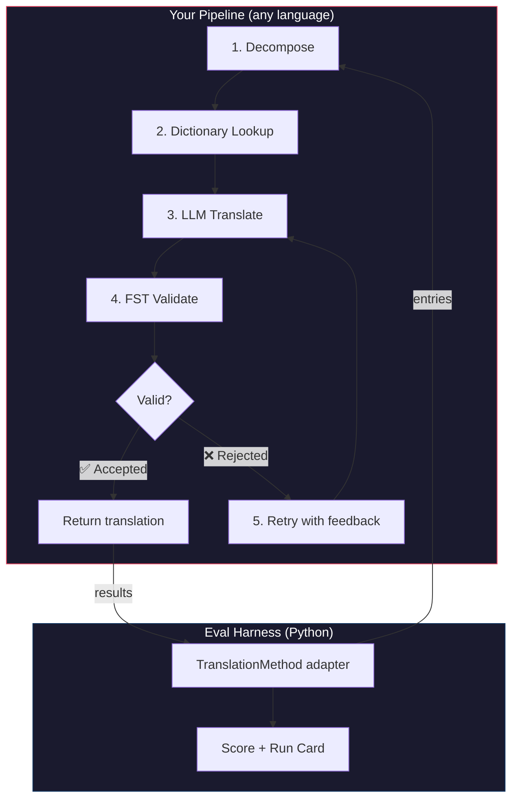
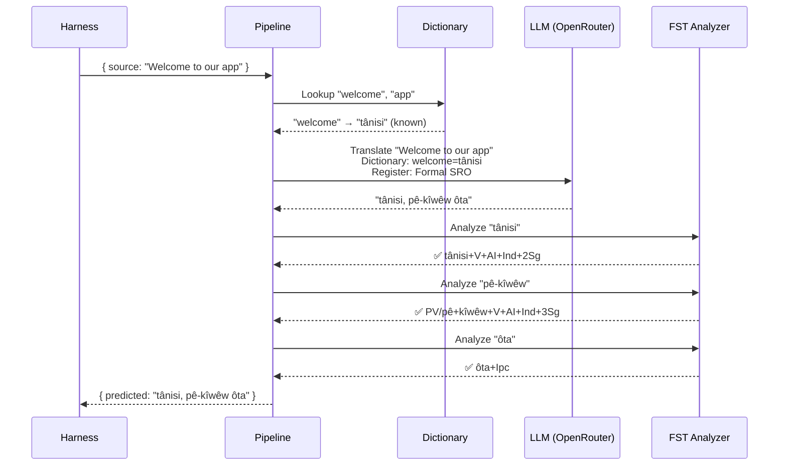
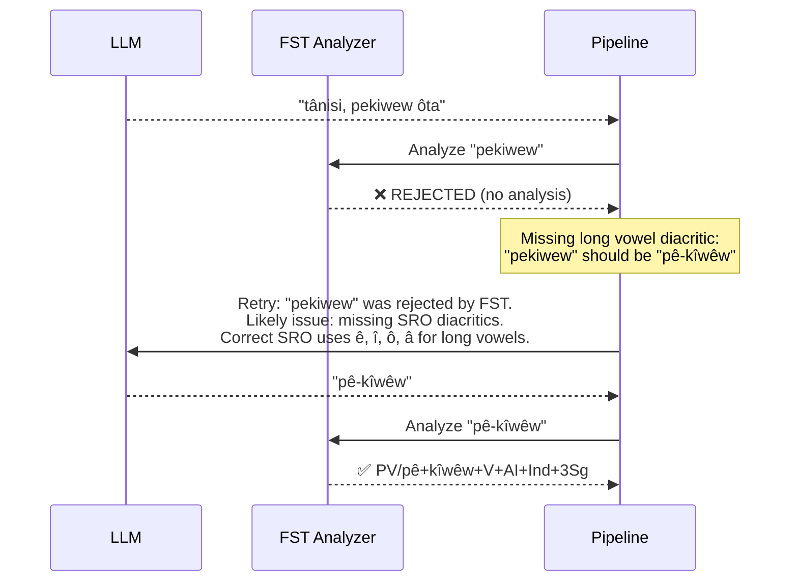

# دليل عملي: خط أنابيب ترجمة موجّه بمحوّل الحالة المحدودة (FST)

ابنِ خط أنابيب ترجمة متعدد المراحل يعمل على تفكيك النص المصدر، وترجمته عبر نموذج لغوي كبير (LLM)، والتحقق من صحة المخرجات باستخدام محوّل الحالة المحدودة (FST)، وإعادة المحاولة عندما يرفض FST صيغ الكلمات غير الصالحة. ثم قم بربطه بنظام التقييم (eval harness) لتطّلع على درجاته.

**ما ستبنيه:** خط أنابيب ترجمة للغة كري السهول (Plains Cree) يكتشف الترجمات غير الصالحة صرفيًا *قبل* أن تُحسب ضد درجاتك.

:::info[المتطلبات الأساسية]
- ملف تنفيذي لـ FST قيد التشغيل (مثل [محلل GiellaLT/ALTLab للغة كري السهول](https://github.com/giellalt/lang-crk) — والموزّع عبر قناة GiellaLT الليلية، وليس عبر إصدارات GitHub)
- Node.js 20+ (لخط الأنابيب) و Python 3.10+ (لنظام التقييم)
- مفتاح API لـ OpenRouter لخطوة LLM
:::

---

## البنية المعمارية

يتكون خط الأنابيب من سلسلة من المراحل، ولكل مرحلة مهمة محددة. يمكنك بناء هذا بأي لغة برمجة — يستخدم هذا المثال JavaScript، ولكن نظام التقييم لا يهتم بما هو موجود في الداخل، إذ لا يرى سوى محوّل Python البسيط عند الحدود الفاصلة.


```mermaid
graph TD
    subgraph pipeline ["Your Pipeline (any language)"]
        A["1. Decompose"]
        B["2. Dictionary Lookup"]
        C["3. LLM Translate"]
        D["4. FST Validate"]
        E{"Valid?"}
        F["5. Retry with feedback"]
        G["Return translation"]
    end

    subgraph harness ["Eval Harness (Python)"]
        H["TranslationMethod adapter"]
        I["Score + Run Card"]
    end

    H -->|"entries"| A
    A --> B
    B --> C
    C --> D
    D --> E
    E -->|"✅ Accepted"| G
    E -->|"❌ Rejected"| F
    F --> C
    G -->|"results"| H
    H --> I

    style pipeline fill:#1a1a2e,stroke:#e94560,color:#fff
    style harness fill:#1a1a2e,stroke:#0f3460,color:#fff
```

### سبب اختيار هذه المراحل

| المرحلة | ما تقوم به | سبب أهميتها |
|-------|-------------|---------------|
| **التفكيك (Decompose)** | تقسيم نصوص واجهة المستخدم المركبة إلى أجزاء قابلة للترجمة | تقوم اللغات متعددة التركيب (Polysynthetic) بترميز جُمَل كاملة في كلمات مفردة — ويحتاج LLM إلى وحدات أصغر |
| **البحث في القاموس (Dictionary Lookup)** | فحص قاموس ثنائي اللغة للبحث عن ترجمات معروفة | يفرض المصطلحات الصحيحة للمصطلحات المعروفة بدلاً من الاعتماد على تخمين LLM |
| **الترجمة عبر LLM (LLM Translate)** | إرسال الجزء إلى LLM مع سياق الأسلوب اللغوي والقواعد | يتعامل مع العبارات الجديدة ويولّد مخرجات سلسة |
| **التحقق عبر FST (FST Validate)** | تمرير المخرجات عبر محلل صرفي | يكتشف صيغ الكلمات غير الصالحة — إذا رفض FST كلمة ما، فهي ليست صيغة كلمة صالحة في اللغة |
| **إعادة المحاولة (Retry)** | إعادة إرسال الكلمات المرفوضة مع تفاصيل الأخطاء الواردة من FST | يزوّد LLM بمعلومات محددة حول *سبب* كون الكلمة غير صحيحة |

---

## مسار تدفق البيانات

إليك ما يحدث لإدخال واحد أثناء تدفقه عبر خط الأنابيب:


```mermaid
sequenceDiagram
    participant H as Harness
    participant P as Pipeline
    participant D as Dictionary
    participant L as LLM (OpenRouter)
    participant F as FST Analyzer

    H->>P: { source: "Welcome to our app" }
    P->>D: Lookup "welcome", "app"
    D-->>P: "welcome" → "tânisi" (known)
    P->>L: Translate "Welcome to our app"<br/>Dictionary: welcome=tânisi<br/>Register: Formal SRO
    L-->>P: "tânisi, pê-kîwêw ôta"
    P->>F: Analyze "tânisi"
    F-->>P: ✅ tânisi+V+AI+Ind+2Sg
    P->>F: Analyze "pê-kîwêw"
    F-->>P: ✅ PV/pê+kîwêw+V+AI+Ind+3Sg
    P->>F: Analyze "ôta"
    F-->>P: ✅ ôta+Ipc
    P-->>H: { predicted: "tânisi, pê-kîwêw ôta" }
```

### عندما يرفض FST


```mermaid
sequenceDiagram
    participant L as LLM
    participant F as FST Analyzer
    participant P as Pipeline

    L-->>P: "tânisi, pekiwew ôta"
    P->>F: Analyze "pekiwew"
    F-->>P: ❌ REJECTED (no analysis)
    Note over P: Missing long vowel diacritic:<br/>"pekiwew" should be "pê-kîwêw"
    P->>L: Retry: "pekiwew" was rejected by FST.<br/>Likely issue: missing SRO diacritics.<br/>Correct SRO uses ê, î, ô, â for long vowels.
    L-->>P: "pê-kîwêw"
    P->>F: Analyze "pê-kîwêw"
    F-->>P: ✅ PV/pê+kîwêw+V+AI+Ind+3Sg
```

---

## التنفيذ

ابنِ ما تريده؛ يستخدم هذا المثال JavaScript، ولكن يمكنك استخدام Python أو Rust أو أي لغة أخرى. فنظام التقييم لا يهتم بذلك — إذ يتواصل فقط مع محوّل Python البسيط (الموضّح في القسم التالي).

### خط الأنابيب

كل مرحلة عبارة عن دالة، ويقوم خط الأنابيب بربطها معًا في سلسلة.

```javascript title="pipeline.js"
import { lookupDictionary } from './dictionary.js';
import { callLLM } from './llm.js';
import { analyzeWithFST } from './fst.js';

const MAX_RETRIES = 3;

/**
 * Translate a batch of keys through the full pipeline.
 *
 * @param {object} keys - Map of key → source string
 * @param {object} options - { sourceLang, targetLang }
 * @returns {{ translations: object, stats: object }}
 */
export async function translateBatch(keys, options) {
  const translations = {};
  const stats = { total: 0, fstAccepted: 0, retries: 0, dictionaryHits: 0 };

  for (const [key, sourceText] of Object.entries(keys)) {
    stats.total++;
    translations[key] = await translateSingle(sourceText, options, stats);
  }

  return { translations, stats };
}

/**
 * Translate a single string through all pipeline stages.
 */
async function translateSingle(sourceText, options, stats) {

  // ── Stage 1: Decompose ──────────────────────────────────
  // Split compound strings into segments the LLM can handle.
  // For UI strings this is often a no-op, but for longer content
  // it prevents the LLM from losing context in long prompts.
  const segments = decompose(sourceText);

  // ── Stage 2: Dictionary Lookup ──────────────────────────
  // Check each segment against the bilingual dictionary.
  // Known terms are forced — the LLM won't override them.
  const knownTerms = {};
  for (const segment of segments) {
    const entry = lookupDictionary(segment.toLowerCase());
    if (entry) {
      knownTerms[segment] = entry;
      stats.dictionaryHits++;
    }
  }

  // ── Stage 3: LLM Translate ──────────────────────────────
  let translation = await callLLM(sourceText, {
    ...options,
    knownTerms,
    register: 'nêhiyawêwin (Plains Cree). Use SRO orthography. '
            + 'Professional register for educational contexts.',
  });

  // ── Stage 4: FST Validate ──────────────────────────────
  // Split the translation into words and check each one.
  let { accepted, rejected } = await validateWords(translation);

  // ── Stage 5: Retry Loop ─────────────────────────────────
  // If any words were rejected, retry with FST feedback.
  let attempt = 0;
  while (rejected.length > 0 && attempt < MAX_RETRIES) {
    attempt++;
    stats.retries++;

    const feedback = rejected
      .map(w => `"${w}" was rejected by the morphological analyzer`)
      .join('; ');

    translation = await callLLM(sourceText, {
      ...options,
      knownTerms,
      register: 'nêhiyawêwin (Plains Cree). Use SRO orthography.',
      feedback: `Previous attempt had invalid words. ${feedback}. `
              + 'Use correct SRO diacritics (ê, î, ô, â for long vowels). '
              + 'Ensure verb forms match expected conjugation patterns.',
    });

    ({ accepted, rejected } = await validateWords(translation));
  }

  if (rejected.length === 0) stats.fstAccepted++;

  return translation;
}

/**
 * Decompose source text into translatable segments.
 *
 * For simple key-value UI strings, this usually returns the
 * original string as a single segment. For longer content,
 * it splits on sentence boundaries.
 */
function decompose(text) {
  // Simple sentence-boundary split. Replace with your own
  // morphological decomposition for more complex needs.
  return text
    .split(/(?<=[.!?])\s+/)
    .filter(s => s.trim().length > 0);
}

/**
 * Validate each word in a translation against the FST.
 *
 * @returns {{ accepted: string[], rejected: string[] }}
 */
async function validateWords(translation) {
  // Split on whitespace and punctuation, keeping only words
  const words = translation
    .split(/[\s,;:.!?'"()\[\]{}]+/)
    .filter(w => w.length > 0);

  const accepted = [];
  const rejected = [];

  for (const word of words) {
    const analyses = await analyzeWithFST(word);
    if (analyses.length > 0) {
      accepted.push(word);
    } else {
      rejected.push(word);
    }
  }

  return { accepted, rejected };
}
```

### غلاف FST

قم بتغليف الملف التنفيذي لـ FST كدالة غير متزامنة (async function). يستخدم هذا المثال محلل لغة كري السهول القائم على HFST من ALTLab.

```javascript title="fst.js"
import { execFile } from 'node:child_process';
import { promisify } from 'node:util';

const execFileAsync = promisify(execFile);

// Path to your FST analyzer binary
const FST_PATH = process.env.FST_ANALYZER_PATH || './bin/crk-analyzer';

/**
 * Run a word through the FST morphological analyzer.
 *
 * Returns an array of analyses. Empty array = rejected.
 *
 * Example:
 *   analyzeWithFST("tânisi")
 *   → ["tânisi+V+AI+Ind+2Sg", "tânisi+V+AI+Cnj+2Sg"]
 *
 *   analyzeWithFST("pekiwew")
 *   → []  // rejected — missing diacritics
 *
 * @param {string} word - A single word in SRO orthography
 * @returns {string[]} Array of FST analyses (empty = rejected)
 */
export async function analyzeWithFST(word) {
  try {
    // HFST lookup: pipe the word to stdin, read analyses from stdout
    const { stdout } = await execFileAsync(
      FST_PATH,
      ['--quiet'],
      { input: word + '\n', timeout: 5000 }
    );

    // Parse HFST output: each line is "input\tanalysis\tweight"
    // Lines with "+?" indicate unrecognized forms
    return stdout
      .split('\n')
      .filter(line => line.includes('\t') && !line.includes('+?'))
      .map(line => line.split('\t')[1]);

  } catch (err) {
    // If the FST binary isn't available, log and reject
    console.error(`[WARN] FST analysis failed for "${word}": ${err.message}`);
    return [];
  }
}
```

### وحدات القاموس وLLM

```javascript title="dictionary.js"
/**
 * Simple bilingual dictionary backed by a JSON file.
 *
 * In production, you'd load from the coaching data directory
 * or query itwêwina (https://itwewina.altlab.app/) via API.
 */
const DICTIONARY = {
  'hello': 'tânisi',
  'welcome': 'tânisi',
  'thank you': 'kinanâskomitin',
  'home': 'kīwēwin',
  'search': 'nānātawāpahtam',
  'settings': 'isi-nākatohkēwin',
  'help': 'nīsōhkamākēwin',
  'back': 'kīwē',
};

/**
 * @param {string} term - Lowercase English term
 * @returns {string|null} Cree translation or null
 */
export function lookupDictionary(term) {
  return DICTIONARY[term] || null;
}
```

```javascript title="llm.js"
/**
 * Call an LLM via OpenRouter for translation.
 */
const OPENROUTER_API = 'https://openrouter.ai/api/v1/chat/completions';

export async function callLLM(sourceText, options) {
  const { knownTerms = {}, register, feedback } = options;

  // Build the system prompt with register and known terms
  let systemPrompt = `You are translating English to Plains Cree.\n\n`;
  systemPrompt += `Register: ${register}\n\n`;

  if (Object.keys(knownTerms).length > 0) {
    systemPrompt += `Required terminology (use these exact translations):\n`;
    for (const [en, crk] of Object.entries(knownTerms)) {
      systemPrompt += `  "${en}" → "${crk}"\n`;
    }
    systemPrompt += '\n';
  }

  if (feedback) {
    systemPrompt += `IMPORTANT correction from previous attempt:\n${feedback}\n\n`;
  }

  systemPrompt += `Rules:\n`;
  systemPrompt += `- Use Standard Roman Orthography (SRO)\n`;
  systemPrompt += `- Use macron/circumflex for long vowels: ê, î, ô, â\n`;
  systemPrompt += `- Return ONLY the Cree translation, nothing else\n`;

  const response = await fetch(OPENROUTER_API, {
    method: 'POST',
    headers: {
      'Authorization': `Bearer ${process.env.OPENROUTER_API_KEY}`,
      'Content-Type': 'application/json',
    },
    body: JSON.stringify({
      model: 'google/gemini-2.5-pro',
      messages: [
        { role: 'system', content: systemPrompt },
        { role: 'user', content: sourceText },
      ],
      temperature: 0.2,
    }),
  });

  const json = await response.json();
  return json.choices[0].message.content.trim();
}
```

---

## الربط مع نظام التقييم

لقد قمت ببناء خط الأنابيب. تحتاج الآن إلى ربطه بنظام التقييم (eval harness) لتتمكن من قياس أدائه ومقارنته على لوحة المتصدرين.

يتعامل نظام التقييم مع واجهة واحدة: `TranslationMethod`. إنه بروتوكول Python يتضمن دالة واحدة فقط. ابنِ ما تريده بأي لغة — ثم وفّر له هذا الغلاف البسيط وسيتم ربطه مباشرة.

```python title="fst_gated_process.py"
"""
TranslationMethod adapter for the FST-gated pipeline.

This thin wrapper connects your pipeline (running as a local
subprocess or HTTP server) to the eval harness. The harness
calls translate() with corpus entries. You call your pipeline.
You return results. That's it.
"""

import time
import subprocess
import json
from mt_eval_harness.config import RunConfig


class FSTGatedProcess:
    """Adapter between the eval harness and your FST-gated pipeline.

    The pipeline runs as a Node.js subprocess. This wrapper:
    1. Receives entries from the harness
    2. Sends them to the pipeline
    3. Returns structured results the harness can score
    """

    def __init__(self, pipeline_url: str = "http://localhost:3001"):
        self.pipeline_url = pipeline_url

    async def translate(
        self,
        entries: list[dict],
        config: RunConfig,
    ) -> list[dict]:
        """Translate a batch of entries through the FST-gated pipeline.

        Args:
            entries: List of corpus entries with 'id' and source text.
            config: Harness run configuration (for context).

        Returns:
            List of result dicts, one per entry.
        """
        import httpx

        results = []

        for entry in entries:
            source_text = entry.get(config.source_field, entry.get("source", ""))
            start = time.monotonic()

            try:
                # Call your pipeline — however it's running
                async with httpx.AsyncClient() as client:
                    response = await client.post(
                        f"{self.pipeline_url}/translate",
                        json={"keys": {str(entry["id"]): source_text}},
                        timeout=30.0,
                    )
                    data = response.json()
                    predicted = data["translations"][str(entry["id"])]

                elapsed = time.monotonic() - start

                results.append({
                    "id": entry["id"],
                    "predicted": predicted,
                    "latency_s": elapsed,
                    "usage": {},  # pipeline doesn't expose token counts
                    "error": None,
                    "tool_calls": [],
                    "tool_call_count": 0,
                    "metadata": data.get("meta", {}),
                })

            except Exception as err:
                results.append({
                    "id": entry["id"],
                    "predicted": "",
                    "latency_s": time.monotonic() - start,
                    "usage": {},
                    "error": str(err),
                    "tool_calls": [],
                    "tool_call_count": 0,
                    "metadata": {},
                })

        return results
```

:::tip[لست بحاجة إلى HTTP]
يستدعي المثال أعلاه خط الأنابيب عبر HTTP لأن خط الأنابيب مكتوب بـ JavaScript. أما إذا كان خط الأنابيب مكتوبًا بـ Python، فيمكنك استدعاؤه مباشرة — دون الحاجة إلى خادم. إن غلاف `TranslationMethod` مجرد حدود للدالة؛ وما يحدث في الداخل متروك لك تمامًا.
:::

### تشغيل الاختبار القياسي

ابدأ تشغيل خط الأنابيب الخاص بك، ثم شغّل نظام التقييم:

```bash
# Terminal 1: Start the pipeline
node server.js

# Terminal 2: Run the harness with your process
export OPENROUTER_API_KEY="sk-or-v1-..."

python -c "
import asyncio
from mt_eval_harness.config import RunConfig
from mt_eval_harness.runner import execute_run
from fst_gated_process import FSTGatedProcess

async def main():
    config = RunConfig(
        corpus_path='data/your-crk-dev-v1.json',
        source_lang='English',
        target_lang='Plains Cree (nêhiyawêwin, SRO)',
        process_name='fst-gated-v1',
    )
    process = FSTGatedProcess('http://localhost:3001')
    run_log = await execute_run(config, process=process)
    print(f'Results: {run_log.output_path}')

asyncio.run(main())
"
```

أو استخدم CLI للمقارنة مع خط الأساس المدمج:

```bash
mt-eval run \
  --corpus eval-amh-fra-globalvoices-test-v1 \
  --model google/gemini-2.5-pro \
  --fst-retries 3 \
  --name fst-gated-v1 \
  --publish
```

---

## فهم نتائجك

يُنتج نظام التقييم **بطاقة تشغيل (run card)** — وهي ملف JSON يحتوي على درجاتك. في ما يلي ملخص توضيحي (أرقام توضيحية وليست سجلاً فعليًا):

```
  Headline     chrF++ 48.7 [47.1, 50.3]   (95% bootstrap CI, sacreBLEU signature recorded)
  Diagnostics  exact match 12.1% · FST acceptance 94.4%
  Cost         436 entries · 47 retries · $0.18 total
```

**ما يوضحه لك هذا بنظرة سريعة:**
- **chrF++ 48.7** هو المؤشر الرئيسي: التداخل على مستوى حروف n-gram للنص بأكمله مع الترجمات المرجعية، على مقياس من 0 إلى 100. يمثل الرقم بين القوسين فترة الثقة بنسبة 95%؛ وإذا كانت فترة الثقة لإعادة التشغيل أو لطريقة منافسة تتداخل مع فترتك، فقد لا يكون الفارق حقيقيًا من الناحية الإحصائية. للتحقق من ذلك، قارن بين التشغيلين باستخدام `mt-eval compare --significance`، الذي يجري اختبار دلالة إحصائية مقترنًا على chrF++.
- **نسبة قبول FST البالغة 94.4%** هي مقياس تشخيصي: يقبل FST ما نسبته 94% من كلمات المخرجات كصيغ صالحة، مما يعني أن حلقة إعادة المحاولة تعمل بنجاح. لكن هذا لا يعبر عما إذا كانت الكلمات تترجم النص المصدر بدقة، ولهذا السبب لا يدخل أبدًا في المؤشر الرئيسي.
- **التطابق التام (Exact match) بنسبة 12.1%** هو مقياس تشخيصي أيضًا: لا يزال هناك مجال واسع للتحسين.

:::info[لا توجد تسميات للجودة على الدرجات التلقائية]
لا يصنف نظام التقييم الدرجة على أنها "صالحة للاستخدام" أو "قابلة للنشر" أو غير ذلك. لقد تم إيقاف العمل بتلك المستويات القائمة على الدرجات المركبة: فالرقم نفسه يحمل معاني مختلفة باختلاف اللغات ومجموعات التقييم، ولا يعتمد الجودة سوى المراجعة من قِبل متحدثي اللغة الأصليين. راجع [كيفية احتساب درجات التشغيل](/docs/network/specifications/scoring#how-runs-are-scored) و[سبب إيقاف المقياس المركب](/docs/network/specifications/scoring#why-the-composite-was-retired).
:::

<details>
<summary><strong>تفاصيل إضافية: ما محتويات بطاقة التشغيل؟</strong></summary>

يسجل ملف JSON الخاص ببطاقة التشغيل كل شيء حول تشغيلة التقييم هذه. الأقسام الرئيسية:

**الدرجات (Scores)** — كل مقياس قام نظام التقييم بحسابه:
```json
{
  "scores": {
    "scoring_standard": "standard/1",
    "primary_metric": "chrf_plus_plus",
    "chrf_plus_plus": 48.7,
    "confidence_intervals": {
      "corpus_chrf": { "ci_lower": 47.1, "ci_upper": 50.3 }
    },
    "sacrebleu_signatures": {
      "chrf": "nrefs:1|case:mixed|eff:yes|nc:6|nw:2|space:no|version:2.4.3"
    },
    "exact_match_rate": 0.121,
    "fst_acceptance_rate": 0.944,
    "composite": null,
    "quality_tier": null
  }
}
```

**المصدر وسجل التتبع (Provenance)** — ما الذي أنتج هذه النتائج:
```json
{
  "method": {
    "process_name": "fst-gated-v1",
    "model": "google/gemini-2.5-pro",
    "temperature": 0.0
  },
  "corpus": {
    "id": "edtekla-dev-v1",
    "sha256": "a1b2c3..."
  }
}
```

**النتائج لكل إدخال (Per-entry results)** — كل ترجمة مع درجاتها الفردية، حتى تتمكن من معرفة مواضع الصعوبة في طريقتك:
```json
{
  "id": 42,
  "source": "The student completed the assignment",
  "reference": "ôskiniw kî-kîsîhtâw ôhi atoskêwina",
  "predicted": "ôskiniw kî-kîsîhtâw ôhi atoskêwin",
  "chrf": 89.2,
  "exact_match": false,
  "fst_accepted": true
}
```

تتضمن البطاقة أيضًا مقاييس BLEU و spBLEU و TER (و COMET عندما يتم احتسابه) إلى جانب chrF++ دون دمجه معه أبدًا، بالإضافة إلى أي تنبيهات بشأن الدرجات أصدرها نظام التقييم. تكون قيمتا `composite` و `quality_tier` دائمًا `null` في البطاقات الجديدة: فقد تم إيقاف المقياس المركب الموزون ومستوياته، ولا تزال البطاقات المنشورة قبل اعتماد المعيار فقط تحمل قيمة مخزنة تظهر كمقياس مركب قديم (موقوف). راجع [مواصفات التقييم](/docs/network/specifications/scoring#how-runs-are-scored).

</details>

---

## النشر في بيئة الإنتاج

أصبحت لطريقتك درجات على لوحة المتصدرين، وتريد الآن استخدامها فعليًا. يتناول هذا القسم كيفية تقديم خط الأنابيب كنقطة نهاية (endpoint) للإنتاج يمكن لـ [champollion](https://champollion.dev) استدعاؤها.

:::note[هذا القسم اختياري]
يركز كل ما سبق على بناء طريقتك وتقييم أدائها. أما هذا القسم فيتعلق بالنشر — وهو موضوع منفصل؛ إذ يمكنك الإرسال إلى لوحة المتصدرين دون نشر أي شيء.
:::

### خادم HTTP

قم بتغليف خط الأنابيب الخاص بك كخادم Express يطبق [ميثاق طريقة API](https://champollion.dev/docs/guides/serving-a-method):

```javascript title="server.js"
import express from 'express';
import { translateBatch } from './pipeline.js';

const app = express();
app.use(express.json());

/**
 * API method contract:
 *
 * Request:  { source_locale, target_locale, method, keys: { "key": "source" } }
 * Response: { translations: { "key": "translated" }, meta: { ... } }
 */
app.post('/translate', async (req, res) => {
  const { source_locale, target_locale, method, keys } = req.body;

  // Validate request
  if (!keys || typeof keys !== 'object') {
    return res.status(400).json({ error: { message: 'Missing keys object' } });
  }

  try {
    const startTime = Date.now();
    const { translations, stats } = await translateBatch(keys, {
      sourceLang: source_locale,
      targetLang: target_locale,
    });

    res.json({
      translations,
      meta: {
        model: 'custom-pipeline/fst-gated-v1',
        method: 'decompose-lookup-translate-validate',
        elapsed_ms: Date.now() - startTime,
        fst_acceptance_rate: stats.fstAccepted / stats.total,
        retries: stats.retries,
      },
    });
  } catch (err) {
    console.error('[ERR] Pipeline failed:', err.message);
    res.status(500).json({ error: { message: err.message } });
  }
});

// Health check for connectivity verification
app.get('/health', (req, res) => res.json({ status: 'ok' }));

app.listen(3001, () => {
  console.log('FST-gated pipeline running on http://localhost:3001');
});
```

### تهيئة champollion

وجّه زوج اللغات الخاص بك إلى الخدمة قيد التشغيل:

```json title="champollion.config.json"
{
  "version": 3,
  "inputLocale": "en",
  "pairs": {
    "en:crk": {
      "method": "api",
      "endpoint": "http://localhost:3001/translate"
    }
  },
  "languages": {
    "crk": {
      "name": "Plains Cree",
      "register": "SRO syllabics with grammatical precision."
    }
  }
}
```

```bash
# Run it
export OPENROUTER_API_KEY="sk-or-v1-..."
node server.js &
npx champollion sync
```

### الحزم كإضافة (Plugin)

بمجرد حصول طريقتك على درجات، قم بحزمها ليتمكن الآخرون من استخدامها:

```json title="crk-fst-gated-v1/method.json"
{
  "name": "crk-fst-gated-v1",
  "type": "api",
  "version": "1.0.0",
  "description": "FST-gated Plains Cree translation with morphological validation",
  "author": "Your Name",

  "config": {
    "endpoint": "https://your-server.example.com/translate"
  },

  "locales": ["crk"],

  "benchmarks": {
    "crk": {
      "date": "2026-06-01T00:00:00Z",
      "corpus_size": 436,
      "exact_match_rate": 0.12,
      "corpus_chrf": 48.7,
      "model": "google/gemini-2.5-pro",
      "harness_version": "2.0"
    }
  },

  "provenance": {
    "resources": [
      { "name": "GiellaLT/ALTLab CRK Analyzer", "license": "AGPL-3.0-or-later", "type": "fst" },
      { "name": "Wolvengrey Dictionary", "license": "none", "type": "dictionary" }
    ],
    "commercialReady": false,
    "flags": ["nc-resource"]
  }
}
```

---

## توسيع هذا النمط

يوضح هذا الدليل العملي بنية خط أنابيب واحدة، ويمكنك تكييفها مع أي لغة أو طريقة:

| الاختلاف | ما الذي يتغير |
|-----------|-------------|
| **استخدام FST مختلف** | قم بتغيير مسار الملف التنفيذي. يمكنك تنزيل ملفات FST المجمّعة مسبقًا (مثل ملفات `.hfstol` أو `lttoolbox` التنفيذية) لأكثر من 100 لغة من [GiellaLT GitHub](https://github.com/giellalt) أو [Apertium GitHub](https://github.com/apertium). |
| **عدم توفر FST** | أزل مرحلة تنفيذ FST واستخدم [ملفات تصريف UniMorph المسطحة](https://huggingface.co/datasets/unimorph/universal_morphologies) من Hugging Face لإجراء التحقق من صحة الصيغ المصرفة عبر البحث في قاعدة بيانات ثابتة. |
| **نماذج LLM متعددة** | ربط النماذج في سلسلة: نموذج سريع للمسودة الأولية، ونموذج استدلالي للتصحيحات. |
| **المراجعة البشرية (Human-in-the-loop)** | إضافة مرحلة قائمة انتظار تحتفظ بالترجمات غير المؤكدة لمراجعتها من قِبل الخبراء قبل إرجاعها. |
| **نموذج مخصص ومدرّب (Fine-tuned model)** | استبدال استدعاء OpenRouter بنموذج محلي (مثل Ollama أو vLLM وغيرها). |
| **لغة مختلفة** | تغيير القاموس، وFST، والأسلوب اللغوي (register)، مع بقاء البنية الهيكلية متطابقة تمامًا. |

إن خط الأنابيب هو نمط تصميمي، ومراحله قابلة للتبديل. ابنِ ما يناسب لغتك، وأثبت كفاءته على [لوحة المتصدرين](https://champollion.dev/leaderboard)، ثم قم بنشره.

---

## انظر أيضًا

- **[نظام التقييم (Eval Harness)](/docs/network/specifications/harness)** — كيفية تشغيل نظام التقييم وتفسير المخرجات
- **[واجهة الطريقة](/docs/network/specifications/methods)** — مواصفات بروتوكول `TranslationMethod`
- **[قواعد لوحة المتصدرين](/docs/network/leaderboard/rules)** — معايير الإرسال وسياسات منع التلاعب
- **[دعم اللغات شحيحة الموارد](/docs/network/community/low-resource-languages)** — السياق الأوسع ومبادئ سيادة البيانات المجتمعية
- **[ALTLab](https://altlab.ualberta.ca/)** — مختبر تقنيات لغات ألبرتا (FST الخاص بلغة كري السهول)
- **[لوحة متصدري الطرق](https://champollion.dev/leaderboard)** — إرسال درجاتك
