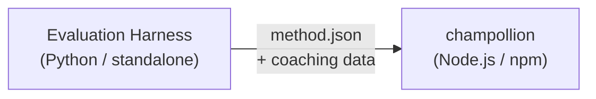

# مواصفات المكون الإضافي للطريقة

> **الإصدار**: 1.1  
> **الجمهور**: مطورو المكونات الإضافية  
> **المخطط الأساسي**: [`shared/schemas/champollion-plugin.schema.json`](https://github.com/gamedaysuits/Champollion/blob/main/cli/shared/schemas/champollion-plugin.schema.json)

## نظرة عامة

يستخدم champollion **نظام طرق قابل للتوصيل** (pluggable method system). يمكن لكل زوج لغوي استخدام طريقة ترجمة مختلفة (LLM، coached، script-converter، إلخ). يتم تسجيل الطرق في `lib/translate.js` ويتم تحديدها لكل زوج عبر `lib/pairs.js`.

تتمثل مهمة بيئة التقييم (eval harness) في **تطوير واختبار وتصدير** طرق الترجمة. بينما تتمثل مهمة champollion في **استهلاكها وتنفيذها**. المكون الإضافي عبارة عن **بيانات فقط** — التكوين، ومحتوى التوجيه (coaching content)، ونتائج قياس الأداء (benchmark results). لا يحتوي على كود Python، ولا توجد تبعيات لبيئة التقييم.

### تدفق البيانات



تقوم بيئة التقييم بتطوير واختبار الطرق بلغة Python. عندما تكون الطريقة جاهزة للنشر، تقوم بيئة التقييم بتصدير بيان (manifest) `method.json` وملفات بيانات توجيه اختيارية. يقوم Champollion بتثبيت وتنفيذ الطريقة باستخدام تطبيقات الطرق المدمجة الخاصة به.

---

## تنسيق المكون الإضافي للطريقة

المكون الإضافي للطريقة عبارة عن ملف JSON واحد (`method.json`) مع ملفات بيانات توجيه اختيارية.

### `method.json` — مطلوب

```json
{
  "name": "french-formal-v1",
  "type": "llm-coached",
  "version": "1.0.0",
  "description": "Formally-tuned French with terminology enforcement and grammar coaching",
  "author": "Plugin Author",

  "config": {
    "model": "google/gemini-3.5-flash",
    "temperature": 0.2,
    "batchSize": 80,
    "register": "formal",
    "coachingFile": null,
    "coachingPrompt": null,
    "promptContext": null,
    "qualityTier": null
  },

  "locales": ["fr"],

  "benchmarks": {
    "fr": {
      "date": "2026-05-11T00:00:00Z",
      "corpus_size": 500,
      "exact_match_rate": 0.42,
      "corpus_chrf": 72.3,
      "corpus_bleu": 45.1,
      "model": "google/gemini-3.5-flash",
      "harness_version": "1.0.0"
    }
  },

  "provenance": {
    "resources": [],
    "commercialReady": false,
    "flags": ["license-unclear"]
  },

  "coaching": {
    "dir": "coaching"
  }
}
```

### مرجع الحقول

| الحقل | النوع | مطلوب | الوصف |
|-------|------|----------|-------------|
| `name` | string | ✅ | معرف فريد للطريقة (بتنسيق kebab-case) |
| `type` | string | ✅ | نوع طريقة Champollion: `llm`, `llm-coached`, `api`, `google-translate`, `deepl`, `microsoft-translator`, `libretranslate`, `openai`, `anthropic`, `gemini` |
| `version` | string | ✅ | إصدار Semver (مثل `1.0.0`) |
| `locales` | string[] | ✅ | رموز اللغات المحلية التي تستهدفها هذه الطريقة (كحد أدنى 1) |
| `description` | string | — | وصف مقروء للبشر |
| `author` | string | — | من قام بتطوير/اختبار هذه الطريقة |
| `config.model` | string | — | معرف نموذج OpenRouter |
| `config.temperature` | number | — | درجة حرارة LLM (0.0–2.0، الافتراضي: 0.3) |
| `config.batchSize` | number | — | عدد المفاتيح لكل دفعة API (1–200، الافتراضي: 80) |
| `config.register` | string \| null | — | السجل/النبرة للغة الهدف (مفتاح محدد مسبقًا أو نص حر) |
| `config.coachingFile` | string \| null | — | مسار ملف مطالبة التوجيه بالنص الحر (نسبيًا إلى جذر المشروع) |
| `config.coachingPrompt` | string \| null | — | نص مطالبة التوجيه الذي تم حله (يُقرأ من `coachingFile` في وقت التشغيل) |
| `config.promptContext` | string \| null | — | سياق التطبيق المحقون في مطالبة النظام (مثل "أوصاف منتجات التجارة الإلكترونية") |
| `config.qualityTier` | string \| null | — | مستوى الجودة من تقييم قياس الأداء (`standard`, `high`, `research`, `verified`) |
| `benchmarks` | object | — | نتائج قياس الأداء لكل لغة محلية من بيئة التقييم |
| `provenance` | object | — | الترخيص وتبعيات الموارد |
| `coaching.dir` | string | — | مسار نسبي إلى دليل بيانات التوجيه |

:::info[الشكل الأساسي لـ MethodConfig]
تستخدم كتلة `config` **مخطط MethodConfig الأساسي** — نفس الحقول الثمانية المستخدمة عبر `champollion.config.json`، وبطاقات تشغيل بيئة التقييم، و `mt-eval export-config`، ونشر/تثبيت لوحة الصدارة (leaderboard). جميع الحقول موجودة دائمًا؛ القيم غير المستخدمة تكون `null`. يضمن هذا انتقالًا سلسًا (zero-friction round-tripping) بين التقييم والإنتاج.
:::

### كائن قياس الأداء (لكل لغة محلية)

| الحقل | النوع | مطلوب | الوصف |
|-------|------|----------|-------------|
| `date` | string | ✅ | طابع زمني ISO 8601 لتشغيل قياس الأداء |
| `corpus_size` | number | ✅ | عدد الإدخالات التي تم تقييمها |
| `exact_match_rate` | number | ✅ | 0.0–1.0، نسبة التطابقات التامة (exact matches) |
| `corpus_chrf` | number | — | نتيجة chrF++ (0–100) |
| `corpus_bleu` | number | — | نتيجة BLEU (0–100) |
| `model` | string | ✅ | النموذج المستخدم أثناء التقييم |
| `harness_version` | string | ✅ | إصدار بيئة التقييم المستخدمة |

:::info[ما هي المقاييس التي يتم عرضها؟]
يعرض الأمر `champollion status` **chrF++** و **معدل التطابق التام** (exact match rate) من كتلة قياس الأداء. يتم قبول `corpus_bleu` في البيان (manifest) ولكن لا يتم عرضه حاليًا أو استخدامه بواسطة أي أمر في champollion. تتتبع [لوحة صدارة الطرق](/leaderboard) (Method Leaderboard) مقاييس chrF++، والتطابق التام، ومعدل قبول FST.
:::

---

### كائن المصدر (Provenance)

تنقل كتلة المصدر حالة الترخيص للموارد المجمعة في المكون الإضافي.

| الحقل | النوع | الافتراضي | الوصف |
|-------|------|---------|-------------|
| `resources` | object[] | `[]` | قائمة الموارد المجمعة مع `name` و `license` و `type` |
| `commercialReady` | boolean | `false` | ما إذا كان المكون الإضافي مصرحًا له بالتوزيع التجاري |
| `flags` | string[] | `["license-unclear"]` | علامات الحالة القابلة للقراءة آليًا |

**الحالة الافتراضية** — يتم شحن المكونات الإضافية المصدرة مع `commercialReady: false` و `flags: ["license-unclear"]`.

**الحالة المصرح بها** — عند التحقق من الترخيص: قم بتعيين `commercialReady: true` وامسح العلامات.

---

## تنسيق بيانات التوجيه

إذا كان `type` هو `llm-coached`، فيجب أن يتضمن المكون الإضافي ملفات بيانات التوجيه في الدليل الفرعي `coaching/`.

### `coaching/<locale>.json`

```json
{
  "grammar_rules": [
    "French adjectives agree in gender and number with the noun they modify",
    "Use 'vous' for formal contexts, 'tu' for informal"
  ],
  "dictionary": {
    "dashboard": "tableau de bord",
    "deployment": "déploiement",
    "settings": "paramètres"
  },
  "style_notes": "Prefer active voice. Avoid anglicisms where a native French term exists."
}
```

| الحقل | النوع | مطلوب | الوصف |
|-------|------|----------|-------------|
| `grammar_rules` | string[] | — | القواعد المحقونة في كل مطالبة LLM لهذه اللغة المحلية |
| `dictionary` | object | — | خريطة المصطلح → الترجمة. يتم حقن المصطلحات المتطابقة كمصطلحات مطلوبة. |
| `style_notes` | string | — | تعليمات النمط بالنص الحر الملحقة بالمطالبة |

---

## بنية الدليل

```
french-formal-v1/
  method.json                 # Method manifest with benchmarks
  coaching/
    fr.json                   # Coaching data for French
```

للطرق متعددة اللغات المحلية:

```
european-formal-v2/
  method.json                 # locales: ["fr", "de", "es", "it"]
  coaching/
    fr.json
    de.json
    es.json
    it.json
```

---

## كيف يستهلك Champollion المكونات الإضافية

### التثبيت

```bash
champollion plugin install ./french-formal-v1/
```

يُحفظ في `.champollion/methods/french-formal-v1/`.

### التكوين

```json title="champollion.config.json"
{
  "pairs": {
    "en:fr": {
      "methodPlugin": "french-formal-v1"
    }
  }
}
```

:::info[دلالات الدمج (Merge semantics)]
يحدد المكون الإضافي *ما هي* الطريقة التي يجب استخدامها (`type`). بينما يضبط تكوين الزوج *كيفية* تشغيلها (`model`، `register`، `batchSize`). إذا قام الزوج بتعيين `model`، فإنه يتجاوز الإعداد الافتراضي للمكون الإضافي.
:::

### وقت التشغيل

1. يقرأ Champollion `method.json` من `.champollion/methods/french-formal-v1/`
2. يحدد حقل `type` في المكون الإضافي طريقة الترجمة (مثل `llm-coached`)
3. يُحمل بيانات التوجيه من دليل `coaching/` الخاص بالمكون الإضافي
4. يستخدم كتلة `config` لملء الفجوات في النموذج/السجل/درجة الحرارة
5. يتم عرض كتلة `benchmarks` في مخرجات `champollion status`
6. يتم فحص كتلة `provenance` بواسطة `champollion provenance` بحثًا عن علامات الترخيص

---

## التحقق من صحة المخطط

يتم التحقق من صحة بيانات المكونات الإضافية (Plugin manifests) في وقت التثبيت مقابل [`shared/schemas/champollion-plugin.schema.json`](https://github.com/gamedaysuits/Champollion/blob/main/cli/shared/schemas/champollion-plugin.schema.json).

قم بالإشارة إلى المخطط في `method.json` الخاص بك للحصول على الإكمال التلقائي في بيئة التطوير المتكاملة (IDE):

```json
{
  "$schema": "./node_modules/champollion/shared/schemas/champollion-plugin.schema.json",
  "name": "my-method-v1"
}
```

---

## ما لا يجب تضمينه

- ❌ لا يوجد كود Python أو تبعيات لبيئة التقييم
- ❌ لا توجد بيانات مدونة (corpus data) خام أو سجلات تشغيل
- ❌ لا توجد مفاتيح API أو بيانات اعتماد
- ❌ لا يوجد تكوين لبيئة التقييم
- ❌ لا توجد قوالب مطالبات داخلية (تلك موجودة في تطبيقات طرق champollion)

المكون الإضافي عبارة عن **بيانات فقط**: التكوين، ومحتوى التوجيه، ونتائج قياس الأداء.

---

## انظر أيضًا

- [طرق الترجمة](/docs/guides/translation-methods) — كيف تعمل كل طريقة مدمجة
- [التكوين](/docs/getting-started/configuration) — التكوين لكل زوج ولكل لغة
- [تقديم طريقة عبر API](/docs/guides/serving-a-method) — استضافة الطرق كخدمات HTTP
- [كتاب الوصفات: مسار عمل مقيد بـ FST](/docs/network/tutorials/fst-gated-pipeline) — بناء وتعبئة مسار عمل
- [تقييم الترجمة الآلية (MT Evaluation)](/docs/network/leaderboard/rules) — قياس أداء الطرق لتقديمها إلى لوحة الصدارة
- [دعم لغة منخفضة الموارد](/docs/network/community/low-resource-languages) — حالة الاستخدام للمكونات الإضافية المجتمعية
