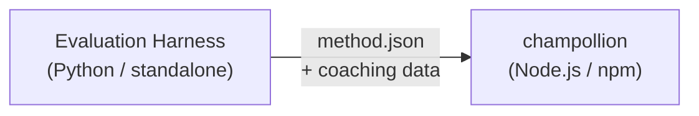

# مواصفات إضافة الطريقة

> **الإصدار**: 1.1  
> **الجمهور المستهدف**: مطوّرو الإضافات  
> **المخطط القياسي**: [`shared/schemas/champollion-plugin.schema.json`](https://github.com/gamedaysuits/Champollion/blob/main/cli/shared/schemas/champollion-plugin.schema.json)

## نظرة عامة

يستخدم champollion **نظام طرق قابلاً للإضافة**. يمكن لكل زوج لغوي استخدام طريقة ترجمة مختلفة (LLM، موجهة، محول نصوص، وما إلى ذلك). تُسجَّل الطرق في `lib/translate.js` وتُحدَّد لكل زوج عبر `lib/pairs.js`.

تتمثل مهمة بيئة التقييم في **تطوير طرق الترجمة واختبارها وتصديرها**. بينما تكمن مهمة champollion في **استهلاكها وتنفيذها**. تقتصر الإضافة على **البيانات فقط** — الإعدادات، ومحتوى التوجيه، ونتائج اختبارات الأداء. لا تتضمن أي كود Python، ولا أي تبعيات لبيئة التقييم.

### تدفق البيانات


```mermaid
flowchart LR
    A["Evaluation Harness\n(Python / standalone)"] -->|"method.json\n+ coaching data"| B["champollion\n(Node.js / npm)"]
```

تقوم بيئة التقييم بتطوير الطرق واختبارها باستخدام Python. وعندما تصبح الطريقة جاهزة للنشر، تُصدّر بيئة التقييم بيان `method.json` وملفات بيانات توجيه اختيارية. بعد ذلك، يقوم Champollion بتثبيت الطريقة وتنفيذها باستخدام تطبيقات الطرق المدمجة الخاصة به.

---

## تنسيق إضافة الطريقة

تتكون إضافة الطريقة من ملف JSON واحد (`method.json`) مصحوباً بملفات بيانات توجيه اختيارية.

### `method.json` — مطلوب

```json
{
  "name": "french-formal-v1",
  "type": "llm-coached",
  "version": "1.0.0",
  "description": "Formally-tuned French with terminology enforcement and grammar coaching",
  "author": "Plugin Author",

  "config": {
    "model": "google/gemini-3.8-flash",
    "temperature": 0.2,
    "batchSize": 80,
    "register": "formal",
    "coachingFile": null,
    "coachingPrompt": null,
    "promptContext": null,
    "qualityTier": null
  },

  "locales": ["fr"],

  "benchmarks": {
    "fr": {
      "date": "2026-05-11T00:00:00Z",
      "corpus_size": 500,
      "exact_match_rate": 0.42,
      "corpus_chrf": 72.3,
      "corpus_bleu": 45.1,
      "model": "google/gemini-3.8-flash",
      "harness_version": "1.0.0"
    }
  },

  "provenance": {
    "resources": [],
    "commercialReady": false,
    "flags": ["license-unclear"]
  },

  "coaching": {
    "dir": "coaching"
  }
}
```

### مرجع الحقول

| الحقل | النوع | مطلوب | الوصف |
|-------|------|----------|-------------|
| `name` | string | ✅ | معرّف فريد للطريقة (بصيغة kebab-case) |
| `type` | string | ✅ | نوع طريقة Champollion: `llm`، `llm-coached`، `api`، `google-translate`، `deepl`، `microsoft-translator`، `libretranslate`، `openai`، `anthropic`، `gemini` |
| `version` | string | ✅ | إصدار Semver (مثل `1.0.0`) |
| `locales` | string[] | ✅ | رموز الإعدادات المحلية التي تستهدفها هذه الطريقة (واحد على الأقل) |
| `description` | string | — | وصف مقروء للبشر |
| `author` | string | — | الجهة أو الشخص الذي طوّر/اختبر هذه الطريقة |
| `config.model` | string | — | معرّف نموذج OpenRouter |
| `config.temperature` | number | — | درجة حرارة LLM (من 0.0 إلى 2.0، القيمة الافتراضية: 0.3) |
| `config.batchSize` | number | — | عدد المفاتيح لكل دفعة API (من 1 إلى 200، القيمة الافتراضية: 80) |
| `config.register` | string \| null | — | الأسلوب/النبرة للغة المستهدفة (مفتاح مسبق الضبط أو نص حر) |
| `config.coachingFile` | string \| null | — | المسار إلى ملف موجه التوجيه النصي الحر (نسبياً إلى جذر المشروع) |
| `config.coachingPrompt` | string \| null | — | نص موجه التوجيه المحلول (تتم قراءته من `coachingFile` أثناء التشغيل) |
| `config.promptContext` | string \| null | — | سياق التطبيق المحقون في موجه النظام (مثل: "أوصاف منتجات التجارة الإلكترونية") |
| `config.qualityTier` | string \| null | — | تصنيف يحدده المؤلف بخصوص المخرجات (`standard`، `high`، `research`، `verified`). لا يتم قياسه ولا يُشتق من درجات اختبارات الأداء؛ وتقوم المزامنة بالترجمة بنفس الطريقة أياً كانت قيمته، بينما يعرضه `serve` |
| `benchmarks` | object | — | نتائج اختبارات الأداء لكل إعداد محلي من بيئة التقييم |
| `provenance` | object | — | التراخيص وتبعيات الموارد |
| `coaching.dir` | string | — | المسار النسبي إلى دليل بيانات التوجيه |

:::info[شكل MethodConfig القياسي]
تستخدم كتلة `config` **مخطط MethodConfig القياسي** — وهو الحقول الثمانية نفسها المستخدمة عبر `champollion.config.json`، وبطاقات تشغيل بيئة التقييم، و`mt-eval export-config`، ونشر/تثبيت لوحة المتصدرين. جميع الحقول حاضرة دائماً؛ وتكون القيم غير المستخدمة هي `null`. يضمن ذلك توافقاً وانتقالاً سلساً تماماً بين التقييم وبيئة الإنتاج.
:::

### كائن اختبار الأداء (لكل إعداد محلي)

| الحقل | النوع | مطلوب | الوصف |
|-------|------|----------|-------------|
| `date` | string | ✅ | طابع زمني بتنسيق ISO 8601 لتشغيل اختبار الأداء |
| `corpus_size` | number | ✅ | عدد المدخلات التي تم تقييمها |
| `exact_match_rate` | number | ✅ | من 0.0 إلى 1.0، نسبة التطابقات التامة |
| `corpus_chrf` | number | — | درجة chrF++ (من 0 إلى 100) |
| `corpus_bleu` | number | — | درجة BLEU (من 0 إلى 100) |
| `model` | string | ✅ | النموذج المستخدم أثناء التقييم |
| `harness_version` | string | ✅ | إصدار بيئة التقييم المستخدمة |

:::info[ما هي المقاييس المعروضة؟]
يعرض الأمر `champollion status` كلاً من **chrF++** و**معدل التطابق التام** من كتلة اختبار الأداء. يتم قبول `corpus_bleu` في البيان، لكنه غير معروض أو مستخدم حالياً بواسطة أي أمر من أوامر champollion. تتعقب [لوحة صدارة الطرق](/leaderboard) مقاييس chrF++، والتطابق التام، ومعدل قبول FST.
:::

---

### كائن المصدر والموثوقية

توضح كتلة المصدر (provenance) حالة ترخيص الموارد المضمنة في الإضافة.

| الحقل | النوع | الافتراضي | الوصف |
|-------|------|---------|-------------|
| `resources` | object[] | `[]` | قائمة بالموارد المضمنة مع `name` و`license` و`type` |
| `commercialReady` | boolean | `false` | ما إذا كانت الإضافة معتمدة للتوزيع التجاري |
| `flags` | string[] | `["license-unclear"]` | أعلام الحالة المقروءة آلياً |

**الحالة الافتراضية** — تُشحن الإضافات المصدَّرة مع `commercialReady: false` و`flags: ["license-unclear"]`.

**الحالة المعتمدة** — عند التحقق من التراخيص: اضبط `commercialReady: true` وامسح الأعلام.

---

## تنسيق بيانات التوجيه

إذا كانت قيمة `type` هي `llm-coached`، فيجب أن تتضمن الإضافة ملفات بيانات توجيه في الدليل الفرعي `coaching/`.

### `coaching/<locale>.json`

```json
{
  "grammar_rules": [
    "French adjectives agree in gender and number with the noun they modify",
    "Use 'vous' for formal contexts, 'tu' for informal"
  ],
  "dictionary": {
    "dashboard": "tableau de bord",
    "deployment": "déploiement",
    "settings": "paramètres"
  },
  "style_notes": "Prefer active voice. Avoid anglicisms where a native French term exists."
}
```

| الحقل | النوع | مطلوب | الوصف |
|-------|------|----------|-------------|
| `grammar_rules` | string[] | — | القواعد المحقونة في كل موجه LLM لهذا الإعداد المحلي |
| `dictionary` | object | — | خريطة المصطلح ← الترجمة. تُحقن المصطلحات المتطابقة كمصطلحات مطلوبة. |
| `style_notes` | string | — | تعليمات أسلوب حرة تُلحق بنهاية الموجه |

---

## هيكل الدليل

```
french-formal-v1/
  method.json                 # Method manifest with benchmarks
  coaching/
    fr.json                   # Coaching data for French
```

بالنسبة للطرق المتعددة الإعدادات المحلية:

```
european-formal-v2/
  method.json                 # locales: ["fr", "de", "es", "it"]
  coaching/
    fr.json
    de.json
    es.json
    it.json
```

---

## كيف يستهلك Champollion الإضافات

### التثبيت

```bash
champollion plugin install ./french-formal-v1/
```

يتم الحفظ في `.champollion/methods/french-formal-v1/`.

### الإعدادات

```json title="champollion.config.json"
{
  "pairs": {
    "en:fr": {
      "methodPlugin": "french-formal-v1"
    }
  }
}
```

:::info[دلالات الدمج]
تحدد الإضافة الطريقة *التي* سيتم استخدامها (`type`). بينما يضبط إعداد الزوج اللغوي طريقة تشغيلها (`model`، `register`، `batchSize`). إذا حدد الزوج قيمة `model`، فإنها تتجاوز القيمة الافتراضية للإضافة.
:::

### وقت التشغيل

1. يقرأ Champollion `method.json` من `.champollion/methods/french-formal-v1/`
2. يحدد حقل `type` الخاص بالإضافة طريقة الترجمة (مثل `llm-coached`)
3. يقوم بتحميل بيانات التوجيه من دليل `coaching/` الخاص بالإضافة
4. يستخدم كتلة `config` لملء الفراغات في النموذج/الأسلوب/درجة الحرارة
5. تُعرض كتلة `benchmarks` في مخرجات `champollion status`
6. يفحص `champollion provenance` كتلة `provenance` للتحقق من أعلام التراخيص

---

## التحقق من صحة المخطط

يتم التحقق من صحة بيانات الإضافة في وقت التثبيت وفقاً لـ [`shared/schemas/champollion-plugin.schema.json`](https://github.com/gamedaysuits/Champollion/blob/main/cli/shared/schemas/champollion-plugin.schema.json).

أشر إلى المخطط في `method.json` للحصول على الإكمال التلقائي في بيئة التطوير المتكاملة (IDE):

```json
{
  "$schema": "./node_modules/champollion/shared/schemas/champollion-plugin.schema.json",
  "name": "my-method-v1"
}
```

---

## ما لا يجب تضمينه

- ❌ لا تتضمن أي كود Python أو تبعيات لبيئة التقييم
- ❌ لا تتضمن بيانات المجموعات النصية الخام أو سجلات التشغيل
- ❌ لا تتضمن مفاتيح API أو بيانات اعتماد
- ❌ لا تتضمن إعدادات بيئة التقييم
- ❌ لا تتضمن قوالب موجهات داخلية (فهذه موجودة في تطبيقات الطرق الخاصة بـ champollion)

تقتصر الإضافة على **البيانات فقط**: الإعدادات، ومحتوى التوجيه، ونتائج اختبارات الأداء.

---

## انظر أيضًا

- [طرق الترجمة](/docs/guides/translation-methods) — كيف تعمل كل طريقة مدمجة
- [الإعدادات](/docs/getting-started/configuration) — الإعدادات لكل زوج لغوي ولكل لغة
- [تقديم الطريقة عبر API](/docs/guides/serving-a-method) — استضافة الطرق كخدمات HTTP
- [كتيب الإرشادات: مسار معالجة ببوابة FST](/docs/network/tutorials/fst-gated-pipeline) — بناء مسار المعالجة وحزمته
- [تقييم الترجمة الآلية](/docs/network/leaderboard/rules) — إجراء اختبارات أداء للطرق لتقديمها إلى لوحة المتصدرين
- [دعم لغة منخفضة الموارد](/docs/network/community/low-resource-languages) — حالة الاستخدام لإضافات المجتمع
