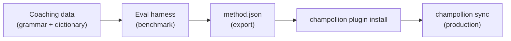

# درس تطبيقي: بناء إضافة ترجمة

قم ببناء طريقة ترجمة مخصصة من الصفر، وقياس أدائها، ونشرها كإضافة في champollion. يمثل هذا سير العمل الكامل لإضافة زوج لغوي جديد لا تدعمه أي واجهة برمجة تطبيقات (API) جاهزة.

**ما ستقوم ببنائه:** إضافة ترجمة موجهة (coached) للغة الفرنسية الرسمية مع فرض المصطلحات، والقواعد النحوية، ودرجات قياس الأداء.

**الوقت:** 30–45 دقيقة

**المتطلبات الأساسية:**
- تثبيت champollion (`npm install --save-dev champollion`)
- مفتاح واجهة برمجة تطبيقات (API) لـ OpenRouter (`OPENROUTER_API_KEY`)
- Python 3.10+ (لإطار التقييم)

---

## الخطوة 1: تحديد المشكلة

أنت تقوم بترجمة لوحة تحكم لبرمجيات كخدمة (SaaS) إلى اللغة الفرنسية. تُنتج طريقة `llm` الافتراضية ترجمات صحيحة ولكنها غير متسقة:

- أحيانًا تُترجم "dashboard" إلى "tableau de bord"، وفي أحيان أخرى إلى "panneau de contrôle"
- تتأرجح نبرة الحديث بين صيغتي `tu` و `vous`
- تتم أنجلة (anglicized) المصطلحات التقنية بشكل غير متسق

أنت بحاجة إلى **فرض المصطلحات** و**التحكم في مستوى اللغة (register control)** وهو ما لا توفره المطالبة (prompt) العامة للنموذج اللغوي الكبير (LLM).

## الخطوة 2: إنشاء بيانات التوجيه

قم بإنشاء ملف توجيه (coaching file) يشفّر متطلباتك اللغوية:

```bash
mkdir -p .champollion/coaching
```

```json title=".champollion/coaching/fr.json"
{
  "grammar_rules": [
    "Always use the 'vous' form for formal register",
    "French adjectives agree in gender and number with their noun",
    "Use the present tense for UI instructions, not the imperative",
    "Preserve sentence-final punctuation style from the source"
  ],
  "dictionary": {
    "dashboard": "tableau de bord",
    "deployment": "déploiement",
    "settings": "paramètres",
    "environment variable": "variable d'environnement",
    "webhook": "webhook",
    "API key": "clé API",
    "sign in": "se connecter",
    "sign out": "se déconnecter",
    "repository": "dépôt",
    "pull request": "demande de tirage"
  },
  "style_notes": "Formal technical French. Prefer native French terms over anglicisms where established equivalents exist. Keep UI labels concise — 3 words maximum where possible."
}
```

**وظيفة كل حقل:**
- **`grammar_rules`** — يُحقن في مطالبة النظام (system prompt) للنموذج اللغوي الكبير كقيود صريحة
- **`dictionary`** — يُطابق مع المفاتيح المصدرية؛ وعند ظهور مصطلح من القاموس، يُحقن كـ "مصطلحات مطلوبة" في المطالبة
- **`style_notes`** — يُلحق بمطالبة النظام كإرشادات عامة للأسلوب

## الخطوة 3: تكوين الزوج اللغوي

أخبر champollion باستخدام `llm-coached` للغة الفرنسية:

```json title="champollion.config.json"
{
  "version": 3,
  "inputLocale": "en",
  "localesDir": "./locales",
  "pairs": {
    "en:fr": {
      "method": "llm-coached",
      "model": "google/gemini-3.5-flash",
      "temperature": 0.2
    }
  },
  "languages": {
    "fr": {
      "register": "Formal technical French (vous-form)",
      "name": "French"
    }
  }
}
```

## الخطوة 4: اختبره

```bash
npx champollion sync --dry
```

راجع مخرجات التشغيل التجريبي (dry-run). تحقق من:
- ✅ استخدام مصطلحات القاموس بشكل متسق ("tableau de bord"، وليس "panneau de contrôle")
- ✅ استخدام صيغة `vous` في جميع الأنحاء
- ✅ تطابق المصطلحات التقنية مع قاموسك

ثم قم بتشغيل المزامنة الحقيقية:

```bash
npx champollion sync
```

## الخطوة 5: قياس الأداء باستخدام إطار التقييم (اختياري)

إذا كنت تريد الحصول على درجات الجودة — وأنت بالتأكيد تريد ذلك، لأن الإضافات تُشحن مع بيانات قياس الأداء — فاستخدم إطار التقييم المرافق.

### تثبيت إطار التقييم

```bash
pip install mt-eval-harness
```

### إنشاء مدونة مرجعية (Reference Corpus)

قم بإنشاء ملف يحتوي على السلاسل النصية المصدرية وترجمات معروفة بجودتها:

```json title="corpus/french-formal.json"
[
  {
    "source": "Dashboard",
    "reference": "Tableau de bord"
  },
  {
    "source": "Sign in to your account",
    "reference": "Connectez-vous à votre compte"
  },
  {
    "source": "Your deployment is ready",
    "reference": "Votre déploiement est prêt"
  },
  {
    "source": "Environment variables",
    "reference": "Variables d'environnement"
  }
]
```

### تشغيل قياس الأداء

```bash
mt-eval test \
  --corpus corpus/french-formal.json \
  --source en \
  --target fr \
  --model google/gemini-3.5-flash \
  --temperature 0.2 \
  --champollion-config champollion.config.json
```

يُخرج إطار التقييم ما يلي:
- **chrF++** — مقياس F-score على مستوى الحرف (0–100). ما فوق 70 يُعتبر قويًا.
- **BLEU** — تداخل N-gram (0–100). ما فوق 40 يُعتبر صلبًا للترجمة الموجهة.
- **معدل التطابق التام (Exact match rate)** — نسبة الترجمات التي تتطابق مع المرجع تمامًا.
- **COMET** — مقياس جودة عصبي (إذا تم تثبيته عبر `mt-eval setup --comet`).

:::tip[اختبر ما تقوم بنشره]
يؤدي استخدام `--champollion-config` إلى استيراد نموذج الإنتاج الخاص بك، ومستوى اللغة (register)، ودرجة الحرارة (temperature)، وبيانات التوجيه مباشرة من `champollion.config.json`. يضمن هذا أنك تقيس أداء الطريقة الدقيقة التي ستقوم بنشرها.
:::

### تصدير الإضافة

بمجرد أن تكون راضيًا عن الدرجات:

```bash
mt-eval export \
  --name french-formal-v1 \
  --report eval/logs/harness/run_report.json \
  --output ./french-formal-v1/
```

يؤدي هذا إلى إنشاء:

```
french-formal-v1/
├── method.json          # Manifest with config + benchmarks
└── coaching/
    └── fr.json          # Your coaching data
```

## الخطوة 6: تثبيت الإضافة في Champollion

```bash
npx champollion plugin install ./french-formal-v1/
```

يؤدي هذا إلى نسخ الإضافة إلى `.champollion/methods/french-formal-v1/`.

قم بتحديث ملف التكوين الخاص بك لاستخدامها:

```json title="champollion.config.json"
{
  "pairs": {
    "en:fr": {
      "methodPlugin": "french-formal-v1"
    }
  }
}
```

## الخطوة 7: التحقق

```bash
# Check plugin is installed and shows benchmark scores
npx champollion status

# Run a sync with the plugin
npx champollion sync

# Audit licensing status
npx champollion provenance
```

ستُظهر مخرجات `status` ما يلي:

```
en → fr
  Method:    french-formal-v1 (llm-coached)
  Model:     google/gemini-3.5-flash
  Quality:   high
  chrF++:    74.2
  BLEU:      46.8
  Exact:     42%
```

## ما قمت ببنائه



لديك الآن:
1. **بيانات التوجيه** — القواعد النحوية والمصطلحات التي تفرض الاتساق
2. **درجات قياس الأداء** — جودة كمية تُشحن مع الإضافة
3. **إضافة محمولة (portable)** — `method.json` + بيانات التوجيه، قابلة للتثبيت على أي جهاز
4. **نشر في بيئة الإنتاج** — مدمجة في مسار المزامنة الخاص بك

## الخطوات التالية

- **[مواصفات الإضافة](/docs/reference/plugin-spec)** — مرجع كامل لتنسيق البيان (manifest)
- **[طرق الترجمة](/docs/guides/translation-methods)** — مقارنة بين الطرق الأربع جميعها
- **[اللغات منخفضة الموارد](/docs/network/community/low-resource-languages)** — تطبيق هذا النمط على اللغات التي لا تغطيها واجهة برمجة التطبيقات (API)
- **[ترجمة 30 لغة](/docs/tutorials/translate-30-languages)** — توسيع نطاق مشروعك ليصل إلى جمهور عالمي
