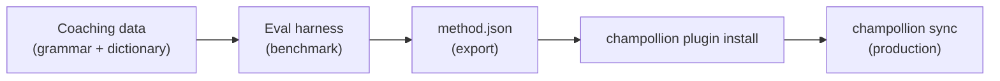

# درس تعليمي: بناء إضافة ترجمة

قم ببناء طريقة ترجمة مخصصة من الصفر، وقياس أدائها، ونشرها كإضافة لـ champollion. يمثل هذا سير العمل الكامل لإضافة زوج لغوي جديد لا تدعمه أي واجهة برمجة تطبيقات جاهزة.

**ما ستقوم ببنائه:** إضافة ترجمة موجَّهة للغة الفرنسية الرسمية مع فرض المصطلحات وقواعد النحو ودرجات قياس الأداء.

**الوقت:** 30–45 دقيقة

**المتطلبات الأساسية:**
- تثبيت champollion (`npm install --save-dev champollion`)
- مفتاح OpenRouter API (`OPENROUTER_API_KEY`)
- Python 3.10+ (من أجل إطار التقييم)

---

## الخطوة 1: تحديد المشكلة

أنت تقوم بترجمة لوحة تحكم لتطبيق SaaS إلى الفرنسية. تنتج طريقة `llm` الافتراضية ترجمات صحيحة ولكنها غير متسقة:

- أحيانًا تُترجم كلمة "dashboard" إلى "tableau de bord"، وفي أحيان أخرى إلى "panneau de contrôle"
- تتناوب نبرة الخطاب بين صيغتي `tu` و`vous`
- تُنقل المصطلحات التقنية إلى الإنجليزية بنحو غير متسق

أنت بحاجة إلى **فرض المصطلحات** و**التحكم في مستوى الخطاب** اللذين لا يوفرهما موجه LLM العام.

## الخطوة 2: إنشاء بيانات التوجيه

أنشئ ملف توجيه يحدد متطلباتك اللغوية:

```bash
mkdir -p .champollion/coaching
```

```json title=".champollion/coaching/fr.json"
{
  "grammar_rules": [
    "Always use the 'vous' form for formal register",
    "French adjectives agree in gender and number with their noun",
    "Use the present tense for UI instructions, not the imperative",
    "Preserve sentence-final punctuation style from the source"
  ],
  "dictionary": {
    "dashboard": "tableau de bord",
    "deployment": "déploiement",
    "settings": "paramètres",
    "environment variable": "variable d'environnement",
    "webhook": "webhook",
    "API key": "clé API",
    "sign in": "se connecter",
    "sign out": "se déconnecter",
    "repository": "dépôt",
    "pull request": "demande de tirage"
  },
  "style_notes": "Formal technical French. Prefer native French terms over anglicisms where established equivalents exist. Keep UI labels concise — 3 words maximum where possible."
}
```

**وظيفة كل حقل:**
- **`grammar_rules`** — يُحقن في موجه النظام لنموذج LLM كقيود صريحة
- **`dictionary`** — يُطابق مع المفاتيح المصدرية؛ عند ظهور مصطلح من القاموس، يتم حقنه كـ "مصطلحات مطلوبة" في الموجه
- **`style_notes`** — يُلحق بموجه النظام كإرشادات عامة للأسلوب

## الخطوة 3: تهيئة الزوج اللغوي

وجّه champollion لاستخدام `llm-coached` للغة الفرنسية:

```json title="champollion.config.json"
{
  "version": 3,
  "inputLocale": "en",
  "localesDir": "./locales",
  "pairs": {
    "en:fr": {
      "method": "llm-coached",
      "model": "google/gemini-3.8-flash",
      "temperature": 0.2
    }
  },
  "languages": {
    "fr": {
      "register": "Formal technical French (vous-form)",
      "name": "French"
    }
  }
}
```

## الخطوة 4: اختباره

```bash
npx champollion sync --dry
```

راجع مخرجات التشغيل التجريبي. تأكد من الآتي:
- ✅ استخدام مصطلحات القاموس بنحو متسق ("tableau de bord" وليس "panneau de contrôle")
- ✅ استخدام صيغة `vous` في جميع النصوص
- ✅ تطابق المصطلحات التقنية مع قاموسك

ثم قم بتشغيل المزامنة الفعلية:

```bash
npx champollion sync
```

## الخطوة 5: قياس الأداء باستخدام إطار التقييم (اختياري)

إذا كنت تريد الحصول على درجات الجودة — وهي مطلوبة، لأن الإضافات يتم شحنها مع بيانات قياس الأداء — فاستخدم إطار التقييم المرفق.

### تثبيت إطار التقييم

```bash
python3 -m pip install mt-eval-harness
```

### إنشاء متن مرجعي

أنشئ ملفاً يحتوي على السلاسل المصدرية وترجمات معتمدة عالية الجودة:

```json title="corpus/french-formal.json"
[
  {
    "source": "Dashboard",
    "reference": "Tableau de bord"
  },
  {
    "source": "Sign in to your account",
    "reference": "Connectez-vous à votre compte"
  },
  {
    "source": "Your deployment is ready",
    "reference": "Votre déploiement est prêt"
  },
  {
    "source": "Environment variables",
    "reference": "Variables d'environnement"
  }
]
```

### تشغيل قياس الأداء

```bash
mt-eval run \
  --corpus corpus/french-formal.json \
  --source-lang English \
  --target-lang French \
  --model google/gemini-3.8-flash \
  --temperature 0.2 \
  --coaching-file .champollion/coaching/fr.txt
```

تُسفر عملية التشغيل عن كتابة `eval/logs/harness/<run-id>.json` وتقرير النقاط الخاص به
`<run-id>_report.json`. (يقوم `mt-eval test <run-log>` بإعادة حساب درجات سجل تشغيل حالي
دون استدعاء النموذج مرة أخرى).

يُخرج إطار التقييم النتائج التالية:
- **chrF++** — مقياس F-score على مستوى الأحرف (0–100). وتُعد الدرجة فوق 70 نتيجة قوية.
- **BLEU** — تداخل الـ N-gram (0–100). وتُعد الدرجة فوق 40 ممتازة للترجمة الموجَّهة.
- **Exact match rate** — نسبة الترجمات المطابقة للمرجع تماماً.
- **COMET** — مقياس جودة عصبي (إذا تم تثبيته عبر `mt-eval setup --comet`).

:::tip[اختبر ما تقوم بنشره]
قم بقياس الأداء باستخدام النموذج نفسه ودرجة الحرارة وملف التوجيه التي سيستخدمها مشروعك. تسجل بطاقة التشغيل هذه العناصر الثلاثة، بالإضافة إلى نص التوجيه، بحيث ترتبط النتيجة بذلك الإعداد بدقة.
:::

### تصدير الإضافة

بمجرد أن تكون راضياً عن الدرجات:

```bash
mt-eval export \
  --name french-formal-v1 \
  --type llm-coached \
  --locales fr \
  --report eval/logs/harness/<run-id>_report.json \
  -o ./french-formal-v1/
```

ينشئ هذا ما يلي:

```
french-formal-v1/
├── method.json          # Manifest with config + benchmarks
└── coaching/
    └── fr.json          # Your coaching data
```

## الخطوة 6: تثبيت الإضافة في Champollion

```bash
npx champollion plugin install ./french-formal-v1/
```

ينسخ هذا الإضافة إلى `.champollion/methods/french-formal-v1/`.

قم بتحديث ملف التكوين لاستخدامها:

```json title="champollion.config.json"
{
  "pairs": {
    "en:fr": {
      "methodPlugin": "french-formal-v1"
    }
  }
}
```

## الخطوة 7: التحقق

```bash
# Check plugin is installed and shows benchmark scores
npx champollion status

# Run a sync with the plugin
npx champollion sync

# Audit licensing status
npx champollion provenance
```

ستُظهر مخرجات `status` ما يلي:

```
en → fr
  Method:    french-formal-v1 (llm-coached)
  Model:     google/gemini-3.8-flash
  Quality:   high
  chrF++:    74.2
  BLEU:      46.8
  Exact:     42%
```

## ما قمت ببنائه


```mermaid
flowchart LR
    A["Coaching data\n(grammar + dictionary)"] --> B["Eval harness\n(benchmark)"]
    B --> C["method.json\n(export)"]
    C --> D["champollion plugin install"]
    D --> E["champollion sync\n(production)"]
```

أصبح لديك الآن:
1. **بيانات التوجيه** — قواعد نحوية ومصطلحات تضمن الاتساق
2. **درجات قياس الأداء** — تقييم كمي للجودة يُرفق مع الإضافة
3. **إضافة قابلة للنقل** — `method.json` + بيانات التوجيه، قابلة للتثبيت على أي جهاز
4. **نشر في بيئة الإنتاج** — مدمجة في مسار المزامنة الخاص بك

## الخطوات القادمة

- **[مواصفات الإضافة](/docs/reference/plugin-spec)** — مرجع كامل لتنسيق ملف البيان
- **[طرق الترجمة](/docs/guides/translation-methods)** — مقارنة بين الطرق الأربع جميعها
- **[اللغات منخفضة الموارد](/docs/network/community/low-resource-languages)** — تطبيق هذا النمط على لغات تفتقر إلى تغطية واجهات برمجة التطبيقات
- **[ترجمة 30 لغة](/docs/tutorials/translate-30-languages)** — توسيع نطاق مشروعك ليصل إلى جمهور عالمي
