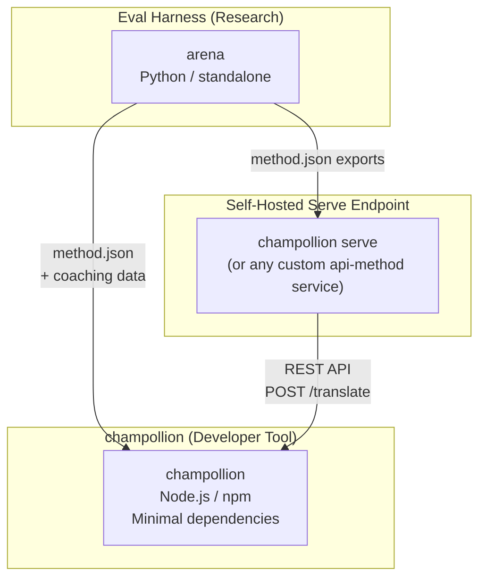
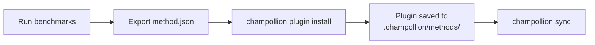
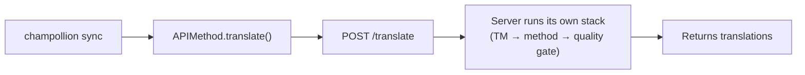
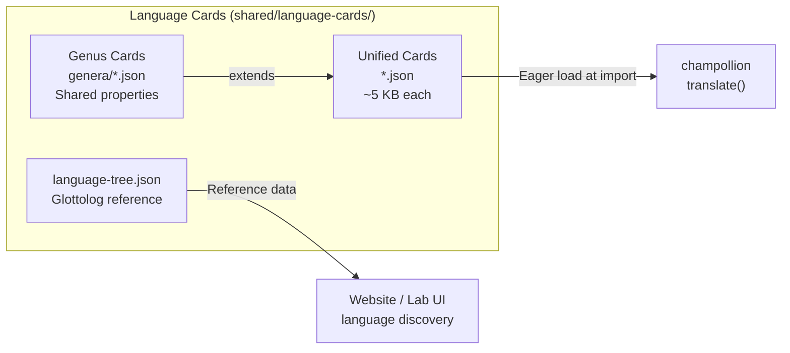

# Architektur

Das Champollion-Übersetzungsökosystem besteht aus drei unabhängigen Tools, die über klar definierte Verträge zusammenarbeiten. Keines von ihnen ist zur Build-Zeit von einem anderen abhängig. Sie kommunizieren über ein gemeinsames **Method-Plugin-Format** und einen **REST-API-Vertrag**.

## Die drei Bestandteile



### champollion (dieses Projekt)

Das im Quelltext verfügbare Entwicklertool (kostenlos für die nicht-kommerzielle Nutzung). Übersetzt Lokalisierungsdateien mithilfe von austauschbaren Methoden. Minimale Abhängigkeiten, optionale Konfiguration, sofort einsatzbereit.

**Integrierte Methoden:**
- `llm` → OpenRouter / beliebiges LLM (200+ Modelle)
- `llm-coached` → LLM + Grammatik-/Wörterbuch-Coaching
- `openai` → Direkte OpenAI-API (GPT-4o, GPT-4o-mini)
- `anthropic` → Direkte Anthropic-API (Claude Sonnet, Haiku, Opus)
- `gemini` → Direkte Google-Gemini-API (Flash, Pro — kostenlose Stufe verfügbar)
- `google-translate` → Google Cloud Translation API v2
- `deepl` → DeepL-API mit Glossar-Unterstützung
- `microsoft-translator` → Azure Cognitive Services Translator
- `libretranslate` → Selbst gehostetes LibreTranslate (AGPL, kostenlos)
- `api` → Schlanke Weiterleitung an einen beliebigen entfernten REST-Endpunkt

### Eval Harness (Begleitprojekt)

Ein Forschungs-Tool zum Entwickeln, Testen und Benchmarken von Übersetzungsmethoden. Wenn eine Methode eine akzeptable Qualität erreicht, exportiert das Harness ein **Method-Plugin** — ein `method.json`-Manifest sowie optionale Coaching-Datendateien.

Das Harness läuft niemals innerhalb von champollion. Es ist ein separates Tool, das statische Ausgaben (JSON-Dateien) erzeugt. Champollion liest lediglich diese Dateien.

[→ Eval Harness auf GitHub](https://github.com/gamedaysuits/Champollion)

### Selbst gehosteter Serve-Endpunkt (`champollion serve`)

Jedes Champollion-Projekt kann seinen eigenen konfigurierten Übersetzungs-Stack über HTTP mit einem einzigen Befehl bereitstellen — [`champollion serve`](/docs/guides/serving-a-method#the-zero-code-path-champollion-serve) — und jedes andere Projekt kann ihn über die Methode `api` nutzen. Die Prompts, Coaching-Daten, das Translation Memory und die Anbieter-Schlüssel verbleiben auf der Infrastruktur des Eigentümers; Nutzer senden lediglich Quellzeichenfolgen und erhalten Übersetzungen. Pipelines, die vollständig außerhalb von Champollion existieren (eine FST-Kette, ein Forschungssystem), können denselben Schnittstellenvertrag wie ein [benutzerdefinierter Dienst](/docs/guides/serving-a-method) implementieren. Es gibt keinen gehosteten Champollion-Dienst — die Bereitstellung ist konzeptionsgemäß immer selbst gehostet.

## Wie sie miteinander verbunden sind

### Eval Harness → champollion (einseitiger Export)



**Vertrag**: [Plugin-Spezifikation](/docs/reference/plugin-spec)

### Serve-Endpunkt → champollion (API zur Laufzeit)



Champollions `APIMethod` ist eine **reine Weiterleitung**. Es sendet Schlüssel hinaus und empfängt Übersetzungen zurück. Es enthält keinerlei Übersetzungslogik und keinerlei proprietäre Inhalte.

## Was jeder Bestandteil über die anderen weiß

| Tool | Kennt champollion? | Kennt einen Serve-Endpunkt? | Kennt Harness? |
|------|---------------------|-------------------------------|---------------------|
| **champollion** | *(ist champollion)* | Ja — die Methode `api` ruft ihn auf | Nein — liest nur Plugin-Exporte |
| **Serve-Endpunkt** | Ja — bedient dessen Anfragen | *(ist der Serve-Endpunkt)* | Nein — installiert exportierte Methoden wie jedes andere Projekt |
| **Eval Harness** | Ja — exportiert das Plugin-Format | Nein — Methoden werden separat bereitgestellt | *(ist das Harness)* |

## Nutzungsszenarien

### Szenario 1: Kostenlos, ohne Konfiguration (die meisten Nutzer)

```bash
export OPENROUTER_API_KEY=sk-...
npx champollion sync
```

Verwendet die integrierte Methode `llm`. Keine Plugins, kein Server, kein Harness.

### Szenario 2: Google-Translate-Basislinie

```bash
export GOOGLE_TRANSLATE_API_KEY=AIza...
npx champollion sync
```

Verwendet die integrierte `google-translate`-Methode. Keine Plugins erforderlich.

### Szenario 3: Offenes Plugin mit gebündeltem Coaching

```bash
champollion plugin install ./french-formal-v1/
champollion sync
```

Das Plugin verfügt über `type: "llm-coached"` → champollion verwendet den eigenen OpenRouter-Schlüssel des Nutzers. Die Coaching-Daten sind lokal (kein Serveraufruf).

### Szenario 4: Eigenes Coaching (kein Plugin, kein Harness)

```json title="champollion.config.json"
{
  "pairs": {
    "en:fr": { "method": "llm-coached" }
  }
}
```

Der Nutzer pflegt seine eigenen Grammatikregeln und sein Wörterbuch in `.champollion/coaching/fr.json`.

### Szenario 5: Den bereitgestellten Stack eines anderen Projekts nutzen

```bash
champollion plugin install ./their-project-serve/   # manifest from `champollion serve --emit-manifest`
CHAMPOLLION_API_KEY=<their bearer token> champollion sync
```

Die Methode `api` des Paares sendet Quellzeichenfolgen per POST an ihren selbst gehosteten [`champollion serve`](/docs/guides/serving-a-method#the-zero-code-path-champollion-serve)-Endpunkt; deren Stack (Coaching, TM, Quality Gate) übernimmt die Übersetzung.

## Language Cards

Jede Sprache in champollion wird über eine **Language Card** konfiguriert — eine einheitliche JSON-Datei, die Register-Voreinstellungen, Formalitätsregeln, Kennzeichen zur Methodenunterstützung, Typografiekonventionen, genealogische Klassifikation und linguistische Referenzdaten enthält.



Cards werden beim Import unmittelbar geladen. Jede Card enthält alle Metadaten, die die Übersetzungs-Engine und die Entwicklerdokumentation benötigen — es gibt keine separate Referenzebene. Cards werden aus maßgeblichen Quellen (IANA, CLDR, [Glottolog](https://glottolog.org), [WALS](https://wals.info)) mithilfe von `scripts/generate-language-card.mjs` und `scripts/build-language-tree.mjs` generiert und anschließend zur Sicherstellung der linguistischen Korrektheit von Menschen kuratiert.

## Designprinzipien

1. **Keine zirkulären Abhängigkeiten.** Die Brücken sind Einbahnstraßen.
2. **Champollion ist der leichtgewichtige Kern.** Minimale Abhängigkeiten, optionale Konfiguration. Plugins und API sind additiv.
3. **IP-Schutz ist architektonisch verankert.** Proprietäre Techniken verbleiben auf der bereitstellenden Seite — wer den Endpunkt betreibt, behält seine Prompts, sein Coaching und seine Schlüssel. Das npm-Paket liefert nichts Proprietäres aus.
4. **Das Plugin-Format ist der Vertrag.** Alles fließt durch `method.json`.
5. **Jedes Tool hat eine Aufgabe.** Harness → Methoden entwickeln. `champollion serve` → Methoden hosten. Champollion → Dateien übersetzen.

---

## Siehe auch

- [Übersetzungsmethoden](/docs/guides/translation-methods) — wie jede integrierte Methode funktioniert
- [Plugin-Spezifikation](/docs/reference/plugin-spec) — das Format des method.json-Manifests
- [Eval Harness](/docs/network/specifications/harness) — das begleitende Forschungs-Tool
- [Eine Methode über die API bereitstellen](/docs/guides/serving-a-method) — Hosting benutzerdefinierter Übersetzungs-Pipelines
- [Eine ressourcenarme Sprache unterstützen](/docs/network/community/low-resource-languages) — der Anwendungsfall, der diese Architektur vorangetrieben hat
