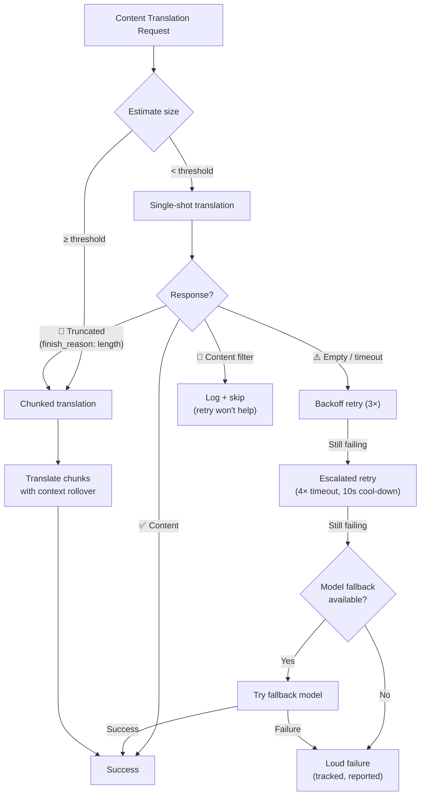

# Resilienz der Inhaltsübersetzung

Die Pipeline zur Inhaltsübersetzung von Champollion (Markdown-/MDX-Dokumente) nutzt ein mehrschichtiges Resilienzsystem, um Fehler kontrolliert zu behandeln. Anders als bei der Schlüssel-Wert-Übersetzung — bei der jeder Stapel klein und Wiederholungen kostengünstig sind — umfasst die Inhaltsübersetzung große Prompts und lange Ausgaben, die aus strukturellen und nicht nur aus vorübergehenden Gründen fehlschlagen können.

## Das Problem

Die Inhaltsübersetzung weist grundlegend andere Fehlermodi auf als die Schlüssel-Wert-Übersetzung:

| Fehlermodus | Schlüssel-Wert | Inhalt |
|---|---|---|
| Rate-Limit (429) | Häufig, vorübergehend | Häufig, vorübergehend |
| Timeout | Selten (kleine Stapel) | Häufig (lange Ausgabe) |
| Leere Antwort | Selten | Häufig (Ausgabelimits, Filter) |
| Ausgabeabschneidung | Nicht zutreffend (JSON validiert) | Geschieht stillschweigend |
| Inhaltsfilter | Äußerst selten | Möglich (CLI-Dokumentation, Sicherheitsdokumentation) |
| Modellbeschränkung | Wiederholung behebt es | Wiederholung behebt es nicht |

Die wesentliche Erkenntnis: **Die Wiederholung derselben fehlschlagenden Anfrage ist keine Redundanz, sondern Sturheit.** Ein angemessenes Resilienzsystem ermittelt, *warum* etwas fehlgeschlagen ist, und passt seinen Ansatz entsprechend an.

## Architekturüberblick



## Schicht 1: Diagnoseorientierte Wiederholung

Bevor entschieden wird, *wie* eine Wiederholung erfolgen soll, untersucht das System die API-Antwort, um zu verstehen, *was* fehlgeschlagen ist.

### Analyse des Abschlussgrunds

Jede LLM-API gibt neben dem generierten Text einen `finish_reason` zurück. Champollion nutzt diesen, um intelligente Wiederholungsentscheidungen zu treffen:

| `finish_reason` | Bedeutung | Aktion |
|---|---|---|
| `stop` + Inhalt | Modell normal abgeschlossen | ✅ Ergebnis akzeptieren |
| `stop` + leer | Modell hat nichts generiert | ⚠️ Dieselbe Anfrage wiederholen (vorübergehend) |
| `length` | Ausgabe hat Token-Limit erreicht | 🔶 Dokument automatisch aufteilen |
| `content_filter` | Sicherheitsfilter hat Ausgabe blockiert | 🔴 Protokollieren und überspringen (Wiederholung hilft nicht) |
| `null` / fehlend | Fehlerhafte Antwort | ⚠️ Dieselbe Anfrage wiederholen (vorübergehend) |

Dies ersetzt den aktuellen Ansatz, jeden Fehler identisch mit Backoff-Wiederholungen zu behandeln.

### Wiederholungsbudget

Das Standard-Wiederholungsbudget für vorübergehende Fehler:

| Runde | Versuche | Timeout | Backoff |
|---|---|---|---|
| Standard | 4 (0→3) | 60s | 1s → 2s → 4s |
| Eskaliert | 4 (0→3) | 120s | 1s → 2s → 4s |
| **Gesamt** | **8** | — | **~3,5 Min. im schlimmsten Fall** |

Zwischen den Runden ermöglicht eine 10-sekündige Abkühlphase die Behebung vorübergehender Probleme.

## Schicht 2: Inhaltsaufteilung

Wenn ein Dokument einen Größenschwellenwert überschreitet — oder wenn Schicht 1 eine Ausgabeabschneidung signalisiert — teilt das System das Dokument in übersetzungsgerechte Abschnitte auf.

Siehe [Context Rollover](/docs/concepts/context-rollover#content-chunking) für eine detaillierte Konfiguration der Aufteilung. Die wesentlichen Punkte:

### Aufteilungsstrategie

1. **Überschriftengrenzen** — `##` und `###` sind natürliche Grenzen für Übersetzungseinheiten. Jeder Abschnitt ist hinreichend in sich abgeschlossen, um unabhängig übersetzt zu werden.
2. **Absatz-Fallback** — wenn ein einzelner Überschriftenabschnitt die Aufteilungsgröße überschreitet, wird an doppelten Zeilenumbrüchen aufgeteilt.
3. **Harte Aufteilung** — letztes Mittel für äußerst lange Absätze (z. B. Tabellen). Aufteilung an Satzgrenzen.

### Kontext zwischen Abschnitten

Jeder Abschnitt erhält die letzten 2–3 Absätze der *Übersetzung des vorherigen Abschnitts* als Kontext. Dies verhindert:
- **Terminologie-Abweichung** — das Modell sieht, was es im vorherigen Abschnitt „tableau de bord" genannt hat
- **Pronomenauflösung** — Bezugswörter aus dem vorherigen Abschnitt werden übernommen
- **Registerkonsistenz** — der in Abschnitt 1 etablierte Ton bleibt bis Abschnitt N bestehen

### Auslöser für automatische Aufteilung

| Auslöser | Verhalten |
|---|---|
| `contentChunkSize` in Konfiguration gesetzt | Dokumente, die diese Größe überschreiten, stets aufteilen |
| `finish_reason: "length"` zurückgegeben | Automatische Aufteilung als Fallback (auch ohne Konfiguration) |
| Eingabe > ~12 KB (automatische Erkennung) | Vorschlag protokollieren, aber nicht erzwingen |

## Schicht 3: Modell-Fallback-Kette

Wenn das konfigurierte Modell konstant fehlschlägt — nicht vorübergehend, sondern strukturell — versucht das System alternative Modelle. Verschiedene Modelle verfügen über unterschiedliche Kontextfenster, Ausgabelimits, Sicherheitsfilter und mehrsprachige Stärken.

### Standard-Fallback-Kette

```json title="champollion.config.json"
{
  "contentFallbackChain": [
    "google/gemini-2.5-flash",
    "anthropic/claude-sonnet-4"
  ]
}
```

Das konfigurierte Modell wird stets zuerst versucht. Fallback-Modelle werden erst nach Erschöpfung aller Wiederholungsrunden (Standard + eskaliert) verwendet.

### Warum mehrere Architekturen

| Szenario | Primärmodell schlägt fehl | Fallback-Modell ist erfolgreich |
|---|---|---|
| Vietnamesische CLI-Dokumentation | Gemini gibt leer zurück | Claude bewältigt es problemlos |
| Sicherheitsgefilterte Inhalte | OpenAI blockiert es | Gemini hat andere Filterschwellenwerte |
| Lange strukturierte Tabellen | Modell A schneidet ab | Modell B hat ein größeres Ausgabefenster |

Der Wert des Fallbacks liegt in der architektonischen Vielfalt — verschiedene Modellfamilien haben unterschiedliche Fehlermodi. Ein Fehler, der für ein Modell strukturell bedingt ist, kann für ein anderes trivial sein.

### Geltungsbereich

> Der Modell-Fallback gilt **nur für Inhalte**. Schlüssel-Wert-Stapel sind klein und schlagen fast nie strukturell fehl. Das Hinzufügen von Fallback-Komplexität an dieser Stelle wäre Over-Engineering.

## Schicht 4: Fehlerabrechnung

Wenn Fehler auftreten, verfolgt und meldet das System diese ordnungsgemäß, anstatt stillschweigend fortzufahren.

### Während der Synchronisierung

- Fehlgeschlagene Elemente zeigen `[FAIL]` in der Fortschrittsausgabe an
- Jeder Fehler protokolliert den konkreten Grund (Timeout, leere Antwort, Inhaltsfilter, Abschneidung)
- Abgeschlossene Elemente werden sofort im Manifest gespeichert (inkrementelle Persistenz)

### Nach der Synchronisierung

Am Ende wird eine Fehlerzusammenfassung ausgegeben:

```
  ┌─ Content Translation Failures ─────────────────────────────────────┐
  │                                                                     │
  │  2 of 24 content translations failed:                              │
  │                                                                     │
  │  ✗ docs/reference/cli.md → vi                                      │
  │    Reason: empty response after 8 attempts + 1 fallback model      │
  │    Models tried: google/gemini-3.1-pro-preview, gemini-2.5-flash   │
  │                                                                     │
  │  ✗ docs/guides/troubleshooting.md → ar                             │
  │    Reason: content_filter (no retry — blocked by safety filter)    │
  │                                                                     │
  │  Re-run: npx champollion@latest sync                              │
  │  (22 completed translations are cached and won't re-run)           │
  └─────────────────────────────────────────────────────────────────────┘
```

### Wiederholungs-Manifest

Fehlgeschlagene Dateien werden in `.champollion-retry.json` geschrieben:

```json
{
  "failedAt": "2026-05-27T21:45:00Z",
  "files": [
    {
      "source": "docs/reference/cli.md",
      "locale": "vi",
      "reason": "empty_response",
      "attempts": 8,
      "modelsTried": ["google/gemini-3.1-pro-preview", "google/gemini-2.5-flash"]
    }
  ]
}
```

Beim nächsten `sync`-Durchlauf werden nur diese Dateien erneut verarbeitet. Abgeschlossene Dateien werden über das Content-Hash-Manifest (`.champollion-content.lock`) bewahrt.

### Exit-Codes

| Code | Bedeutung |
|---|---|
| 0 | Alle Übersetzungen erfolgreich |
| 1 | Konfigurationsfehler, fehlender API-Schlüssel usw. |
| 2 | Teilweiser Fehler — einige Inhaltsübersetzungen sind fehlgeschlagen |

## Konfiguration

```json title="champollion.config.json"
{
  "contentChunkSize": 4000,
  "contentOverlap": 200,
  "contentFallbackChain": [
    "google/gemini-2.5-flash",
    "anthropic/claude-sonnet-4"
  ]
}
```

| Feld | Typ | Standard | Beschreibung |
|---|---|---|---|
| `contentChunkSize` | `number \| null` | `null` | Maximale Token pro Inhaltsabschnitt. `null` = keine Aufteilung (automatische Aufteilung nur bei Abschneidung) |
| `contentOverlap` | `number` | `200` | Überlappende Token zwischen Inhaltsabschnitten zur Kontextkontinuität |
| `contentFallbackChain` | `string[]` | `[]` | Fallback-Modelle, die versucht werden, wenn das konfigurierte Modell strukturell fehlschlägt |

## Implementierungsstatus

| Funktion | Status |
|---|---|
| Diagnoseorientierte Wiederholung (finish_reason-Parsing) | 🔲 Geplant |
| Inhaltsaufteilung (Aufteilung nach Überschrift/Absatz) | 🔲 Geplant |
| Kontextübertragung zwischen Abschnitten | 🔲 Geplant |
| Modell-Fallback-Kette | 🔲 Geplant |
| Fehlerzusammenfassungsbericht | 🔲 Geplant |
| Wiederholungs-Manifest (.champollion-retry.json) | 🔲 Geplant |
| Exit-Code 2 für teilweise Fehler | 🔲 Geplant |
| Eskalationswiederholung (verlängerter Timeout) | ✅ Implementiert (v3.3.3) |
| Wiederholungsmeldungen mit Versuchsnummer | ✅ Implementiert (v3.3.3) |
| Lautstarke Fehlermeldung bei Inhaltsfehlern | ✅ Implementiert (v3.3.3) |

## Siehe auch

- [Context Rollover](/docs/concepts/context-rollover) — Stapelkonsistenz und Konfiguration der Inhaltsaufteilung
- [How Sync Works](/docs/concepts/how-sync-works) — die vollständige Synchronisierungs-Pipeline
- [Translation Methods](/docs/guides/translation-methods) — verfügbare Methoden und ihre Eigenschaften
