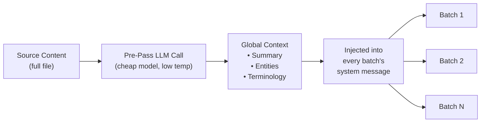

# Context Rollover Batching

Context Rollover ist eine Funktion zur Sicherstellung der Übersetzungskonsistenz auf Dokumentebene, die ein Fenster vorheriger Übersetzungen in nachfolgende Batches überträgt und dem LLM somit ein „Kurzzeitgedächtnis" über Batch-Grenzen hinweg verleiht.

## Warum es diese Funktion gibt

Beim Übersetzen großer Dateien (100+ Schlüssel oder lange Markdown-Dokumente) teilt champollion die Arbeit in Batches auf. Ohne Rollover wird jeder Batch unabhängig übersetzt — das LLM hat keine Erinnerung daran, was es im vorherigen Batch übersetzt hat. Dies führt zu:

- **Terminologie-Drift**: Derselbe englische Begriff wird über Batches hinweg unterschiedlich übersetzt (z. B. „dashboard" → „tableau de bord" in Batch 1, „panneau" in Batch 3)
- **Koreferenzfehler**: Pronomen und Verweise, die sich über Batch-Grenzen erstrecken, verlieren ihren Bezugspunkt
- **Register-Inkonsistenz**: Der Ton kann zwischen den Batches wechseln (formell → informell → formell)

Dies ist ein gut dokumentiertes Problem in der MT-Literatur. Der Sliding-Window-Ansatz wird durch Forschung im Bereich der maschinellen Übersetzung auf Dokumentebene bestätigt (ACL, WMT-Workshops).

## Funktionsweise

### Das Sliding Window

Wenn `contextRollover` aktiviert ist, verwaltet die Übersetzungspipeline ein Fenster kürzlich übersetzter Schlüssel-Wert-Paare. Nach Abschluss jedes Batches wird ein Teil seiner Ausgabe (Standard: 20 % von `batchSize`) als „Referenzübersetzungen" in den Prompt des nächsten Batches übertragen.

```
Batch 1: Translate keys 1-80         → LLM sees: system prompt + keys 1-80
Batch 2: Translate keys 81-160       → LLM sees: system prompt + [16 reference translations from batch 1] + keys 81-160
Batch 3: Translate keys 161-240      → LLM sees: system prompt + [16 reference translations from batch 2] + keys 161-240
```

Die Referenzübersetzungen werden mit einer eindeutigen Kennzeichnung in die Benutzernachricht eingefügt:

```
--- Previous translations for context (do NOT re-translate these) ---
"nav.dashboard": "Tableau de bord"
"nav.settings": "Paramètres"
"header.welcome": "Bienvenue sur la plateforme"
---

{
  "content.main_heading": "Getting Started with Your Dashboard",
  ...
}
```

### Auswahlstrategie

Zwei Modi zur Auswahl der zu übertragenden Übersetzungen:

| Strategie | Verhalten | Am besten geeignet für |
|----------|----------|----------|
| `tail` (Standard) | Letzte N Übersetzungen aus dem vorherigen Batch | Sequenzielle Dokumente, Markdown-Inhalte |
| `diverse` | Wählt Einträge aus, die verschiedene Schlüsseltypen abdecken (Schaltflächen, Überschriften, Beschreibungen) | Große JSON-Dateien mit gemischten UI-Elementtypen |

### Token-Budget

Das Rollover-Fenster verbraucht Eingabe-Tokens. Champollion berechnet die ungefähren Token-Kosten und gibt eine Warnung aus, wenn das Fenster 15 % des geschätzten Kontextfensters des Modells überschreitet. Die Warnung enthält einen Reduktionsvorschlag:

```
[WARN] Rollover window is ~2400 tokens (18% of model context).
       Consider reducing rolloverSize to 0.15 or lowering batchSize.
```

## Global Context Pre-Pass

Ein optionaler erster LLM-Aufruf, der **vor** Beginn der Übersetzung ausgeführt wird. Das LLM analysiert den vollständigen Quellinhalt und erzeugt:

1. **Dokumentzusammenfassung** — Beschreibung in 2–3 Sätzen, was übersetzt wird
2. **Benannte Entitäten** — Produktnamen, Fachbegriffe und Eigennamen mit vorgeschlagener Behandlung
3. **Liste zur Terminologiekonsistenz** — Schlüsselbegriffe, die das LLM als konsistent zu übersetzen identifiziert hat

Dieser globale Kontext wird in die **Systemnachricht** jedes Batches eingefügt und gibt jedem Batch Kenntnis vom gesamten Dokument, obwohl er nur einen Ausschnitt sieht.



### Pre-Pass-Modell

Die Extraktion des globalen Kontexts verwendet einen separaten, kostengünstigen LLM-Aufruf (Standard: `google/gemini-3.5-flash` bei Temperatur 0.1) unabhängig vom konfigurierten Übersetzungsmodell des Benutzers. Dies ist eine Metadaten-Extraktionsaufgabe, keine Übersetzungsaufgabe — Geschwindigkeit und Kosten sind wichtiger als kreative Ausgabe.

## Content Chunking {#content-chunking}

Bei langen Markdown-Dokumenten (Inhaltsübersetzung) kann der Textkörper das effektive Kontextfenster des LLM überschreiten, oder das Modell kürzt seine Ausgabe. Content Chunking teilt das Dokument in überlappende Segmente auf, die jeweils unabhängig übersetzt und anschließend wieder zusammengesetzt werden.

### Aufteilungsstrategie

Das Chunking folgt einer Prioritätskaskade — es versucht zuerst den semantisch sinnvollsten Aufteilungspunkt:

1. **Überschriftengrenzen** — `##`- und `###`-Markierungen erzeugen natürliche Übersetzungseinheiten. Jeder Abschnitt ist eigenständig genug für eine unabhängige Übersetzung, und Überschriften geben dem LLM strukturellen Kontext darüber, was es übersetzt.
2. **Absatzgrenzen** — wenn ein einzelner Überschriftenabschnitt die Chunk-Größe überschreitet, wird an doppelten Zeilenumbrüchen (`\n\n`) aufgeteilt. Absätze sind die nächstbeste Grenze, da sie vollständige Gedanken darstellen.
3. **Satzgrenzen** — letztes Mittel bei extrem langen Absätzen (z. B. große Tabellen, dichte Prosa). Aufteilung an Punkt-Leerzeichen-Grenzen unter Berücksichtigung von Abkürzungen.

Geschützte Blöcke (Code-Fences, Shortcodes — siehe [Wie Sync funktioniert](/docs/concepts/how-sync-works)) werden niemals über Chunks hinweg getrennt. Würde ein geschützter Block durchtrennt, verschiebt sich der Aufteilungspunkt davor oder danach.

### Auto-Chunking-Auslöser

Chunking wird auf zwei Arten aktiviert:

| Auslöser | Verhalten |
|---------|----------|
| `contentChunkSize` in der Konfiguration gesetzt | Teilt proaktiv alle Dokumente auf, die diese Token-Anzahl überschreiten |
| Modell gibt `finish_reason: "length"` zurück | Auto-Chunking als Fallback, auch ohne Konfiguration |

Der Fallback-Auslöser bedeutet, dass Chunking auch dann als Sicherheitsnetz funktioniert, wenn Sie es nicht konfigurieren — wenn das Modell die Ausgabe kürzt, versucht champollion es automatisch erneut mit Chunks.

### Konfiguration

- **`contentChunkSize`**: Maximale Tokens pro Chunk (Standard: null = vollständigen Textkörper senden; setzen Sie z. B. 4000 für lange Dokumente)
- **`contentOverlap`**: Überlappung in Tokens zwischen Chunks (Standard: 200). Die Überlappung sorgt für reibungslose Übergänge an den Chunk-Grenzen.

Wenn Chunking aktiv ist, wird Context Rollover automatisch zwischen Chunks angewendet — die übersetzte Ausgabe des letzten Absatzes des vorherigen Chunks wird dem Prompt des nächsten Chunks vorangestellt.

```json title="champollion.config.json"
{
  "contentChunkSize": 4000,
  "contentOverlap": 200
}
```

> Für das vollständige Resilienzsystem der Inhaltsübersetzung (diagnostischer Retry, Modell-Fallback, Fehlererfassung) siehe [Content Resilience](/docs/concepts/content-resilience).

## Konfiguration

### Schnellstart

```json title="champollion.config.json"
{
  "contextRollover": true,
  "globalContext": true,
  "contentChunkSize": 4000,
  "contentOverlap": 200
}
```

### Vollständige Optionen

```json title="champollion.config.json (advanced)"
{
  "contextRollover": {
    "size": 0.2,
    "strategy": "tail",
    "maxTokens": null
  },
  "globalContext": {
    "model": "google/gemini-3.5-flash",
    "maxEntities": 20,
    "temperature": 0.1
  },
  "contentChunkSize": 4000,
  "contentOverlap": 200,
  "contentFallbackChain": [
    "google/gemini-2.5-flash",
    "anthropic/claude-sonnet-4"
  ]
}
```

| Feld | Typ | Standard | Beschreibung |
|-------|------|---------|-------------|
| `contextRollover` | `boolean \| object` | `false` | Sliding-Window-Rollover aktivieren |
| `contextRollover.size` | `number` | `0.2` | Anteil von `batchSize`, der übertragen wird (0.0–1.0) |
| `contextRollover.strategy` | `string` | `"tail"` | Auswahlstrategie: `"tail"` oder `"diverse"` |
| `contextRollover.maxTokens` | `number \| null` | `null` | Hartes Limit für das Rollover-Token-Budget |
| `globalContext` | `boolean \| object` | `false` | Global Context Pre-Pass aktivieren |
| `globalContext.model` | `string` | `"google/gemini-3.5-flash"` | Modell für den Pre-Pass-Aufruf |
| `globalContext.maxEntities` | `number` | `20` | Maximale Anzahl zu extrahierender benannter Entitäten |
| `globalContext.temperature` | `number` | `0.1` | Temperatur für den Pre-Pass-Aufruf |
| `contentChunkSize` | `number \| null` | `null` | Maximale Tokens pro Content-Chunk (null = kein Chunking) |
| `contentOverlap` | `number` | `200` | Überlappungs-Tokens zwischen Content-Chunks |
| `contentFallbackChain` | `string[]` | `[]` | Fallback-Modelle für die Inhaltsübersetzung, wenn das konfigurierte Modell strukturell versagt |

## Wann sollte sie verwendet werden

| Szenario | Empfehlung |
|----------|---------------|
| Kleine JSON-Dateien (< 50 Schlüssel) | Nicht erforderlich — einzelner Batch, keine Grenzprobleme |
| Große JSON-Dateien (100+ Schlüssel) | `contextRollover` für Terminologiekonsistenz aktivieren |
| Lange Markdown-Dokumente | `contextRollover` + `contentChunkSize` + `globalContext` aktivieren |
| Technische Dokumentation | `globalContext` für Entitätsextraktion aktivieren |
| UI-Strings mit gemischtem Register | `contextRollover` mit `strategy: "diverse"` verwenden |

## Implementierungsstatus

| Funktion | Status |
|---------|--------|
| Sliding-Window-Rollover (Schlüssel-Wert) | 🔲 Geplant |
| Sliding-Window-Rollover (Inhalt) | 🔲 Geplant |
| Global Context Pre-Pass | 🔲 Geplant |
| Content Chunking | 🔲 Geplant |
| Auto-Chunking bei Kürzung | 🔲 Geplant |
| `diverse`-Auswahlstrategie | 🔲 Geplant |

## Literatur

Diese Funktion basiert auf veröffentlichter Forschung zur maschinellen Übersetzung auf Dokumentebene:

- **Sliding-Window-Ansatz**: Bestätigt zur Verbesserung von BLEU-, chrF- und COMET-Werten bei der Verwendung von LLMs für Übersetzungen (ACL-Workshops 2023–2025 zur Dokument-MT)
- **Multi-Knowledge-Fusion**: Das Einfügen von Dokumentzusammenfassungen und Entitätslisten als globaler Kontext verbessert die Terminologiekonsistenz über lange Dokumente hinweg
- **Context-Aware Prompting (CAP)**: Auswahl relevanten Kontexts über Attention-Scores oder semantische Ähnlichkeit für In-Context-Learning

## Siehe auch

- [Content Resilience](/docs/concepts/content-resilience) — diagnostischer Retry, Modell-Fallback und Fehlererfassung
- [Wie Sync funktioniert](/docs/concepts/how-sync-works) — die Batch-Pipeline, die durch Rollover ergänzt wird
- [Coaching-Daten](/docs/concepts/coaching-data) — ergänzende Funktion für die Einbindung von Grammatik/Wörterbuch
- [Translation Memory](/docs/concepts/translation-memory) — der TM-Cache, der zusammen mit Rollover funktioniert
