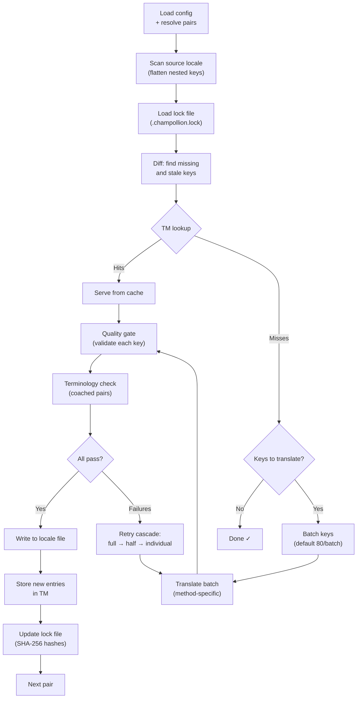

# Wie die Synchronisierung funktioniert

Der Befehl `sync` ist die zentrale Operation von champollion. Im Folgenden wird beschrieben, was bei der Ausführung von `npx champollion sync` geschieht.

## Überblick über die Pipeline



## Schritt für Schritt

### 1. Auflösung der Konfiguration

Champollion lädt `champollion.config.json` (oder ermittelt die Einstellungen automatisch). Dabei werden aufgelöst:
- Quell-Locale und Ziel-Locales
- Der Paar-Graph (welche Quell→Ziel-Kombinationen verarbeitet werden sollen)
- Methode, Modell und Qualitätseinstellungen je Paar

Vor dem Scannen der Dateien gibt champollion einen Start-Header aus:

```
champollion v0.1.0

[INFO] Detected format: json (auto)
[INFO] Detected framework: Hugo
```

- **Versionsbanner**: Zeigt die installierte Version zur Fehlersuche und für Problemberichte an.
- **Formaterkennung**: Meldet das Dateiformat und ob es automatisch erkannt `(auto)` oder explizit konfiguriert `(config)` wurde. Unterstützt werden `json`, `toml` und `yaml`.
- **Framework-Erkennung**: Wenn `contentDir` gesetzt ist, identifiziert sie das Framework (`Hugo`), um zu bestätigen, dass die Inhaltssynchronisierung aktiv ist.

### 2. Scannen der Quelle

Die Quell-Locale-Datei wird geladen und zu einer Schlüssel→Wert-Zuordnung abgeflacht:

```json
// Input (nested)
{ "hero": { "title": "Welcome", "subtitle": "Build" } }

// Flattened
{ "hero.title": "Welcome", "hero.subtitle": "Build" }
```

### 3. Änderungserkennung

Champollion liest `.champollion.lock`, worin SHA-256-Hashes der zuvor übersetzten Quellwerte gespeichert sind. Für jeden Schlüssel wird Folgendes geprüft:

| Bedingung | Aktion |
|-----------|--------|
| Schlüssel im Ziel nicht vorhanden | **Übersetzen** |
| Quell-Hash hat sich seit der letzten Synchronisierung geändert | **Neu übersetzen** (veraltet) |
| Zielwert beginnt mit `[EN]` | **Neu übersetzen** (veralteter Fallback-Marker) |
| Quell-Hash unverändert, Schlüssel vorhanden | **Überspringen** |

Aus diesem Grund übersetzt champollion nur das, was sich geändert hat — es übersetzt nicht bei jeder Synchronisierung Ihre gesamte Datei neu.

### 4. Batchverarbeitung

Schlüssel werden in Batches gruppiert (Standard: 80 Schlüssel/Batch für LLM, 128 für Google Translate). Die Batchverarbeitung reduziert die Anzahl der API-Aufrufe, während die Prompts handhabbar bleiben.

Während der Übersetzung zeigt champollion eine Inline-Fortschrittsleiste an, die nach Abschluss jedes Batches aktualisiert wird:

```
[INFO] fr.json — 2,847 missing
     ████████████████░░░░░░░░░░░░░░░░ 1,440/2,847 keys
```

Die Leiste wird mithilfe des Wagenrücklaufs `\r` für In-Place-Aktualisierungen gerendert — kein Scrollen. In den Modi `--quiet` und `--json` unterdrückt.

### 4b. Translation Memory

Vor der Batchverarbeitung prüft champollion den Translation-Memory-Cache (`.champollion/tm.json`). Schlüssel, deren Quelltext + Locale + Methode mit einer früheren Übersetzung übereinstimmen, werden sofort aus dem Cache bereitgestellt — ohne API-Aufruf.

```
  [TM] 142 key(s) served from cache
  Translating 3 key(s) to French (llm)... [OK]
```

TM ist der primäre Mechanismus zur Kostenersparnis. Eine erneute Ausführung der Synchronisierung nach einer einzelnen Schlüsseländerung übersetzt nur diesen einen Schlüssel und nicht die gesamte Datei. Weitere Einzelheiten finden Sie unter [Translation Memory](/docs/concepts/translation-memory).

Um den Cache für eine einzelne Ausführung zu umgehen: `champollion sync --no-tm`

### 5. Übersetzung

Jeder Batch wird an die konfigurierte Übersetzungsmethode gesendet:

- **`llm`**: Strukturierter Prompt an OpenRouter mit Anweisungen zu Register und geschlechtsspezifischer Ansprache
- **`llm-coached`**: Dasselbe, jedoch mit eingefügten Grammatikregeln, Wörterbuch und Stilhinweisen
- **`google-translate`**: Batch-Anfrage an die Google Cloud Translation API v2
- **`api`**: HTTP-POST an einen Remote-Endpunkt

Die Systemnachricht (Register, geschlechtsspezifische Ansprache, Regeln) ist für eine bestimmte Locale über alle Batches hinweg identisch, was **Prompt-Caching** ermöglicht — Anbieter wie Anthropic und Google cachen wiederholte Systemnachrichten und senken so die Token-Kosten.

### 6. Qualitätsprüfung

Jede Übersetzung wird validiert, bevor sie auf die Festplatte geschrieben wird. Fünf Prüfungen werden durchgeführt:

| Prüfung | Was sie erkennt | Beispiel |
|-------|----------------|---------|
| **Leer/blank** | Modell hat nichts zurückgegeben | `""` |
| **Quell-Echo** | Modell hat die englische Eingabe zurückgegeben | `"Welcome"` für Japanisch |
| **Halluzinationsschleife** | Wiederholte Trigramme | `"Qo' Qo' Qo' Qo'"` |
| **Längeninflation** | Ausgabe ist 4×+ länger als die Quelle | 10-Zeichen-Quelle → 50-Zeichen-Ausgabe |
| **Schriftkonformität** | Falsche Schrift für die Locale | Lateinischer Text für arabische Locale |

Fehler werden mit dem Präfix `[GATE]` protokolliert. Keine stillen Fallbacks.

Weitere Einzelheiten finden Sie unter [Qualitätsprüfung](/docs/concepts/quality-gate).

### 6b. Terminologieprüfung

Bei gecoachten Paaren mit einem Wörterbuch prüft champollion, ob das LLM die erforderliche Terminologie nach der Übersetzung tatsächlich verwendet hat. Verstöße werden als `[TERM]`-Warnungen protokolliert:

```
[TERM] en→fr: 2 term violation(s)
  • "dashboard" → expected "tableau de bord" but got "panneau"
```

Dies sind Warnungen, keine blockierenden Fehler — die Übersetzung wird dennoch geschrieben.

### 7. Wiederholungskaskade

Bei einem JSON-Parsing-Fehler oder Fehlern auf Batch-Ebene wiederholt champollion den Vorgang mit zunehmend kleineren Batches:

```
Full batch (80 keys) → Failed
  └→ Half batch (40 keys) → 1 failure
      └→ Individual keys (1 each) → Isolates the problem key
```

Das Wiederholungsbudget ist durch `maxRetries` begrenzt (Standard: 3), um unkontrollierte Token-Ausgaben zu verhindern.

### 8. Schreiben & Sperren

Bestandene Übersetzungen werden in die Ziel-Locale-Datei geschrieben, wobei die ursprüngliche Verschachtelungsstruktur erhalten bleibt. Die Sperrdatei wird mit neuen SHA-256-Hashes aktualisiert.

### 9. Verifizierung

Nachdem alle Paare verarbeitet wurden, liest champollion die geschriebenen Locale-Dateien erneut von der Festplatte und führt einen Verifizierungsdurchlauf durch (sofern nicht `--no-verify` gesetzt ist). Dies erkennt die Lücke zwischen einer als erfolgreich gemeldeten Synchronisierung und tatsächlich fehlerhaften Schlüsseln:

- **Schlüsselparität** — alle Quellschlüssel in jedem Ziel vorhanden
- **`[EN]`-Fallback-Marker** — veraltete Marker aus früheren Durchläufen
- **Leere Übersetzungen** — leere Werte, die durchgerutscht sind
- **Schriftkonformität** — nicht-lateinische Locales mit reinen ASCII-Übersetzungen
- **Platzhalter-Erhaltung** — ICU-Platzhalter stimmen mit der Quelle überein
- **Kodierungsprobleme** — BOM-Marker, unsichtbare Zeichen

Dies ist auch als eigenständiger Befehl `champollion verify` für CI-Gates verfügbar.

## Inhaltsübersetzung (Phase 2)

Für Docusaurus- und Hugo-Projekte führt `sync` eine zweite Phase nach der JSON-Schlüsselübersetzung durch. In dieser Phase werden Markdown- und MDX-Dateien (Dokumentation, Blogbeiträge, Tutorials) mit denselben Methoden und derselben Qualitätsprüfung übersetzt.

### Funktionsweise

1. Champollion ermittelt alle Quellinhaltsdateien (`.md`, `.mdx`), indem es das content/docs-Verzeichnis durchläuft
2. Für jedes Datei-×-Locale-Paar prüft es eine separate Inhaltssperrdatei (`.champollion-content.lock`) auf SHA-256-Hash-Änderungen
3. Geänderte oder fehlende Dateien werden in einem flachen Arbeitselement-Pool gesammelt
4. Der Pool wird mit **paralleler Nebenläufigkeit** verarbeitet (Standard: 12 gleichzeitige API-Aufrufe)

```
Phase 2: content (79 translations to process, 341 skipped, concurrency: 48)

    [1/79] (1%)  docs/concepts/security.md → ja [RE-TRANSLATE] (~3328s left)
    [2/79] (3%)  docs/concepts/security.md → th [RE-TRANSLATE] (~1821s left)
    ...
    [79/79] (100%) blog/v3-2-quality.md → de [OK]

  [OK] Created 79 content file(s), 341 unchanged
```

### Parallelität

Sowohl Phase 1 (JSON-Schlüssel) als auch Phase 2 (Inhalt) laufen nun parallel:

- **Phase 1**: Alle Locale-Übersetzungen werden gleichzeitig ausgelöst (Standard: 50 gleichzeitige Locales). Innerhalb jeder Locale laufen auch die API-Batches parallel (4 gleichzeitige Batches). Eine Synchronisierung mit 12 Locales und 120 Schlüsseln wird in etwa 1 Minute statt in etwa 15 Minuten abgeschlossen.
- **Phase 2**: Alle Datei-×-Locale-Kombinationen werden als flacher Pool übersetzt (Standard: 12 gleichzeitige API-Aufrufe). Unterschiedliche Dateien und unterschiedliche Locales werden gleichzeitig übersetzt.

Steuern Sie die Parallelität mit `--json-concurrency`, `--content-concurrency` oder `--concurrency` (setzt beide):

```bash
# Faster JSON sync (more parallel locale translations)
npx champollion sync --json-concurrency 30

# Faster content sync (more parallel API calls)
npx champollion sync --content-concurrency 20

# Slower (gentler on rate limits)
npx champollion sync --concurrency 4
```

### Inhaltsschutz

Während der Übersetzung schützt champollion nicht übersetzbare Inhalte:

- **Codeblöcke** (eingezäunt und eingerückt) werden durch Platzhalter ersetzt
- **Frontmatter**-Felder, die nicht in der Liste `translatableFields` enthalten sind, bleiben unverändert erhalten
- **Links**, Bildpfade und HTML-Tags werden geschützt
- **Shortcodes** und Interpolationsvariablen (z. B. `{count}`, `{{.Params.title}}`) werden geschützt

Nach der Übersetzung werden alle Platzhalter wiederhergestellt und validiert. Sollten welche fehlen oder beschädigt sein, wird die Übersetzung abgelehnt und wiederholt.

## Teilweiser Erfolg

Ein fehlgeschlagener Batch blockiert nicht den Rest. Wenn 9 von 10 Batches erfolgreich sind, werden diese 9 geschrieben. Der fehlgeschlagene Batch wird protokolliert, und Sie können `sync` zur Wiederholung erneut ausführen.

## Probelauf

Sehen Sie sich eine Vorschau der Änderungen an, ohne Dateien zu schreiben:

```bash
npx champollion sync --dry-run
```

## Erzwungene Neuübersetzung

Erzwingen Sie die Neuübersetzung bestimmter Schlüssel, auch wenn diese unverändert sind:

```bash
npx champollion sync --force-keys "hero.title,nav.about"
```

## Kostenschätzung

Vor der Übersetzung erstellt champollion einen **Kostenbericht vor der Synchronisierung**, der die geschätzten Kosten je Paar anzeigt. Dies läuft automatisch bei jeder `sync` — Sie sehen ihn, bevor irgendwelche API-Aufrufe erfolgen.

```
╔══════════════════════════════════════════════════════════╗
║  Cost Estimate                                          ║
╠════════════╦═══════╦════════════╦════════════════════════╣
║ Pair       ║ Keys  ║ Est. Cost  ║ Method                 ║
╠════════════╬═══════╬════════════╬════════════════════════╣
║ en → fr    ║   142 ║ $0.07      ║ google-translate       ║
║ en → ja    ║    38 ║   —        ║ llm (model-dependent)  ║
║ en → crk   ║    38 ║   —        ║ llm-coached            ║
╚════════════╩═══════╩════════════╩════════════════════════╝
```

### Was geschätzt wird

Jede Übersetzungsmethode liefert ihre eigene Kostenschätzung:

| Methode | Kostenbasis | Genauigkeit |
|--------|-----------|-----------|
| `google-translate` | Veröffentlichter Tarif von Google (20 $/Million Zeichen) | Genau |
| `llm` | Variiert je nach OpenRouter-Modell | Modellabhängig — siehe [OpenRouter-Preise](https://openrouter.ai/models) |
| `llm-coached` | Wie `llm` zuzüglich Token für den Coaching-Kontext | Modellabhängig |
| `api` | Serverseitig bestimmt | Unbekannt — kann ohne Abfrage des Endpunkts nicht geschätzt werden |

Wenn eine Methode die Kosten nicht bestimmen kann (LLM-Methoden, Remote-APIs), meldet champollion `—`, anstatt zu raten. Verwenden Sie `--dry`, um Kostenschätzungen anzuzeigen, ohne tatsächlich zu übersetzen.

---

## Siehe auch

- [CLI-Referenz — sync](/docs/reference/cli#sync) — Befehlsflags und -optionen
- [Translation Memory](/docs/concepts/translation-memory) — Caching und Kostenersparnis
- [Qualitätsprüfung](/docs/concepts/quality-gate) — wie Übersetzungen validiert werden
- [Übersetzungsmethoden](/docs/guides/translation-methods) — wie die einzelnen Methoden funktionieren
- [Zusammenarbeit mit professionellen Übersetzern](/docs/guides/professional-translators) — XLIFF-Workflow
- [Konfiguration](/docs/getting-started/configuration) — Konfigurationsreferenz
- [CI/CD-Leitfaden](/docs/guides/ci-cd) — Automatisierung von Synchronisierungen in Ihrer Pipeline
