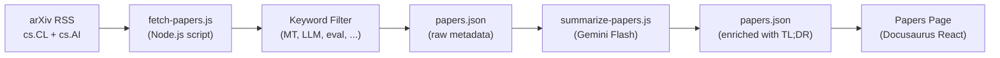

# Forschungspapier-Feed

Champollion pflegt einen kuratierten Feed mit Forschungsarbeiten zu maschineller Übersetzung und NLP von arXiv, gefiltert und zusammengefasst für die Praxis. Der Feed ist halbautomatisiert: Arbeiten werden täglich abgerufen und gefiltert, KI-gestützt zusammengefasst und auf der Website veröffentlicht.

## Warum es ihn gibt

Die Übersetzungspipeline von champollion basiert auf Techniken aus veröffentlichter Forschung — registergesteuertes Prompting, Einspeisung von Coaching-Daten, Context Rollover, Qualitätsprüfungen. Der Papers-Feed erfüllt drei Zwecke:

1. **Transparenz**: Anwender können die Forschung einsehen, die jeder Funktion zugrunde liegt
2. **Entdeckung**: Neue, auf arXiv veröffentlichte Techniken können künftige Funktionen oder Anwenderkonfigurationen beeinflussen
3. **Community**: Positioniert champollion als forschungsbasiertes Werkzeug, nicht nur als weiteren API-Wrapper

## Architektur



### Pipeline-Schritte

#### 1. Abrufen (täglich)

`scripts/fetch-papers.js` fragt die arXiv-Atom-API nach aktuellen Arbeiten in folgenden Kategorien ab:
- `cs.CL` (Computation and Language)
- `cs.AI` (Artificial Intelligence)

Liefert: Titel, Autoren, Abstract, arXiv-ID, PDF-Link, Veröffentlichungsdatum, Kategorien.

#### 2. Filtern

Arbeiten werden nach Schlüsselwortrelevanz gefiltert. Eine Arbeit muss mindestens ein primäres Schlüsselwort enthalten:

**Primäre Schlüsselwörter** (müssen ≥1 entsprechen):
- `machine translation`, `neural machine translation`, `NMT`
- `LLM`, `large language model`
- `multilingual`, `cross-lingual`
- `document-level translation`
- `low-resource language`, `endangered language`
- `translation evaluation`, `BLEU`, `COMET`, `chrF`
- `tokenization`, `morphology`, `polysynthetic`
- `context window`, `sliding window`
- `prompt engineering` (im Übersetzungskontext)

**Boost-Schlüsselwörter** (erhöhen den Relevanzwert):
- `i18n`, `internationalization`, `localization`
- `few-shot`, `in-context learning`
- `terminology`, `glossary`, `consistency`
- `quality estimation`, `hallucination`

#### 3. Zusammenfassen (KI-gestützt)

`scripts/summarize-papers.js` verarbeitet neue (noch nicht zusammengefasste) Arbeiten:

Für jede Arbeit wird das Abstract an Gemini 3.5 Flash gesendet mit:
```
Read this ML research abstract and produce:
1. A 2-sentence TL;DR accessible to a software developer (not a researcher)
2. A single bullet: "Why this matters for MT" — how could this technique
   improve machine translation quality, cost, or speed in production?

Abstract: {abstract}
```

Die Ausgabe wird zusammen mit den Rohmetadaten zurück in `papers.json` gespeichert.

#### 4. Veröffentlichen

Die Docusaurus-Papers-Seite (`website/src/pages/papers.js`) rendert `papers.json` als filterbares, paginiertes Karten-Raster.

Jede Karte zeigt:
- **Titel** (verlinkt mit arXiv)
- **Autoren** (erste 3 + „et al.")
- **Datum** (veröffentlicht oder zuletzt aktualisiert)
- **TL;DR** (KI-generiert)
- **Warum es wichtig ist** (KI-generiert)
- **Kategorien** (arXiv-Tags)
- **PDF-Link**

### Automatisierung

Ein GitHub-Actions-Workflow führt die Pipeline täglich aus:

```yaml title=".github/workflows/fetch-papers.yml"
name: Fetch MT Research Papers
on:
  schedule:
    - cron: '0 6 * * *'  # 06:00 UTC daily
  workflow_dispatch: {}   # Manual trigger

jobs:
  fetch:
    runs-on: ubuntu-latest
    steps:
      - uses: actions/checkout@v4
      - uses: actions/setup-node@v4
        with:
          node-version: 20
      - run: node scripts/fetch-papers.js
      - run: node scripts/summarize-papers.js
        env:
          GEMINI_API_KEY: ${{ secrets.GEMINI_API_KEY }}
      - name: Commit if changed
        run: |
          git config user.name "github-actions[bot]"
          git config user.email "github-actions[bot]@users.noreply.github.com"
          git add website/src/data/papers.json
          git diff --cached --quiet || git commit -m "chore: update research papers feed"
          git push
```

## Datenschema

```typescript
interface Paper {
  id: string;           // arXiv ID (e.g., "2406.12345")
  title: string;
  authors: string[];
  abstract: string;
  published: string;    // ISO date
  updated: string;      // ISO date
  pdfUrl: string;
  categories: string[];
  primaryCategory: string;

  // Computed by filter
  relevanceScore: number;
  matchedKeywords: string[];

  // Computed by summarizer (null until processed)
  tldr: string | null;
  whyItMatters: string | null;
  summarizedAt: string | null;
}
```

## Dateispeicherorte

| Datei | Zweck |
|------|---------|
| `scripts/fetch-papers.js` | arXiv-RSS-Abruf und Schlüsselwortfilter |
| `scripts/summarize-papers.js` | KI-Zusammenfassung über Gemini |
| `website/src/data/papers.json` | Arbeitsdaten (in Repo committet) |
| `website/src/pages/papers.js` | Docusaurus-Seitenkomponente |
| `website/src/pages/papers.module.css` | Seitenstile |
| `.github/workflows/fetch-papers.yml` | Tägliche Automatisierung |

## Implementierungsstatus

| Funktion | Status |
|---------|--------|
| `fetch-papers.js` (arXiv-Abruf + Filter) | 🔲 Geplant |
| `summarize-papers.js` (KI-Zusammenfassung) | 🔲 Geplant |
| Papers-Seite (React-Komponente) | 🔲 Geplant |
| GitHub-Actions-Workflow | 🔲 Geplant |
| Kategorie-/Schlüsselwortfilterung auf der Seite | 🔲 Geplant |
| Paginierung | 🔲 Geplant |

## Siehe auch

- [Architektur](/docs/concepts/architecture) — wie die Komponenten von champollion zusammenhängen
- [Context Rollover](/docs/concepts/context-rollover) — eine Funktion, die direkt von diesem Forschungs-Feed beeinflusst wird
