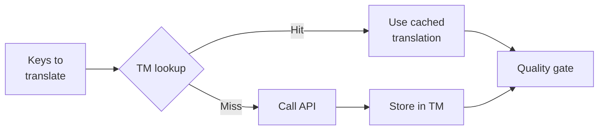

# Translation Memory

Translation Memory (TM) ist die integrierte Caching-Ebene von champollion. Sie speichert jede Übersetzung mit einem Schlüssel aus Quelltext + Locale + Methode, sodass bei einem erneuten Ausführen von `sync` die API nur für Schlüssel aufgerufen wird, die sich tatsächlich geändert haben.

## Warum TM existiert

Ohne TM übersetzt jeder `sync` jeden geänderten Schlüssel erneut – selbst wenn Sie genau denselben englischen Text für dieselbe Locale bereits in einem vorherigen Durchlauf übersetzt haben. Häufige Szenarien, in denen dies Geld verschwendet:

| Szenario | Ohne TM | Mit TM |
|----------|-----------|---------|
| Sync nach 1 Schlüsseländerung erneut ausführen (500 Schlüssel × 10 Locales) | 5.000 API-Aufrufe | 10 API-Aufrufe |
| Einen Schlüssel auf einen vorherigen englischen Wert zurücksetzen | Vollständiger API-Aufruf | Sofortiger Cache-Treffer |
| Dieselbe Phrase erscheint in 3 Locale-Dateien | 3 × API-Aufrufe | 1 API-Aufruf + 2 Cache-Treffer |
| Probelauf → echter Sync | Vollständige API-Aufrufe bei beiden | Erster Durchlauf cacht, zweiter verwendet wieder |

TM ist **standardmäßig aktiviert** und erfordert keine Konfiguration. Übersetzungen werden bei jedem `sync` automatisch gecacht und bei nachfolgenden Durchläufen bereitgestellt.

## Funktionsweise

### Cache-Schlüssel

Jeder TM-Eintrag wird mit einem SHA-256-Hash aus drei Werten verschlüsselt:

```
SHA-256( sourceValue + '\x00' + locale + '\x00' + method )
```

| Komponente | Warum sie im Schlüssel enthalten ist |
|-----------|-------------------|
| `sourceValue` | Anderer englischer Text → andere Übersetzung |
| `locale` | "Hello" wird ins Französische anders übersetzt als ins Japanische |
| `method` | Google-Translate-Ausgabe ≠ GPT-4o-Ausgabe |

Der Nullbyte-Trenner (`\x00`) verhindert Kollisionen zwischen `"ab" + "c"` und `"a" + "bc"`.

### Während des Syncs



1. Vor dem Aufruf der Übersetzungs-API partitioniert champollion die Schlüssel in **TM-Treffer** und **TM-Fehltreffer**
2. Treffer werden sofort aus dem Cache bereitgestellt – kein API-Aufruf, keine Latenz, keine Kosten
3. Fehltreffer durchlaufen die normale Übersetzungs-Pipeline
4. Neue Übersetzungen aus der API werden im TM für zukünftige Durchläufe gespeichert
5. Alle Übersetzungen (gecacht + neu) durchlaufen das Qualitäts-Gate

### Speicherung

TM wird unter `.champollion/tm.json` im Stammverzeichnis Ihres Projekts gespeichert. Die Datei verwendet kompaktes JSON (ohne Pretty-Printing), um die Größe überschaubar zu halten. Jeder Eintrag speichert:

| Feld | Beschreibung |
|-------|-------------|
| `t` | Der übersetzte Text |
| `ts` | ISO-8601-Zeitstempel, wann er gecacht wurde |
| `l` | Ziel-Locale-Code (für Statistiken/Filterung) |
| `m` | Name der Übersetzungsmethode (für Statistiken/Filterung) |

Bei 50 Sprachen × 500 Schlüssel = 25.000 Einträge sollte die Datei etwa 2–3 MB groß sein.

## Verwalten des Caches

### Statistiken anzeigen

```bash
champollion tm stats
```

Zeigt die Anzahl der Einträge, die Dateigröße und eine Aufschlüsselung pro Locale an:

```
  Translation Memory — .champollion/tm.json

  Entries:      2,847
  File size:    1.2 MB
  Created:      2026-05-20
  Last entry:   2026-05-24

  By locale:
    fr       482 entries  (llm: 380, llm-coached: 102)
    de       471 entries  (llm: 471)
    ja       465 entries  (llm: 465)
```

### Cache leeren

```bash
# Clear everything (with confirmation prompt)
champollion tm clear

# Clear without prompt (CI environments)
champollion tm clear --yes

# Clear only one locale
champollion tm clear --locale fr
```

### TM für einen Durchlauf überspringen

```bash
# Force fresh API calls for all keys (useful when switching providers)
champollion sync --no-tm
```

Dadurch wird der Cache nicht gelöscht – er wird für diesen Durchlauf lediglich ignoriert und es werden keine neuen Ergebnisse gespeichert.

## Wann TM nicht hilft

TM erzeugt keinen Cache-Treffer, wenn:

- **Der Quelltext sich geändert hat** – der Hash ändert sich, sodass es sich um einen Fehltreffer handelt
- **Die Methode sich geändert hat** – der Wechsel von `llm` zu `google-translate` bedeutet andere Cache-Schlüssel
- **Erster Durchlauf** – Kaltstart, noch keine Einträge
- **`--no-tm`-Flag** – umgeht den Cache explizit

## Sollten Sie `.champollion/tm.json` committen?

**Im Allgemeinen nein.** TM ist eine lokale Entwickleroptimierung. Es wird während des Syncs automatisch befüllt und hilft nur, wenn der Sync auf derselben Maschine erneut ausgeführt wird. Sie könnten ein Committen jedoch in Betracht ziehen, wenn:

- Ihr Team einen einzigen CI-Runner gemeinsam nutzt, der Übersetzungen synchronisiert
- Sie reproduzierbare Builds ohne API-Aufrufe wünschen
- Sie Übersetzungen zu Compliance-Zwecken archivieren

Fügen Sie für die typische Verwendung `.champollion/tm.json` zu `.gitignore` hinzu.

---

## Siehe auch

- [Wie Sync funktioniert](/docs/concepts/how-sync-works) — wo TM in die Pipeline passt
- [CLI-Referenz — tm](/docs/reference/cli#tm) — Befehlsreferenz
- [CLI-Referenz — sync --no-tm](/docs/reference/cli#sync) — TM umgehen
