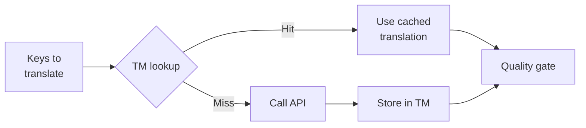

# Translation Memory

Translation Memory (TM) ist die integrierte Caching-Ebene von champollion. Sie speichert jede Übersetzung mit einem Schlüssel aus Quelltext + Locale + Methode, sodass bei einem erneuten Ausführen von `sync` die API nur für Schlüssel aufgerufen wird, die sich tatsächlich geändert haben.

## Warum TM existiert

Ohne TM übersetzt jeder `sync` jeden geänderten Schlüssel erneut – selbst wenn Sie genau denselben englischen Text für dieselbe Locale bereits in einem vorherigen Durchlauf übersetzt haben. Häufige Szenarien, in denen dies Geld verschwendet:

| Szenario | Ohne TM | Mit TM |
|----------|-----------|---------|
| Sync nach 1 Schlüsseländerung erneut ausführen (500 Schlüssel × 10 Locales) | 5.000 API-Aufrufe | 10 API-Aufrufe |
| Einen Schlüssel auf einen vorherigen englischen Wert zurücksetzen | Vollständiger API-Aufruf | Sofortiger Cache-Treffer |
| Dieselbe Phrase erscheint in 3 Locale-Dateien | 3 × API-Aufrufe | 1 API-Aufruf + 2 Cache-Treffer |
| Probelauf → echter Sync | Vollständige API-Aufrufe bei beiden | Erster Durchlauf cacht, zweiter verwendet wieder |

TM ist **standardmäßig aktiviert** und erfordert keine Konfiguration. Übersetzungen werden bei jedem `sync` automatisch gecacht und bei nachfolgenden Durchläufen bereitgestellt.

## Wie es funktioniert

### Cache-Schlüssel

Jeder TM-Eintrag wird mit einem SHA-256-Hash aus drei Werten verschlüsselt:

```
SHA-256( sourceValue + '\x00' + locale + '\x00' + method )
```

| Komponente | Warum sie im Schlüssel enthalten ist |
|-----------|-------------------|
| `sourceValue` | Anderer englischer Text → andere Übersetzung |
| `locale` | "Hello" wird ins Französische anders übersetzt als ins Japanische |
| `method` | Google-Translate-Ausgabe ≠ GPT-4o-Ausgabe |

Der Nullbyte-Trenner (`\x00`) verhindert Kollisionen zwischen `"ab" + "c"` und `"a" + "bc"`.

Der `sourceValue` ist der Text, von dem der Schlüssel übersetzt wird, zusammen mit allem, was zwei identische Texte voneinander unterscheidet:

- **gettext-Kontext.** Ein Eintrag mit einem `msgctxt` wird mit seinem Kontext zwischengespeichert: „Open“ als Verb und „Open“ als Adjektiv sind zwei Einträge.
- **Pluralformen, die in der Quelle nicht vorhanden sind.** i18next speichert Plurale als Schlüssel mit Suffix, und eine Zielsprache kann Formen aufweisen, die der Quelle fehlen: Französisch und Spanisch fügen `count_many` hinzu, was aus dem englischen `count_other`-Text übersetzt wird. Die beiden Schlüssel senden denselben Text, aber das Modell wird nach unterschiedlichen Formen gefragt (`"2 recettes"` und `"1 000 000 de recettes"`), sodass jede ihren eigenen Eintrag erhält: `count_other` behält den einfachen, und `count_many` wird unter dem Text plus seiner Form zwischengespeichert. Dasselbe gilt für jede Form, die aus dem Text einer anderen Kategorie übersetzt wird (Arabisch `_zero`, `_two`, `_few`, `_many`; Russisch `_few`, `_many`; Ordinalformen).
- **gettext-`msgid_plural` und ARB- / ICU-Plurale** sind eine Meldung pro Schlüssel (jede Form in einem Wert), daher sind sie nach wie vor ein einzelner Eintrag.

Vor Version 0.4.0 teilte sich eine entlehnte Form den Eintrag der Form, von der sie übersetzt wird, und der Eintrag enthielt die jeweils zuletzt gespeicherte Antwort, sodass `--redo all` dieselbe Form in beide Schlüssel schreiben konnte. Ein Cache aus dieser Zeit wird bei seiner Verwendung repariert. Wenn der geteilte Eintrag den Text der entlehnten Form enthält, wechselt er in den eigenen Eintrag dieser Form, und die andere Form wird beim nächsten Einreihen erneut übersetzt. Andernfalls verbleibt der Eintrag bei der Form, von der er entlehnt, und die entlehnte Form wird beim ersten Einreihen einmal an das Modell gesendet (der Durchlauf weist darauf hin). `champollion verify` warnt, wenn eine entlehnte Form exakt den Text der Form enthält, von der sie entlehnt, und der Cache nicht zeigt, dass das Modell dies so verfasst hat. Einige Sprachen schreiben zwei Formen tatsächlich identisch, daher ist dies eine Warnung; `--redo keys:<key>` fragt erneut an.

### Während des Syncs


```mermaid
flowchart LR
    A["Keys to\ntranslate"] --> B{"TM lookup"}
    B -->|Hit| C["Use cached\ntranslation"]
    B -->|Miss| D["Call API"]
    D --> E["Store in TM"]
    C --> F["Quality gate"]
    E --> F
```

1. Vor dem Aufruf der Übersetzungs-API partitioniert champollion die Schlüssel in **TM-Treffer** und **TM-Fehltreffer**
2. Treffer werden sofort aus dem Cache bereitgestellt – kein API-Aufruf, keine Latenz, keine Kosten
3. Fehltreffer durchlaufen die normale Übersetzungs-Pipeline
4. Neue Übersetzungen aus der API werden im TM für zukünftige Durchläufe gespeichert
5. Alle Übersetzungen (gecacht + neu) durchlaufen das Qualitäts-Gate

### Speicherung

TM wird unter `.champollion/tm.json` im Stammverzeichnis Ihres Projekts gespeichert. Die Datei verwendet kompaktes JSON (ohne Pretty-Printing), um die Größe überschaubar zu halten. Jeder Eintrag speichert:

| Feld | Beschreibung |
|-------|-------------|
| `t` | Der übersetzte Text |
| `ts` | ISO-8601-Zeitstempel, wann er gecacht wurde |
| `l` | Ziel-Locale-Code (für Statistiken/Filterung) |
| `m` | Name der Übersetzungsmethode (für Statistiken/Filterung) |

Bei 50 Sprachen × 500 Schlüssel = 25.000 Einträge sollte die Datei etwa 2–3 MB groß sein.

## Verwalten des Caches

### Statistiken anzeigen

```bash
champollion tm stats
```

Zeigt die Anzahl der Einträge, die Dateigröße und eine Aufschlüsselung pro Locale an:

```
  Translation Memory — .champollion/tm.json

  Entries:      2,847
  File size:    1.2 MB
  Created:      2026-05-20 09:14 MDT
  Last entry:   2026-05-24 17:52 MDT

  By locale:
    fr       482 entries
               380  llm · model google/gemini-3.8-flash · register formal-vous
               102  llm-coached · model google/gemini-3.8-flash · register formal-vous · coaching 3f2a9c1b
    de       471 entries
               471  llm · model google/gemini-3.8-flash · register formal-Sie
    ja       465 entries
               465  llm · model google/gemini-3.8-flash · register polite
```

Die Datumsangaben entsprechen der lokalen Zeit dieses Rechners, unter Nennung der Zeitzone (`--json`
enthält zudem die gespeicherten UTC-Zeitstempel als `createdAt` und `lastEntryAt`).
Jede Zeile unter einem Gebietsschema gibt an, wodurch diese Einträge erzeugt wurden: Methode, Modell und
Sprachregister (sowie ein Fingerabdruck des Coaching-Texts für jede Methode, deren
Prompt ihn enthält: `llm`, `local`, `openai`, `anthropic`, `gemini`,
`llm-coached`; hierfür wird die eigene `coachingFile` eines Paars, einer Sprache oder eines Fallbacks gelesen,
wobei deren Text und nicht deren Pfad zählt). Zwei
Modelle unter einem Gebietsschema deuten gewöhnlich auf einen Modellwechsel hin; `champollion status`
gibt an, ob die Gebietsschema-Dateien selbst nun den Text der beiden Modelle mischen.

### Cache leeren

```bash
# Clear everything (with confirmation prompt)
champollion tm clear

# Clear without prompt (CI environments)
champollion tm clear --yes

# Clear only one locale
champollion tm clear --locale fr
```

### TM für einen Durchlauf überspringen

```bash
# Fresh API calls for everything queued (useful when debugging quality)
champollion sync --redo all --fresh     # --fresh = --no-tm
```

Dadurch wird der Cache nicht gelöscht und in diesem Durchlauf auch nicht gelesen – aber was der Durchlauf übersetzt (und bezahlt), wird dennoch gespeichert, sodass der nächste Durchlauf wieder zwischengespeichert ist.

## Modell wechseln

**So wechseln Sie.** Das Modell ist eine Einstellung in `champollion.config.json`: Bearbeiten Sie `"model"` (und `"defaultMethod"`, wenn sich auch die Methode ändert) oder das eigene `"model"` eines Paars in `"pairs"`. Das nächste `champollion sync` verwendet es.

`sync --model <name>` (und `--method <name>`) bestimmen ein Modell für **nur einen einzigen Durchlauf**: Die Datei wird nicht geändert, Sync weist darauf hin, und das nächste normale `sync` verwendet wieder das konfigurierte Modell. Was dieser Durchlauf übersetzt hat, verbleibt in den Dateien. Ein anschließendes normales Sync gibt an, welche Übersetzungen von einem anderen Modell verfasst wurden, und bietet zwei Auswege: Behalten Sie diese, indem Sie dieses Modell als konfiguriertes Modell festlegen (setzen Sie `"model"` darauf – es wird nichts gesendet), oder lassen Sie sie vom konfigurierten Modell übersetzen (der ausgegebene Redo-Befehl samt Preisangabe). `champollion status` meldet dasselbe. Ein erneutes Ausführen von `champollion init` ist für den Wechsel nicht erforderlich; `init --force` überschreibt nur die von seinen Flags angegebenen Einstellungen und behält alle übrigen bei ([CLI-Referenz](/docs/reference/cli#init)).

Ein Modellwechsel verwirft Ihren Cache nicht. Wenn für eine Zeichenkette kein Eintrag unter dem neuen Modell existiert, verwendet Sync die unter dem vorherigen Modell erstellte Übersetzung wieder, sofern Methode, Sprachregister und Coaching unverändert sind. Wiederverwendete Einträge durchlaufen dieselben Qualitätsprüfungen wie jeder andere Cache-Treffer. Vor dem Kostenvoranschlag gibt Sync an, wie viele Übersetzungen wiederverwendet werden und welches Modell sie verfasst hat – dies gilt auch für einen Testlauf (Dry Run) sowie nach Abschluss des Wechsels: Wird eine Zeichenkette auf einen Text zurückgesetzt, den nur das frühere Modell übersetzt hatte, wird die Übersetzung dieses Modells verwendet, und der Durchlauf weist vor dem Kostenvoranschlag darauf hin.

Um sie stattdessen vom neuen Modell übersetzen zu lassen (dies sendet die Schlüssel,
die ein früheres Modell übersetzt hat; was das neue Modell bereits übersetzt hat,
stammt weiterhin aus dem Cache):

```bash
champollion sync --redo all --fresh-on-model-change
```

Für sich genommen betrifft `--fresh-on-model-change` nur Schlüssel, die der Durchlauf ohnehin
übersetzt (neue oder geänderte). Nach einer vollständigen Neuübersetzung kündigt Sync
den Modellwechsel für diese Sprache nicht mehr an. Schlüssel, bei denen die Antworten des neuen
Modells fehlgeschlagen sind, werden in `.champollion.lock` als **ausstehend** (pending) festgehalten: Das nächste
`champollion sync` fordert sie erneut beim neuen Modell an (nicht aus dem Cache), und
der Wechsel ist abgeschlossen, sobald diese erledigt sind. `champollion status` listet ausstehende
Schlüssel auf und weist darauf hin, wenn die Dateien Text eines früheren Modells enthalten – gemischt mit
dem aktuellen Modell oder vollständig ([Quality Gate](/docs/concepts/quality-gate#a-redo-that-could-not-finish)).
Es weiß, welches Modell jeden Wert verfasst hat, da Sync dies in
`.champollion.lock` vermerkt (das Modell, das geantwortet hat, oder jenes, dessen zwischengespeicherte
Übersetzung geliefert wurde). Für Werte, die vor Version 0.4.0 geschrieben wurden, greift es auf den
Cache zurück und meldet „model unknown“, wenn zwei Modelle denselben Text zwischengespeichert haben. Ein normales
`champollion sync` ohne anstehende Übersetzungen gibt in einer Zeile pro Sprache an,
wenn die Dateien von einem anderen als dem konfigurierten Modell geschrieben wurden, zusammen mit dem
obigen Befehl.
Eine Massen-Neuübersetzung (Bulk Redo) ersetzt niemals eine Übersetzung, die von einer Person in der Datei manuell bearbeitet wurde
([Übersetzungen bearbeiten](/docs/guides/professional-translators#editing-key-value-files)).

Eine Änderung der Methode, des Sprachregisters oder des Coachings führt weiterhin zu neuen Übersetzungen, da diese Änderungen vorgenommen werden, um einen abweichenden Text zu erhalten. Wenn Schlüssel an das Modell gesendet werden, obwohl der Cache Übersetzungen desselben Textes enthält, die auf andere Weise erstellt wurden (beispielsweise nach dem Wechsel von `local` → `llm`), weist Sync einmal pro Sprache darauf hin und nennt die bisherige Konfiguration – aus diesem Grund zeigt der Durchlauf an, dass nichts aus dem Cache bezogen wurde.

Eine Änderung von Methode, Sprachregister oder Coaching übersetzt von sich aus nichts erneut: Ein normales Sync (oder ein Dry Run) ohne neue zu übersetzende Inhalte lässt die Dateien unverändert. Es weist pro Sprache darauf hin: wie viele Werte von einer anderen Methode geschrieben wurden, der Redo-Befehl, der sie ersetzt (`champollion sync --pair en:fr --redo all`), und was dies kosten würde.

## Wann TM nicht hilft

TM erzeugt keinen Cache-Treffer, wenn:

- **Ausgangstext geändert** — der Hash ändert sich, somit liegt ein Cache-Miss vor
- **Methode geändert** — der Wechsel von `llm` zu `google-translate` bedeutet abweichende Cache-Schlüssel
- **Sprachregister oder Coaching geändert** — der Cache-Schlüssel bezieht diese mit ein (bei einem ausschließlichen Modellwechsel wird wiederverwendet; siehe oben). Der Fallback eines Paars hat seinen eigenen Schlüssel (Methode, Modell, Sprachregister, Coaching): Nach einer Änderung nennen `sync` und `status` die Werte, die von der vorherigen Konfiguration geschrieben wurden, sowie den Redo-Befehl (`--redo all`; mit `--fresh-on-model-change` bei einem ausschließlichen Modellwechsel). Vor Version 0.4.0 geschriebene Caches berücksichtigten das Coaching nur für `llm-coached`; beim ersten Durchlauf bleiben Einträge erhalten, die mit dem damaligen Coaching des Paars erstellt wurden
- **Nicht Teil des Schlüssels:** das Glossar sowie die Grammatikregeln und Stilhinweise von `llm-coached` — deren Bearbeitung übersetzt nichts Zwischengespeichertes erneut (`--redo keys:… --fresh` fordert dies explizit neu an)
- **`--retranslate <glob>`** — die angegebenen Inhaltsdateien werden gezielt neu übersetzt
- **Erster Durchlauf** — Kaltstart, noch keine Einträge vorhanden
- **`--no-tm` / `--fresh`** — umgeht den Cache explizit
- **Ein ausstehender Schlüssel** — ein Schlüssel, den ein Redo nicht abschließen konnte, wird erneut beim Modell angefordert und nicht aus dem Cache bezogen

Der Cache entscheidet niemals darüber, ob ein Schlüssel *in die Warteschlange gestellt* wird: Ein unveränderter Schlüssel, dessen Übersetzung sich bereits in der Datei befindet, wird noch vor jeder Abfrage übersprungen (er zählt nicht als Cache-Treffer). Und ein Schlüssel, den das Quality Gate von einem Modell abgelehnt hat, wird bei einem normalen Sync nicht erneut an dieses Modell gesendet – dies würde dieselbe Antwort in Rechnung stellen ([zurückgehalten](/docs/concepts/quality-gate#refused-keys-are-held-back)); der Cache wird für ihn dennoch gelesen.

## Sollten Sie `.champollion/tm.json` committen?

**Im Allgemeinen nein.** TM ist eine lokale Entwickleroptimierung. Es wird während des Syncs automatisch befüllt und hilft nur, wenn der Sync auf derselben Maschine erneut ausgeführt wird. Sie könnten ein Committen jedoch in Betracht ziehen, wenn:

- Ihr Team einen einzigen CI-Runner gemeinsam nutzt, der Übersetzungen synchronisiert
- Sie reproduzierbare Builds ohne API-Aufrufe wünschen
- Sie Übersetzungen zu Compliance-Zwecken archivieren

Fügen Sie für die typische Verwendung `.champollion/tm.json` zu `.gitignore` hinzu.

---

## Siehe auch

- [Wie Sync funktioniert](/docs/concepts/how-sync-works) — wo TM in die Pipeline passt
- [CLI-Referenz — tm](/docs/reference/cli#tm) — Befehlsreferenz
- [CLI-Referenz — sync --no-tm](/docs/reference/cli#sync) — TM umgehen
