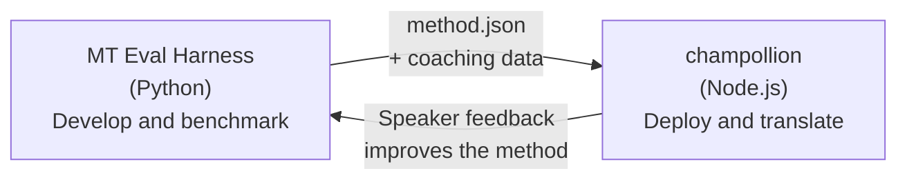

# Die Eval-Harness-Brücke

champollion und das MT Eval Harness sind zwei separate Tools, die ein Ökosystem bilden. Das Harness ist der Ort, an dem Übersetzungsmethoden **erprobt** werden. Champollion ist der Ort, an dem erprobte Methoden **eingesetzt** werden. Sie sind über ein gemeinsames Plugin-Format verbunden.



## Der Ablauf: Forschung → Produktion

### 1. Eine Methode im Harness erstellen

Jede Python-Klasse, die `async translate(entries, config) → [{id, predicted}]` implementiert, lässt sich an das Harness anbinden. Das Harness kümmert sich nicht darum, was intern geschieht — geprompteter LLM, eigens trainiertes Modell, deterministische Regeln, alles ist möglich.

### 2. Sie benchmarken

Das Harness bewertet Ihre Methode anhand eines standardisierten Korpus mit reproduzierbaren Metriken: chrF++, FST-Akzeptanz (für morphologisch reiche Sprachen), morphologische Genauigkeit und semantische Bewertung.

### 3. Als Plugin exportieren

Sobald Ihre Methode eine akzeptable Qualität erreicht, verpacken Sie sie als champollion-Plugin — ein `method.json`-Manifest mit optionalen Coaching-Daten.

:::info[Export-CLI ist geplant]
Derzeit erstellen Sie das method.json-Manifest manuell. Der Befehl `mt-eval export` wird dies automatisieren. Weitere Informationen finden Sie im [Method Interface](/docs/network/specifications/methods) zum vollständigen Plugin-Format.
:::

### 4. In champollion installieren

```bash
champollion plugin install ./my-method-plugin/
```

### 5. Realen Inhalt übersetzen

```bash
champollion sync
```

Ihre per Benchmark getestete Methode erzeugt nun echte Übersetzungen in Produktion.

## Der Ablauf: Produktion → Forschung

Eingesetzte Übersetzungen werden von zweisprachigen Sprechern überprüft. Deren Rückmeldungen identifizieren systematische Fehler (falsche Zeitformenmuster, fehlendes Vokabular, unnatürliche Formulierungen). Der Forscher aktualisiert die Methode im Harness, benchmarkt sie erneut, exportiert sie erneut und stellt sie erneut bereit. Das System lernt aus der Nutzung.

## Das Plugin-Format

Das `method.json`-Manifest ist der Vertrag zwischen den beiden Tools:

```json
{
  "name": "crk-coached-v3",
  "type": "llm-coached",
  "version": "3.0.0",
  "description": "Coached LLM translation for Plains Cree",
  "locales": ["crk"],
  "config": {
    "model": "google/gemini-3.5-flash",
    "temperature": 0.3
  },
  "benchmarks": {
    "crk": {
      "composite_score": 0.67,
      "fst_acceptance": 0.82,
      "corpus_size": 150
    }
  }
}
```

Siehe die [Plugin Specification](/docs/reference/plugin-spec) für das vollständige Format.

## Was umgesetzt ist vs. geplant

| Komponente | Status |
|-----------|--------|
| TranslationMethod-Protokoll | ✅ Umgesetzt |
| Harness-Benchmark-Runner | ✅ Umgesetzt |
| method.json-Plugin-Format | ✅ Umgesetzt |
| `champollion plugin install/remove/list` | ✅ Umgesetzt |
| Laden von Coaching-Daten | ✅ Umgesetzt |
| `mt-eval export`-CLI | 🔲 Geplant |
| Community-Review-Schnittstelle | 🔲 Geplant |
| Kryptografische Testset-Evaluierung | 🔲 Geplant |

## Weiterführende Lektüre

- [Übersetzungsmethoden](/docs/guides/translation-methods) — alle verfügbaren Methoden und wie sie funktionieren
- [Plugin-Spezifikation](/docs/reference/plugin-spec) — das method.json-Format
- [Bereitstellung einer Methode via API](/docs/guides/serving-a-method) — serverseitiges Hosting einer Methode
- [Datensouveränität](/docs/network/sovereignty/data-sovereignty) — indigene Prinzipien der Datensouveränität, CARE und kryptografischer Schutz
- [Für MT-Forscher](/docs/network/leaderboard/rules) — die Dokumentation des Eval Harness
