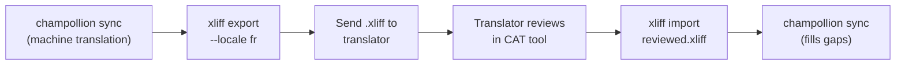

# Zusammenarbeit mit professionellen Übersetzern

Champollion erzeugt maschinelle Übersetzungen, doch einige Projekte erfordern eine menschliche Überprüfung — regulatorische Inhalte, markensensible Texte oder kritische Benutzeroberflächen. Der XLIFF-Workflow ermöglicht es Ihnen, Übersetzungen für eine professionelle Überprüfung zu exportieren und nahtlos wieder zu importieren.

## Was ist XLIFF?

XLIFF (XML Localization Interchange File Format) ist das branchenübliche Austauschformat für Übersetzungswerkzeuge. Jedes professionelle CAT-Werkzeug (Computer-Assisted Translation) unterstützt es:

- **memoQ** — XLIFF importieren, im Kontext überprüfen, überprüfte Datei exportieren
- **SDL Trados Studio** — native XLIFF-Unterstützung
- **Phrase (Memsource)** — XLIFF-Aufträge für Übersetzerteams hochladen
- **Smartling** — XLIFF-Eingabe-Pipeline
- **OmegaT** — kostenloses/quelloffenes CAT-Werkzeug mit XLIFF-Unterstützung

Champollion erzeugt XLIFF 1.2 (die universell unterstützte Version) anstelle von 2.0+, um maximale Werkzeugkompatibilität zu gewährleisten.

## Der Workflow



### Schritt 1: Maschinelle Übersetzungen erzeugen

Führen Sie zunächst `sync` aus, um eine maschinelle Basisübersetzung zu erhalten:

```bash
champollion sync
```

### Schritt 2: XLIFF exportieren

Exportieren Sie das Quell-Ziel-Paar als XLIFF:

```bash
champollion xliff export --locale fr
```

Dadurch wird `.champollion/xliff/fr.xliff` geschrieben, das Folgendes enthält:
- Jeden Quellschlüssel mit seinem englischen Wert
- Die aktuelle maschinelle Übersetzung (falls vorhanden) als `<target>`
- Schlüssel ohne Übersetzungen, gekennzeichnet als `state="new"`

```xml
<trans-unit id="hero.title" xml:space="preserve">
  <source>Welcome to our platform</source>
  <target state="translated">Bienvenue sur notre plateforme</target>
</trans-unit>
```

### Schritt 3: An den Übersetzer senden

Senden Sie die Datei `.xliff` an Ihren Übersetzer oder laden Sie sie auf Ihre CAT-Plattform hoch. Der Übersetzer sieht Quelle und Ziel nebeneinander und kann:

- Maschinelle Übersetzungen bearbeiten
- Fehlende Übersetzungen ausfüllen
- Qualitätsprobleme kennzeichnen
- Eigenes Translation Memory und eigene Termbanken anwenden

### Schritt 4: Überprüfte Datei importieren

Wenn der Übersetzer die überprüfte Datei `.xliff` zurücksendet, importieren Sie sie:

```bash
# Preview what will change
champollion xliff import .champollion/xliff/fr.xliff --dry

# Apply changes
champollion xliff import .champollion/xliff/fr.xliff
```

Ausgabe:
```
  ✓ Imported 142 translations for fr
    Updated:    23 (changed from existing)
    Added:      0 (new keys)
    Unchanged:  119
    Written to: locales/fr.json
```

### Schritt 5: Lücken füllen

Wenn nach dem Export des XLIFF neue Schlüssel hinzugefügt wurden, führen Sie `sync` aus, um sie zu übersetzen:

```bash
champollion sync
```

Champollion übersetzt nur die Schlüssel, die noch fehlen — überprüfte Übersetzungen aus dem XLIFF-Import bleiben erhalten.

## Tipps

### Benutzerdefinierte Pfade exportieren

```bash
# Export to a specific directory
champollion xliff export --locale ja --out ./for-review/

# Export with a specific filename
champollion xliff export --locale de --out ./review/german.xliff
```

### Mehrere Locales

Exportieren Sie jede Locale separat:

```bash
for locale in fr de ja ko; do
  champollion xliff export --locale $locale
done
```

### Versionskontrolle

Fügen Sie `.champollion/xliff/` zu `.gitignore` hinzu — XLIFF-Dateien sind temporäre Artefakte, kein Projektquellcode:

```gitignore
.champollion/xliff/
```

### Wann XLIFF verwenden und wann nur `sync`

| Szenario | Empfehlung |
|----------|---------------|
| Interne App, Qualität von 90%+ akzeptabel | Nur `sync` — maschinelle Übersetzung ist ausreichend |
| Marketingtexte für Endnutzer | XLIFF für menschliche Überprüfung exportieren |
| Rechtliche/regulatorische Inhalte | XLIFF exportieren — menschliche Überprüfung erforderlich |
| 50+ Locales, enge Frist | Zunächst `sync`, XLIFF-Export nur für die wichtigsten 5 Locales |
| Übersetzer verwendet bereits ein CAT-Werkzeug | XLIFF ist das natürliche Übergabeformat |

---

## Siehe auch

- [CLI-Referenz — xliff](/docs/reference/cli#xliff) — Befehlsreferenz
- [Translation Memory](/docs/concepts/translation-memory) — Zwischenspeicherung überprüfter Übersetzungen
- [Übersetzungsmethoden](/docs/guides/translation-methods) — Optionen für maschinelle Übersetzung
