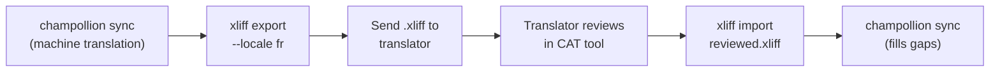

# Zusammenarbeit mit professionellen Übersetzern

Champollion erzeugt maschinelle Übersetzungen, doch einige Projekte erfordern eine menschliche Überprüfung — regulatorische Inhalte, markensensible Texte oder kritische Benutzeroberflächen. Der XLIFF-Workflow ermöglicht es Ihnen, Übersetzungen für eine professionelle Überprüfung zu exportieren und nahtlos wieder zu importieren.

XLIFF deckt die **String-Dateien** Ihrer Anwendung ab (Schlüssel und Werte). Übersetztes **Markdown** (Newsletter, Blogbeiträge, Dokumentationsseiten) wird anders überprüft: Der Prüfer bearbeitet die übersetzte `.md`-Datei direkt, und die Synchronisierung behält diese Änderungen bei. Siehe [Überprüfen von übersetztem Markdown](#reviewing-translated-markdown) weiter unten.

## Was ist XLIFF?

XLIFF (XML Localization Interchange File Format) ist das branchenübliche Austauschformat für Übersetzungswerkzeuge. Jedes professionelle CAT-Werkzeug (Computer-Assisted Translation) unterstützt es:

- **memoQ** — XLIFF importieren, im Kontext überprüfen, überprüfte Datei exportieren
- **SDL Trados Studio** — native XLIFF-Unterstützung
- **Phrase (Memsource)** — XLIFF-Aufträge für Übersetzerteams hochladen
- **Smartling** — XLIFF-Eingabe-Pipeline
- **OmegaT** — kostenloses/quelloffenes CAT-Werkzeug mit XLIFF-Unterstützung

Champollion erzeugt XLIFF 1.2 (die universell unterstützte Version) anstelle von 2.0+, um maximale Werkzeugkompatibilität zu gewährleisten.

## Der Workflow


```mermaid
flowchart LR
    A["champollion sync\n(machine translation)"] --> B["xliff export\n--locale fr"]
    B --> C["Send .xliff to\ntranslator"]
    C --> D["Translator reviews\nin CAT tool"]
    D --> E["xliff import\nreviewed.xliff"]
    E --> F["champollion sync\n(fills gaps)"]
```

### Schritt 1: Maschinelle Übersetzungen erzeugen

Führen Sie zunächst `sync` aus, um eine maschinelle Basisübersetzung zu erhalten:

```bash
champollion sync
```

### Schritt 2: XLIFF exportieren

Exportieren Sie das Quell-Ziel-Paar als XLIFF:

```bash
champollion xliff export --locale fr
```

Dadurch wird `.champollion/xliff/fr.xliff` geschrieben, das Folgendes enthält:
- Jeden Quellschlüssel mit seinem englischen Wert
- Die aktuelle maschinelle Übersetzung (falls vorhanden) als `<target>`
- Schlüssel ohne Übersetzungen, gekennzeichnet als `state="new"`

```xml
<trans-unit id="hero.title" xml:space="preserve">
  <source>Welcome to our platform</source>
  <target state="translated">Bienvenue sur notre plateforme</target>
</trans-unit>
```

### Schritt 3: An den Übersetzer senden

Senden Sie die Datei `.xliff` an Ihren Übersetzer oder laden Sie sie auf Ihre CAT-Plattform hoch. Der Übersetzer sieht Quelle und Ziel nebeneinander und kann:

- Maschinelle Übersetzungen bearbeiten
- Fehlende Übersetzungen ausfüllen
- Qualitätsprobleme kennzeichnen
- Eigenes Translation Memory und eigene Termbanken anwenden

### Schritt 4: Überprüfte Datei importieren

Wenn der Übersetzer die überprüfte Datei `.xliff` zurücksendet, importieren Sie sie:

```bash
# Preview what will change
champollion xliff import .champollion/xliff/fr.xliff --dry

# Apply changes
champollion xliff import .champollion/xliff/fr.xliff
```

Ausgabe:
```
  ✓ Imported 142 translations for fr
    Updated:    23 (changed from existing)
    Added:      0 (new keys)
    Unchanged:  119
    Written to: locales/fr.json
```

### Schritt 5: Lücken füllen

Wenn nach dem Export des XLIFF neue Schlüssel hinzugefügt wurden, führen Sie `sync` aus, um sie zu übersetzen:

```bash
champollion sync
```

Champollion übersetzt nur die Schlüssel, die noch fehlen — überprüfte Übersetzungen aus dem XLIFF-Import bleiben erhalten.

## Tipps

### Benutzerdefinierte Pfade exportieren

```bash
# Export to a specific directory
champollion xliff export --locale ja --out ./for-review/

# Export with a specific filename
champollion xliff export --locale de --out ./review/german.xliff
```

### Mehrere Locales

Exportieren Sie jede Locale separat:

```bash
for locale in fr de ja ko; do
  champollion xliff export --locale $locale
done
```

### Versionskontrolle

Fügen Sie `.champollion/xliff/` zu `.gitignore` hinzu — XLIFF-Dateien sind temporäre Artefakte, kein Projektquellcode:

```gitignore
.champollion/xliff/
```

### Wann XLIFF verwenden und wann nur `sync`

| Szenario | Empfehlung |
|----------|---------------|
| Interne App, Qualität von 90%+ akzeptabel | Nur `sync` — maschinelle Übersetzung ist ausreichend |
| Marketingtexte für Endnutzer | XLIFF für menschliche Überprüfung exportieren |
| Rechtliche/regulatorische Inhalte | XLIFF exportieren — menschliche Überprüfung erforderlich |
| 50+ Locales, enge Frist | Zunächst `sync`, XLIFF-Export nur für die wichtigsten 5 Locales |
| Übersetzer verwendet bereits ein CAT-Werkzeug | XLIFF ist das natürliche Übergabeformat |

## Bearbeiten von Übersetzungen in den Locale-Dateien {#editing-key-value-files}

Ein Prüfer kann eine Übersetzung auch direkt in einer Locale-Datei (`messages/fr.json`, `locale/fr/LC_MESSAGES/django.po`, `app_fr.arb`, …) korrigieren und committen. Champollion zeichnet in `.champollion.lock` einen Fingerabdruck jedes geschriebenen Werts auf. Ein Wert, der nicht mehr übereinstimmt, wurde von einer Person geändert, und die Synchronisierung behandelt ihn als deren Änderung:

| Was ausgeführt wird | Was mit dem bearbeiteten Wert geschieht |
|---------------------|-----------------------------------------|
| Ein einfaches `sync`, das Englische ist unverändert | Bleibt unberührt (wie zuvor). |
| `sync --redo all` / `--force`, ein Modellwechsel (`--redo all --fresh-on-model-change`) oder das erneute Versuchen von Schlüsseln, die durch ein Redo ausstehend blieben | **Beibehalten.** Die Ausführung gibt an, wie viele und welche Werte beibehalten wurden und wie einer ersetzt werden kann: `--redo keys:<key>`. |
| `sync --redo keys:<key>` unter Nennung des Schlüssels | Ersetzt – Sie haben diesen Schlüssel namentlich angefordert. Der bearbeitete Wortlaut wird zuvor ausgegeben. |
| Die **englische Quelle dieses Schlüssels ändert sich** | Wird erneut übersetzt (die Bearbeitung galt dem alten Text). Der bearbeitete Wortlaut wird ausgegeben, damit er erneut angewendet werden kann, und an `.champollion-replaced-edits.jsonl` im Stammverzeichnis des Projekts angehängt. |

`.champollion-replaced-edits.jsonl` ist eine versionierte Datei neben der Lock-Datei (der Cache-Ordner `.champollion/` ist maschinenspezifisch und wird von Git ignoriert): eine JSON-Zeile pro ersetzter Bearbeitung, mit dem Locale, der Datei, dem Schlüssel, dem bearbeiteten Wortlaut, dem Grund für die Ersetzung und dem neuen Quelltext. Committen Sie diese zusammen mit der Lock-Datei – sie ist die einzige Kopie dieses Wortlauts. `champollion status` gibt an, wie viele Einträge sie enthält.

Werte, die vor der Existenz dieser Aufzeichnung oder von einem anderen Werkzeug geschrieben wurden, besitzen keinen Fingerabdruck. Ein solcher Wert gilt nur dann als von Champollion stammend, wenn der Übersetzungscache genau diesen Text für den Schlüssel enthält; andernfalls wird er als manuell erstellt behandelt und bei Massen-Redos beibehalten (die Ausführung nennt sie als Werte, über deren Erstellung keine Aufzeichnung vorliegt). Werte, die mit `champollion xliff import` importiert wurden, gelten als menschliche Arbeit und werden auf dieselbe Weise beibehalten.

## Überprüfen von übersetztem Markdown {#reviewing-translated-markdown}

Inhaltsdateien aus einer `contentDir` (zum Beispiel `newsletters/2026-10.md` → `newsletters/2026-10.crk.md`) verfügen über keinen XLIFF-Export. Der Prüfer arbeitet direkt in der übersetzten Datei:

1. Führen Sie `champollion sync` aus und committen Sie die Übersetzungen zusammen mit `.champollion-content.lock`.
2. Der Prüfer bearbeitet die übersetzte Datei – entweder einen Absatz oder ein übersetztes Frontmatter-Feld wie `title` – und committet sie.
3. Bei späteren Synchronisierungen bleiben die Bearbeitungen erhalten. Ändert sich die englische Quelle in anderen Absätzen, bleiben die Absätze des Prüfers Wort für Wort bestehen und nur die geänderten Absätze werden übersetzt. Die Ausführung gibt `kept the edits made by hand to …` aus.

Es gibt zwei Ausnahmen, und die Synchronisierung warnt vor beiden. Wenn sich der englische Absatz, den der Prüfer korrigiert hat, ebenfalls ändert, wird dieser Absatz erneut übersetzt und der Wortlaut des Prüfers ausgegeben, damit er wieder angewendet werden kann. Hat der Prüfer Absätze hinzugefügt oder entfernt und die Quelle ändert sich anschließend, bleibt die Datei unverändert und wird bei jeder Synchronisierung aufgeführt, bis sie manuell aktualisiert wird.

Um die Bearbeitungen zu verwerfen und zur maschinellen Übersetzung zurückzukehren, geben Sie den Dateinamen an: `champollion sync --redo files:2026-10.md`. Die vollständigen Regeln finden Sie unter [Inhaltsübersetzung](/docs/guides/content-translation#reviewing-and-editing-translations).

---

## Siehe auch

- [CLI-Referenz – xliff](/docs/reference/cli#xliff) – Befehlsreferenz
- [Translation Memory](/docs/concepts/translation-memory) – Zwischenspeichern überprüfter Übersetzungen
- [Übersetzungsmethoden](/docs/guides/translation-methods) – Optionen für maschinelle Übersetzung
- [Inhaltsübersetzung](/docs/guides/content-translation) – Übersetzen von Markdown und wie Bearbeitungen von Prüfern beibehalten werden
- [Quality Gate](/docs/concepts/quality-gate#refused-keys-are-held-back) – Schlüssel, die das Gate abgelehnt hat, und Schlüssel, die bei einem Redo ausstehend blieben
