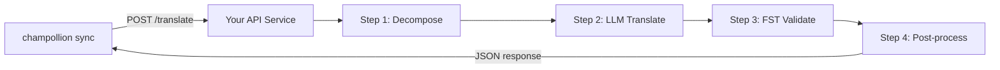

# Eine benutzerdefinierte Methode als API bereitstellen

Die **`api`-Methode** von champollion ermöglicht es Ihnen, jedes Übersetzungspaar auf einen externen HTTP-Endpunkt zu verweisen. So integrieren Sie Pipelines, die für einen einzelnen LLM-Prompt zu komplex sind — morphologische Analysewerkzeuge, endliche Zustandsübersetzer (FSTs), mehrstufige LLM-Ketten oder jede benutzerdefinierte Forschungsmethode, die Sie entwickelt haben.

Es gibt zwei Möglichkeiten, einen solchen Endpunkt bereitzustellen:

1. **`champollion serve`** — ein Befehl, der den konfigurierten Stack Ihres bestehenden Champollion-Projekts (Methode, Register, Coaching, Translation Memory, Quality Gate) hinter diesem Vertrag bereitstellt. Kein Server-Code. Siehe [den Zero-Code-Weg](#the-zero-code-path-champollion-serve).
2. **Ein benutzerdefinierter Dienst** — schreiben Sie Ihren eigenen HTTP-Server, der den Vertrag implementiert, für Pipelines, die vollständig außerhalb von Champollion existieren.

## Warum ein API-Dienst?

Manche Übersetzungs-Pipelines lassen sich nicht innerhalb eines einfachen Prompt-Antwort-Zyklus ausführen:

| Pipeline-Schritt | Beispiel |
|---|---|
| **Morphologische Zerlegung** | Zerlegen polysynthetischer Wörter in Morpheme vor der Übersetzung |
| **FST-Validierung** | Ablehnen von Ausgaben, die phonologische oder morphologische Regeln verletzen |
| **Mehrstufige LLM-Ketten** | Zyklen aus Generieren → Verifizieren → Korrigieren mit verschiedenen Modellen |
| **Wörterbuch-Nachschlagen** | Abgleich mit einem kuratierten zweisprachigen Wörterbuch mitten in der Pipeline |
| **Human-in-the-Loop** | Einreihen unsicherer Übersetzungen zur Prüfung durch Fachleute |

Die `api`-Methode behandelt Ihre Pipeline als Blackbox — champollion sendet Quellzeichenketten, Ihr Dienst gibt Übersetzungen zurück. Was intern geschieht, liegt vollständig bei Ihnen.

## Architektur



## Der Zero-Code-Weg: `champollion serve`

Wenn Ihre Pipeline bereits ein Champollion-Projekt ist — eine konfigurierte Methode (LLM, gecoacht oder eine Engine), Register, Coaching-Dateien, Translation Memory und das deterministische Quality Gate —, müssen Sie überhaupt keinen Server schreiben. `champollion serve` stellt **Ihren eigenen konfigurierten Stack** hinter genau dem unten beschriebenen Vertrag bereit:

```bash
# Owner side — run from the project whose champollion.config.json defines the stack
CHAMPOLLION_SERVE_TOKEN=$(openssl rand -hex 24) npx champollion serve
# [OK] champollion serve listening on http://127.0.0.1:1822/translate
```

Jede Anfrage durchläuft dieselbe Pipeline, die auch `champollion sync` verwendet:

- **Translation Memory** — Zeichenfolgen, die das TM bereits enthält, werden kostenlos aus dem Cache bereitgestellt, ohne Ihren Upstream-Anbieter zu kontaktieren. Durch das Gate validierte API-Ergebnisse werden für die nächste Anfrage zwischengespeichert.
- **Quality Gate** — jede Antwort wird deterministisch validiert (Wiederholung, Längenverhältnis, Skript-Konformität, Source-Echo). Fehler werden als strukturierte Fehler pro Schlüssel zurückgegeben (HTTP 207/422) — niemals als stillschweigend verschlechterte Ausgabe.
- **Cost Guard** — `--max-cost-per-request` und `--max-session-cost` lehnen Anfragen ab, deren *geschätzte* Upstream-Kosten Ihre Obergrenzen überschreiten, bevor ein Anbieteraufruf getätigt wird. Methoden mit unbekannter Preisgestaltung werden unter einer Obergrenze ebenfalls abgelehnt: unbekannt bedeutet nicht kostenlos. Durch das TM abgedeckte Anfragen kosten bekanntermaßen 0 $ und werden immer durchgelassen.

Der Server bindet sich standardmäßig an `127.0.0.1`: Jeder, der den Port erreichen kann, kann Ihr Upstream-API-Budget ausgeben. Daher ist die öffentliche Bereitstellung eine explizite Entscheidung — `--bind 0.0.0.0` plus ein starkes Bearer-Token. `--no-auth` wird nur zusammen mit einer Loopback-Bindung akzeptiert. Ein Ratenlimit pro IP und eine Obergrenze für die Anfragengröße sind standardmäßig aktiviert; siehe `champollion serve --help`.

### Einen Consumer darauf verweisen

Geben Sie das Plugin-Manifest aus, das Consumer installieren (ein Befehl auf jeder Seite):

```bash
# Owner side
champollion serve --emit-manifest --endpoint https://translate.example.org
# [OK] Wrote ./my-project-serve/method.json
```

```bash
# Consumer side
champollion plugin install ./my-project-serve
```

```json title="champollion.config.json (consumer)"
{
  "pairs": {
    "en:crk": { "methodPlugin": "my-project-serve" }
  }
}
```

```bash
CHAMPOLLION_API_KEY=<the server's bearer token> champollion sync
```

Die `api`-Methode des Consumers sendet Quellzeichenfolgen per POST an Ihren Server; Ihr Stack übersetzt, validiert und speichert im Cache; das `qualityTier` des Manifests ist eine ehrliche Weitergabe Ihrer konfigurierten Paare (die konservativste Stufe, wenn sie sich unterscheiden). Ihre Prompts, Coaching-Daten und Anbieter-Schlüssel verlassen niemals Ihre Maschine.

Der Rest dieses Leitfadens behandelt das Schreiben eines **benutzerdefinierten** Dienstes — nützlich, wenn Ihre Pipeline kein Champollion-Projekt ist (eine Python-FST-Kette, ein maßgeschneidertes Forschungssystem). Der Wire-Contract ist in beiden Fällen identisch.

## Einrichten Ihres Dienstes

Ihr API-Dienst muss einen einzelnen Endpunkt implementieren, der JSON akzeptiert und zurückgibt:

### Anfrageformat

champollion sendet exakt diesen JSON-Body (siehe [api.js](https://github.com/gamedaysuits/Champollion/blob/main/cli/lib/methods/api.js)):

```json
POST /translate
Content-Type: application/json
Authorization: Bearer <CHAMPOLLION_API_KEY>

{
  "source_locale": "en",
  "target_locale": "crk",
  "method": "crk-coached-v1",
  "keys": {
    "greeting": "Hello, welcome to our app",
    "farewell": "Goodbye and thanks"
  }
}
```

| Feld | Typ | Beschreibung |
|-------|------|-------------|
| `source_locale` | string | BCP-47-Quellsprachencode |
| `target_locale` | string | BCP-47-Zielsprachencode |
| `method` | string | Plugin-Name oder `"default"` |
| `keys` | object | Zuordnung von Schlüssel → zu übersetzende Quellzeichenkette |
```

### Response Format

Your service must return a `translations` object. An optional `meta` object can include cost and diagnostic info:

```json
{
  "translations": {
    "greeting": "tânisi, pê-kîwêw ôta",
    "farewell": "ekosi mâka, kinanâskomitin"
  },
  "meta": {
    "model": "my-custom-pipeline/v1",
    "cost_usd": 0.0042,
    "method": "decompose-translate-validate"
  }
}
```

| Field | Type | Required | Description |
|-------|------|----------|-------------|
| `translations` | object | ✅ | Map of key → translated string |
| `meta` | object | — | Optional metadata |
| `meta.cost_usd` | number | — | If present, displayed in champollion's output |
| `errors` | object | — | For partial success (HTTP 207): map of key → `{ message }` |

### Minimal Express Server

```javascript
import express from 'express';

const app = express();
app.use(express.json());

/**
 * champollion API contract:
 *
 * Request:  { source_locale, target_locale, method, keys: { "key": "source" } }
 * Response: { translations: { "key": "translated" }, meta: { ... } }
 */
app.post('/translate', async (req, res) => {
  const { source_locale, target_locale, method, keys } = req.body;

  const translations = {};

  for (const [key, source] of Object.entries(keys)) {
    // --- Your pipeline goes here ---
    // Step 1: Morphological decomposition
    const morphemes = await decompose(source, source_locale);

    // Step 2: LLM translation with context
    const draft = await llmTranslate(morphemes, target_locale);

    // Step 3: FST validation
    const validated = await fstValidate(draft, target_locale);

    // Step 4: Post-processing (orthography normalization, etc.)
    translations[key] = await postProcess(validated);
  }

  res.json({
    translations,
    meta: {
      model: 'my-custom-pipeline/v1',
      method: 'decompose-translate-validate',
    },
  });
});

app.listen(3001, () => {
  console.log('Translation API running on http://localhost:3001');
});
```

## Configuring champollion

Point a translation pair at your running service in `champollion.config.json`:

```json
{
  "inputLocale": "en",
  "pairs": {
    "en:crk": {
      "method": "api",
      "endpoint": "http://localhost:3001/translate",
      "register": "Formal Plains Cree. Use SRO orthography."
    }
  }
}
```

Then run sync as usual:

```bash
npx champollion sync
```

champollion will POST your source strings to the endpoint and write the returned translations to `crk.json`.

## Case Study: Plains Cree Pipeline

:::info[Under Development]
The Plains Cree pipeline described below is **under active development** and is not yet running in production. Details here reflect the current design direction and may change as the project evolves.
:::

The **arena** project demonstrates this pattern. Its Plains Cree pipeline uses:

1. **Morphological decomposition** — Break polysynthetic Cree words into translatable morpheme chains
2. **LLM translation** — Context-enriched GPT-4o translation with coaching data (SRO orthography rules, register instructions)
3. **FST validation** — Finite-state transducer checks that outputs conform to Cree phonological rules
4. **Confidence scoring** — Each translation gets a confidence score based on FST pass rate and dictionary coverage

The entire pipeline runs as a single HTTP endpoint that champollion calls via the `api` method.

### Running Evaluations

After translating, you can evaluate output quality using the harness directly:

```bash
# Clone the harness
git clone https://github.com/gamedaysuits/Champollion.git
cd Champollion/arena
pip install -e .

# Führen Sie die Evaluierung gegen ein echtes, nicht gebündeltes Korpus aus
mt-eval run --corpus eval-amh-fra-globalvoices-test-v1 --model gemini-pro --yes
```

This produces structured evaluation records with chrF++, BLEU, and exact match scores that can be used as regression baselines.

## Authentication

If your API requires authentication, set the `apiKey` field or use an environment variable:

```json
{
  "pairs": {
    "en:crk": {
      "method": "api",
      "endpoint": "https://my-mt-service.example.com/translate",
      "apiKey": "${CRK_API_KEY}"
    }
  }
}
```

## Data Sovereignty

The `api` method is particularly important for **Indigenous language communities**. By self-hosting the translation pipeline, a community keeps full control over:

- **Proprietary coaching data** — register instructions, orthography rules, and domain glossaries never leave community infrastructure.
- **Linguistic resources** — curated dictionaries, FST grammars, and elder-verified translations remain under community ownership.
- **Access policies** — the community decides who can call the endpoint and under what terms.

This design follows the direction of [Indigenous data-sovereignty principles](/docs/network/community/low-resource-languages#data-sovereignty-principles) — community ownership and control of language data: sensitive language data stays governed by the community rather than a third-party platform.

:::tip
Combine the `api` method with a private deployment (e.g., a community-hosted VM or on-prem server) for the strongest data-sovereignty posture. `champollion serve` gives a community exactly this self-hosting posture without writing any server code — coaching data, provider keys, and the Translation Memory all stay on community infrastructure. See [Support a Low-Resource Language](/docs/network/community/low-resource-languages) for a full walkthrough.
:::

## Cost Estimation

The `api` method returns `null` for cost estimation by default — your service controls pricing. If you want to provide cost transparency, have your API return a `cost` field in the metadata:

```json
{
  "translations": { "...": "..." },
  "metadata": {
    "cost": {
      "estimatedCost": 0.0042,
      "currency": "USD",
      "source": "my-service-pricing"
    }
  }
}
```

## Bewährte Praktiken

1. **Geben Sie bei Fehlern leere Zeichenketten zurück** — Geben Sie nicht die Quellzeichenkette als „Übersetzung“ zurück. Geben Sie `""` zurück, und das Qualitätsgate von champollion wird es erkennen. Der Schlüssel wird übersprungen und beim nächsten Sync erneut versucht.
2. **Fügen Sie Konfidenzwerte hinzu** — Wenn Ihre Pipeline die Qualität schätzen kann, geben Sie diese in den Metadaten zurück. Das hilft bei der Qualitätsprüfung.
3. **Implementieren Sie Health-Checks** — Fügen Sie einen `GET /health`-Endpunkt hinzu, damit champollion die Verbindung überprüfen kann, bevor ein großer Sync gestartet wird.
4. **Begrenzen Sie die Rate elegant** — Wenn Ihre Pipeline Durchsatzgrenzen hat, geben Sie `429`-Statuscodes zurück. Das Batch-System von champollion wird zurückstecken.
5. **Protokollieren Sie alles** — Mehrstufige Pipelines können stillschweigend fehlschlagen. Protokollieren Sie Eingabe und Ausgabe jedes Schritts zur Fehlersuche.

## Lizenzierung

Das `api`-Methodenmuster ist vollständig offen — es gibt keine Lizenzbeschränkungen für das Einbinden Ihrer eigenen Übersetzungs-Pipeline als HTTP-Dienst. Das `arena`-Eval-Harness ist unter AGPL-3.0-or-later lizenziert (mit einer §7-Ausnahme für eval-standard-plugin); Sie können es unter diesen Bedingungen studieren und darauf aufbauen.

## Siehe auch

- [Übersetzungsmethoden](/docs/guides/translation-methods) — Übersicht über jede integrierte Methode (`openai`, `google`, `api` usw.)
- [Plugin-Spezifikation](/docs/reference/plugin-spec) — vollständiges Schema für `champollion.config.json` einschließlich der `api`-Methodenfelder
- [Unterstützung einer ressourcenarmen Sprache](/docs/network/community/low-resource-languages) — End-to-End-Leitfaden für ressourcenarme Sprachen, einschließlich der Prinzipien der Datensouveränität
- [Architektur](/docs/concepts/architecture) — wie die Sync-Schleife, das Batching und der Methoden-Dispatch von Champollion funktionieren
- [MT-Evaluierung](/docs/network/leaderboard/rules) — Evaluierungsmethodik, Metriken und der Einreichungsprozess für das Leaderboard
- [Methoden-Leaderboard](/leaderboard) — Live-Qualitätsrankings über Methoden und Sprachpaare hinweg
